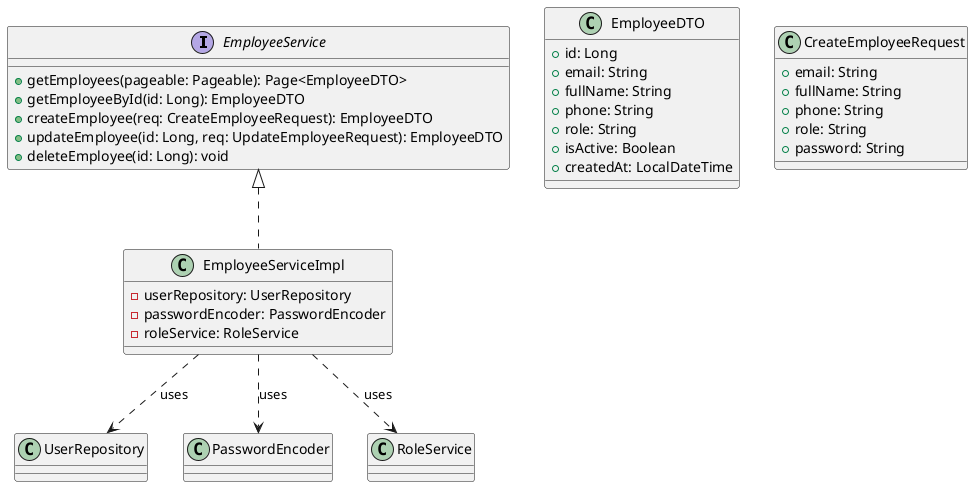
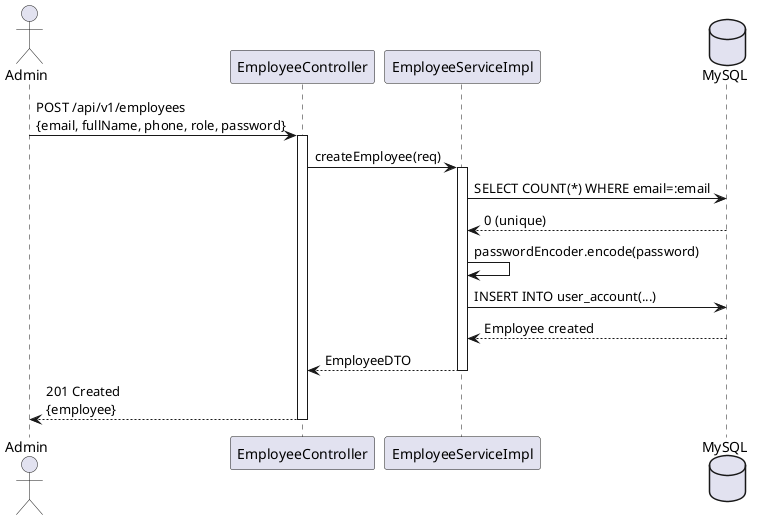
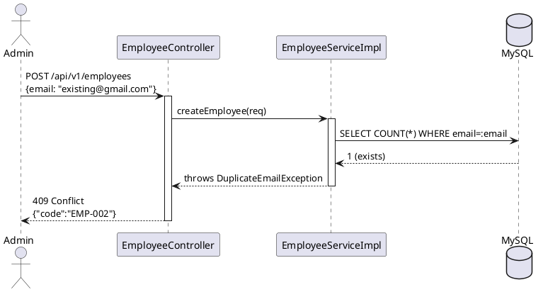

# ENGINEERING DOCUMENTATION STANDARD (EDS) v2.0

## UC03 — Quản lý Nhân viên CRUD (EmployeeService)

| Field | Value |
|-------|-------|
| **Document ID** | `KAWAI-EDS-MOD1-UC03-001` |
| **Version** | 1.0 |
| **Date** | 2026-06-14 |
| **Status** | Approved |
| **Document Owner** | Nguyễn Xuân Lưu |
| **Author** | Nguyễn Xuân Lưu — Developer |
| **Reviewed by** | Nguyễn Xuân Lưu — Tech Lead |
| **DPO Sign-off** | `[x] Approved – 2026-06-14 – Nguyễn Xuân Lưu` |
| **Approved by** | `[x] Nguyễn Xuân Lưu – 2026-06-14` |
| **Last Review** | 2026-06-14 |
| **Based on EDS** | v2.0 |

---

### CHANGELOG
| Ngày | Người thực hiện | Nội dung thay đổi |
|------|-----------------|-------------------|
| 2026-06-14 | Nguyễn Xuân Lưu | Tạo tài liệu lần đầu |

---

### MỤC LỤC
1. [Tổng quan Module](#1)
2. [Ma trận Truy vết](#2)
3. [ADR](#3)
4. [Non-Functional & SLA](#4)
5. [Static Modeling](#5)
6. [Dynamic Modeling](#6)
7. [Domain Event Catalog](#7)
8. [Interface Specification](#8)
9. [API Specification](#9)
10. [Bảng mã lỗi](#10)
11. [Quy trình Triển khai](#11)
12. [Rollback & Incident Runbook](#12)
13. [Kịch bản Kiểm thử](#13)
14. [Phương pháp Xác minh](#14)
15. [Mẫu thử thực tế](#15)
16. [Authorization Matrix](#16)
17. [Phụ lục](#17)

---

### 1. Tổng quan Module

| Field | Value |
|-------|-------|
| **Module Name** | Quản lý Nhân viên CRUD (UC03) |
| **Bounded Context** | HR & Employee Management |
| **Use Case** | UC03: Admin CRUD nhân viên — tạo, xem, sửa, xóa tài khoản nhân viên |
| **Data Classification** | PII (họ tên, email, SĐT nhân viên) |
| **Compliance Scope** | Nghị định 13/2023/NĐ-CP |
| **Upstream Dependencies** | UC01 (Auth — JWT required), UC02 (Profile) |
| **Downstream Consumers** | UC05 (RBAC — gán role cho nhân viên) |

---

### 2. Ma trận Truy vết

| Requirement ID | Loại | Mô tả | Thành phần Code | Compliance | ADR |
|----------------|------|-------|-----------------|------------|-----|
| UC03.1 | US | Danh sách nhân viên (phân trang) | `EmployeeService.getEmployees()` | — | — |
| UC03.2 | US | Tạo tài khoản nhân viên | `EmployeeService.createEmployee()` | Nghị định 13/2023 | — |
| UC03.3 | US | Cập nhật thông tin nhân viên | `EmployeeService.updateEmployee()` | — | — |
| UC03.4 | US | Xóa (soft-delete) nhân viên | `EmployeeService.deleteEmployee()` | — | — |
| BR-EMP-01 | BR | Email nhân viên phải unique | `EmployeeServiceImpl.validateEmail()` | — | — |
| BR-EMP-02 | BR | Chỉ ADMIN mới được CRUD nhân viên | `@PreAuthorize("hasRole('ADMIN')")` | — | ADR-003 |

---

### 3. Architecture Decision Records (ADR)

#### ADR-003 — Employee CRUD Authorization

| Field | Value |
|-------|-------|
| **Status** | Accepted |
| **Deciders** | Nguyễn Xuân Lưu |
| **Date** | 2026-06-10 |

**Bối cảnh:** Quản lý nhân viên là chức năng nhạy cảm, cần kiểm soát quyền truy cập chặt chẽ.

**Quyết định:** Chỉ role ADMIN được phép thực hiện CRUD nhân viên. Soft-delete thay vì hard-delete để bảo toàn audit trail.

**Hệ quả:** Nhân viên bị xóa vẫn giữ dữ liệu trong DB (isActive = false), có thể khôi phục nếu cần.

---

### 4. Non-Functional Requirements & SLA

#### 4.1. Performance & Availability

| Category | Requirement | Target SLA | Measurement |
|----------|-------------|------------|-------------|
| **Latency** | List employees (p99) | < 200ms | k6 load test |
| **Availability** | Uptime (monthly) | 99.9% | Uptime monitor |
| **Pagination** | Max page size | 50 records | Config |

#### 4.2. Security

| Category | Requirement | Target | Verification |
|----------|-------------|--------|-------------|
| **Access** | ADMIN only | RBAC check | Integration test |
| **Email** | Unique constraint | DB unique index | Unit test |
| **Soft-delete** | Không xóa vĩnh viễn | isActive flag | Unit test |

---

### 5. Static Modeling

#### 5.1. Class Diagram



#### 5.2. Data Structure

```sql
CREATE TABLE user_account (
    id BIGINT AUTO_INCREMENT PRIMARY KEY,
    email VARCHAR(255) UNIQUE NOT NULL,
    password_hash VARCHAR(255) NOT NULL,
    full_name VARCHAR(100),
    phone VARCHAR(20),
    role VARCHAR(50) NOT NULL DEFAULT 'CUSTOMER',
    is_active BOOLEAN DEFAULT TRUE,
    created_at TIMESTAMP DEFAULT CURRENT_TIMESTAMP,
    updated_at TIMESTAMP DEFAULT CURRENT_TIMESTAMP ON UPDATE CURRENT_TIMESTAMP
);
```

---

### 6. Dynamic Modeling

#### 6.1. Sequence Diagram — Happy Path: Create Employee



#### 6.2. Sequence Diagram — Error: Duplicate Email



---

### 7. Domain Event Catalog

| Event Name | Trigger | Publisher | Subscriber(s) | Async? |
|------------|---------|-----------|---------------|--------|
| `EmployeeCreated` | Tạo nhân viên | `EmployeeService` | `AuditService` | Yes |
| `EmployeeUpdated` | Sửa nhân viên | `EmployeeService` | `AuditService` | Yes |
| `EmployeeDeactivated` | Xóa (soft-delete) nhân viên | `EmployeeService` | `AuditService`, `NotificationService` | Yes |

---

### 8. Interface Specification

```java
// EmployeeService.java
// @version 1.0

public interface EmployeeService {
    Page<EmployeeDTO> getEmployees(Pageable pageable);
    EmployeeDTO getEmployeeById(Long id)
        throws EmployeeNotFoundException;
    EmployeeDTO createEmployee(CreateEmployeeRequest req)
        throws DuplicateEmailException, ValidationException;
    EmployeeDTO updateEmployee(Long id, UpdateEmployeeRequest req)
        throws EmployeeNotFoundException, DuplicateEmailException;
    void deleteEmployee(Long id)
        throws EmployeeNotFoundException;
}
```

---

### 9. API Specification

| Method | Path | Auth | Roles | Rate Limit | Idempotent? |
|--------|------|------|-------|------------|-------------|
| GET | `/api/v1/employees` | JWT | ADMIN | 60/min | Yes |
| GET | `/api/v1/employees/{id}` | JWT | ADMIN | 60/min | Yes |
| POST | `/api/v1/employees` | JWT | ADMIN | 20/min | No |
| PUT | `/api/v1/employees/{id}` | JWT | ADMIN | 20/min | No |
| DELETE | `/api/v1/employees/{id}` | JWT | ADMIN | 10/min | Yes |

**POST `/api/v1/employees`**
*Request:* `{"email":"staff@kawai.com","fullName":"Nguyen Van A","phone":"0901234567","role":"RECEPTIONIST","password":"Str0ng@Pass"}`
*Response 201:* `{"id":5,"email":"staff@kawai.com","fullName":"Nguyen Van A","role":"RECEPTIONIST","isActive":true}`
*Response 409:* `{"error":{"code":"EMP-002","message":"Email already exists"}}`

**PUT `/api/v1/employees/{id}`**
*Request:* `{"fullName":"Nguyen Van B","phone":"0907654321","role":"TOURGUIDE"}`
*Response 200:* `{"id":5,"email":"staff@kawai.com","fullName":"Nguyen Van B","role":"TOURGUIDE","isActive":true}`

---

### 10. Bảng mã lỗi

| Code | HTTP | Message (EN) | Message (VI) | Trigger |
|------|------|--------------|--------------|---------|
| `EMP-001` | 400 | Validation failed | Dữ liệu không hợp lệ | Thiếu tên, email |
| `EMP-002` | 409 | Email already exists | Email đã tồn tại | Trùng email |
| `EMP-003` | 404 | Employee not found | Không tìm thấy nhân viên | ID không tồn tại |
| `EMP-004` | 403 | Insufficient permissions | Không có quyền | Non-ADMIN truy cập |
| `EMP-005` | 400 | Invalid role | Role không hợp lệ | Role name không tồn tại |

---

### 11. Quy trình Triển khai

#### 11.1. Prerequisites
- [x] Database đã có bảng user_account
- [x] UC01 (Auth) đã hoạt động

#### 11.2. Deployment
```bash
mvn clean package -DskipTests
java -jar target/kawai-backend-1.0.jar --spring.profiles.active=staging
```

#### 11.3. Verification
```bash
curl -X GET http://localhost:8080/api/v1/employees \
  -H "Authorization: Bearer [JWT_ADMIN]"
```

---

### 12. Rollback & Incident Runbook

| Điều kiện | Ngưỡng | Người quyết định |
|-----------|--------|-------------------|
| Employee CRUD fail liên tục | > 10% trong 5 phút | On-call Engineer |
| Duplicate email bypass | Bất kỳ case nào | Tech Lead |

**Rollback:** `git checkout tags/v1.0.0 && mvn clean package`

---

### 13. Kịch bản Kiểm thử

**[Policy]** Test Data: SYNTHETIC. ❌ KHÔNG dùng Production PII.

#### 13.1. Unit Tests
- TC-UNIT-UC03-001: List employees thành công (phân trang)
- TC-UNIT-UC03-002: Create employee thành công → trả EmployeeDTO
- TC-UNIT-UC03-003: Update employee thành công
- TC-UNIT-UC03-004: Delete (soft-delete) employee thành công
- TC-UNIT-UC03-005: Create employee trùng email → 409

#### 13.2. E2E Tests
- TC-E2E-UC03-001: Admin login → Create → List → Update → Delete employee flow

---

### 14. Phương pháp Xác minh

```sql
SELECT id, email, full_name, role, is_active FROM user_account WHERE role != 'CUSTOMER';
SELECT COUNT(*) FROM user_account WHERE email = :email AND is_active = TRUE;
```

---

### 15. Mẫu thử thực tế

```bash
# List employees
curl -X GET https://api.kawairesort.com/api/v1/employees \
  -H "Authorization: Bearer [JWT_ADMIN]"

# Create employee
curl -X POST https://api.kawairesort.com/api/v1/employees \
  -H "Authorization: Bearer [JWT_ADMIN]" \
  -H "Content-Type: application/json" \
  -d '{"email":"staff@kawai.com","fullName":"Nguyen Van A","phone":"0901234567","role":"RECEPTIONIST","password":"Str0ng@Pass"}'

# Update employee
curl -X PUT https://api.kawairesort.com/api/v1/employees/5 \
  -H "Authorization: Bearer [JWT_ADMIN]" \
  -H "Content-Type: application/json" \
  -d '{"fullName":"Nguyen Van B","role":"TOURGUIDE"}'

# Delete employee
curl -X DELETE https://api.kawairesort.com/api/v1/employees/5 \
  -H "Authorization: Bearer [JWT_ADMIN]"
```

---

### 16. Authorization Matrix

| Endpoint | GUEST | CUSTOMER | RECEPTIONIST | ADMIN |
|----------|:-----:|:--------:|:------------:|:-----:|
| GET `/api/v1/employees` | ❌ | ❌ | ❌ | ✔️ |
| GET `/api/v1/employees/{id}` | ❌ | ❌ | ❌ | ✔️ |
| POST `/api/v1/employees` | ❌ | ❌ | ❌ | ✔️ |
| PUT `/api/v1/employees/{id}` | ❌ | ❌ | ❌ | ✔️ |
| DELETE `/api/v1/employees/{id}` | ❌ | ❌ | ❌ | ✔️ |

---

### PHỤ LỤC

#### A. Glossary
| Thuật ngữ | Định nghĩa |
|-----------|------------|
| **CRUD** | Create, Read, Update, Delete |
| **Soft-delete** | Đánh dấu isActive = false thay vì xóa khỏi DB |
| **RBAC** | Role-Based Access Control |

#### B. Tài liệu tham chiếu
| Document | Path |
|----------|------|
| TDD UC03 | `06-Testing/mod1_auth/uc03/TDD_UC03_SPEC.md` |
| ADR-003 | `06-Testing/MASTER_EDS_SPEC.md` |

---

*EDS v2.0*
