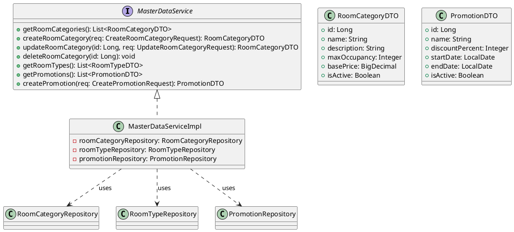
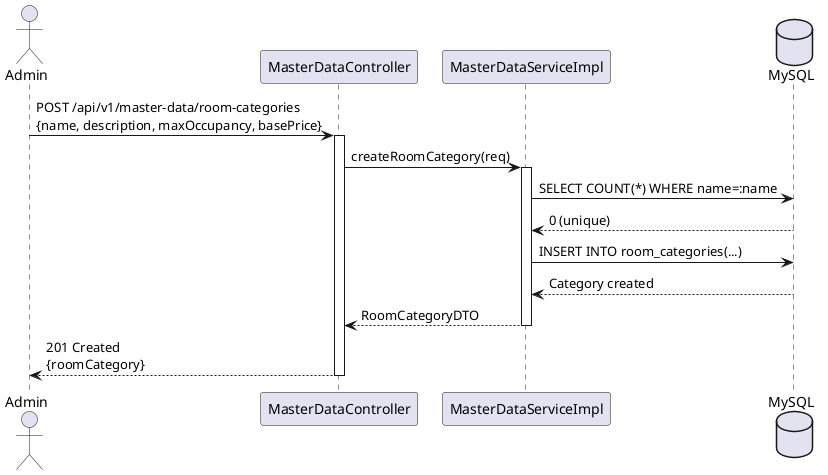
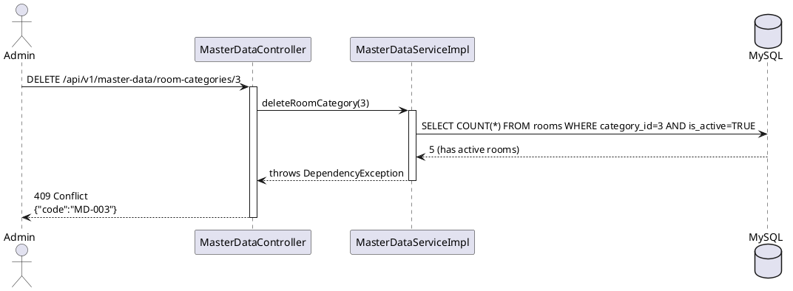

# ENGINEERING DOCUMENTATION STANDARD (EDS) v2.0

## UC04 — Quản lý Master Data (MasterDataService)

| Field | Value |
|-------|-------|
| **Document ID** | `KAWAI-EDS-MOD1-UC04-001` |
| **Version** | 1.0 |
| **Date** | 2026-06-14 |
| **Status** | Approved |
| **Document Owner** | Nguyễn Xuân Lưu |
| **Author** | Nguyễn Xuân Lưu — Developer |
| **Reviewed by** | Nguyễn Xuân Lưu — Tech Lead |
| **DPO Sign-off** | `[x] Approved – 2026-06-14 – Nguyễn Xuân Lưu` |
| **Approved by** | `[x] Nguyễn Xuân Lưu – 2026-06-14` |
| **Last Review** | 2026-06-14 |
| **Based on EDS** | v2.0 |

---

### CHANGELOG
| Ngày | Người thực hiện | Nội dung thay đổi |
|------|-----------------|-------------------|
| 2026-06-14 | Nguyễn Xuân Lưu | Tạo tài liệu lần đầu |

---

### MỤC LỤC
1. [Tổng quan Module](#1)
2. [Ma trận Truy vết](#2)
3. [ADR](#3)
4. [Non-Functional & SLA](#4)
5. [Static Modeling](#5)
6. [Dynamic Modeling](#6)
7. [Domain Event Catalog](#7)
8. [Interface Specification](#8)
9. [API Specification](#9)
10. [Bảng mã lỗi](#10)
11. [Quy trình Triển khai](#11)
12. [Rollback & Incident Runbook](#12)
13. [Kịch bản Kiểm thử](#13)
14. [Phương pháp Xác minh](#14)
15. [Mẫu thử thực tế](#15)
16. [Authorization Matrix](#16)
17. [Phụ lục](#17)

---

### 1. Tổng quan Module

| Field | Value |
|-------|-------|
| **Module Name** | Quản lý Master Data (UC04) |
| **Bounded Context** | Reference Data Management |
| **Use Case** | UC04: Admin CRUD hạng phòng, loại tour, menu — dữ liệu tham chiếu cho toàn hệ thống |
| **Data Classification** | Internal |
| **Compliance Scope** | N/A |
| **Upstream Dependencies** | UC01 (Auth — JWT required) |
| **Downstream Consumers** | UC08 (Price Config), UC09/UC10 (Booking) |

---

### 2. Ma trận Truy vết

| Requirement ID | Loại | Mô tả | Thành phần Code | Compliance | ADR |
|----------------|------|-------|-----------------|------------|-----|
| UC04.1 | US | CRUD Room Category | `MasterDataService.crudRoomCategory()` | — | ADR-004 |
| UC04.2 | US | CRUD Room Type | `MasterDataService.crudRoomType()` | — | — |
| UC04.3 | US | CRUD Promotion | `MasterDataService.crudPromotion()` | — | — |
| BR-MD-01 | BR | Tên category/type phải unique | `MasterDataServiceImpl.validateUniqueName()` | — | — |
| BR-MD-02 | BR | Không xóa category đang có phòng active | `MasterDataServiceImpl.checkDependencies()` | — | — |

---

### 3. Architecture Decision Records (ADR)

#### ADR-004 — Master Data Immutable Audit Trail

| Field | Value |
|-------|-------|
| **Status** | Accepted |
| **Deciders** | Nguyễn Xuân Lưu |
| **Date** | 2026-06-10 |

**Bối cảnh:** Master data thay đổi ảnh hưởng toàn bộ hệ thống booking và pricing. Cần đảm bảo truy vết mọi thay đổi.

**Quyết định:** Mọi thay đổi master data đều được ghi audit log. Soft-delete thay vì hard-delete. Không cho phép xóa category/type khi còn phòng/tour đang sử dụng.

**Hệ quả:** Tăng tính toàn vẹn dữ liệu, nhưng cần thêm logic kiểm tra dependencies trước khi xóa.

---

### 4. Non-Functional Requirements & SLA

#### 4.1. Performance & Availability

| Category | Requirement | Target SLA | Measurement |
|----------|-------------|------------|-------------|
| **Latency** | Master data API (p99) | < 200ms | k6 load test |
| **Availability** | Uptime (monthly) | 99.9% | Uptime monitor |
| **Caching** | Category list | Cache 5 phút | Redis TTL |

#### 4.2. Security

| Category | Requirement | Target | Verification |
|----------|-------------|--------|-------------|
| **Access** | ADMIN only cho CUD, ADMIN + RECEPTIONIST cho Read | RBAC | Integration test |
| **Unique** | Tên category/type unique | DB constraint | Unit test |

---

### 5. Static Modeling

#### 5.1. Class Diagram



#### 5.2. Data Structure

```sql
CREATE TABLE room_categories (
    id BIGINT AUTO_INCREMENT PRIMARY KEY,
    name VARCHAR(100) UNIQUE NOT NULL,
    description TEXT,
    max_occupancy INT NOT NULL DEFAULT 2,
    base_price DECIMAL(12,2) NOT NULL,
    is_active BOOLEAN DEFAULT TRUE,
    created_at TIMESTAMP DEFAULT CURRENT_TIMESTAMP,
    updated_at TIMESTAMP DEFAULT CURRENT_TIMESTAMP ON UPDATE CURRENT_TIMESTAMP
);

CREATE TABLE promotions (
    id BIGINT AUTO_INCREMENT PRIMARY KEY,
    name VARCHAR(100) NOT NULL,
    discount_percent INT NOT NULL CHECK (discount_percent BETWEEN 1 AND 100),
    start_date DATE NOT NULL,
    end_date DATE NOT NULL,
    is_active BOOLEAN DEFAULT TRUE,
    created_at TIMESTAMP DEFAULT CURRENT_TIMESTAMP
);
```

---

### 6. Dynamic Modeling

#### 6.1. Sequence Diagram — Happy Path: Create Room Category



#### 6.2. Sequence Diagram — Error: Delete category đang sử dụng



---

### 7. Domain Event Catalog

| Event Name | Trigger | Publisher | Subscriber(s) | Async? |
|------------|---------|-----------|---------------|--------|
| `RoomCategoryCreated` | Tạo hạng phòng | `MasterDataService` | `AuditService` | Yes |
| `RoomCategoryUpdated` | Sửa hạng phòng | `MasterDataService` | `AuditService`, `CacheService` | Yes |
| `PromotionCreated` | Tạo khuyến mãi | `MasterDataService` | `AuditService`, `NotificationService` | Yes |

---

### 8. Interface Specification

```java
// MasterDataService.java
// @version 1.0

public interface MasterDataService {
    List<RoomCategoryDTO> getRoomCategories();
    RoomCategoryDTO createRoomCategory(CreateRoomCategoryRequest req)
        throws DuplicateNameException, ValidationException;
    RoomCategoryDTO updateRoomCategory(Long id, UpdateRoomCategoryRequest req)
        throws CategoryNotFoundException, DuplicateNameException;
    void deleteRoomCategory(Long id)
        throws CategoryNotFoundException, DependencyException;

    List<RoomTypeDTO> getRoomTypes();

    List<PromotionDTO> getPromotions();
    PromotionDTO createPromotion(CreatePromotionRequest req)
        throws ValidationException;
}
```

---

### 9. API Specification

| Method | Path | Auth | Roles | Rate Limit | Idempotent? |
|--------|------|------|-------|------------|-------------|
| GET | `/api/v1/master-data/room-categories` | JWT | ADMIN, RECEPTIONIST | 60/min | Yes |
| POST | `/api/v1/master-data/room-categories` | JWT | ADMIN | 20/min | No |
| PUT | `/api/v1/master-data/room-categories/{id}` | JWT | ADMIN | 20/min | No |
| DELETE | `/api/v1/master-data/room-categories/{id}` | JWT | ADMIN | 10/min | Yes |
| GET | `/api/v1/master-data/promotions` | JWT | ADMIN, RECEPTIONIST | 60/min | Yes |
| POST | `/api/v1/master-data/promotions` | JWT | ADMIN | 20/min | No |

**POST `/api/v1/master-data/room-categories`**
*Request:* `{"name":"Deluxe Ocean View","description":"Phòng view biển cao cấp","maxOccupancy":3,"basePrice":2500000}`
*Response 201:* `{"id":4,"name":"Deluxe Ocean View","basePrice":2500000,"isActive":true}`
*Response 409:* `{"error":{"code":"MD-002","message":"Category name already exists"}}`

---

### 10. Bảng mã lỗi

| Code | HTTP | Message (EN) | Message (VI) | Trigger |
|------|------|--------------|--------------|---------|
| `MD-001` | 400 | Invalid master data | Dữ liệu không hợp lệ | Thiếu required field |
| `MD-002` | 409 | Name already exists | Tên đã tồn tại | Trùng tên category/type |
| `MD-003` | 409 | Cannot delete — has dependencies | Không thể xóa — đang có dữ liệu phụ thuộc | Category đang có phòng active |
| `MD-004` | 404 | Master data not found | Không tìm thấy dữ liệu | ID không tồn tại |

---

### 11. Quy trình Triển khai

#### 11.1. Prerequisites
- [x] Database đã có bảng room_categories, promotions
- [x] UC01 (Auth) đã hoạt động

#### 11.2. Deployment
```bash
mvn clean package -DskipTests
java -jar target/kawai-backend-1.0.jar --spring.profiles.active=staging
```

#### 11.3. Verification
```bash
curl -X GET http://localhost:8080/api/v1/master-data/room-categories \
  -H "Authorization: Bearer [JWT_ADMIN]"
```

---

### 12. Rollback & Incident Runbook

| Điều kiện | Ngưỡng | Người quyết định |
|-----------|--------|-------------------|
| Master data CRUD fail | > 5% trong 5 phút | On-call Engineer |
| Data integrity issue | Bất kỳ case nào | Tech Lead |

**Rollback:** `git checkout tags/v1.0.0 && mvn clean package`

---

### 13. Kịch bản Kiểm thử

**[Policy]** Test Data: SYNTHETIC. ❌ KHÔNG dùng Production data.

#### 13.1. Unit Tests
- TC-UNIT-UC04-001: CRUD Room Category thành công
- TC-UNIT-UC04-002: CRUD Room Type thành công
- TC-UNIT-UC04-003: Create Promotion thành công
- TC-UNIT-UC04-004: Duplicate name → 409
- TC-UNIT-UC04-005: Delete category có dependency → 409

#### 13.2. E2E Tests
- TC-E2E-UC04-001: Admin login → Create Category → Update → Delete flow

---

### 14. Phương pháp Xác minh

```sql
SELECT id, name, base_price, is_active FROM room_categories ORDER BY id;
SELECT id, name, discount_percent, start_date, end_date FROM promotions WHERE is_active = TRUE;
```

---

### 15. Mẫu thử thực tế

```bash
# List room categories
curl -X GET https://api.kawairesort.com/api/v1/master-data/room-categories \
  -H "Authorization: Bearer [JWT_ADMIN]"

# Create room category
curl -X POST https://api.kawairesort.com/api/v1/master-data/room-categories \
  -H "Authorization: Bearer [JWT_ADMIN]" \
  -H "Content-Type: application/json" \
  -d '{"name":"Deluxe Ocean View","description":"Phòng view biển cao cấp","maxOccupancy":3,"basePrice":2500000}'

# Update room category
curl -X PUT https://api.kawairesort.com/api/v1/master-data/room-categories/4 \
  -H "Authorization: Bearer [JWT_ADMIN]" \
  -H "Content-Type: application/json" \
  -d '{"name":"Premium Ocean View","basePrice":3000000}'

# Delete room category
curl -X DELETE https://api.kawairesort.com/api/v1/master-data/room-categories/4 \
  -H "Authorization: Bearer [JWT_ADMIN]"
```

---

### 16. Authorization Matrix

| Endpoint | GUEST | CUSTOMER | RECEPTIONIST | ADMIN |
|----------|:-----:|:--------:|:------------:|:-----:|
| GET `/api/v1/master-data/room-categories` | ❌ | ❌ | ✔️ | ✔️ |
| POST `/api/v1/master-data/room-categories` | ❌ | ❌ | ❌ | ✔️ |
| PUT `/api/v1/master-data/room-categories/{id}` | ❌ | ❌ | ❌ | ✔️ |
| DELETE `/api/v1/master-data/room-categories/{id}` | ❌ | ❌ | ❌ | ✔️ |
| GET `/api/v1/master-data/promotions` | ❌ | ❌ | ✔️ | ✔️ |
| POST `/api/v1/master-data/promotions` | ❌ | ❌ | ❌ | ✔️ |

---

### PHỤ LỤC

#### A. Glossary
| Thuật ngữ | Định nghĩa |
|-----------|------------|
| **Master Data** | Dữ liệu tham chiếu dùng chung cho toàn hệ thống (hạng phòng, khuyến mãi...) |
| **Room Category** | Hạng phòng (Standard, Deluxe, Suite...) |
| **Promotion** | Chương trình khuyến mãi với discount % |

#### B. Tài liệu tham chiếu
| Document | Path |
|----------|------|
| TDD UC04 | `06-Testing/mod1_auth/uc04/TDD_UC04_SPEC.md` |
| ADR-004 | `06-Testing/MASTER_EDS_SPEC.md` |

---

*EDS v2.0*
