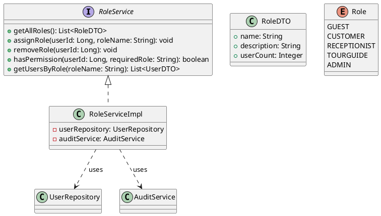
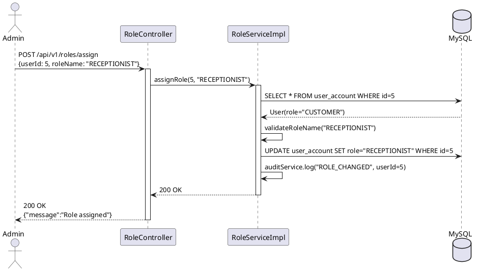
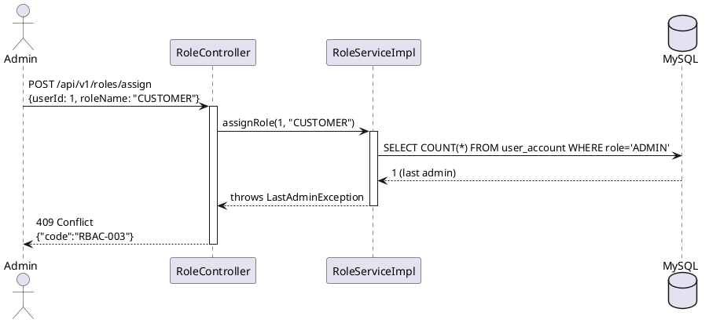

# ENGINEERING DOCUMENTATION STANDARD (EDS) v2.0

## UC05 — Phân quyền RBAC (RoleService)

| Field | Value |
|-------|-------|
| **Document ID** | `KAWAI-EDS-MOD1-UC05-001` |
| **Version** | 1.0 |
| **Date** | 2026-06-14 |
| **Status** | Approved |
| **Document Owner** | Nguyễn Xuân Lưu |
| **Author** | Nguyễn Xuân Lưu — Developer |
| **Reviewed by** | Nguyễn Xuân Lưu — Tech Lead |
| **DPO Sign-off** | `[x] Approved – 2026-06-14 – Nguyễn Xuân Lưu` |
| **Approved by** | `[x] Nguyễn Xuân Lưu – 2026-06-14` |
| **Last Review** | 2026-06-14 |
| **Based on EDS** | v2.0 |

---

### CHANGELOG
| Ngày | Người thực hiện | Nội dung thay đổi |
|------|-----------------|-------------------|
| 2026-06-14 | Nguyễn Xuân Lưu | Tạo tài liệu lần đầu |

---

### MỤC LỤC
1. [Tổng quan Module](#1)
2. [Ma trận Truy vết](#2)
3. [ADR](#3)
4. [Non-Functional & SLA](#4)
5. [Static Modeling](#5)
6. [Dynamic Modeling](#6)
7. [Domain Event Catalog](#7)
8. [Interface Specification](#8)
9. [API Specification](#9)
10. [Bảng mã lỗi](#10)
11. [Quy trình Triển khai](#11)
12. [Rollback & Incident Runbook](#12)
13. [Kịch bản Kiểm thử](#13)
14. [Phương pháp Xác minh](#14)
15. [Mẫu thử thực tế](#15)
16. [Authorization Matrix](#16)
17. [Phụ lục](#17)

---

### 1. Tổng quan Module

| Field | Value |
|-------|-------|
| **Module Name** | Phân quyền RBAC (UC05) |
| **Bounded Context** | Authorization & Access Control |
| **Use Case** | UC05: Gán role, gỡ role, kiểm tra quyền truy cập dựa trên RBAC |
| **Data Classification** | Internal |
| **Compliance Scope** | GDPR Art.25 (Data Protection by Design) |
| **Upstream Dependencies** | UC01 (Auth — JWT), UC03 (Employee Management) |
| **Downstream Consumers** | Tất cả UC khác (authorization check) |

---

### 2. Ma trận Truy vết

| Requirement ID | Loại | Mô tả | Thành phần Code | Compliance | ADR |
|----------------|------|-------|-----------------|------------|-----|
| UC05.1 | US | Gán role cho user | `RoleService.assignRole()` | GDPR Art.25 | ADR-005 |
| UC05.2 | US | Gỡ role khỏi user | `RoleService.removeRole()` | — | — |
| UC05.3 | US | Kiểm tra quyền | `RoleService.hasPermission()` | — | — |
| UC05.4 | US | Danh sách roles | `RoleService.getAllRoles()` | — | — |
| BR-RBAC-01 | BR | Chỉ ADMIN mới gán/gỡ role | `@PreAuthorize("hasRole('ADMIN')")` | — | ADR-005 |
| BR-RBAC-02 | BR | Không cho phép gỡ role ADMIN cuối cùng | `RoleServiceImpl.validateLastAdmin()` | — | — |

---

### 3. Architecture Decision Records (ADR)

#### ADR-005 — RBAC Role Hierarchy

| Field | Value |
|-------|-------|
| **Status** | Accepted |
| **Deciders** | Nguyễn Xuân Lưu |
| **Date** | 2026-06-10 |

**Bối cảnh:** Cần hệ thống phân quyền linh hoạt cho resort — GUEST (chưa đăng nhập), CUSTOMER, RECEPTIONIST, TOURGUIDE, ADMIN.

**Quyết định:** RBAC đơn giản — mỗi user có 1 role. Role hierarchy: ADMIN > RECEPTIONIST/TOURGUIDE > CUSTOMER > GUEST. Permission kiểm tra theo role trực tiếp, không dùng permission table phức tạp.

**Hệ quả:** Đơn giản và đủ dùng cho resort, nhưng không hỗ trợ custom permission per user. Chấp nhận trade-off này cho MVP.

---

### 4. Non-Functional Requirements & SLA

#### 4.1. Performance & Availability

| Category | Requirement | Target SLA | Measurement |
|----------|-------------|------------|-------------|
| **Latency** | Permission check (p99) | < 50ms | k6 load test |
| **Availability** | Uptime (monthly) | 99.9% | Uptime monitor |

#### 4.2. Security

| Category | Requirement | Target | Verification |
|----------|-------------|--------|-------------|
| **Access** | ADMIN only cho gán/gỡ role | RBAC check | Integration test |
| **Safety** | Không xóa ADMIN cuối cùng | Business logic | Unit test |
| **Audit** | Mọi thay đổi role đều được log | Audit trail | Unit test |

---

### 5. Static Modeling

#### 5.1. Class Diagram



#### 5.2. Data Structure

```sql
-- Role được lưu trực tiếp trong bảng user_account
ALTER TABLE user_account
    ADD COLUMN role VARCHAR(50) NOT NULL DEFAULT 'CUSTOMER';

-- Enum values: GUEST, CUSTOMER, RECEPTIONIST, TOURGUIDE, ADMIN
```

---

### 6. Dynamic Modeling

#### 6.1. Sequence Diagram — Happy Path: Assign Role



#### 6.2. Sequence Diagram — Error: Remove Last ADMIN



---

### 7. Domain Event Catalog

| Event Name | Trigger | Publisher | Subscriber(s) | Async? |
|------------|---------|-----------|---------------|--------|
| `RoleAssigned` | Gán role cho user | `RoleService` | `AuditService` | Yes |
| `RoleRemoved` | Gỡ role khỏi user | `RoleService` | `AuditService`, `NotificationService` | Yes |

---

### 8. Interface Specification

```java
// RoleService.java
// @version 1.0

public interface RoleService {
    List<RoleDTO> getAllRoles();
    void assignRole(Long userId, String roleName)
        throws UserNotFoundException, InvalidRoleException, LastAdminException;
    void removeRole(Long userId)
        throws UserNotFoundException, LastAdminException;
    boolean hasPermission(Long userId, String requiredRole);
    List<UserDTO> getUsersByRole(String roleName)
        throws InvalidRoleException;
}
```

---

### 9. API Specification

| Method | Path | Auth | Roles | Rate Limit | Idempotent? |
|--------|------|------|-------|------------|-------------|
| GET | `/api/v1/roles` | JWT | ADMIN | 60/min | Yes |
| POST | `/api/v1/roles/assign` | JWT | ADMIN | 20/min | No |
| POST | `/api/v1/roles/remove` | JWT | ADMIN | 10/min | No |
| GET | `/api/v1/roles/check-permission` | JWT | All | 60/min | Yes |
| GET | `/api/v1/roles/{roleName}/users` | JWT | ADMIN | 30/min | Yes |

**POST `/api/v1/roles/assign`**
*Request:* `{"userId":5,"roleName":"RECEPTIONIST"}`
*Response 200:* `{"message":"Role RECEPTIONIST assigned to user 5"}`
*Response 400:* `{"error":{"code":"RBAC-002","message":"Invalid role name"}}`

**GET `/api/v1/roles/check-permission?userId=5&requiredRole=RECEPTIONIST`**
*Response 200:* `{"hasPermission":true}`

---

### 10. Bảng mã lỗi

| Code | HTTP | Message (EN) | Message (VI) | Trigger |
|------|------|--------------|--------------|---------|
| `RBAC-001` | 403 | Insufficient permissions | Không có quyền | Non-ADMIN gán role |
| `RBAC-002` | 400 | Invalid role name | Tên role không hợp lệ | Role không tồn tại |
| `RBAC-003` | 409 | Cannot remove last admin | Không thể gỡ ADMIN cuối cùng | Chỉ còn 1 ADMIN |
| `RBAC-004` | 404 | User not found | Không tìm thấy user | userId không tồn tại |

---

### 11. Quy trình Triển khai

#### 11.1. Prerequisites
- [x] UC01 (Auth) đã hoạt động
- [x] UC03 (Employee Management) đã hoạt động
- [x] Role enum đã được định nghĩa

#### 11.2. Deployment
```bash
mvn clean package -DskipTests
java -jar target/kawai-backend-1.0.jar --spring.profiles.active=staging
```

#### 11.3. Verification
```bash
curl -X GET http://localhost:8080/api/v1/roles \
  -H "Authorization: Bearer [JWT_ADMIN]"
```

---

### 12. Rollback & Incident Runbook

| Điều kiện | Ngưỡng | Người quyết định |
|-----------|--------|-------------------|
| Permission check fail | Bất kỳ case nào | Tech Lead |
| Role assignment sai | Bất kỳ case nào | ADMIN |

**Rollback:** `git checkout tags/v1.0.0 && mvn clean package`

---

### 13. Kịch bản Kiểm thử

**[Policy]** Test Data: SYNTHETIC. ❌ KHÔNG dùng Production data.

#### 13.1. Unit Tests
- TC-UNIT-UC05-001: Assign role thành công
- TC-UNIT-UC05-002: Remove role thành công
- TC-UNIT-UC05-003: Check permission — has permission
- TC-UNIT-UC05-004: Check permission — no permission
- TC-UNIT-UC05-005: Invalid role name → 400
- TC-UNIT-UC05-006: Remove last ADMIN → 409

#### 13.2. E2E Tests
- TC-E2E-UC05-001: Admin login → Assign role → Verify permission → Remove role flow

---

### 14. Phương pháp Xác minh

```sql
SELECT id, email, role FROM user_account WHERE id = :userId;
SELECT role, COUNT(*) as user_count FROM user_account GROUP BY role;
SELECT COUNT(*) FROM user_account WHERE role = 'ADMIN' AND is_active = TRUE;
```

---

### 15. Mẫu thử thực tế

```bash
# List all roles
curl -X GET https://api.kawairesort.com/api/v1/roles \
  -H "Authorization: Bearer [JWT_ADMIN]"

# Assign role
curl -X POST https://api.kawairesort.com/api/v1/roles/assign \
  -H "Authorization: Bearer [JWT_ADMIN]" \
  -H "Content-Type: application/json" \
  -d '{"userId":5,"roleName":"RECEPTIONIST"}'

# Check permission
curl -X GET "https://api.kawairesort.com/api/v1/roles/check-permission?userId=5&requiredRole=RECEPTIONIST" \
  -H "Authorization: Bearer [JWT]"

# Remove role (reset to CUSTOMER)
curl -X POST https://api.kawairesort.com/api/v1/roles/remove \
  -H "Authorization: Bearer [JWT_ADMIN]" \
  -H "Content-Type: application/json" \
  -d '{"userId":5}'
```

---

### 16. Authorization Matrix

| Endpoint | GUEST | CUSTOMER | RECEPTIONIST | ADMIN |
|----------|:-----:|:--------:|:------------:|:-----:|
| GET `/api/v1/roles` | ❌ | ❌ | ❌ | ✔️ |
| POST `/api/v1/roles/assign` | ❌ | ❌ | ❌ | ✔️ |
| POST `/api/v1/roles/remove` | ❌ | ❌ | ❌ | ✔️ |
| GET `/api/v1/roles/check-permission` | ❌ | ✔️ | ✔️ | ✔️ |
| GET `/api/v1/roles/{roleName}/users` | ❌ | ❌ | ❌ | ✔️ |

---

### PHỤ LỤC

#### A. Glossary
| Thuật ngữ | Định nghĩa |
|-----------|------------|
| **RBAC** | Role-Based Access Control — phân quyền dựa trên vai trò |
| **Role Hierarchy** | ADMIN > RECEPTIONIST/TOURGUIDE > CUSTOMER > GUEST |
| **Permission Check** | Kiểm tra user có quyền truy cập tài nguyên hay không |

#### B. Tài liệu tham chiếu
| Document | Path |
|----------|------|
| TDD UC05 | `06-Testing/mod1_auth/uc05/TDD_UC05_SPEC.md` |
| ADR-005 | `06-Testing/MASTER_EDS_SPEC.md` |

---

*EDS v2.0*
