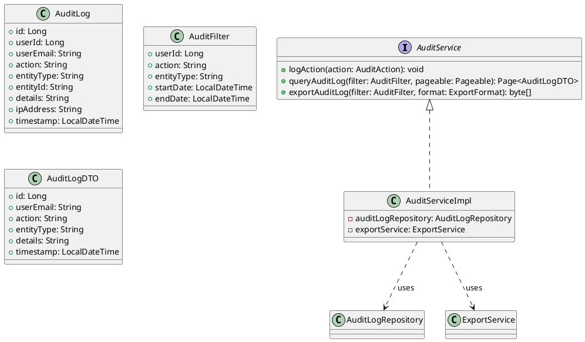
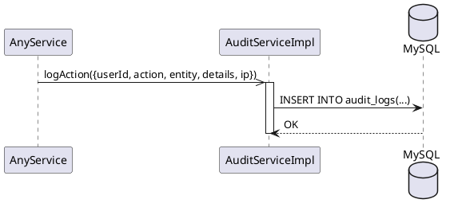
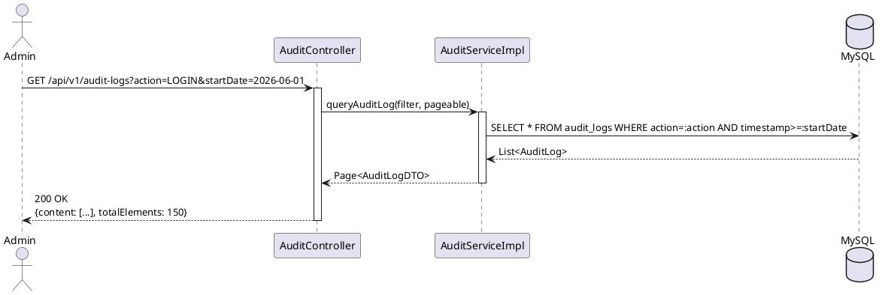

# ENGINEERING DOCUMENTATION STANDARD (EDS) v2.0

## UC06 — Giám sát Audit Log (AuditService)

| Field | Value |
|-------|-------|
| **Document ID** | `KAWAI-EDS-MOD1-UC06-001` |
| **Version** | 1.0 |
| **Date** | 2026-06-14 |
| **Status** | Approved |
| **Document Owner** | Nguyễn Xuân Lưu |
| **Author** | Nguyễn Xuân Lưu — Developer |
| **Reviewed by** | Nguyễn Xuân Lưu — Tech Lead |
| **DPO Sign-off** | `[x] Approved – 2026-06-14 – Nguyễn Xuân Lưu` |
| **Approved by** | `[x] Nguyễn Xuân Lưu – 2026-06-14` |
| **Last Review** | 2026-06-14 |
| **Based on EDS** | v2.0 |

---

### CHANGELOG
| Ngày | Người thực hiện | Nội dung thay đổi |
|------|-----------------|-------------------|
| 2026-06-14 | Nguyễn Xuân Lưu | Tạo tài liệu lần đầu |

---

### MỤC LỤC
1. [Tổng quan Module](#1)
2. [Ma trận Truy vết](#2)
3. [ADR](#3)
4. [Non-Functional & SLA](#4)
5. [Static Modeling](#5)
6. [Dynamic Modeling](#6)
7. [Domain Event Catalog](#7)
8. [Interface Specification](#8)
9. [API Specification](#9)
10. [Bảng mã lỗi](#10)
11. [Quy trình Triển khai](#11)
12. [Rollback & Incident Runbook](#12)
13. [Kịch bản Kiểm thử](#13)
14. [Phương pháp Xác minh](#14)
15. [Mẫu thử thực tế](#15)
16. [Authorization Matrix](#16)
17. [Phụ lục](#17)

---

### 1. Tổng quan Module

| Field | Value |
|-------|-------|
| **Module Name** | Giám sát Audit Log (UC06) |
| **Bounded Context** | Security & Compliance |
| **Use Case** | UC06: Ghi nhận, truy vấn, và xuất audit log — ai làm gì, lúc nào |
| **Data Classification** | Internal — Audit Trail |
| **Compliance Scope** | GDPR Art.5.1(d), ISO 27001 |
| **Upstream Dependencies** | Tất cả UC (mọi action đều được log) |
| **Downstream Consumers** | Compliance reports, Security monitoring |

---

### 2. Ma trận Truy vết

| Requirement ID | Loại | Mô tả | Thành phần Code | Compliance | ADR |
|----------------|------|-------|-----------------|------------|-----|
| UC06.1 | US | Ghi audit log tự động | `AuditService.logAction()` | ISO 27001 | ADR-006 |
| UC06.2 | US | Truy vấn audit log (filter, phân trang) | `AuditService.queryAuditLog()` | GDPR Art.5.1(d) | — |
| UC06.3 | US | Xuất audit log (CSV/Excel) | `AuditService.exportAuditLog()` | — | — |
| BR-AUDIT-01 | BR | Audit log là append-only, không cho sửa/xóa | `AuditLogRepository` (no update/delete) | ISO 27001 | ADR-006 |
| BR-AUDIT-02 | BR | Log phải chứa: userId, action, entity, timestamp, IP | `AuditLog entity` | — | — |

---

### 3. Architecture Decision Records (ADR)

#### ADR-006 — Append-Only Audit Log

| Field | Value |
|-------|-------|
| **Status** | Accepted |
| **Deciders** | Nguyễn Xuân Lưu |
| **Date** | 2026-06-10 |

**Bối cảnh:** Audit log phải đảm bảo tính toàn vẹn dữ liệu, không cho phép thay đổi hoặc xóa log đã ghi.

**Quyết định:** Audit log table chỉ có INSERT, không có UPDATE/DELETE. Repository không expose update/delete methods. Sử dụng @Immutable annotation trên entity.

**Hệ quả:** Data tăng theo thời gian, cần chiến lược archiving (sau 1 năm). Trade-off: storage vs compliance.

---

### 4. Non-Functional Requirements & SLA

#### 4.1. Performance & Availability

| Category | Requirement | Target SLA | Measurement |
|----------|-------------|------------|-------------|
| **Latency** | Log write (p99) | < 50ms | k6 load test |
| **Latency** | Query with filter (p99) | < 500ms | k6 load test |
| **Availability** | Uptime (monthly) | 99.9% | Uptime monitor |
| **Retention** | Log retention | 365 ngày | DB archiving |

#### 4.2. Security

| Category | Requirement | Target | Verification |
|----------|-------------|--------|-------------|
| **Immutability** | Append-only | No UPDATE/DELETE | Unit test |
| **Access** | ADMIN only cho query/export | RBAC | Integration test |
| **Integrity** | Log không bị tamper | Checksum | Unit test |

---

### 5. Static Modeling

#### 5.1. Class Diagram



#### 5.2. Data Structure

```sql
CREATE TABLE audit_logs (
    id BIGINT AUTO_INCREMENT PRIMARY KEY,
    user_id BIGINT,
    user_email VARCHAR(255),
    action VARCHAR(100) NOT NULL,
    entity_type VARCHAR(100),
    entity_id VARCHAR(100),
    details TEXT,
    ip_address VARCHAR(45),
    timestamp TIMESTAMP DEFAULT CURRENT_TIMESTAMP,
    INDEX idx_audit_user (user_id),
    INDEX idx_audit_action (action),
    INDEX idx_audit_timestamp (timestamp)
);

-- NOTE: Không có UPDATE hoặc DELETE trigger trên bảng này
```

---

### 6. Dynamic Modeling

#### 6.1. Sequence Diagram — Happy Path: Log Action (async)



#### 6.2. Sequence Diagram — Query Audit Log



---

### 7. Domain Event Catalog

| Event Name | Trigger | Publisher | Subscriber(s) | Async? |
|------------|---------|-----------|---------------|--------|
| `AuditLogCreated` | Mọi action trong hệ thống | Tất cả services | `AuditService` | Yes |
| `AuditExportRequested` | Admin xuất report | `AuditService` | `ExportService` | Yes |

---

### 8. Interface Specification

```java
// AuditService.java
// @version 1.0

public interface AuditService {
    void logAction(AuditAction action);

    Page<AuditLogDTO> queryAuditLog(AuditFilter filter, Pageable pageable);

    byte[] exportAuditLog(AuditFilter filter, ExportFormat format)
        throws ExportException;
}
```

---

### 9. API Specification

| Method | Path | Auth | Roles | Rate Limit | Idempotent? |
|--------|------|------|-------|------------|-------------|
| GET | `/api/v1/audit-logs` | JWT | ADMIN | 30/min | Yes |
| GET | `/api/v1/audit-logs/export` | JWT | ADMIN | 5/min | Yes |

**GET `/api/v1/audit-logs?action=LOGIN&startDate=2026-06-01&page=0&size=20`**
*Response 200:*
```json
{
  "content": [
    {"id":1,"userEmail":"admin@kawai.com","action":"LOGIN","details":"Login success","timestamp":"2026-06-14T10:00:00"},
    {"id":2,"userEmail":"staff@kawai.com","action":"LOGIN","details":"Login failed - wrong password","timestamp":"2026-06-14T10:05:00"}
  ],
  "totalElements": 150,
  "totalPages": 8
}
```

**GET `/api/v1/audit-logs/export?format=CSV&startDate=2026-06-01`**
*Response 200:* File download (CSV)

---

### 10. Bảng mã lỗi

| Code | HTTP | Message (EN) | Message (VI) | Trigger |
|------|------|--------------|--------------|---------|
| `AUDIT-001` | 400 | Invalid date range | Khoảng ngày không hợp lệ | startDate > endDate |
| `AUDIT-002` | 404 | No audit logs found | Không tìm thấy log | Filter trống kết quả |
| `AUDIT-003` | 500 | Export failed | Xuất file thất bại | File generation error |
| `AUDIT-004` | 403 | Insufficient permissions | Không có quyền | Non-ADMIN truy cập |

---

### 11. Quy trình Triển khai

#### 11.1. Prerequisites
- [x] Database đã có bảng audit_logs với indexes
- [x] UC01 (Auth) đã hoạt động

#### 11.2. Deployment
```bash
mvn clean package -DskipTests
java -jar target/kawai-backend-1.0.jar --spring.profiles.active=staging
```

#### 11.3. Verification
```bash
curl -X GET http://localhost:8080/api/v1/audit-logs \
  -H "Authorization: Bearer [JWT_ADMIN]"
```

---

### 12. Rollback & Incident Runbook

| Điều kiện | Ngưỡng | Người quyết định |
|-----------|--------|-------------------|
| Audit log write fail | Bất kỳ case nào | Tech Lead |
| Export timeout | > 30s | On-call Engineer |

**Rollback:** `git checkout tags/v1.0.0 && mvn clean package`

---

### 13. Kịch bản Kiểm thử

**[Policy]** Test Data: SYNTHETIC. ❌ KHÔNG dùng Production data.

#### 13.1. Unit Tests
- TC-UNIT-UC06-001: Log action ghi thành công
- TC-UNIT-UC06-002: Query audit log với filter
- TC-UNIT-UC06-003: Export audit log CSV
- TC-UNIT-UC06-004: Verify append-only (no update/delete)

#### 13.2. E2E Tests
- TC-E2E-UC06-001: Login → Trigger action → Query audit log → Verify entry

---

### 14. Phương pháp Xác minh

```sql
-- Verify audit log entries
SELECT id, user_email, action, entity_type, details, timestamp
FROM audit_logs
WHERE action = :action AND timestamp >= :startDate
ORDER BY timestamp DESC
LIMIT 20;

-- Verify append-only (count should never decrease)
SELECT COUNT(*) FROM audit_logs;

-- Verify specific user audit trail
SELECT * FROM audit_logs WHERE user_id = :userId ORDER BY timestamp DESC;
```

---

### 15. Mẫu thử thực tế

```bash
# Query audit logs
curl -X GET "https://api.kawairesort.com/api/v1/audit-logs?action=LOGIN&page=0&size=20" \
  -H "Authorization: Bearer [JWT_ADMIN]"

# Query by date range
curl -X GET "https://api.kawairesort.com/api/v1/audit-logs?startDate=2026-06-01&endDate=2026-06-14" \
  -H "Authorization: Bearer [JWT_ADMIN]"

# Export CSV
curl -X GET "https://api.kawairesort.com/api/v1/audit-logs/export?format=CSV&startDate=2026-06-01" \
  -H "Authorization: Bearer [JWT_ADMIN]" \
  -o audit_report.csv
```

---

### 16. Authorization Matrix

| Endpoint | GUEST | CUSTOMER | RECEPTIONIST | ADMIN |
|----------|:-----:|:--------:|:------------:|:-----:|
| GET `/api/v1/audit-logs` | ❌ | ❌ | ❌ | ✔️ |
| GET `/api/v1/audit-logs/export` | ❌ | ❌ | ❌ | ✔️ |

---

### PHỤ LỤC

#### A. Glossary
| Thuật ngữ | Định nghĩa |
|-----------|------------|
| **Audit Log** | Nhật ký ghi lại mọi hành động trong hệ thống |
| **Append-only** | Chỉ cho thêm mới, không cho sửa/xóa |
| **Compliance** | Tuân thủ quy định pháp luật (GDPR, ISO 27001) |

#### B. Tài liệu tham chiếu
| Document | Path |
|----------|------|
| TDD UC06 | `06-Testing/mod1_auth/uc06/TDD_UC06_SPEC.md` |
| ADR-006 | `06-Testing/MASTER_EDS_SPEC.md` |

---

*EDS v2.0*
