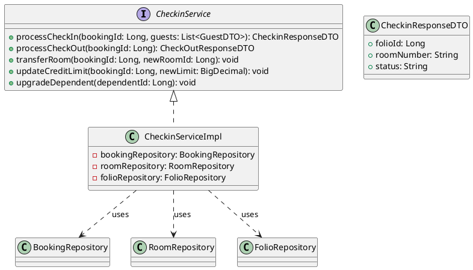
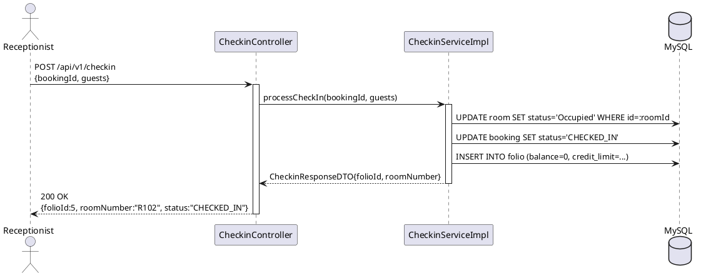
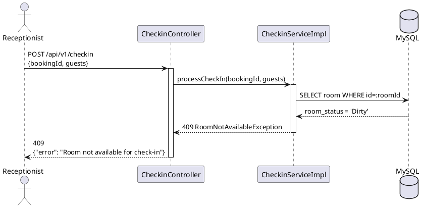
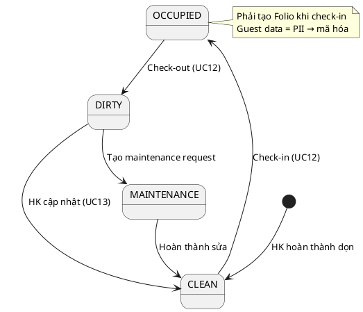

# ENGINEERING DOCUMENTATION STANDARD (EDS) v2.0

## UC12 — Check-in / Check-out / Đổi phòng (CheckinService)

| Field | Value |
|-------|-------|
| **Document ID** | `KAWAI-EDS-MOD2-UC12-001` |
| **Version** | 1.0 |
| **Date** | 2026-06-14 |
| **Status** | Approved |
| **Document Owner** | Chu Xuân Dũng |
| **Author** | Chu Xuân Dũng — Developer |
| **Reviewed by** | Nguyễn Xuân Lưu — Tech Lead |
| **DPO Sign-off** | `[x] Approved – 2026-06-14 – Chu Xuân Dũng` |
| **Approved by** | `[x] Chu Xuân Dũng – 2026-06-14` |
| **Last Review** | 2026-06-14 *(stale nếu > 2 sprints không cập nhật)* |
| **Based on EDS** | v2.0 |

---

### CHANGELOG
| Ngày | Người thực hiện | Nội dung thay đổi |
|------|-----------------|-------------------|
| 2026-06-14 | Chu Xuân Dũng | Tạo tài liệu lần đầu |

---

### MỤC LỤC
1. [Tổng quan Module](#1)
2. [Ma trận Truy vết](#2)
3. [ADR](#3)
4. [Non-Functional & SLA](#4)
5. [Static Modeling](#5)
6. [Dynamic Modeling](#6)
7. [Domain Event Catalog](#7)
8. [Interface Specification](#8)
9. [API Specification](#9)
10. [Bảng mã lỗi](#10)
11. [Quy trình Triển khai](#11)
12. [Rollback & Incident Runbook](#12)
13. [Kịch bản Kiểm thử](#13)
14. [Phương pháp Xác minh](#14)
15. [Mẫu thử thực tế](#15)
16. [Authorization Matrix](#16)
17. [Phụ lục](#17)

---

### 1. Tổng quan Module

| Field | Value |
|-------|-------|
| **Module Name** | Check-in / Check-out / Đổi phòng (UC12) |
| **Bounded Context** | Đặt phòng & Tiền sảnh vận hành |
| **Use Case** | UC12: Receptionist check-in khách, check-out, đổi phòng, cập nhật credit limit, upgrade dependent |
| **Data Classification** | PII (CCCD, họ tên khách) |
| **Compliance Scope** | Nghị định 13/2023/NĐ-CP |
| **Upstream Dependencies** | UC10 (Đặt phòng) |
| **Downstream Consumers** | UC13 (Housekeeping), Module 5 (Folio) |

---

### 2. Ma trận Truy vết (Traceability Matrix)

| Requirement ID | Loại | Mô tả yêu cầu | Thành phần Code | Compliance | ADR |
|----------------|------|---------------|-----------------|------------|-----|
| UC12.1 | US | Check-in guest → phòng OCCUPIED + tạo Folio | `CheckinService.processCheckIn()` | Nghị định 13/2023 | — |
| UC12.2 | US | Ủy quyền hạn mức — update Credit Limit | `CheckinService.updateCreditLimit()` | — | — |
| UC12.3 | US | Đổi phòng — chuyển Folio, phòng cũ DIRTY | `CheckinService.transferRoom()` | — | ADR-001 |
| UC12.4 | US | Nâng cấp Dependent → Customer + Account mới | `CheckinService.upgradeDependent()` | — | — |

---

### 3. Architecture Decision Records (ADR)

#### ADR-001 — Quản lý Trạng thái Phòng & Buồng phòng

| Field | Value |
|-------|-------|
| **Status** | Accepted |
| **Deciders** | Nguyễn Xuân Lưu + Chu Xuân Dũng |
| **Date** | 2026-06-12 |

**Bối cảnh (Context):** Kiểm soát trạng thái phòng vật lý (Dirty, Clean, Occupied, Maintenance) để đảm bảo lễ tân không giao nhầm phòng.

**Quyết định (Decision):** Tự động chuyển DIRTY khi Checkout + Housekeeping cập nhật CLEAN.

**Hệ quả:** Trạng thái phòng cập nhật real-time, giảm sai sót thủ công.

---

### 4. Non-Functional Requirements & SLA

#### 4.1. Performance & Availability

| Category | Requirement | Target SLA | Measurement Method |
|----------|-------------|------------|-------------------|
| **Latency** | API response (p99) | < 300ms | k6 load test |
| **Availability** | Uptime (monthly) | 99.9% | Uptime monitor |
| **Throughput** | Concurrent requests | 100 req/s | Load test |

#### 4.2. Data Integrity

| Category | Requirement | Target | Verification |
|----------|-------------|--------|-------------|
| **ACID** | Check-in phải đồng bộ room + booking + folio | RPO = 0 | Transaction log |

#### 4.3. Security

| Category | Requirement | Target | Verification |
|----------|-------------|--------|-------------|
| **Encryption** | PII fields (CCCD) | AES-256 | DB encryption check |
| **Access control** | Least privilege | — | Auth Matrix (§16) |

---

### 5. Static Modeling (Mô hình Tĩnh)

#### 5.1. Class Diagram (PlantUML)



#### 5.2. Data Structure

```sql
-- Room status flow during check-in
UPDATE room SET room_status = 'Occupied' WHERE id = :roomId;

-- Create folio
INSERT INTO folio (booking_id, room_id, credit_limit, balance, status)
VALUES (:bookingId, :roomId, :creditLimit, 0, 'ACTIVE');

-- Transfer room
UPDATE room SET room_status = 'Dirty' WHERE id = :oldRoomId;
UPDATE room SET room_status = 'Occupied' WHERE id = :newRoomId;
```

---

### 6. Dynamic Modeling (Mô hình Động)

#### 6.1. Sequence Diagram — Happy Path: Check-in



#### 6.2. Sequence Diagram — Error Path: Check-in phòng Dirty



#### 6.3. State Machine



> **Invariant:** Phòng DIRTY/MAINTENANCE không được phép check-in.

---

### 7. Domain Event Catalog

#### 7.1. Events Published

| Event Name | Trigger | Publisher | Subscriber(s) | Async? |
|------------|---------|-----------|---------------|--------|
| `RoomCheckedIn` | Check-in thành công | `CheckinService` | `HousekeepingService`, `FolioService` | Yes |
| `RoomCheckedOut` | Check-out thành công | `CheckinService` | `HousekeepingService`, `FolioService` | Yes |

#### 7.2. Events Consumed

| Event Name | Source | Handler | Action |
|------------|--------|---------|--------|
| `BookingConfirmed` | UC10 | `CheckinService` | Chuẩn bị check-in |

#### 7.3. Payload Schema

```typescript
export interface RoomCheckedInEvent {
  eventId: string;
  eventType: 'RoomCheckedIn';
  occurredAt: string;
  version: '1.0';
  payload: {
    bookingId: number;
    roomId: number;
    roomNumber: string;
    guestName: string;
    checkInDate: string;
    folioId: number;
  };
  metadata: { correlationId: string; createdBy: string; };
}
```

---

### 8. Interface Specification (Đặc tả Giao diện)

> **Policy:** Mỗi interface phải khai báo `@version`. Breaking change phải tạo ADR mới.

#### 8.1. Service Interface

```java
// CheckinService.java
// @version 1.0

public interface CheckinService {
    /**
     * Check-in khách: cập nhật phòng → OCCUPIED, tạo Folio
     * @throws RoomNotAvailableException nếu phòng Dirty/Maintenance
     */
    CheckinResponseDTO processCheckIn(Long bookingId, List<GuestDTO> guests)
        throws RoomNotAvailableException;

    /** Đổi phòng: chuyển Folio, phòng cũ → DIRTY */
    void transferRoom(Long bookingId, Long newRoomId);

    /** Cập nhật hạn mức tín dụng */
    void updateCreditLimit(Long bookingId, BigDecimal newLimit);

    /** Nâng cấp Dependent thành Customer + tạo Account */
    void upgradeDependent(Long dependentId);
}
```

#### 8.2. Repository Interface

```java
// @version 1.0
public interface RoomBookingDetailRepository extends JpaRepository<RoomBookingDetail, Long> {
    @Query("SELECT rbd FROM RoomBookingDetail rbd WHERE rbd.roomBooking.id = :bookingId AND rbd.detailStatus = 'CHECKED_IN'")
    List<RoomBookingDetail> findByBookingIdCheckedIn(@Param("bookingId") Long bookingId);
}
```

#### 8.3. DTOs

```java
public class GuestDTO {
    @NotNull private String fullName;
    @NotNull private String cccd;
    private boolean isMainGuest;
}

public class CheckinResponseDTO {
    private Long folioId;
    private String roomNumber;
    private String status;
}
```

---

### 9. API Specification

#### 9.1. Endpoints Table

| Method | Path | Auth Level | Required Roles | Rate Limit | Idempotent? |
|--------|------|------------|----------------|------------|-------------|
| POST | `/api/v1/checkin` | JWT Bearer | RECEPTIONIST, ADMIN | 30/min | No |
| POST | `/api/v1/checkin/transfer` | JWT Bearer | RECEPTIONIST, ADMIN | 20/min | No |
| PATCH | `/api/v1/checkin/credit-limit` | JWT Bearer | RECEPTIONIST, ADMIN | 20/min | No |

#### 9.2. Request / Response

**POST `/api/v1/checkin` — Check-in**

*Request Body:*
```json
{
  "bookingId": 12,
  "guests": [
    {"fullName": "Nguyen Van A", "cccd": "123456789012", "isMainGuest": true}
  ]
}
```

*Response 200:*
```json
{
  "folioId": 5,
  "roomNumber": "R102",
  "status": "CHECKED_IN"
}
```

*Response 409 (Phòng Dirty):*
```json
{"error": {"code": "MOD2-002", "message": "Room not available for check-in"}}
```

---

### 10. Bảng mã lỗi (Error Codes)

| Code | HTTP Status | Message (EN) | Message (VI) | Trigger Condition |
|------|-------------|--------------|--------------|-------------------|
| `MOD2-001` | 400 | Validation failed | Dữ liệu không hợp lệ | Thiếu CCCD, bookingId |
| `MOD2-002` | 409 | Room not available | Phòng không sẵn sàng | Phòng Dirty/Maintenance |
| `MOD2-003` | 404 | Booking not found | Không tìm thấy booking | BookingId không tồn tại |
| `MOD2-005` | 500 | Internal error | Lỗi hệ thống | Lỗi DB |

---

### 11. Quy trình Triển khai

#### 11.1. Prerequisites
- [x] ADR-001 Approved
- [x] UC10 (Đặt phòng) đã hoạt động

#### 11.2. Deployment
```bash
mvn clean package -DskipTests
java -jar target/kawai-backend-1.0.jar --spring.profiles.active=staging
```

#### 11.3. Verification
```bash
curl -X POST http://localhost:8080/api/v1/checkin \
  -H "Authorization: Bearer [JWT]" \
  -H "Content-Type: application/json" \
  -d '{"bookingId":12,"guests":[{"fullName":"Test","cccd":"123456789012","isMainGuest":true}]}'
```

---

### 12. Rollback & Incident Runbook

| Điều kiện | Ngưỡng | Người quyết định |
|-----------|--------|-------------------|
| Check-in fail liên tục | > 5 lỗi trong 5 phút | On-call Engineer |
| Folio tạo sai | Bất kỳ case nào | Tech Lead |

**Rollback:** `git checkout tags/v1.0.0 && mvn clean package`

---

### 13. Kịch bản Kiểm thử Chi tiết

**[Policy]** Test Data Classification: SYNTHETIC. ❌ KHÔNG dùng Production PII.

#### 13.1. Unit Tests

**TC-UNIT-UC12-001 — Check-in thành công**
* **Feature:** `CheckinService.processCheckIn()`
* **Scenario: Happy path**
  * Given booking BK-1001 CONFIRMED, phòng R102 CLEAN
  * When `processCheckIn` được gọi
  * Then room R102 = OCCUPIED, booking = CHECKED_IN, Folio tạo

**TC-UNIT-UC12-002 — Check-in thất bại: phòng Dirty**
* **Scenario: Room not ready**
  * Given room R103 DIRTY
  * When `processCheckIn` được gọi
  * Then throw RoomNotAvailableException

**TC-UNIT-UC12-003 — Đổi phòng**
* **Scenario: Transfer room**
  * Given booking BK-1001, phòng cũ R102 OCCUPIED
  * When `transferRoom(bookingId, newRoomId=R103)`
  * Then R102 = DIRTY, R103 = OCCUPIED

#### 13.2. E2E Tests

**TC-E2E-UC12-001 — Check-in through API**
* Given JWT của receptionist
* When POST /api/v1/checkin
* Then 200 + folioId

---

### 14. Phương pháp Xác minh

```sql
-- Verify check-in
SELECT r.room_status, b.booking_status, f.id as folio_id
FROM room r JOIN room_booking_detail rbd ON r.id = rbd.room_id
JOIN room_booking b ON rbd.room_booking_id = b.id
JOIN folio f ON f.booking_id = b.id
WHERE b.id = :bookingId;
```

---

### 15. Mẫu thử thực tế

```bash
# Check-in
curl -X POST https://api.kawairesort.com/api/v1/checkin \
  -H "Authorization: Bearer [RECEPTIONIST_TOKEN]" \
  -H "Content-Type: application/json" \
  -d '{"bookingId":12,"guests":[{"fullName":"Nguyen Van A","cccd":"123456789012","isMainGuest":true}]}'
```

---

### 16. Authorization Matrix

| Endpoint | GUEST | CUSTOMER | RECEPTIONIST | ADMIN | HOUSEKEEPING |
|----------|:-----:|:--------:|:------------:|:-----:|:------------:|
| POST `/api/v1/checkin` | ❌ | ❌ | ✔️ | ✔️ | ❌ |
| POST `/api/v1/checkin/transfer` | ❌ | ❌ | ✔️ | ✔️ | ❌ |
| PATCH `/api/v1/checkin/credit-limit` | ❌ | ❌ | ✔️ | ✔️ | ❌ |

---

### PHỤ LỤC

#### A. Glossary

| Thuật ngữ | Định nghĩa |
|-----------|------------|
| **Folio** | Hồ sơ ghi nhận chi tiêu tại khách sạn |
| **Credit Limit** | Hạn mức tín dụng phòng |
| **Dependent** | Người phụ thuộc đi cùng khách chính |

#### B. Tài liệu tham chiếu

| Document | Path |
|----------|------|
| TDD UC12 | `06-Testing/mod2_booking/uc12/TDD_UC12_SPEC.md` |
| ADR-001 | `06-Testing/MASTER_EDS_SPEC.md` |
| Database Schema | `03-Design/database_schema.md` |

---

*EDS v2.0*