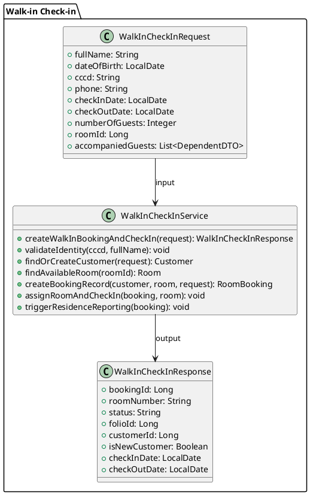
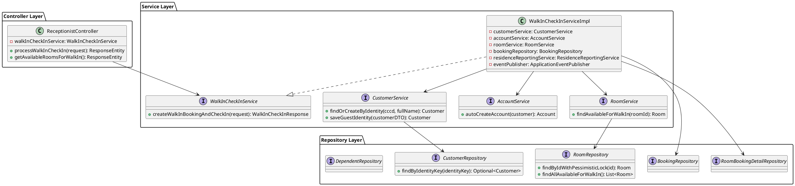
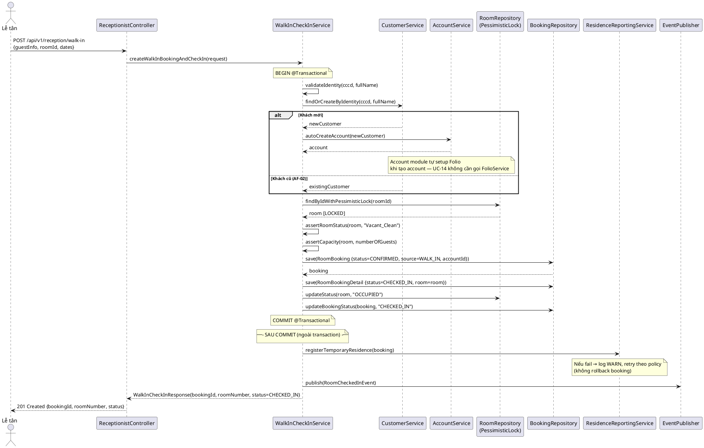
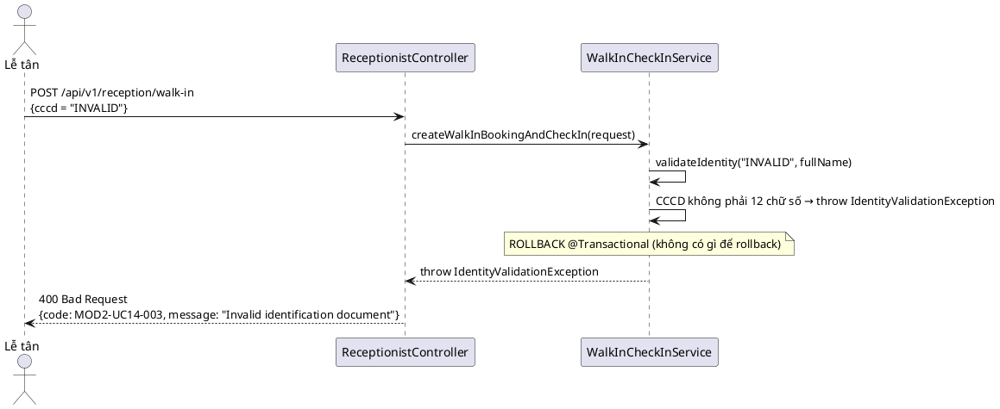
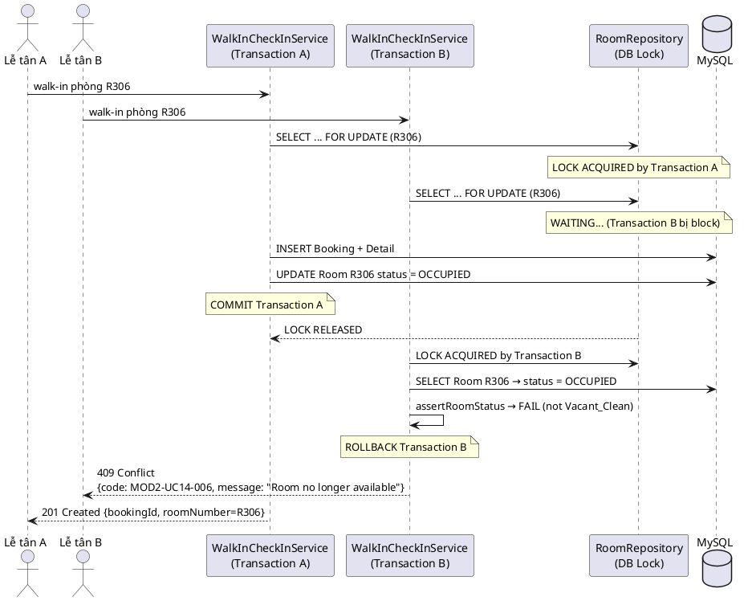
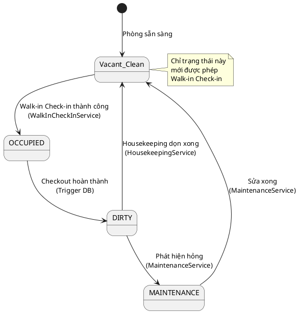

# ENGINEERING DOCUMENTATION STANDARD (EDS) v2.0

## UC-14: Walk-in Guest Check-in — Đặc tả Kỹ thuật & Hiện thực hóa

| Field                    | Value                                                                         |
| ------------------------ | ----------------------------------------------------------------------------- |
| **Document ID**    | `KAWAI-EDS-MOD2-UC14-001`                                                   |
| **Version**        | 1.2                                                                           |
| **Date**           | 2026-06-19                                                                    |
| **Status**         | Approved                                                                      |
| **Document Owner** | Chu Xuân Dũng                                                               |
| **Author**         | Chu Xuân Dũng                                                               |
| **Reviewed by**    | [ ] Nguyễn Xuân Lưu — Tech Lead — Pending                                |
| **DPO Sign-off**   | [ ] Pending*(bắt buộc — module xử lý PII: CCCD, Passport, Ngày sinh)* |
| **Approved by**    | [ ] Pending                                                                   |
| **Last Review**    | 2026-06-19                                                                    |
| **Based on EDS**   | v2.0                                                                          |

---

### CHANGELOG

> [!IMPORTANT]
> **Policy 4.4 — Immutable History:** Không bao giờ xóa thông tin cũ. Mọi thay đổi phải ghi vào bảng này.

| Ngày      | Người thực hiện | Nội dung thay đổi                                                                                                                                                                                                                                                                                                                                                                                                                                                         |
| ---------- | ------------------- | ---------------------------------------------------------------------------------------------------------------------------------------------------------------------------------------------------------------------------------------------------------------------------------------------------------------------------------------------------------------------------------------------------------------------------------------------------------------------------- |
| 2026-06-19 | Chu Xuân Dũng     | Xóa Folio khỏi UC-14: Folio được Account module setup sẵn khi tạo account — UC-14 không cần initializeFolio(). Xóa: FolioService dependency, folioId khỏi Response DTO/API sample, Folio assertion khỏi test, Folio check khỏi DB verification, Downstream Consumer Finance/Folio. Cập nhật ADR-UC14-003, Sequence Diagram, Service Interface.                                                                                                               |
| 2026-06-19 | Chu Xuân Dũng     | Scope reduction: xóa ADR-UC14-001 (AES/Key detail → Security Module), xóa creditLimit khỏi DTO/API, xóa MOD2-UC14-008 (age≥18 không có trong SRS), sửa Sequence Diagram (ResidenceReporting sau COMMIT), refactor Event Catalog (xóa FolioService subscriber, xóa PaymentReceived), đơn giản hóa ADR-UC14-004, xóa PII-specific rollback SQL, xóa TC-M2-027 khỏi deployment checklist, bổ sung BR-UC14-09 đơn giản (password do Auth module quản lý) |
| 2026-06-19 | Antigravity Agent   | Refactor scope: bổ sung BR-08/09/10 vào Traceability Matrix, thêm ADR-UC14-004 (Residence Reporting Option B), cập nhật NFR §4.3 (PII test → Security Suite), thêm MOD2-UC14-009, cập nhật Integration Test §13 (loại bỏ POS/F&B)                                                                                                                                                                                                                               |
| 2026-06-19 | Chu Xuân Dũng     | Tạo tài liệu lần đầu — EDS đầy đủ 17 section cho UC-14 Walk-in Guest Check-in theo chuẩn v2.0                                                                                                                                                                                                                                                                                                                                                                    |

---

### MỤC LỤC

1. [Tổng quan Module](#1-tong-quan-module)
2. [Ma trận Truy vết (Traceability Matrix)](#2-ma-tran-truy-vet-traceability-matrix)
3. [Architecture Decision Records (ADR)](#3-architecture-decision-records-adr)
4. [Non-Functional Requirements &amp; SLA](#4-non-functional-requirements--sla)
5. [Static Modeling (Mô hình Tĩnh)](#5-static-modeling-mo-hinh-tinh)
6. [Dynamic Modeling (Mô hình Động)](#6-dynamic-modeling-mo-hinh-dong)
7. [Domain Event Catalog](#7-domain-event-catalog)
8. [Interface Specification (Đặc tả Giao diện)](#8-interface-specification-dac-ta-giao-dien)
9. [API Specification](#9-api-specification)
10. [Bảng mã lỗi (Error Codes)](#10-bang-ma-loi-error-codes)
11. [Quy trình Triển khai (Step-by-Step)](#11-quy-trinh-trien-khai-step-by-step)
12. [Rollback &amp; Incident Runbook](#12-rollback--incident-runbook)
13. [Kịch bản Kiểm thử Chi tiết](#13-kich-ban-kiem-thu-chi-tiet)
14. [Phương pháp Xác minh](#14-phuong-phap-xac-minh)
15. [Mẫu thử thực tế (API Verification Samples)](#15-mau-thu-thuc-te-api-verification-samples)
16. [Bảng tổng hợp phân quyền (Authorization Matrix)](#16-bang-tong-hop-phan-quyen-authorization-matrix)
17. [Phụ lục](#17-phu-luc)

---

### 1. Tổng quan Module

Mô tả chức năng Walk-in Guest Check-in: xử lý khách đến khách sạn không có đặt phòng trước. Luồng gộp 2 tác vụ trong 1 giao dịch: Tạo đặt phòng mới + Check-in ngay lập tức.

| Field                           | Value                                                               |
| ------------------------------- | ------------------------------------------------------------------- |
| **Module Name**           | `Walk-in Guest Check-in (UC-14)`                                  |
| **Parent Module**         | `MOD2 — Đặt phòng & Tiền sảnh vận hành`                   |
| **Bounded Context**       | `Front Desk Operations`                                           |
| **Data Classification**   | Sensitive-PII (CCCD/Passport, Ngày sinh, SĐT, Địa chỉ)         |
| **Compliance Scope**      | Luật cư trú 2020, Luật du lịch 2017, Nghị định 13/2023      |
| **Upstream Dependencies** | `Module 1 (Auth)` — Xác thực Lễ tân (ROLE_RECEPTIONIST)      |
| **Downstream Consumers**  | `ResidenceReportingService` — Đăng ký tạm trú (best-effort) |
| **Primary Actor**         | Receptionist                                                        |
| **Secondary Actors**      | System, Customer                                                    |

**Phạm vi trách nhiệm của UC-14:**

- ✅ Xác thực thông tin nhận dạng khách (format CCCD/Passport)
- ✅ Tìm hoặc tạo Customer record
- ✅ Tạo Account cho khách mới (uỷ thác AccountService)
- ✅ Kiểm tra phòng trống (Vacant_Clean)
- ✅ Tạo Reservation + Assign room
- ✅ Check-in (cập nhật trạng thái Booking, Room)
- ✅ Kích hoạt Temporary Residence Reporting (best-effort)

**Ngoài phạm vi UC-14 (xử lý bởi module khác):**

- ❌ Mã hóa PII / Key Management → Security Module / CustomerService
- ❌ Password hashing policy → Auth Module / AccountService
- ❌ Folio initialization / Finance/Debt → Account Module / Finance Module *(Folio được setup sẵn khi tạo account)*
- ❌ POS/Post-to-Room → Module 3
- ❌ Checkout → UC-15

---

### 2. Ma trận Truy vết (Traceability Matrix)

Ánh xạ: `[Mã yêu cầu] → [Thành phần Code] → [Mục tiêu Tuân thủ]`

> [!NOTE]
> **Policy:** Không viết code nếu không biết code đó phục vụ Rule nào.

| Requirement ID | Loại (BR/ADR) | Mô tả yêu cầu                                                                                                                  | Thành phần Code                                             | Compliance Target                  | ADR liên quan |
| -------------- | -------------- | ---------------------------------------------------------------------------------------------------------------------------------- | ------------------------------------------------------------- | ---------------------------------- | -------------- |
| BR-UC14-01     | Business Rule  | Walk-in guest phải cung cấp CCCD/Passport hợp lệ (đúng format) trước khi check-in                                          | `WalkInCheckInService.validateIdentity()`                   | Luật cư trú 2020                | —             |
| BR-UC14-02     | Business Rule  | Check-in chỉ thực hiện được khi phòng chỉ định là `Vacant_Clean` và số khách ≤ capacity                           | `RoomRepository.findByIdWithPessimisticLock()`              | Luật du lịch 2017                | ADR-UC14-002   |
| BR-UC14-03     | Business Rule  | Phải tạo Booking record TRƯỚC khi check-in trong cùng 1 transaction                                                           | `WalkInCheckInService.createBookingAndCheckIn()`            | Quy trình nghiệp vụ khách sạn | ADR-UC14-003   |
| BR-UC14-04     | Business Rule  | Mỗi booking phải được gán vào 1 phòng vật lý cụ thể (RoomBookingDetail)                                                | `RoomBookingDetailRepository.save()`                        | Quy trình nghiệp vụ             | —             |
| BR-UC14-05     | Business Rule  | Trạng thái booking phải chuyển sang `Checked_In` sau check-in thành công                                                   | `WalkInCheckInService.updateStatusToCheckedIn()`            | Quy trình nghiệp vụ             | —             |
| BR-UC14-06     | Business Rule  | Thông tin nhận dạng khách phải được lưu trữ bảo mật theo chính sách bảo mật hệ thống (uỷ thác CustomerService) | `CustomerService.saveGuestIdentity()`                       | Nghị định 13/2023/NĐ-CP        | —             |
| BR-UC14-07     | Business Rule  | Tất cả khách lưu trú phải được đăng ký tạm trú (best-effort, không block check-in)                                  | `ResidenceReportingService.registerTemporaryResidence()`    | Luật cư trú 2020                | ADR-UC14-004   |
| BR-UC14-08     | Business Rule  | System tự động tạo Customer Account cho khách Walk-in mới (uỷ thác AccountService)                                         | `AccountService.autoCreateAccount(customer)`                | Quy trình nghiệp vụ             | —             |
| BR-UC14-09     | Business Rule  | Account được tạo với default credentials theo chính sách hệ thống (password do Auth module quản lý)                     | `AccountService.autoCreateAccount(customer)` *(nội bộ)* | Auth Module policy                 | —             |
| BR-UC14-10     | Business Rule  | Customer Account phải được link với Reservation ngay sau khi tạo                                                             | `RoomBooking.setAccountId(account.getId())`                 | Quy trình nghiệp vụ             | —             |
| BR-CONCUR-01   | ADR            | Chống overbooking: 2 lễ tân không thể check-in cùng 1 phòng đồng thời                                                    | `RoomRepository.findByIdWithPessimisticLock()`              | Data Integrity                     | ADR-UC14-002   |
| BR-ATOMIC-01   | ADR            | Toàn bộ walk-in (tạo Customer + Account + Booking + CheckIn) là 1 transaction nguyên vẹn                                     | `@Transactional` annotation trên service method            | Data Integrity / ACID              | ADR-UC14-003   |

> [!NOTE]
> **BR-UC14-06:** UC-14 chỉ biết rằng `CustomerService.saveGuestIdentity()` đảm bảo lưu trữ bảo mật. Chi tiết implementation (thuật toán mã hóa, key management) là trách nhiệm của Security/Customer Module — không thuộc UC-14.
>
> **BR-UC14-09:** UC-14 chỉ gọi `AccountService.autoCreateAccount()`. Chính sách mật khẩu (hashing algorithm, salt, rotation) là trách nhiệm của Auth Module — không thuộc UC-14.

---

### 3. Architecture Decision Records (ADR)

⭐️ **Section mới — EDS v2.0**

> [!NOTE]
> **ADR-UC14-001 đã bị xóa khỏi UC-14 (v1.2):** Chi tiết mã hóa PII (AES-256, Key Rotation, PII_ENCRYPTION_KEY) là trách nhiệm của Security Module / CustomerService. UC-14 chỉ cần biết rằng `CustomerService.saveGuestIdentity()` lưu trữ thông tin nhận dạng khách một cách bảo mật. Xem Security Module ADR để biết chi tiết implementation.

---

#### ADR-UC14-002 — Cơ chế Chống Overbooking cho Walk-in (Pessimistic Lock)

| Field                | Value                                       |
| -------------------- | ------------------------------------------- |
| **Status**     | Accepted                                    |
| **Deciders**   | Tech Lead + Chu Xuân Dũng                 |
| **Date**       | 2026-06-19                                  |
| **Supersedes** | ADR-002 (EDS_MOD2) — Mở rộng cho Walk-in |

**Bối cảnh (Context)**
Walk-in không có cơ chế soft-lock trước như online booking. 2 lễ tân có thể chọn cùng 1 phòng cùng lúc.

**Quyết định (Decision)**
Sử dụng `@Lock(LockModeType.PESSIMISTIC_WRITE)` khi query phòng trong `findByIdWithPessimisticLock()`. Luồng Walk-in giữ lock trong toàn bộ transaction cho đến khi Booking + CheckIn hoàn tất.

**Hệ quả (Consequences)**

- ✅ Loại bỏ hoàn toàn race condition.
- ⚠️ Tăng thời gian chờ nếu 2 lễ tân tranh chấp cùng 1 phòng.

---

#### ADR-UC14-003 — Tính Nguyên vẹn Giao dịch (ACID Transaction Boundary)

| Field              | Value      |
| ------------------ | ---------- |
| **Status**   | Accepted   |
| **Deciders** | Tech Lead  |
| **Date**     | 2026-06-19 |

**Quyết định (Decision)**
Toàn bộ Walk-in flow cốt lõi (findOrCreateCustomer → autoCreateAccount → createBooking → assignRoom → updateStatuses) được bọc trong 1 `@Transactional`. Bất kỳ bước nào thất bại → rollback toàn bộ. Không được phép partial commit.

> [!IMPORTANT]
> `ResidenceReportingService` được gọi SAU khi `@Transactional` commit — **không nằm trong transaction boundary**. Failure của reporting không rollback booking. Xem ADR-UC14-004.

> [!NOTE]
> `FolioService` **không được gọi** trong UC-14. Folio được Account module khởi tạo sẵn khi tạo account — UC-14 chỉ cần link Booking với account_id có sẵn.

---

#### ADR-UC14-004 — Temporary Residence Reporting: Best-Effort (Non-Blocking)

| Field                | Value                      |
| -------------------- | -------------------------- |
| **Status**     | Accepted                   |
| **Deciders**   | Tech Lead + Business Owner |
| **Date**       | 2026-06-19                 |
| **Supersedes** | —                         |

**Bối cảnh (Context)**
BR-07 yêu cầu đăng ký tạm trú theo Luật cư trú 2020. `ResidenceReportingService` có thể fail do network timeout hoặc external service unavailable.

**Quyết định (Decision)**
Chọn **Best-Effort, Non-Blocking:**

- `ResidenceReportingService.registerTemporaryResidence()` được gọi **sau khi** `@Transactional` commit.
- Nếu fail → ghi log WARN, hệ thống retry theo operational policy.
- Check-in **không bị ảnh hưởng** bởi kết quả của reporting.

**Hệ quả (Consequences)**

- ✅ UX không bị gián đoạn.
- ✅ Compliance đạt được qua cơ chế retry — audit trail đầy đủ.
- ⚠️ *Implementation note:* Operational team cần đảm bảo retry mechanism và SLA cho reporting (≤ 24h).

---

### 4. Non-Functional Requirements & SLA

#### 4.1. Performance & Availability

| Category               | Requirement         | Target SLA | Measurement Method | Compliance Basis |
| ---------------------- | ------------------- | ---------- | ------------------ | ---------------- |
| **Latency**      | Walk-in API (p99)   | < 500ms    | k6 load test       | —               |
| **Availability** | Uptime (monthly)    | 99.9%      | Uptime monitor     | —               |
| **Throughput**   | Concurrent walk-ins | 50 req/s   | Load test          | —               |

*Ghi chú: Walk-in có Pessimistic Lock nên throughput thấp hơn online booking là chấp nhận được.*

#### 4.2. Data Integrity & Retention

| Category              | Requirement                    | Target  | Verification Method                                    | Compliance Basis     |
| --------------------- | ------------------------------ | ------- | ------------------------------------------------------ | -------------------- |
| **ACID**        | Walk-in transaction toàn vẹn | RPO = 0 | `@Transactional` + TC-M2-025                         | Luật du lịch 2017  |
| **Durability**  | Audit log walk-in operations   | 7 năm  | DB backup policy                                       | Nghị định 13/2023 |
| **PII Storage** | Guest identity securely stored | 100%    | CustomerService Security Suite*(ngoài scope UC-14)* | Nghị định 13/2023 |

#### 4.3. Security (UC-14 Scope)

| Category                        | Requirement         | Target                 | Verification Method            | Compliance Basis     |
| ------------------------------- | ------------------- | ---------------------- | ------------------------------ | -------------------- |
| **Secure storage**        | Guest identity info | Per security policy    | CustomerService Security Suite | Nghị định 13/2023 |
| **Encryption in transit** | All API endpoints   | TLS 1.3+               | SSL Labs scan                  | GDPR Art. 32         |
| **Access control**        | Walk-in API         | ROLE_RECEPTIONIST only | Auth Matrix §16 + TC-M2-021   | Luật du lịch 2017  |
| **Audit trail**           | Mọi walk-in action | 100% logged            | AOP_Data_Interception          | Nghị định 13/2023 |

> [!NOTE]
> Chi tiết security implementation (mã hóa algorithm, password hashing, key management) là trách nhiệm của Security Module / Auth Module — không mô tả trong UC-14 EDS.

---

### 5. Static Modeling (Mô hình Tĩnh)

#### 5.1. Class Diagram (PlantUML)



#### 5.2. Data Structure (JPA Entities liên quan UC14)

```java
// Entity tham chiếu từ Walk-in Check-in

// Customer (khách walk-in mới hoặc đã có)
@Entity
public class Customer {
    @Id @GeneratedValue
    private Long id;
    private String fullName;
    private LocalDate dateOfBirth;

    // PII — lưu trữ bảo mật theo chính sách Security Module
    @Column(name = "cccd_passport_encrypted")
    private String cccdPassportEncrypted;

    private String phone;
    private String email;
    private String loyaltyPoints;
}

// RoomBooking (Walk-in tạo booking + check-in ngay)
@Entity
public class RoomBooking {
    @Id @GeneratedValue
    private Long id;
    @ManyToOne private Customer customer;
    private LocalDate checkInDate;
    private LocalDate checkOutDate;

    // Walk-in: tạo với CONFIRMED → ngay lập tức CHECKED_IN
    private String bookingStatus;

    // Walk-in source
    private String bookingSource; // = "WALK_IN"
}

// RoomBookingDetail
@Entity
public class RoomBookingDetail {
    @Id @GeneratedValue
    private Long id;
    @ManyToOne private RoomBooking roomBooking;
    @ManyToOne private Room room;
    @ManyToOne private RoomCategory category;
    private String detailStatus; // CHECKED_IN
}

// Dependent (khách đi kèm walk-in)
@Entity
public class Dependent {
    @Id @GeneratedValue
    private Long id;
    @ManyToOne private Customer primaryCustomer;
    private String dependentName;
    private LocalDate birthDate;

    // PII — lưu trữ bảo mật theo chính sách Security Module
    @Column(name = "cccd_passport_encrypted")
    private String cccdPassportEncrypted;
}
```

#### 5.3. Software Architecture Class Diagram



---

### 6. Dynamic Modeling (Mô hình Động)

#### 6.1. Sequence Diagram — Happy Path (PlantUML)



#### 6.2. Sequence Diagram — E-01: Invalid Identification



#### 6.3. Sequence Diagram — Concurrency (TC-M2-026)



#### 6.4. State Machine — Phòng & Booking trong Walk-in



> [!WARNING]
> **Invariant bất biến — UC14:** Phòng đang ở trạng thái `DIRTY` hoặc `MAINTENANCE` **tuyệt đối không** được check-in Walk-in. Service phải kiểm tra và throw exception trước khi acquire lock.

---

### 7. Domain Event Catalog

⭐️ **Section mới — EDS v2.0**

#### 7.1. Events Published (Phát ra) — UC-14

| Event Name                       | Trigger                         | Publisher                     | Subscriber(s)           | Payload Schema               | Async? |
| -------------------------------- | ------------------------------- | ----------------------------- | ----------------------- | ---------------------------- | ------ |
| `RoomCheckedIn`                | Phòng chuyển sang OCCUPIED    | `WalkInCheckInServiceImpl`  | `HousekeepingService` | `RoomCheckedInEvent`       | Yes    |
| `TemporaryResidenceRegistered` | Đăng ký tạm trú hoàn tất | `ResidenceReportingService` | `AuditLogService`     | `ResidenceRegisteredEvent` | Yes    |

> [!NOTE]
> **`WalkInCheckInCompleted` — FolioService subscriber đã bị xóa (v1.2):** Folio được tạo trực tiếp trong transaction thông qua `FolioService.initializeFolio()`. Không cần event để trigger FolioService sau khi commit.
>
> **`PaymentReceived` đã bị xóa (v1.2):** Walk-in thanh toán tại quầy — không có event payment trong UC-14. PaymentReceived thuộc Finance Module.

#### 7.2. Events Consumed (Tiêu thụ)

UC-14 **không consume** event từ module khác. Walk-in là luồng khởi tạo (producer-only từ góc độ event).

#### 7.3. Payload Schema

```typescript
// Event phát ra khi phòng chuyển OCCUPIED
export interface RoomCheckedInEvent {
  eventId: string;                    // UUID v4
  eventType: 'RoomCheckedIn';
  occurredAt: string;                 // ISO 8601
  version: '1.0';
  payload: {
    bookingId: number;
    roomId: number;
    roomNumber: string;
    checkInDate: string;
    checkOutDate: string;
    isWalkIn: boolean;                // = true cho Walk-in
  };
  metadata: {
    correlationId: string;
    performedBy: string;              // receptionist username
  };
}
```

---

### 8. Interface Specification (Đặc tả Giao diện)

> [!NOTE]
> **Policy (EDS v2.0):** Mỗi interface phải khai báo `@version`. Mọi breaking change phải tạo ADR mới.

#### 8.1. Service Interface

```java
// @version 1.0
// @since UC-14 Walk-in Guest Check-in
public interface WalkInCheckInService {

    /**
     * Xử lý toàn bộ luồng Walk-in trong 1 transaction:
     * 1. Xác thực danh tính khách (format CCCD/Passport)
     * 2. Tìm hoặc tạo Customer record (bảo mật uỷ thác CustomerService)
     * 3. Tạo Account nếu khách mới (uỷ thác AccountService — Folio được setup sẵn bởi Account module)
     * 4. Tạo RoomBooking (status: CHECKED_IN)
     * 5. Gán phòng vật lý (Pessimistic Lock)
     * 6. Cập nhật Room status → OCCUPIED
     * --- SAU COMMIT ---
     * 7. Kích hoạt Temporary Residence Reporting (best-effort)
     * 8. Publish RoomCheckedInEvent
     *
     * @param request DTO chứa thông tin khách và phòng
     * @return WalkInCheckInResponse chứa bookingId, roomNumber, status
     * @throws IdentityValidationException   khi CCCD/Passport không hợp lệ
     * @throws RoomNotAvailableException     khi phòng đã bị đặt hoặc không Vacant_Clean
     * @throws CapacityExceededException     khi số khách vượt capacity phòng
     * @throws WalkInTransactionException    khi transaction gặp lỗi không phục hồi
     */
    @Transactional
    WalkInCheckInResponse createWalkInBookingAndCheckIn(WalkInCheckInRequest request)
        throws IdentityValidationException, RoomNotAvailableException, WalkInTransactionException;

    /**
     * Trả về danh sách phòng trống hiện tại cho Walk-in
     * @return List<RoomAvailabilityDTO>
     */
    List<RoomAvailabilityDTO> getAvailableRoomsForWalkIn();
}
```

#### 8.2. Repository Interface

```java
// @version 1.0
public interface RoomRepository extends JpaRepository<Room, Long> {

    /**
     * Lấy phòng với Pessimistic Write Lock — chống race condition Walk-in
     * Chỉ dùng trong transaction context
     */
    @Lock(LockModeType.PESSIMISTIC_WRITE)
    @Query("SELECT r FROM Room r WHERE r.id = :id")
    Optional<Room> findByIdWithPessimisticLock(@Param("id") Long id);

    /**
     * Tìm tất cả phòng Vacant_Clean sẵn sàng cho Walk-in
     */
    @Query("SELECT r FROM Room r WHERE r.roomStatus = 'Vacant_Clean'")
    List<Room> findAllAvailableForWalkIn();
}

// @version 1.0
public interface CustomerRepository extends JpaRepository<Customer, Long> {

    /**
     * Tìm Customer bằng identity key (đã được CustomerService transform)
     * Chi tiết implementation (mã hóa/hash) là trách nhiệm của CustomerService
     */
    Optional<Customer> findByIdentityKey(String identityKey);
}
```

---

### 9. API Specification

#### 9.1. Endpoints

| Method | Path                                | Auth Level | Required Roles    | Rate Limit | Idempotent? |
| ------ | ----------------------------------- | ---------- | ----------------- | ---------- | ----------- |
| POST   | `/api/v1/reception/walk-in`       | Protected  | ROLE_RECEPTIONIST | 30/min     | No          |
| GET    | `/api/v1/reception/walk-in/rooms` | Protected  | ROLE_RECEPTIONIST | 100/min    | Yes         |

#### 9.2. Authorization Matrix (UC-14 Specific)

| Tác vụ / Endpoint                            | GUEST | CUSTOMER | RECEPTIONIST | F&B STAFF | ADMIN / MANAGER |
| ---------------------------------------------- | :---: | :------: | :----------: | :-------: | :-------------: |
| Walk-in Check-in (`POST /walk-in`)           |  ❌  |    ❌    |      ✅      |    ❌    |       ✅       |
| Xem phòng trống cho Walk-in (`GET /rooms`) |  ❌  |    ❌    |      ✅      |    ❌    |       ✅       |

#### 9.3. Request Body — POST /api/v1/reception/walk-in

```json
{
  "fullName": "Nguyen Van Test",
  "dateOfBirth": "1990-05-15",
  "cccd": "001234567890",
  "phone": "0901234567",
  "email": "nguyen.test@example.com",
  "checkInDate": "2026-06-19",
  "checkOutDate": "2026-06-21",
  "numberOfGuests": 2,
  "roomId": 301,
  "accompaniedGuests": [
    {
      "fullName": "Nguyen Thi B",
      "dateOfBirth": "1995-03-20",
      "cccd": "001234567893"
    }
  ]
}
```

**Field Constraints:**

| Field                 | Type      | Required | Validation                                     |
| --------------------- | --------- | -------- | ---------------------------------------------- |
| `fullName`          | String    | ✅       | NotBlank, max 255 chars                        |
| `dateOfBirth`       | LocalDate | ✅       | NotNull, past date                             |
| `cccd`              | String    | ✅       | Pattern:`^\d{12}$` (12 chữ số)             |
| `checkInDate`       | LocalDate | ✅       | NotNull, >= today                              |
| `checkOutDate`      | LocalDate | ✅       | NotNull, > checkInDate                         |
| `numberOfGuests`    | Integer   | ✅       | Min 1, Max theo capacity phòng                |
| `roomId`            | Long      | ✅       | NotNull, phải tồn tại trong DB              |
| `accompaniedGuests` | List      | No       | Nullable, mỗi guest phải có fullName + cccd |

> [!NOTE]
> `creditLimit` đã bị xóa khỏi Request DTO (v1.2). Walk-in không quản lý credit limit — đây là trách nhiệm của Finance/Folio Module nếu cần.

#### 9.4. Response — 201 Created (Happy Path)

```json
{
  "status": "SUCCESS",
  "data": {
    "bookingId": 12345,
    "customerId": 99,
    "roomNumber": "R301",
    "roomId": 301,
    "bookingStatus": "CHECKED_IN",
    "checkInDate": "2026-06-19",
    "checkOutDate": "2026-06-21",
    "isNewCustomer": true,
    "accompaniedGuestCount": 1
  },
  "message": "Walk-in check-in completed successfully"
}
```

> [!NOTE]
> `folioId` đã bị xóa khỏi Response (v1.3). Folio được Account module setup sẵn khi tạo account — UC-14 không tạo Folio, không có folioId để trả về.

#### 9.5. Response — GET /api/v1/reception/walk-in/rooms (200 OK)

```json
{
  "status": "SUCCESS",
  "availableRooms": [
    {
      "roomId": 301,
      "roomNumber": "R301",
      "categoryName": "Standard",
      "capacity": 2,
      "pricePerNight": 1500000,
      "roomStatus": "Vacant_Clean",
      "floor": 3
    },
    {
      "roomId": 302,
      "roomNumber": "R302",
      "categoryName": "Deluxe",
      "capacity": 2,
      "pricePerNight": 2500000,
      "roomStatus": "Vacant_Clean",
      "floor": 3
    }
  ],
  "totalAvailable": 2
}
```

#### 9.6. Business Rules (Enforcement ở Service layer)

| Rule ID      | Description                                                 | Implementation                                                              |
| ------------ | ----------------------------------------------------------- | --------------------------------------------------------------------------- |
| BR-UC14-01   | CCCD bắt buộc, đúng format 12 chữ số                  | `@Pattern(regexp = "^\\d{12}$")` + Service validation                     |
| BR-UC14-02   | Phòng phải `Vacant_Clean` tại thời điểm lock        | `assertRoomStatus(room, "Vacant_Clean")` sau khi acquire Pessimistic Lock |
| BR-UC14-02   | Số khách ≤ room capacity                                 | `assertCapacity(room, numberOfGuests)` — trả lỗi MOD2-UC14-009         |
| BR-UC14-05   | Walk-in booking status =`CHECKED_IN` (không qua Pending) | Hardcode `bookingStatus = "CHECKED_IN"` trong service                     |
| BR-CONCUR-01 | Pessimistic Lock trên Room entity                          | `@Lock(PESSIMISTIC_WRITE)` trong RoomRepository                           |
| BR-ATOMIC-01 | Toàn bộ walk-in là 1 `@Transactional`                  | `@Transactional` trên `createWalkInBookingAndCheckIn()`                |

---

### 10. Bảng mã lỗi (Error Codes)

| Code              | HTTP Status | Message (EN)                                         | Message (VI)                                          | Trigger Condition                                                    |
| ----------------- | ----------- | ---------------------------------------------------- | ----------------------------------------------------- | -------------------------------------------------------------------- |
| `MOD2-UC14-001` | 400         | `Required field missing`                           | Thiếu thông tin bắt buộc                          | `fullName`, `cccd`, `checkInDate`, `roomId` bị null/blank   |
| `MOD2-UC14-002` | 400         | `Invalid date range`                               | Ngày trả phòng phải sau ngày nhận phòng        | `checkOutDate <= checkInDate`                                      |
| `MOD2-UC14-003` | 400         | `Invalid identification document`                  | CCCD/Passport không hợp lệ                         | CCCD không đúng format 12 số, hoặc null                         |
| `MOD2-UC14-004` | 409         | `No available rooms for the requested period`      | Không có phòng trống                              | Không có `Vacant_Clean` room / phòng chỉ định đã bị đặt |
| `MOD2-UC14-005` | 500         | `Walk-in check-in failed. Transaction rolled back` | Lỗi hệ thống — giao dịch đã rollback           | Bất kỳ RuntimeException nào trong `@Transactional`              |
| `MOD2-UC14-006` | 409         | `Selected room is not available for check-in`      | Phòng không sẵn sàng (Dirty/Maintenance/Occupied) | Room status không phải `Vacant_Clean`                            |
| `MOD2-UC14-007` | 403         | `Insufficient permissions`                         | Không có quyền thực hiện Walk-in                 | Token không có `ROLE_RECEPTIONIST`                               |
| `MOD2-UC14-009` | 400         | `Number of guests exceeds room capacity`           | Số khách vượt sức chứa của phòng              | `numberOfGuests > room.capacity`                                   |

> [!NOTE]
> **MOD2-UC14-008 đã bị xóa (v1.2):** Validation `age >= 18` không có trong SRS UC-14. Nếu có yêu cầu này từ Business thì phải tạo Business Requirement chính thức trước khi bổ sung lại.

---

### 11. Quy trình Triển khai (Step-by-Step)

#### 11.1. Prerequisites

- [ ] ADR-UC14-002, ADR-UC14-003, ADR-UC14-004 đã được Accepted.
- [ ] DPO đã sign-off (module xử lý PII: CCCD, Passport).
- [ ] Security Module / CustomerService đã configured secure storage (chi tiết là trách nhiệm Security team).
- [ ] Bảng `customers`, `room_bookings`, `room_booking_details`, `dependents` đã tồn tại.
- [ ] Môi trường staging đã sẵn sàng.

#### 11.2. Pre-Migration Checklist

- [ ] Backup DB: `mysqldump -u [user] -p kawai_db > backup_walkin_YYYYMMDD.sql`
- [ ] Xác nhận cột `booking_source` tồn tại trong bảng `room_bookings` (thêm nếu thiếu).
- [ ] Test migration trên staging >= 24 giờ.

**SQL kiểm tra cột:**

```sql
-- Kiểm tra cột booking_source
SHOW COLUMNS FROM room_bookings LIKE 'booking_source';

-- Thêm cột nếu thiếu
ALTER TABLE room_bookings ADD COLUMN booking_source VARCHAR(20) DEFAULT 'ONLINE';
```

#### 11.3. Implementation Steps

**Chặng 1 — Service Layer**

```bash
# Tạo file service mới
touch src/main/java/com/kawai/services/WalkInCheckInService.java
touch src/main/java/com/kawai/services/impl/WalkInCheckInServiceImpl.java
```

**Chặng 2 — Repository Layer**

Cập nhật `RoomRepository` thêm Pessimistic Lock query (xem §8.2).

**Chặng 3 — Controller Layer**

Thêm endpoint `POST /api/v1/reception/walk-in` và `GET /api/v1/reception/walk-in/rooms` vào `ReceptionistController`.

**Chặng 4 — Security Config**

Thêm vào `SecurityConfig`:

```java
.requestMatchers("/api/v1/reception/walk-in/**").hasRole("RECEPTIONIST")
```

**Chặng 5 — Chạy Test TDD**

```bash
# Chạy TDD tests UC-14 (phải PASS toàn bộ)
mvn test -Dtest=WalkInCheckInServiceUC14Test,WalkInCheckInConcurrencyUC14Test

# Chạy toàn bộ test suite Module 2
mvn test -pl kawai-backend -Dtest="*UC14*,*UC09*,*UC10*,*UC12*,*UC13*"
```

#### 11.4. Deployment Checklist

- [ ] Migration chạy thành công
- [ ] `mvn test` PASS 100% cho UC-14 test suite (TC-M2-021, 023-026, 028-034)
- [ ] TC-M2-026 (Concurrency) PASS >= 10 lần
- [ ] Customer/Security test suites passed *(chạy riêng bởi Security team)*
- [ ] Health check: `GET /actuator/health` → `{"status":"UP"}`
- [ ] Error rate < 1% trong 10 phút đầu sau deploy

---

### 12. Rollback & Incident Runbook

#### 12.1. Điều kiện kích hoạt Rollback — UC-14

| Điều kiện                                  | Ngưỡng                 | Người quyết định |
| --------------------------------------------- | ------------------------ | --------------------- |
| **Walk-in Double Booking phát hiện**  | Bất kỳ case nào       | Tech Lead             |
| **Error rate tăng đột biến**        | > 5% trong 5 phút       | On-call Engineer      |
| **Latency Walk-in API vượt ngưỡng** | > 2s (p99)               | On-call Engineer      |
| **Partial commit phát hiện**          | Booking không có Folio | Tech Lead             |

> [!NOTE]
> Điều kiện "CCCD lộ plaintext trong DB" là trách nhiệm của Security Monitoring — không phải UC-14 Runbook.

#### 12.2. Rollback Procedure

```bash
# Bước 1: Re-deploy phiên bản cũ
git checkout tags/v[previous-stable-tag]
mvn clean package -DskipTests
java -jar target/kawai-backend-1.0.jar

# Bước 2: Xác minh không có Double Booking Walk-in
SELECT room_id, COUNT(*) as cnt
FROM room_bookings
WHERE booking_status = 'CHECKED_IN' AND DATE(check_in_date) = CURDATE()
GROUP BY room_id HAVING cnt > 1;
-- Expected: 0 rows

# Bước 3: Kiểm tra Partial Commit (Booking không có Folio)
SELECT rb.id
FROM room_bookings rb
LEFT JOIN folio_items fi ON fi.booking_id = rb.id
WHERE rb.booking_source = 'WALK_IN'
  AND fi.id IS NULL
  AND rb.created_at >= DATE_SUB(NOW(), INTERVAL 1 HOUR);
-- Expected: 0 rows
```

#### 12.3. Notification Protocol

| Thời điểm         | Người nhận | Kênh               | Template                                                   |
| -------------------- | ------------- | ------------------- | ---------------------------------------------------------- |
| Ngay khi phát hiện | On-call team  | Slack `#incident` | `"🚨 [UC14-WALKIN] Double booking / Partial commit [X]"` |
| Trong 24 giờ        | Management    | Email               | Báo cáo chi tiết sự cố và biện pháp khắc phục    |

---

### 13. Kịch bản Kiểm thử Chi tiết

> [!IMPORTANT]
> **Policy (EDS v2.0 — Test Data):** Mọi test scenario phải khai báo `Test Data Classification: SYNTHETIC`.
> ❌ **TUYỆT ĐỐI KHÔNG** dùng Production PII (CCCD, Hộ chiếu thật) trong test.

#### 13.1. Integration — UC-14 Boundary: Walk-in → Room OCCUPIED → Checkout Trigger

> [!NOTE]
> **Scope của Integration Test §13:** Chỉ test luồng UC-14 đến điểm handover sang UC-15.
>
> - ✅ Included: Walk-in Check-in → Room OCCUPIED → Folio khởi tạo → Checkout trigger
> - ❌ Excluded (test riêng): POS/Post-to-Room, Folio Debt logic, F&B flow → xem `POSIntegrationTest.java`
> - ❌ Excluded (test riêng): Checkout full flow → xem `CheckoutServiceUC15Test.java`

**TC-UC14-E2E-001 — Walk-in thành công → Room OCCUPIED → Checkout trigger DIRTY**

```gherkin
Feature: UC-14 Walk-in → UC-15 Checkout boundary
  Background:
    Given test data classification: SYNTHETIC
    Given Phòng R301 trạng thái Vacant_Clean
    And Không có customer với CCCD "001234567890" trong hệ thống

  Scenario: Walk-in thành công và Checkout trigger housekeeping
    # UC-14: Walk-in Check-in
    When Lễ tân thực hiện Walk-in cho phòng R301
    And Guest identity CCCD "001234567890", tên "Nguyen Van Test"
    Then Response 201 Created
    And Booking được tạo với status "CHECKED_IN"
    And Phòng R301 chuyển thành OCCUPIED
    And Customer Account được tạo tự động

    # UC-15 Boundary: Checkout trigger (không test full checkout logic)
    When Lễ tân thực hiện Checkout cho phòng R301
    Then Phòng R301 chuyển thành DIRTY
    And HousekeepingTask record được tạo cho R301

  Scenario: Walk-in khách đã có account → Account cũ được reuse
    Given Customer với CCCD "001200009999" và account_id 99 đã tồn tại
    And Phòng R302 trạng thái Vacant_Clean
    When Lễ tân thực hiện Walk-in cho phòng R302 với CCCD "001200009999"
    Then Response 201 Created
    And isNewCustomer = false trong response
    And Booking liên kết account_id = 99
    And Không có Customer mới được tạo
```

> [!NOTE]
> **Cross-Module Integration Test (ngoài scope UC-14):**
> Walk-in → Restaurant Post-to-Room → Folio Debt → Checkout với thanh toán
> → Được test tại: `CrossModuleUC14UC15POSIntegrationTest.java`

#### 13.2. Unit Tests Cốt lõi

**TC-UC14-UNIT-001 — Identity Validation**

```java
// Test: CCCD không đúng format
@Test
void shouldRejectInvalidCccdFormat() {
    WalkInCheckInRequest req = buildRequest("INVALID", "Nguyen Van A");
    assertThrows(IdentityValidationException.class,
        () -> walkInCheckInService.createWalkInBookingAndCheckIn(req));
}

// Test: CCCD null
@Test
void shouldRejectNullCccd() {
    WalkInCheckInRequest req = buildRequest(null, "Nguyen Van A");
    assertThrows(IdentityValidationException.class,
        () -> walkInCheckInService.createWalkInBookingAndCheckIn(req));
}
```

**TC-UC14-UNIT-002 — Room Status Guard**

```java
@Test
void shouldRejectDirtyRoomForWalkIn() {
    Room dirtyRoom = new Room();
    dirtyRoom.setRoomStatus("DIRTY");
    when(roomRepository.findByIdWithPessimisticLock(any())).thenReturn(Optional.of(dirtyRoom));

    assertThrows(RoomNotAvailableException.class,
        () -> walkInCheckInService.createWalkInBookingAndCheckIn(validRequest));
}
```

---

### 14. Phương pháp Xác minh

#### 14.1. Database Inspection

```sql
-- Xác minh Walk-in Check-in thành công
SELECT
    rb.id as booking_id,
    rb.booking_status,
    rb.booking_source,
    r.room_number,
    r.room_status,
    c.full_name
FROM room_bookings rb
JOIN room_booking_details rbd ON rbd.room_booking_id = rb.id
JOIN rooms r ON r.id = rbd.room_id
JOIN customers c ON c.id = rb.customer_id
WHERE rb.booking_source = 'WALK_IN'
ORDER BY rb.created_at DESC
LIMIT 10;

-- Kiểm tra không có overbooking Walk-in
SELECT room_id, COUNT(*) as active_bookings
FROM room_booking_details
WHERE detail_status = 'CHECKED_IN'
GROUP BY room_id
HAVING active_bookings > 1;
-- Expected: 0 rows
```

> [!NOTE]
> DB verification chỉ kiểm tra sự tồn tại của Booking, Room OCCUPIED, và Folio. Không kiểm tra balance/debt/charges — đây là trách nhiệm của Finance Module verification.

#### 14.2. Log / Audit Verification

```bash
# Kiểm tra audit log Walk-in
kubectl logs -l app=kawai-backend | grep "WalkInCheckIn"

# Xác nhận event RoomCheckedIn được publish
kubectl logs -l app=kawai-backend | grep "RoomCheckedInEvent"

# Kiểm tra Residence Reporting (best-effort)
kubectl logs -l app=kawai-backend | grep "ResidenceReporting"
```

---

### 15. Mẫu thử thực tế (API Verification Samples)

#### 15.1. Happy Path — Walk-in thành công

```bash
# [POST] Walk-in Check-in mới
curl -X POST https://api.kawairesort.com/api/v1/reception/walk-in \
  -H "Authorization: Bearer [RECEPTIONIST_TOKEN]" \
  -H "Content-Type: application/json" \
  -d '{
    "fullName": "Nguyen Van Test",
    "dateOfBirth": "1990-05-15",
    "cccd": "001234567890",
    "phone": "0901234567",
    "checkInDate": "2026-06-19",
    "checkOutDate": "2026-06-21",
    "numberOfGuests": 1,
    "roomId": 301
  }'

# Expected Response (201 Created):
{
  "status": "SUCCESS",
  "data": {
    "bookingId": 12345,
    "customerId": 200,
    "roomNumber": "R301",
    "bookingStatus": "CHECKED_IN",
    "checkInDate": "2026-06-19",
    "checkOutDate": "2026-06-21",
    "isNewCustomer": true
  },
  "message": "Walk-in check-in completed successfully"
}
```

#### 15.2. Xem phòng trống cho Walk-in

```bash
# [GET] Danh sách phòng Vacant_Clean
curl -X GET https://api.kawairesort.com/api/v1/reception/walk-in/rooms \
  -H "Authorization: Bearer [RECEPTIONIST_TOKEN]"

# Expected Response (200 OK):
{
  "status": "SUCCESS",
  "availableRooms": [
    {
      "roomId": 301,
      "roomNumber": "R301",
      "categoryName": "Standard",
      "capacity": 2,
      "pricePerNight": 1500000,
      "roomStatus": "Vacant_Clean"
    }
  ],
  "totalAvailable": 1
}
```

#### 15.3. Error Paths

```bash
# [POST] CCCD không hợp lệ → 400
curl -X POST https://api.kawairesort.com/api/v1/reception/walk-in \
  -H "Authorization: Bearer [RECEPTIONIST_TOKEN]" \
  -H "Content-Type: application/json" \
  -d '{"fullName": "Test", "cccd": "INVALID", "roomId": 301, ...}'

# Expected Response (400 Bad Request):
{
  "error": {
    "code": "MOD2-UC14-003",
    "message": "Invalid identification document",
    "details": [{"field": "cccd", "message": "CCCD must be exactly 12 digits"}]
  }
}

# [POST] Phòng DIRTY → 409
curl -X POST https://api.kawairesort.com/api/v1/reception/walk-in \
  -H "Authorization: Bearer [RECEPTIONIST_TOKEN]" \
  -H "Content-Type: application/json" \
  -d '{..., "roomId": 310}'  # Room 310 = DIRTY

# Expected Response (409 Conflict):
{
  "error": {
    "code": "MOD2-UC14-006",
    "message": "Selected room is not available for check-in",
    "details": [{"field": "roomId", "message": "Room R310 is currently DIRTY"}]
  }
}

# [POST] Số khách vượt capacity → 400
{
  "error": {
    "code": "MOD2-UC14-009",
    "message": "Number of guests exceeds room capacity",
    "details": [{"field": "numberOfGuests", "message": "Room R301 capacity is 2"}]
  }
}

# [POST] Không có JWT → 401
{
  "error": {
    "code": "AUTH-001",
    "message": "Full authentication is required to access this resource"
  }
}
```

---

### 16. Bảng tổng hợp phân quyền (Authorization Matrix)

> [!NOTE]
> **Nguyên tắc Least Privilege:** Chỉ Receptionist và Admin mới được thực hiện Walk-in.

| Endpoint                                | GUEST | CUSTOMER | RECEPTIONIST | F&B STAFF | HOUSEKEEPING | ADMIN / MANAGER |
| --------------------------------------- | :---: | :------: | :----------: | :-------: | :----------: | :-------------: |
| `POST /api/v1/reception/walk-in`      |  ❌  |    ❌    |      ✅      |    ❌    |      ❌      |       ✅       |
| `GET /api/v1/reception/walk-in/rooms` |  ❌  |    ❌    |      ✅      |    ❌    |      ❌      |       ✅       |
| Xem Walk-in Audit Log                   |  ❌  |    ❌    |   Own only   |    ❌    |      ❌      |     ✅ All     |

**Chú thích:**

- ✅ = Được phép
- ❌ = Bị từ chối (403 Forbidden)
- **Own only** = Chỉ xem log của mình

---

### 17. Phụ lục

#### A. Glossary (Thuật ngữ)

| Thuật ngữ                   | Định nghĩa                                                                                               |
| ----------------------------- | ----------------------------------------------------------------------------------------------------------- |
| **Walk-in**             | Khách đến khách sạn trực tiếp không có đặt phòng trước qua kênh online.                      |
| **Walk-in Check-in**    | Luồng nghiệp vụ gộp 2 bước: Tạo đặt phòng mới + Check-in ngay lập tức trong 1 giao dịch DB.   |
| **Pessimistic Lock**    | Khóa DB bi quan — giữ lock trong suốt transaction để chống 2 lễ tân chọn cùng phòng cùng lúc. |
| **PII**                 | Personally Identifiable Information — CCCD, Hộ chiếu, Ngày sinh, SĐT.                                  |
| **Folio**               | Sổ chi tiêu của khách — hồ sơ tổng hợp các khoản nợ phát sinh trong kỳ lưu trú.             |
| **Vacant_Clean**        | Trạng thái phòng duy nhất được phép thực hiện Walk-in Check-in.                                   |
| **ACID**                | Atomicity, Consistency, Isolation, Durability — đảm bảo giao dịch Walk-in toàn vẹn.                  |
| **Temporary Residence** | Đăng ký tạm trú theo Luật cư trú 2020 — bắt buộc với mọi khách lưu trú.                     |
| **Best-Effort**         | Cơ chế thực thi không block: nếu thất bại thì retry, không rollback transaction chính.            |

#### B. Tài liệu tham chiếu

| Document                           | Link / Path                                                         |
| ---------------------------------- | ------------------------------------------------------------------- |
| SRS UC-14 (Walk-in Guest Check-in) | `06-Testing/mod2_booking/SRS_Document_SWP391_G2.docx.md` §2.1.14 |
| TDD Spec UC-14                     | `06-Testing/mod2_booking/uc14/TDD_UC14_SPEC.md`                   |
| EDS MOD2 Master                    | `06-Testing/mod2_booking/EDS_MOD2_SPEC.md`                        |
| TDD MOD2 Master (Tracker)          | `06-Testing/mod2_booking/TDD_MOD2_SPEC.md`                        |
| Nghị định 13/2023/NĐ-CP        | Bảo vệ dữ liệu cá nhân — https://thuvienphapluat.vn          |
| Luật cư trú 2020                | Đăng ký tạm trú — https://thuvienphapluat.vn                  |
| Luật du lịch Việt Nam 2017      | Quy trình lưu trú khách sạn — https://thuvienphapluat.vn      |
| AGENTS_MEMORIES.md                 | `08-Document-References/AGENTS_MEMORIES.md`                       |

---

*EDS v2.0 — UC-14 Walk-in Guest Check-in — MOD2 Đặt phòng & Tiền sảnh*
*Sections đánh dấu ⭐️ là bổ sung mới so với EDS v1.0.*
*Câu hỏi hoặc đề xuất: tạo Issue với label `docs-uc14`.*
