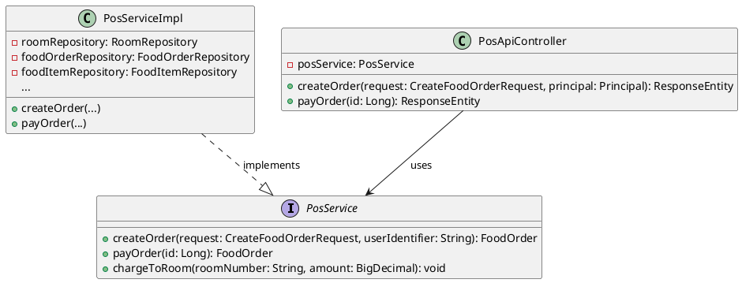
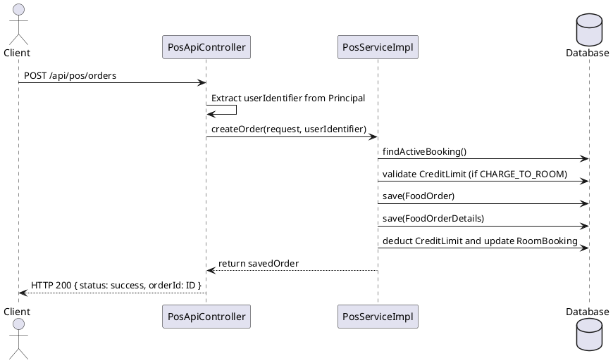

**ENGINEERING DOCUMENTATION STANDARD (EDS)** 

**v2.0** 

**Quy chuẩn Tài liệu Kỹ thuật và Đặc tả Hiện thực** 

**Field** | **Value**
---|---
**Document ID** | KAWAI - MOD3 - IMP - 001
**Version** | 1.0
**Date** | 2026-06-22
**Status** | Approved
**Document Owner** | F&B Squad
**Author** | AI Developer
**Reviewed by** | Tech Lead
**Approved by** | Principal Architect
**Last Review** | 2026-06-22

**CHANGELOG** 

| **Ngày** | **Người thực hiện** | **Nội dung thay đổi** |
|---|---|---|
| 2026-06-22 | AI Developer | Khởi tạo tài liệu và mô tả refactoring PosApiController |

---

## 1. Tổng quan Module

| **Field** | **Value** |
|---|---|
| **Module Name** | Point of Sale (POS) |
| **Bounded Context** | Food & Beverage (F&B) |
| **Data Classification** | Internal / PII (Customer Names in Notes) |
| **Compliance Scope** | Internal Auditing, Folio Integration |
| **Upstream Dependencies** | Identity (Auth), Room Management (Booking) |
| **Downstream Consumers** | Kitchen Display System (KDS), Night Audit (MOD5) |

---

## 2. Ma trận Truy vết (Traceability Matrix)

| **Requirement ID** | **Loại** | **Mô tả yêu cầu** | **Thành phần Code** | **Compliance Target** | **ADR liên quan** |
|---|---|---|---|---|---|
| BR-POS-001 | Business Rule | Phải kiểm tra CreditLimit trước khi cho Charge to Room | `PosServiceImpl.validateCreditLimit` | Tránh nợ xấu | ADR-001 |
| US-POS-002 | User Story | Staff có thể đặt đơn Dine-in | `PosServiceImpl.createOrder` | Ghi log Employee | N/A |
| ARC-001 | Architecture | Áp dụng 3-Tier Architecture nghiêm ngặt | `PosApiController` & `PosService` | Maintainability | ADR-001 |

---

## 3. Architecture Decision Records (ADR)

**ADR-001 — Chuyển dời Logic Đặt món từ Controller sang Service (Khắc phục Fat Controller)**

| **Field** | **Value** |
|---|---|
| **Status** | Accepted |
| **Deciders** | AI Developer, Tech Lead |
| **Date** | 2026-06-22 |

**Bối cảnh (Context)**
Trong giai đoạn phát triển đầu tiên, logic nghiệp vụ phức tạp của việc tạo đơn hàng (đọc thông tin người dùng, tìm Active Booking, kiểm tra Credit Limit, lưu đơn và chi tiết) được viết gộp toàn bộ trong `PosApiController.java`. Điều này dẫn đến vấn đề "Fat Controller", khó tái sử dụng, khó Unit Test và vi phạm Separation of Concerns.

**Các phương án đã xem xét (Options Considered)**

| **Phương án** | **Mô tả** | **Ưu điểm** | **Nhược điểm** |
|---|---|---|---|
| A | Giữ nguyên logic tại Controller | Không mất thời gian refactor. Dễ hiểu cho người mới đọc từ trên xuống. | Hard to scale. Logic bị duplicate nếu các module khác cần tạo đơn. Test cực khó. |
| B | Di dời Business Logic xuống `PosServiceImpl` | Tạo interface `PosService` và bóc tách toàn bộ phần xử lý giá, kiểm tra limit xuống Service. Controller chỉ nhận HTTP Request và gọi hàm Service. | Đúng chuẩn 3-Tier, dễ bảo trì, dễ viết Test (chỉ cần mock Repository), tái sử dụng được. | Tốn công sức refactor ban đầu. Phải test lại toàn bộ luồng. |

**Quyết định (Decision)**
Chọn **Phương án B** vì bảo trì lâu dài quan trọng hơn tốc độ hiện tại.

**Hệ quả (Consequences)**
- **Tích cực**: Code của `PosApiController` trở nên cực kỳ gọn nhẹ (chỉ còn dưới 50 dòng thay vì 200 dòng). `PosServiceImpl` bao gồm annotation `@Transactional` giúp quản lý rollback an toàn khi tạo đơn lỗi giữa chừng.
- **Tiêu cực**: Rủi ro sinh lỗi Regression nếu không map đúng các tham số. Đã bù đắp bằng việc migrate code cẩn thận.

---

## 4. Static Modeling (Mô hình Tĩnh)

### 4.1. Class Diagram (PlantUML)



---

## 5. Dynamic Modeling (Mô hình Động)

### 5.1. Sequence Diagram - Luồng Tạo Đơn Hàng (Happy Path)



---

## 6. API Specification

### 6.1. Endpoints Table

| **Method** | **Path** | **Auth Level** | **Idempotent?** |
|---|---|---|---|
| POST | `/api/pos/orders` | session/jwt (Optional) | No |
| POST | `/api/pos/orders/{id}/pay` | session/jwt (Optional) | Yes |

### 6.2. Request / Response Schemas

**POST /api/pos/orders — Tạo đơn mới**

**Response - 200 OK (Happy Path)**:
```json
{
  "status": "success",
  "orderId": 123
}
```

**Response - 400 Bad Request (Business Logic Error):**
```json
{
  "error": "com.kawai.exceptions.BusinessException",
  "message": "Hạn mức tín dụng của phòng không đủ để thanh toán!"
}
```

---

## 7. Bảng mã lỗi nghiệp vụ (Business Exceptions)

| **Code** | **Message (VI)** | **Trigger Condition** |
|---|---|---|
| POS-001 | Phòng không tồn tại! | Khách đặt Room Service nhưng truyền sai số phòng. |
| POS-002 | Bàn ăn không tồn tại! | Khách đặt Dine-In nhưng hệ thống không tìm thấy Table ID. |
| POS-003 | Post to Room vượt Credit Limit | Tổng tiền thanh toán lớn hơn Credit Limit của chi tiết phòng (SubCreditLimit). |
| POS-004 | Món ăn không tồn tại! | Item trong Cart truyền sai ID. |
| POS-005 | Hạn mức tín dụng của phòng không đủ để thanh toán! | Dùng khi trừ vào Hợp đồng tổng (`RoomBooking`) bị thiếu tiền. |
| POS-006 | Đơn hàng không tồn tại | Khi gọi hàm payOrder với ID không hợp lệ. |
