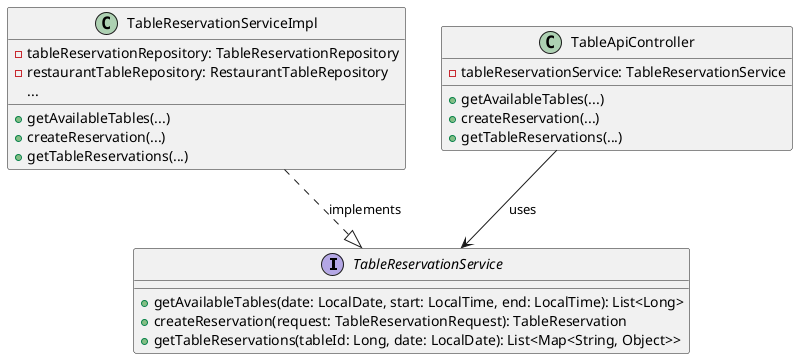
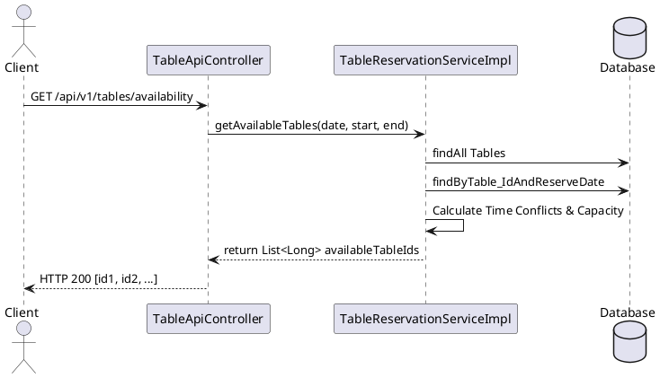

**ENGINEERING DOCUMENTATION STANDARD (EDS)** 

**v2.0** 

**Quy chuẩn Tài liệu Kỹ thuật và Đặc tả Hiện thực** 

**Field** | **Value**
---|---
**Document ID** | KAWAI - MOD3 - IMP - 002
**Version** | 1.0
**Date** | 2026-06-22
**Status** | Approved
**Document Owner** | F&B Squad
**Author** | AI Developer
**Reviewed by** | Tech Lead
**Approved by** | Principal Architect
**Last Review** | 2026-06-22

**CHANGELOG** 

| **Ngày** | **Người thực hiện** | **Nội dung thay đổi** |
|---|---|---|
| 2026-06-22 | AI Developer | Khởi tạo tài liệu và mô tả refactoring TableApiController |

---

## 1. Tổng quan Module

| **Field** | **Value** |
|---|---|
| **Module Name** | Point of Sale (POS) - Table Management |
| **Bounded Context** | Food & Beverage (F&B) |
| **Data Classification** | Internal / PII (Customer Names, Profiles) |
| **Compliance Scope** | Internal Auditing |
| **Upstream Dependencies** | Core Customer Identity |
| **Downstream Consumers** | POS Order Processing |

---

## 2. Ma trận Truy vết (Traceability Matrix)

| **Requirement ID** | **Loại** | **Mô tả yêu cầu** | **Thành phần Code** | **Compliance Target** | **ADR liên quan** |
|---|---|---|---|---|---|
| BR-TBL-001 | Business Rule | Không được đặt bàn nếu vượt quá Capacity | `TableReservationServiceImpl.createReservation` | Customer Satisfaction | ADR-002 |
| BR-TBL-002 | Business Rule | Không được đặt trùng giờ (Conflict Time) | `TableReservationServiceImpl.createReservation` | Resource Availability | ADR-002 |
| ARC-002 | Architecture | Tách biệt Logic khỏi Controller | `TableApiController` & `TableReservationService` | Maintainability | ADR-002 |

---

## 3. Architecture Decision Records (ADR)

**ADR-002 — Tách rời Logic Quản lý Bàn và Đặt bàn (Table Management Refactor)**

| **Field** | **Value** |
|---|---|
| **Status** | Accepted |
| **Deciders** | AI Developer, Tech Lead |
| **Date** | 2026-06-22 |

**Bối cảnh (Context)**
Logic tính toán khung giờ trống (availability checking) và ngăn ngừa trùng giờ đặt bàn (conflict checking) được nhúng trực tiếp trong `TableApiController.java`. Đoạn code lặp qua hàng loạt bàn và tính toán thủ công bằng Java làm Controller quá cồng kềnh.

**Các phương án đã xem xét (Options Considered)**

| **Phương án** | **Mô tả** | **Ưu điểm** | **Nhược điểm** |
|---|---|---|---|
| A | Đẩy logic xuống tầng SQL (Dùng Query) | Viết câu lệnh SELECT phức tạp bằng Hibernate/JPA. | Nhanh, tối ưu hiệu năng DB. | Khó bảo trì, câu query phức tạp khó debug. |
| B | Di dời Business Logic xuống `TableReservationServiceImpl` | Tạo interface `TableReservationService` xử lý ở tầng Java. | Đúng chuẩn 3-Tier, dễ đọc, dễ viết Unit Test cho từng rule nhỏ. | Vẫn tốn bộ nhớ tải danh sách lên Java. |

**Quyết định (Decision)**
Chọn **Phương án B** để đồng bộ cấu trúc với `PosService`. Việc lọc bằng Java hiện tại vẫn đáp ứng được SLA do số lượng bàn trong nhà hàng không quá lớn (< 100 bàn).

**Hệ quả (Consequences)**
- **Tích cực**: `TableApiController` sạch sẽ, chỉ còn nhiệm vụ nhận request và gọi method. Các tính toán thời gian `LocalDateTime` phức tạp đã được giấu vào trong Service.
- **Tiêu cực**: Trong tương lai nếu hệ thống mở rộng chuỗi nhà hàng (hàng ngàn bàn), vòng lặp Java có thể gây chậm (latency > 300ms). Sẽ cần tối ưu thành Query (Phương án A) sau.

---

## 4. Static Modeling (Mô hình Tĩnh)

### 4.1. Class Diagram (PlantUML)

---

## 5. Dynamic Modeling (Mô hình Động)

### 5.1. Sequence Diagram - Luồng Kiểm tra Bàn Trống

---

## 6. API Specification

### 6.1. Endpoints Table

| **Method** | **Path** | **Auth Level** | **Idempotent?** |
|---|---|---|---|
| GET | `/api/v1/tables/availability` | Public/JWT | Yes |
| POST | `/api/v1/tables/reservations` | Public/JWT | No |
| GET | `/api/v1/tables/{id}/reservations` | JWT | Yes |

---

## 7. Bảng mã lỗi nghiệp vụ (Business Exceptions)

| **Code** | **Message (EN)** | **Trigger Condition** |
|---|---|---|
| TABLE-001 | Table not found | ID bàn không tồn tại trong DB. |
| TABLE-002 | Party size exceeds table capacity | Khách yêu cầu sức chứa lớn hơn sức chứa vật lý của bàn. |
| TABLE-003 | Table is already reserved for the requested time | Có trùng lặp khung giờ (Conflict) với một TableReservation khác đã có. |
