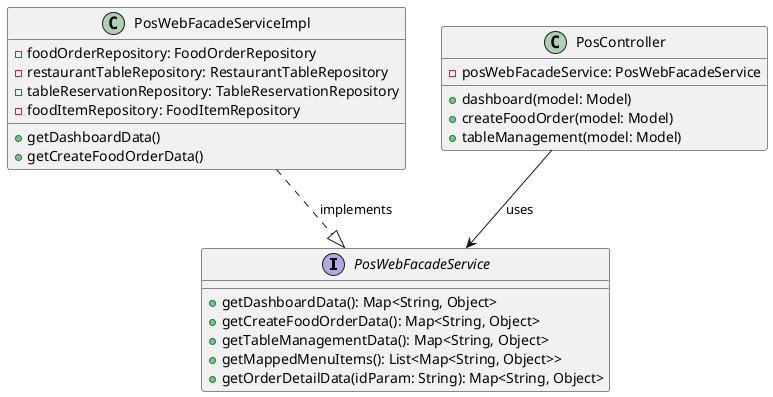

**ENGINEERING DOCUMENTATION STANDARD (EDS)** 

**v2.0** 

**Quy chuẩn Tài liệu Kỹ thuật và Đặc tả Hiện thực** 

**Field** | **Value**
---|---
**Document ID** | KAWAI - MOD3 - IMP - 004
**Version** | 1.0
**Date** | 2026-06-22
**Status** | Approved
**Document Owner** | F&B Squad
**Author** | AI Developer
**Reviewed by** | Tech Lead
**Approved by** | Principal Architect
**Last Review** | 2026-06-22

**CHANGELOG** 

| **Ngày** | **Người thực hiện** | **Nội dung thay đổi** |
|---|---|---|
| 2026-06-22 | AI Developer | Khởi tạo tài liệu và mô tả refactoring PosController áp dụng Facade Pattern |

---

## 1. Tổng quan Module

| **Field** | **Value** |
|---|---|
| **Module Name** | Point of Sale (POS) - Web Presentation |
| **Bounded Context** | Food & Beverage (F&B) |
| **Data Classification** | Internal |
| **Compliance Scope** | None |
| **Upstream Dependencies** | Repositories (FoodOrder, RestaurantTable, TableReservation) |
| **Downstream Consumers** | Thymeleaf View Templates |

---

## 2. Ma trận Truy vết (Traceability Matrix)

| **Requirement ID** | **Loại** | **Mô tả yêu cầu** | **Thành phần Code** | **Compliance Target** | **ADR liên quan** |
|---|---|---|---|---|---|
| ARC-003 | Architecture | Tách biệt Presentation Logic khỏi Controller | `PosWebFacadeService`, `PosController` | Clean Code / MVC | ADR-004 |
| UI-001 | UI Logic | Tạo chuỗi hiển thị trạng thái bàn trống | `PosWebFacadeServiceImpl.getCreateFoodOrderData` | UX | ADR-004 |

---

## 3. Architecture Decision Records (ADR)

**ADR-004 — Áp dụng Facade Pattern cho Web Controller (Presentation Logic)**

| **Field** | **Value** |
|---|---|
| **Status** | Accepted |
| **Deciders** | AI Developer, Tech Lead |
| **Date** | 2026-06-22 |

**Bối cảnh (Context)**
Web Controller `PosController` ban đầu đảm nhiệm cả vai trò Routing (Định tuyến) lẫn vai trò chuẩn bị dữ liệu (Data Preparation) cho giao diện Thymeleaf. Điều này dẫn đến sự vi phạm nguyên tắc Single Responsibility (SRP) và khiến Controller phình to (Fat Controller). Quá trình lấy danh sách bàn, chắt lọc, map với order, lặp tính giờ trống được viết thẳng vào các Endpoint.

**Các phương án đã xem xét (Options Considered)**

| **Phương án** | **Mô tả** | **Ưu điểm** | **Nhược điểm** |
|---|---|---|---|
| A | Đẩy logic xuống các API Service (Ví dụ: `PosService`) | Tái sử dụng các Service nghiệp vụ hiện có. Dùng chung cho cả API và Web. | Logic của Web rất đặc thù (trả về text hiển thị, màu sắc icon), nếu để chung vào API Service sẽ làm "bẩn" lớp Data gốc. |
| B | Tạo `PosWebFacadeService` chuyên dụng | Xây dựng một Service mới chỉ phục vụ việc "nhào nặn" dữ liệu thô thành Model Map cho màn hình hiển thị. | Chuẩn MVC. Controller siêu mỏng. Logic API (`PosService`) và Logic Giao diện (`PosWebFacadeService`) độc lập hoàn toàn. | Thêm file interface/impl, tăng số lượng class. |

**Quyết định (Decision)**
Chọn **Phương án B (Facade Pattern)**. Việc tạo một tầng trung gian chuyên phục vụ Web View giúp hệ thống sạch sẽ và dễ maintain khi thay đổi giao diện.

**Hệ quả (Consequences)**
- **Tích cực**: `PosController` thu gọn từ 255 dòng xuống chưa tới 60 dòng. Code dễ tái sử dụng hơn nếu cần thay đổi giao diện. Dễ viết Unit Test cho phần mapping giao diện.
- **Tiêu cực**: Phát sinh thêm 1 tầng nữa phải theo dõi.

---

## 4. Static Modeling (Mô hình Tĩnh)

### 4.1. Class Diagram (PlantUML)

