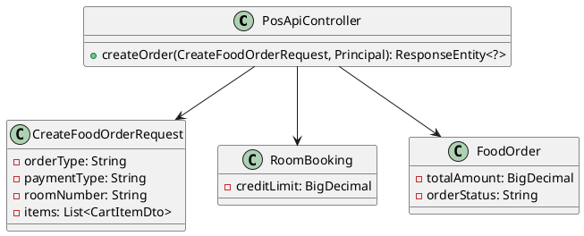
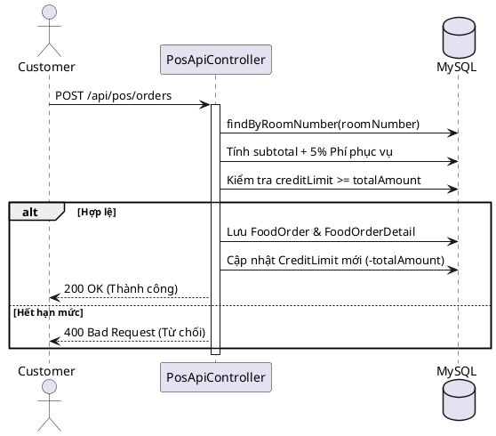

# ENGINEERING DOCUMENTATION STANDARD (EDS) v2.0

## UC16 — Đặt món trực tuyến lên phòng nghỉ (Room Service)

*(Lưu ý: Tài liệu trước đây ghi nhầm là UC14, đã được cập nhật thành UC16 theo UC_MASTER_TABLE.md)*

| Field                    | Value                                               |
| ------------------------ | --------------------------------------------------- |
| **Document ID**    | `KAWAI-EDS-MOD3-UC16-001`                         |
| **Version**        | 2.0                                                 |
| **Date**           | 2026-06-17                                          |
| **Status**         | Approved                                            |
| **Document Owner** | Trịnh Minh Đức                                   |
| **Author**         | Trịnh Minh Đức — Developer                      |
| **Reviewed by**    | Nguyễn Xuân Lưu — Tech Lead                    |
| **DPO Sign-off**   | `[x] Approved – 2026-06-17 – Trịnh Minh Đức` |
| **Approved by**    | `[x] Trịnh Minh Đức – 2026-06-17`             |
| **Last Review**    | 2026-06-17                                          |
| **Based on EDS**   | v2.0                                                |

---

### CHANGELOG

| Ngày      | Người thực hiện | Nội dung thay đổi                                                                                                              |
| ---------- | ------------------- | --------------------------------------------------------------------------------------------------------------------------------- |
| 2026-06-17 | Developer           | Cập nhật cấu trúc API thực tế (PosApiController), cập nhật luồng tương tác CreditLimit và mã Test Case thành UC16. |
| 2026-06-15 | Trịnh Minh Đức   | Cập nhật tài liệu theo chuẩn 17 sections                                                                                     |

---

### MỤC LỤC

1. [Tổng quan Module](#1)
2. [Ma trận Truy vết](#2)
3. [ADR](#3)
4. [Non-Functional &amp; SLA](#4)
5. [Static Modeling](#5)
6. [Dynamic Modeling](#6)
7. [Domain Event Catalog](#7)
8. [Interface Specification](#8)
9. [API Specification](#9)
10. [Bảng mã lỗi](#10)
11. [Quy trình Triển khai](#11)
12. [Rollback &amp; Incident Runbook](#12)
13. [Kịch bản Kiểm thử](#13)
14. [Phương pháp Xác minh](#14)
15. [Mẫu thử thực tế](#15)
16. [Authorization Matrix](#16)
17. [Phụ lục](#17)

---

### 1. Tổng quan Module

| Field                           | Value                                                                              |
| ------------------------------- | ---------------------------------------------------------------------------------- |
| **Module Name**           | E-Menu & POS Order                                                                 |
| **Bounded Context**       | POS & F&B                                                                          |
| **Use Case**              | Khách quét QR hiển thị E-Menu, đặt Room Service (Ký nợ vào tiền phòng). |
| **Data Classification**   | Internal                                                                           |
| **Compliance Scope**      | Nội bộ                                                                           |
| **Upstream Dependencies** | RoomBooking                                                                        |
| **Downstream Consumers**  | Folio (Kiểm toán), KDS (Bếp)                                                    |

---

### 2. Ma trận Truy vết

| Requirement ID | Loại | Mô tả                                            | Thành phần Code    | Compliance | ADR     |
| -------------- | ----- | -------------------------------------------------- | -------------------- | ---------- | ------- |
| UC16_REQ_01    | US    | Khách đặt Room Service và ký nợ vào phòng. | `PosApiController` | —         | ADR-001 |

---

### 3. Architecture Decision Records (ADR)

#### ADR-001 — Cơ chế xử lý Ký nợ (Charge to Room) trực tiếp tại Controller

| Field              | Value             |
| ------------------ | ----------------- |
| **Status**   | Accepted          |
| **Deciders** | Trịnh Minh Đức |
| **Date**     | 2026-06-17        |

**Bối cảnh:** Room Service cần kiểm tra Hạn mức tín dụng (`CreditLimit`) của căn phòng trước khi cho phép gọi món ký nợ.
**Quyết định:** Gộp logic kiểm tra và trừ tiền trực tiếp trong `PosApiController` bằng cách gọi `RoomBookingRepository`. Bỏ qua JWT (dùng `.permitAll()`) vì khách hàng có thể dùng điện thoại cá nhân không đăng nhập, bảo mật dựa trên Business Logic (Mã phòng + Tên khách).
**Hệ quả:** Request xử lý nhanh, không cần token. Tuy nhiên Controller đang phình to do ôm đồm nhiều logic (cần refactor xuống Service layer trong tương lai).

---

### 4. Non-Functional Requirements & SLA

#### 4.1. Performance & Availability

| Category               | Requirement         | Target SLA | Measurement    |
| ---------------------- | ------------------- | ---------- | -------------- |
| **Latency**      | Response time (p99) | < 300ms    | k6 load test   |
| **Availability** | Uptime (monthly)    | 99.9%      | Uptime monitor |

---

### 5. Static Modeling

#### 5.1. Class Diagram



#### 5.2. Data Structure

```sql
-- Sử dụng bảng `food_orders`, `food_order_details`, `room_bookings`
```

---

### 6. Dynamic Modeling

#### 6.1. Sequence Diagram



---

### 7. Domain Event Catalog

| Event Name             | Trigger                 | Publisher            | Subscriber(s)           | Async?           |
| ---------------------- | ----------------------- | -------------------- | ----------------------- | ---------------- |
| `RoomServiceOrdered` | Tạo order thành công | `PosApiController` | `Folio (Kiểm toán)` | No (Trực tiếp) |

---

### 8. Interface Specification

```java
@RestController
@RequestMapping("/api/pos")
public class PosApiController {
    @PostMapping("/orders")
    public ResponseEntity<?> createOrder(
        @RequestBody CreateFoodOrderRequest request, 
        Principal principal
    );
}
```

---

### 9. API Specification

| Method | Path                | Auth             | Roles    | Rate Limit | Idempotent? |
| ------ | ------------------- | ---------------- | -------- | ---------- | ----------- |
| POST   | `/api/pos/orders` | `.permitAll()` | Bất kỳ | 30/min     | No          |

---

### 10. Bảng mã lỗi

| Code        | HTTP | Message (EN)          | Message (VI)                     | Trigger                          |
| ----------- | ---- | --------------------- | -------------------------------- | -------------------------------- |
| `POS-001` | 400  | Invalid Request       | Yêu cầu không hợp lệ        | Thiếu tham số phòng / bàn    |
| `POS-003` | 400  | Credit Limit Exceeded | Hạn mức tín dụng không đủ | Hóa đơn > Hạn mức còn lại |
| `POS-004` | 400  | Room Not Found        | Không tìm thấy phòng         | Số phòng sai hoặc trống      |

---

### 11. Quy trình Triển khai

#### 11.1. Prerequisites

- [X] Database tables đã cập nhật (Bảng `food_orders`, `room_bookings` có trường `credit_limit`).

#### 11.2. Deployment

```bash
mvn clean package -DskipTests
```

---

### 12. Rollback & Incident Runbook

| Điều kiện                            | Ngưỡng        | Người quyết định |
| --------------------------------------- | --------------- | --------------------- |
| Khách không trừ được Credit Limit | > 5 lỗi / giờ | Lễ tân / Kế toán  |

**Rollback:** Đảo ngược code về commit trước tính năng `CHARGE_TO_ROOM`.

---

### 13. Kịch bản Kiểm thử

#### 13.1. Unit Tests (Tham khảo TDD_uc14_SPEC.md)

- `TC-M3-004`: Khách quét QR → hiển thị E-Menu, đặt Room Service thành công.
- `TC-M3-005`: Room Service cho phòng trống / vượt hạn mức → từ chối.

---

### 14. Phương pháp Xác minh

```sql
SELECT id, total_amount, order_status FROM food_orders ORDER BY id DESC LIMIT 10;
SELECT id, room_number, credit_limit FROM room_bookings WHERE room_number = '101';
```

---

### 15. Mẫu thử thực tế

```bash
curl -X POST http://localhost:8080/api/pos/orders \
  -H "Content-Type: application/json" \
  -d '{
    "orderType": "room-svc",
    "roomNumber": "101",
    "paymentType": "CHARGE_TO_ROOM",
    "items": [
      { "id": 1, "qty": 2 }
    ]
  }'
```

---

### 16. Authorization Matrix

| Endpoint            | GUEST | CUSTOMER | RECEPTIONIST | ADMIN |
| ------------------- | :---: | :------: | :----------: | :---: |
| `/api/pos/orders` | ✔️ |   ✔️   |     ✔️     | ✔️ |

*(Lý do GUEST được phép: API không kiểm tra JWT Token do thiết lập `.permitAll()`, bảo mật phụ thuộc hoàn toàn vào mã phòng thực tế).*

---

### 17. Phụ lục

#### A. Glossary

| Thuật ngữ     | Định nghĩa                                          |
| --------------- | ------------------------------------------------------ |
| **KOT**   | Kitchen Order Ticket                                   |
| **Folio** | Hồ sơ nợ của phòng để thanh toán khi check-out |

#### B. Tài liệu tham chiếu

| Document | Path                                          |
| -------- | --------------------------------------------- |
| TDD UC16 | `06-Testing/mod3_pos/uc14/TDD_uc14_SPEC.md` |

---

*EDS v2.0*
