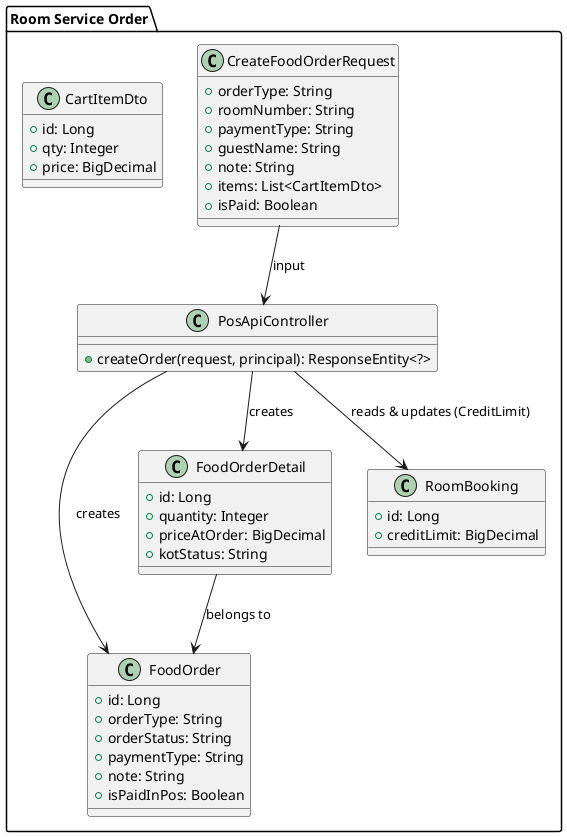
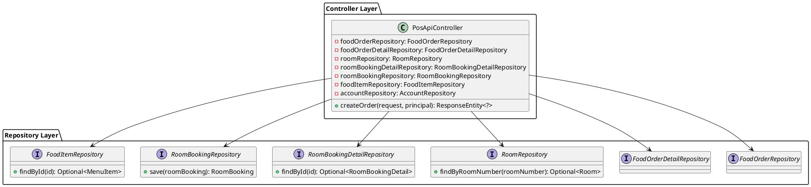
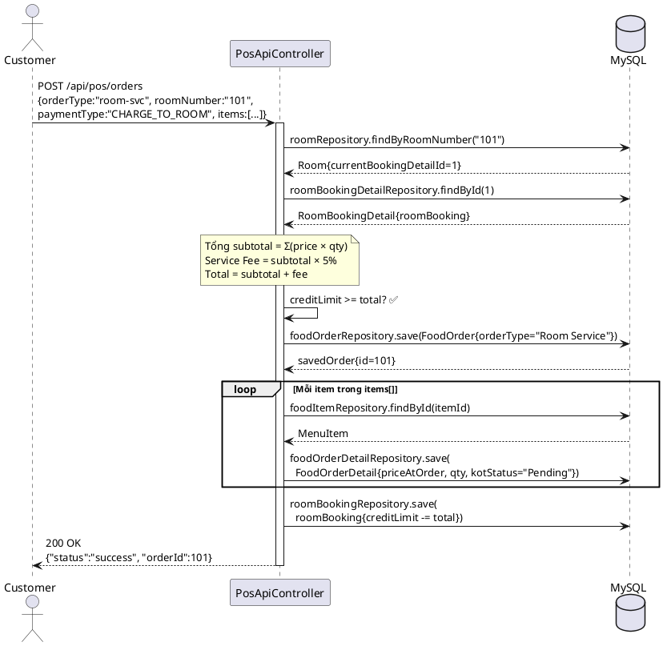
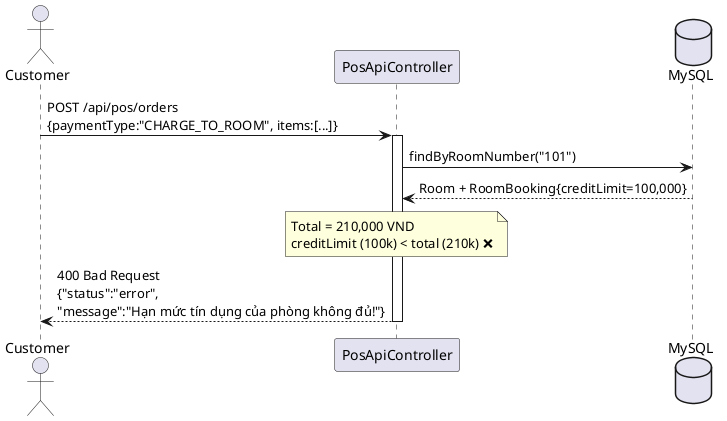
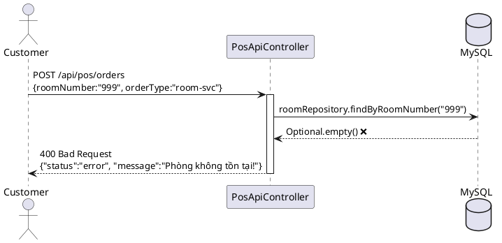
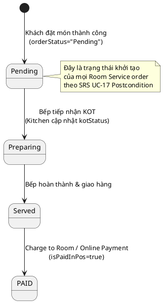

# ENGINEERING DOCUMENTATION STANDARD (EDS) v2.0

## UC-17: Order Food Online (Room Service / E-Menu) — Đặc tả Kỹ thuật & Hiện thực hóa

| Field                    | Value                                                                 |
| ------------------------ | --------------------------------------------------------------------- |
| **Document ID**    | `KAWAI-EDS-MOD3-UC17-001`                                           |
| **Version**        | 2.0                                                                   |
| **Date**           | 2026-06-19                                                            |
| **Status**         | Approved                                                              |
| **Document Owner** | Trịnh Minh Đức                                                     |
| **Author**         | Trịnh Minh Đức — Developer                                        |
| **Reviewed by**    | Nguyễn Xuân Lưu — Tech Lead                                      |
| **DPO Sign-off**   | `[x] Approved – 2026-06-19 – Trịnh Minh Đức`                   |
| **Approved by**    | `[x] Trịnh Minh Đức – 2026-06-19`                               |
| **Last Review**    | 2026-06-19                                                            |
| **Based on EDS**   | v2.0                                                                  |

---

### CHANGELOG

> [!IMPORTANT]
> **Policy 4.4 — Immutable History:** Không bao giờ xóa thông tin cũ. Mọi thay đổi phải ghi vào bảng này.

| Ngày       | Người thực hiện  | Nội dung thay đổi                                                                                                                                                                                       |
| ---------- | ----------------- | ---------------------------------------------------------------------------------------------------------------------------------------------------------------------------------------------------------- |
| 2026-06-19 | Antigravity Agent | Nâng cấp từ UC16 → UC17 theo bảng SRS 2.1.17. Viết lại toàn bộ 17 sections theo chuẩn EDS v2.0. Bổ sung đầy đủ test case Unit + Integration bám sát Normal Flow, Alternative Flows, và Exceptions. |
| 2026-06-17 | Trịnh Minh Đức | Cập nhật cấu trúc API thực tế (PosApiController), cập nhật luồng tương tác CreditLimit.                                                                                                              |
| 2026-06-15 | Trịnh Minh Đức | Tạo tài liệu lần đầu — Bản sơ khai theo chuẩn 17 sections.                                                                                                                                        |

---

### MỤC LỤC

1. [Tổng quan Module](#1-tong-quan-module)
2. [Ma trận Truy vết (Traceability Matrix)](#2-ma-tran-truy-vet-traceability-matrix)
3. [Architecture Decision Records (ADR)](#3-architecture-decision-records-adr)
4. [Non-Functional Requirements & SLA](#4-non-functional-requirements--sla)
5. [Static Modeling (Mô hình Tĩnh)](#5-static-modeling-mo-hinh-tinh)
6. [Dynamic Modeling (Mô hình Động)](#6-dynamic-modeling-mo-hinh-dong)
7. [Domain Event Catalog](#7-domain-event-catalog)
8. [Interface Specification (Đặc tả Giao diện)](#8-interface-specification-dac-ta-giao-dien)
9. [API Specification](#9-api-specification)
10. [Bảng mã lỗi (Error Codes)](#10-bang-ma-loi-error-codes)
11. [Quy trình Triển khai (Step-by-Step)](#11-quy-trinh-trien-khai-step-by-step)
12. [Rollback & Incident Runbook](#12-rollback--incident-runbook)
13. [Kịch bản Kiểm thử Chi tiết](#13-kich-ban-kiem-thu-chi-tiet)
14. [Phương pháp Xác minh](#14-phuong-phap-xac-minh)
15. [Mẫu thử thực tế (API Verification Samples)](#15-mau-thu-thuc-te-api-verification-samples)
16. [Bảng tổng hợp phân quyền (Authorization Matrix)](#16-bang-tong-hop-phan-quyen-authorization-matrix)
17. [Phụ lục](#17-phu-luc)

---

### 1. Tổng quan Module

Mô tả chức năng **Order Food Online (Room Service / E-Menu)**: Cho phép khách đang lưu trú tại resort đặt món ăn và đồ uống qua ứng dụng web (E-Menu), với tùy chọn ký nợ vào tài khoản phòng (`Charge to Room`) hoặc thanh toán online. Đơn hàng được chuyển tự động đến hệ thống POS F&B và Kitchen Display System (KDS).

| Field                           | Value                                                                              |
| ------------------------------- | ---------------------------------------------------------------------------------- |
| **Module Name**           | `Order Food Online — UC-17 (Room Service / E-Menu)`                             |
| **Parent Module**         | `MOD3 — Restaurant POS & F&B Operations`                                        |
| **Bounded Context**       | `POS & F&B`                                                                      |
| **Data Classification**   | Internal (Dữ liệu đơn hàng nội bộ, không chứa PII nhạy cảm)               |
| **Compliance Scope**      | Nội bộ                                                                           |
| **Upstream Dependencies** | `RoomBooking` — Kiểm tra trạng thái check-in và Hạn mức tín dụng       |
| **Downstream Consumers**  | `Folio (Kiểm toán)`, `KDS — Kitchen Display System (Bếp)`              |
| **Primary Actor**         | Customer (Khách đang check-in)                                                   |
| **Secondary Actors**      | System, F&B Staff, Kitchen Staff                                                  |

**Phạm vi trách nhiệm của UC-17:**

- ✅ Hiển thị danh sách món ăn có sẵn (E-Menu)
- ✅ Xử lý đặt món Room Service (giao đến phòng)
- ✅ Kiểm tra Hạn mức tín dụng (Credit Limit) trước khi Charge to Room
- ✅ Tạo `Food_Order` và `Food_Order_Detail` records
- ✅ Cập nhật Credit Limit của phòng sau khi ký nợ thành công
- ✅ Chuyển đơn hàng đến F&B Staff và Kitchen Staff (KOT)
- ✅ Hỗ trợ thanh toán Online (ONLINE) và thanh toán sau (Pay_Later)

**Ngoài phạm vi UC-17 (xử lý bởi module khác):**

- ❌ Quản lý thực đơn (CRUD Menu) → Module Admin / Master Data (UC-08)
- ❌ Xử lý thanh toán cuối kỳ → Checkout Module (UC-15)
- ❌ Tạo bàn ăn / đặt bàn → UC-18, UC-19
- ❌ Đánh dấu món hết hàng → UC-20 (Flag Out-of-Stock)

---

### 2. Ma trận Truy vết (Traceability Matrix)

Ánh xạ: `[Mã yêu cầu] → [Thành phần Code] → [Mục tiêu Tuân thủ]`

> [!NOTE]
> **Policy:** Không viết code nếu không biết code đó phục vụ Rule nào.

| Requirement ID | Loại (BR/ADR) | Mô tả yêu cầu                                                                                                         | Thành phần Code                                             | Compliance Target           | ADR liên quan |
| -------------- | -------------- | ------------------------------------------------------------------------------------------------------------------------- | ------------------------------------------------------------- | --------------------------- | -------------- |
| BR-UC17-01     | Business Rule  | Khách phải đang check-in (có RoomBooking active) mới được đặt Room Service                                     | `PosApiController.createOrder()` — kiểm tra `roomOpt`      | SRS UC-17 Precondition      | ADR-UC17-001   |
| BR-UC17-02     | Business Rule  | Hạn mức tín dụng (`CreditLimit`) phải đủ bao phủ tổng đơn hàng trước khi Charge to Room                    | `PosApiController` — Credit Limit check                     | SRS UC-17 E1                | ADR-UC17-001   |
| BR-UC17-03     | Business Rule  | Mỗi dòng item phải tồn tại trong `food_items` tại thời điểm đặt hàng                                           | `foodItemRepository.findById()`                             | SRS UC-17 E3                | —             |
| BR-UC17-04     | Business Rule  | Giá tại thời điểm đặt (`priceAtOrder`) là snapshot bất biến — không phụ thuộc vào giá MenuItem thay đổi sau | `FoodOrderDetail.setPriceAtOrder(itemDto.getPrice())`       | Tính toàn vẹn dữ liệu   | —             |
| BR-UC17-05     | Business Rule  | Phí phục vụ (Service Fee) được tính bằng 5% subtotal khi Charge to Room                                          | `BigDecimal feePercent = new BigDecimal("0.05")`            | Quy trình nghiệp vụ F&B   | ADR-UC17-001   |
| BR-UC17-06     | Business Rule  | Ghi chú đặc biệt của khách (Special Request) phải được đính kèm vào FoodOrder và gửi đến bếp             | `order.setNote(finalNote)` — bao gồm tên khách và ghi chú | SRS UC-17 AF2               | —             |
| BR-UC17-07     | Business Rule  | KOT status của mỗi món phải là `Pending` ngay khi tạo — chờ bếp tiếp nhận                                  | `detail.setKotStatus("Pending")`                            | SRS UC-17 Postcondition     | —             |
| BR-UC17-08     | Business Rule  | Phòng phải tồn tại trong hệ thống (roomNumber hợp lệ) mới được đặt Room Service                             | `roomRepository.findByRoomNumber()` — kiểm tra Optional     | SRS UC-17 E2                | —             |
| BR-ATOMIC-01   | ADR            | Toàn bộ việc tạo order + trừ credit limit là 1 luồng xử lý nhất quán                                          | `PosApiController.createOrder()` — try/catch block          | Data Integrity / ACID-like | ADR-UC17-002   |

---

### 3. Architecture Decision Records (ADR)

⭐️ **Section mới — EDS v2.0**

---

#### ADR-UC17-001 — Xử lý Charge to Room và kiểm tra Credit Limit tại Controller Layer

| Field              | Value             |
| ------------------ | ----------------- |
| **Status**   | Accepted          |
| **Deciders** | Trịnh Minh Đức |
| **Date**     | 2026-06-17        |

**Bối cảnh (Context)**
Room Service cần kiểm tra `CreditLimit` của phòng và trừ ngay sau khi khách đặt món thành công theo phương thức Charge to Room. Phải đảm bảo không vượt hạn mức đã thiết lập bởi lễ tân khi check-in.

**Quyết định (Decision)**
Gộp logic kiểm tra và trừ tiền trực tiếp trong `PosApiController` bằng cách gọi trực tiếp `RoomBookingRepository`. Service Fee được cố định ở mức 5% subtotal. Nếu Credit Limit không đủ → trả 400 Bad Request ngay lập tức.

**Hệ quả (Consequences)**

- ✅ Xử lý nhanh, logic đơn giản, dễ kiểm thử với Mock.
- ⚠️ Controller đang ôm đồm nhiều logic nghiệp vụ. Cần refactor xuống Service Layer trong phiên bản tương lai.

---

#### ADR-UC17-002 — Snapshot Pricing: Lưu giá tại thời điểm đặt hàng

| Field              | Value      |
| ------------------ | ---------- |
| **Status**   | Accepted   |
| **Deciders** | Tech Lead  |
| **Date**     | 2026-06-19 |

**Quyết định (Decision)**
`FoodOrderDetail.priceAtOrder` được gán bằng giá trong Cart Request (`itemDto.getPrice()`) — không lấy lại từ `MenuItem.price`. Điều này đảm bảo đơn hàng lịch sử không bị ảnh hưởng khi giá thực đơn thay đổi sau này.

**Hệ quả (Consequences)**

- ✅ Tính toàn vẹn dữ liệu lịch sử đơn hàng.
- ⚠️ Phía client có trách nhiệm truyền đúng giá tại thời điểm hiển thị (không thể giả mạo giá từ phía server trong phiên bản hiện tại).

---

### 4. Non-Functional Requirements & SLA

#### 4.1. Performance & Availability

| Category               | Requirement         | Target SLA | Measurement Method | Compliance Basis |
| ---------------------- | ------------------- | ---------- | ------------------ | ---------------- |
| **Latency**      | Order API (p99)     | < 300ms    | k6 load test       | —               |
| **Availability** | Uptime (monthly)    | 99.9%      | Uptime monitor     | —               |
| **Throughput**   | Concurrent orders   | 100 req/s  | Load test          | —               |

#### 4.2. Data Integrity & Retention

| Category              | Requirement                     | Target  | Verification Method                                | Compliance Basis |
| --------------------- | ------------------------------- | ------- | -------------------------------------------------- | ---------------- |
| **ACID-like**   | Order + CreditLimit nhất quán | RPO = 0 | `PosApiController` try/catch + TC-M3-001d        | Nội bộ         |
| **Durability**  | Order history bất biến        | 100%    | DB backup policy + Snapshot Pricing (ADR-UC17-002) | Nội bộ         |
| **Consistency** | KOT status chính xác          | 100%    | TC-M3-001 + TC-M3-001b                            | SRS UC-17        |

#### 4.3. Security (UC-17 Scope)

| Category                   | Requirement          | Target              | Verification Method  | Compliance Basis |
| -------------------------- | -------------------- | ------------------- | -------------------- | ---------------- |
| **Access control**   | Order API            | Authenticated users | Spring Security Auth | SRS UC-17        |
| **Audit trail**      | Mọi order đặt món | 100% logged         | food_orders table    | Nội bộ         |
| **Input validation** | roomNumber, items[]  | 100% validated      | TC-M3-001e, 001f     | SRS UC-17 E2, E3 |

---

### 5. Static Modeling (Mô hình Tĩnh)

#### 5.1. Class Diagram (PlantUML)



#### 5.2. Data Structure (JPA Entities liên quan UC-17)

```java
// FoodOrder — đơn hàng Room Service
@Entity
@Table(name = "food_orders")
public class FoodOrder {
    @Id @GeneratedValue
    private Long id;
    private String orderType;    // "Room Service" | "Dine In"
    private String orderStatus;  // "Pending" | "PAID"
    private String paymentType;  // "CHARGE_TO_ROOM" | "ONLINE" | "Pay_Later"
    private String note;         // Ghi chú đặc biệt + tên khách
    private Boolean isPaidInPos;

    @ManyToOne
    private RoomBookingDetail roomBookingDetail; // Liên kết phòng
}

// FoodOrderDetail — dòng chi tiết từng món
@Entity
@Table(name = "food_order_details")
public class FoodOrderDetail {
    @Id @GeneratedValue
    private Long id;

    @ManyToOne
    private FoodOrder foodOrder;

    @ManyToOne
    private MenuItem menuItem;

    private Integer quantity;
    private BigDecimal priceAtOrder; // Snapshot giá tại thời điểm gọi món (BR-UC17-04)
    private String kotStatus;        // "Pending" | "Preparing" | "Served"
}

// RoomBooking — chứa Credit Limit
@Entity
@Table(name = "room_bookings")
public class RoomBooking {
    @Id @GeneratedValue
    private Long id;
    private BigDecimal creditLimit; // Trừ dần khi Charge to Room (BR-UC17-02, BR-UC17-05)
}
```

#### 5.3. Software Architecture Class Diagram



---

### 6. Dynamic Modeling (Mô hình Động)

#### 6.1. Sequence Diagram — Happy Path (Normal Flow) (PlantUML)



#### 6.2. Sequence Diagram — E1: Credit Limit Exceeded



#### 6.3. Sequence Diagram — E2: Room Not Found



#### 6.4. State Machine — FoodOrder trong Room Service



> [!WARNING]
> **Invariant bất biến — UC17:** Nếu `creditLimit < totalAmount` thì **tuyệt đối không** được lưu `FoodOrder` vào database. Logic phải kiểm tra và return 400 TRƯỚC KHI gọi `foodOrderRepository.save()`.

---

### 7. Domain Event Catalog

⭐️ **Section mới — EDS v2.0**

#### 7.1. Events Published (Phát ra) — UC-17

| Event Name             | Trigger                     | Publisher            | Subscriber(s)                   | Payload Schema          | Async? |
| ---------------------- | --------------------------- | -------------------- | ------------------------------- | ----------------------- | ------ |
| `RoomServiceOrdered` | Tạo order thành công     | `PosApiController` | `Folio (Kiểm toán)`, `KDS`   | `FoodOrderCreatedEvent` | No     |
| `CreditLimitUpdated` | Charge to Room thành công | `PosApiController` | `Folio Module`                | `CreditLimitEvent`      | No     |

#### 7.2. Events Consumed (Tiêu thụ)

UC-17 **không consume** event từ module khác. Luồng này được kích hoạt bởi HTTP Request trực tiếp từ Customer.

#### 7.3. Payload Schema

```typescript
// Event phát ra khi Room Service order được tạo thành công
export interface FoodOrderCreatedEvent {
  eventId: string;                      // UUID v4
  eventType: 'RoomServiceOrdered';
  occurredAt: string;                   // ISO 8601
  version: '1.0';
  payload: {
    orderId: number;
    roomNumber: string;
    roomBookingId: number;
    orderType: 'Room Service';
    paymentType: 'CHARGE_TO_ROOM' | 'ONLINE' | 'Pay_Later';
    subtotal: number;
    serviceFee: number;                 // 5% của subtotal nếu CHARGE_TO_ROOM
    totalAmount: number;
    creditLimitAfter: number;           // Credit limit còn lại sau khi trừ
    items: Array<{
      menuItemId: number;
      quantity: number;
      priceAtOrder: number;             // Snapshot price (BR-UC17-04)
      kotStatus: 'Pending';
    }>;
  };
  metadata: {
    correlationId: string;
    performedBy: string;                // customer username
  };
}
```

---

### 8. Interface Specification (Đặc tả Giao diện)

> [!NOTE]
> **Policy (EDS v2.0):** Mỗi interface phải khai báo `@version`. Mọi breaking change phải tạo ADR mới.

#### 8.1. Controller Interface

```java
// @version 1.0
// @since UC-17 Order Food Online (Room Service / E-Menu)
@RestController
@RequestMapping("/api/pos")
public class PosApiController {

    /**
     * Tạo đơn hàng Food Order (Room Service hoặc Dine-In).
     *
     * UC-17 Flow (Room Service — Charge to Room):
     * 1. Xác định Customer từ Principal
     * 2. Tìm phòng theo roomNumber → validate tồn tại (BR-UC17-08)
     * 3. Lấy RoomBookingDetail → RoomBooking → creditLimit
     * 4. Tính subtotal + 5% service fee
     * 5. Kiểm tra creditLimit >= totalAmount (BR-UC17-02)
     * 6. Lưu FoodOrder với orderType="Room Service"
     * 7. Lưu FoodOrderDetail với priceAtOrder=snapshot (BR-UC17-04), kotStatus="Pending" (BR-UC17-07)
     * 8. Trừ creditLimit và save RoomBooking (BR-UC17-05)
     *
     * @param request DTO chứa thông tin đặt hàng
     * @param principal Người dùng hiện tại (Customer hoặc F&B Staff)
     * @return 200 OK với orderId khi thành công
     *         400 Bad Request khi Phòng không tồn tại / CreditLimit không đủ / Món không tồn tại
     *         500 Internal Server Error khi lỗi hệ thống
     */
    @PostMapping("/orders")
    public ResponseEntity<?> createOrder(
        @RequestBody CreateFoodOrderRequest request,
        Principal principal
    );
}
```

#### 8.2. Repository Interface

```java
// @version 1.0
public interface RoomRepository extends JpaRepository<Room, Long> {

    /**
     * Tìm phòng theo số phòng — dùng trong UC-17 Room Service flow
     * Trả về Optional.empty() nếu roomNumber không tồn tại → controller trả 400
     */
    Optional<Room> findByRoomNumber(String roomNumber);
}

// @version 1.0
public interface FoodItemRepository extends JpaRepository<MenuItem, Long> {
    /**
     * Tìm menu item theo ID — snapshot price được lấy từ CartItemDto (không phải từ đây)
     * Chỉ dùng để validate item tồn tại (BR-UC17-03)
     */
    Optional<MenuItem> findById(Long id);
}
```

---

### 9. API Specification

#### 9.1. Endpoints

| Method | Path                | Auth Level     | Required Roles                | Rate Limit | Idempotent? |
| ------ | ------------------- | -------------- | ----------------------------- | ---------- | ----------- |
| POST   | `/api/pos/orders` | Authenticated  | CUSTOMER, F&B_STAFF, ADMIN    | 30/min     | No          |

#### 9.2. Authorization Matrix (UC-17 Specific)

| Tác vụ / Endpoint                     | GUEST | CUSTOMER | F&B STAFF | RECEPTIONIST | ADMIN / MANAGER |
| --------------------------------------- | :---: | :------: | :-------: | :----------: | :-------------: |
| Đặt Room Service (`POST /orders`)    |  ❌  |    ✅    |     ✅    |      ❌      |       ✅       |

#### 9.3. Request Body — POST /api/pos/orders (Room Service)

```json
{
  "orderType": "room-svc",
  "roomNumber": "101",
  "paymentType": "CHARGE_TO_ROOM",
  "guestName": "Nguyễn Văn A",
  "note": "Không hành, dị ứng hải sản",
  "items": [
    {
      "id": 1,
      "qty": 2,
      "price": 100000
    },
    {
      "id": 2,
      "qty": 1,
      "price": 80000
    }
  ]
}
```

**Field Constraints:**

| Field           | Type            | Required | Validation                                        |
| --------------- | --------------- | -------- | ------------------------------------------------- |
| `orderType`   | String          | ✅       | `"room-svc"` cho Room Service                   |
| `roomNumber`  | String          | ✅ (room-svc) | NotBlank, phải tồn tại trong DB           |
| `paymentType` | String          | ✅       | `CHARGE_TO_ROOM` \| `ONLINE` \| `Pay_Later`    |
| `guestName`   | String          | No       | Nullable — tên khách để đính vào ghi chú        |
| `note`        | String          | No       | Nullable — ghi chú đặc biệt (AF2)               |
| `items`       | List<CartItemDto> | ✅    | NotEmpty, mỗi item phải có id, qty, price         |
| `items[].id`  | Long            | ✅       | Phải tồn tại trong `food_items` (BR-UC17-03)   |
| `items[].qty` | Integer         | ✅       | Min 1                                             |
| `items[].price`| BigDecimal     | ✅       | Snapshot giá tại thời điểm đặt (BR-UC17-04)    |

#### 9.4. Response — 200 OK (Happy Path)

```json
{
  "status": "success",
  "orderId": 101
}
```

#### 9.5. Business Rules (Enforcement ở Controller layer)

| Rule ID    | Description                                                   | Implementation                                                              |
| ---------- | ------------------------------------------------------------- | --------------------------------------------------------------------------- |
| BR-UC17-01 | Phòng phải tồn tại (findByRoomNumber trả kết quả)        | `if (roomOpt.isEmpty()) return 400 "Phòng không tồn tại!"`              |
| BR-UC17-02 | Credit Limit >= Total Amount mới được Charge to Room      | `if (creditLimit.compareTo(totalAmount) < 0) return 400`                  |
| BR-UC17-03 | Mỗi item phải tồn tại trong food_items                     | `if (menuOpt.isEmpty()) return 400 "Món ăn không tồn tại!"`             |
| BR-UC17-04 | priceAtOrder = giá snapshot từ client request              | `detail.setPriceAtOrder(itemDto.getPrice())`                              |
| BR-UC17-05 | Service Fee = 5% subtotal khi CHARGE_TO_ROOM               | `feePercent = 0.05`, `total = subtotal + subtotal * 0.05`                |
| BR-UC17-07 | KOT status khởi tạo = "Pending"                            | `detail.setKotStatus("Pending")`                                          |

---

### 10. Bảng mã lỗi (Error Codes)

| Code              | HTTP Status | Message (EN)                         | Message (VI)                                | Trigger Condition                                               |
| ----------------- | ----------- | ------------------------------------ | ------------------------------------------- | --------------------------------------------------------------- |
| `MOD3-UC17-001` | 400         | `Room not found`                   | Phòng không tồn tại!                    | `roomRepository.findByRoomNumber()` trả `Optional.empty()`   |
| `MOD3-UC17-002` | 400         | `Credit Limit Exceeded`            | Hạn mức tín dụng của phòng không đủ! | `creditLimit < totalAmount` khi CHARGE_TO_ROOM                |
| `MOD3-UC17-003` | 400         | `Menu item not found`              | Món ăn không tồn tại!                  | `foodItemRepository.findById()` trả `Optional.empty()`       |
| `MOD3-UC17-004` | 500         | `Internal Server Error`            | Lỗi hệ thống khi tạo đơn hàng!      | RuntimeException trong `createOrder()`                        |

---

### 11. Quy trình Triển khai (Step-by-Step)

#### 11.1. Prerequisites

- [X] Database tables đã cập nhật (Bảng `food_orders`, `food_order_details` tồn tại với trường `kot_status`, `price_at_order`).
- [X] Bảng `room_bookings` có trường `credit_limit`.
- [X] Bảng `food_items` (MenuItem) đã có dữ liệu.
- [X] Môi trường đã cấu hình `application.yml` với `ddl-auto: update`.

#### 11.2. Pre-Migration Checklist

- [X] Backup DB: `mysqldump -u root -p kawai_db > backup_uc17_YYYYMMDD.sql`
- [X] Xác nhận cột `credit_limit` tồn tại trong bảng `room_bookings`:

```sql
-- Kiểm tra cột credit_limit
SHOW COLUMNS FROM room_bookings LIKE 'credit_limit';

-- Kiểm tra cột kot_status trong food_order_details
SHOW COLUMNS FROM food_order_details LIKE 'kot_status';
```

#### 11.3. Implementation Steps

**Chặng 1 — Controller**

Đã implement tại: `PosApiController.createOrder()` trong file:
`src/main/java/com/kawai/controllers/api/PosApiController.java`

**Chặng 2 — Chạy Test TDD**

```bash
# Chạy TDD tests UC-17 (phải PASS toàn bộ)
.\mvnw test -Dtest=PosApiControllerUC17Test

# Chạy toàn bộ test suite Module 3
.\mvnw test -pl kawai-backend -Dtest="*UC17*,*UC19*"
```

#### 11.4. Deployment Checklist

- [ ] `.\mvnw test -Dtest=PosApiControllerUC17Test` PASS 100% (6/6 test cases)
- [ ] `.\mvnw test -Dtest=PosApiControllerUC19Test` PASS 100% (6/6 test cases)
- [ ] Health check: `GET /actuator/health` → `{"status":"UP"}`
- [ ] Kiểm tra E-Menu hiển thị đúng món ăn trên giao diện `/guest/order-food`
- [ ] Thử đặt món thực tế: phòng 101 với credit limit 500,000 VND

---

### 12. Rollback & Incident Runbook

#### 12.1. Điều kiện kích hoạt Rollback — UC-17

| Điều kiện                               | Ngưỡng              | Người quyết định |
| ----------------------------------------- | ---------------------- | --------------------- |
| **Credit Limit bị trừ sai**       | Bất kỳ case nào     | Tech Lead             |
| **Order tạo nhưng không trừ tiền** | > 3 lỗi / giờ       | On-call Engineer      |
| **Error rate tăng đột biến**      | > 5% trong 5 phút     | On-call Engineer      |
| **Latency Order API vượt ngưỡng** | > 1s (p99)              | On-call Engineer      |

#### 12.2. Rollback Procedure

```bash
# Bước 1: Re-deploy phiên bản cũ
git checkout tags/v[previous-stable-tag]
.\mvnw clean package -DskipTests
java -jar target/kawai-backend-0.0.1-SNAPSHOT.jar

# Bước 2: Xác minh Credit Limit không bị trừ sai
SELECT room_number, credit_limit
FROM room_bookings
WHERE updated_at >= DATE_SUB(NOW(), INTERVAL 1 HOUR);

# Bước 3: Kiểm tra đơn hàng trong 1 giờ gần nhất
SELECT id, order_type, order_status, payment_type, created_at
FROM food_orders
WHERE created_at >= DATE_SUB(NOW(), INTERVAL 1 HOUR)
ORDER BY created_at DESC;
```

#### 12.3. Notification Protocol

| Thời điểm          | Người nhận | Kênh                | Template                                                        |
| -------------------- | ------------- | ------------------- | --------------------------------------------------------------- |
| Ngay khi phát hiện | On-call team  | Slack `#incident` | `"🚨 [UC17-ROOMSVC] Credit Limit sai / Order fail [X]"`      |
| Trong 24 giờ        | Management    | Email               | Báo cáo chi tiết sự cố và biện pháp khắc phục          |

---

### 13. Kịch bản Kiểm thử Chi tiết

> [!IMPORTANT]
> **Policy (EDS v2.0 — Test Data):** Mọi test scenario phải khai báo `Test Data Classification: SYNTHETIC`.
> ❌ **TUYỆT ĐỐI KHÔNG** dùng Production data (phòng thật, credit limit thật) trong test tự động.

#### 13.1. Unit Tests (TDD — PosApiControllerUC17Test.java)

**TC-M3-001 — Normal Flow: Room Service thành công, Credit Limit trừ đúng**

```java
/**
 * Test Data Classification: SYNTHETIC
 * Scenario: Khách đặt 2 phần Gỏi cuốn (100k/phần) → Charge to Room
 * Credit Limit ban đầu: 500,000 VND
 * Subtotal: 200,000 | Fee 5%: 10,000 | Total: 210,000
 * Credit Limit còn lại: 290,000 VND
 *
 * SRS Reference: UC-17 Normal Flow Steps 1–16
 */
@Test
@DisplayName("TC-M3-001 | UC17 | Room Service — Normal Flow: Đặt thành công, credit limit trừ đúng")
void testCreateOrder_RoomService_ChargeToRoom_Success() {
    // Arrange: Room 101 có credit limit 500k, món ID 1 tồn tại
    // Act: POST /api/pos/orders
    // Assert:
    //   - HTTP 200, status="success", orderId=101
    //   - FoodOrder được lưu 1 lần
    //   - FoodOrderDetail được lưu 1 lần (1 item)
    //   - RoomBooking.creditLimit = 290,000 VND (trừ 210,000)
}
```

**TC-M3-001b — Alternative Flow 1: Đặt nhiều món (Multiple Items)**

```java
/**
 * Test Data Classification: SYNTHETIC
 * Scenario: Khách đặt 2 món:
 *   Món 1: 2x 100,000 = 200,000
 *   Món 2: 3x 80,000  = 240,000
 *   Subtotal: 440,000 | Fee 5%: 22,000 | Total: 462,000
 *   Credit Limit còn lại: 38,000 VND
 *
 * SRS Reference: UC-17 AF1 "Multiple Items Ordered"
 */
@Test
@DisplayName("TC-M3-001b | UC17 | Room Service — AF1: Nhiều món, tổng tiền và credit tính đúng")
void testCreateOrder_MultipleItems_TotalCalculatedCorrectly() { ... }
```

**TC-M3-001c — Alternative Flow 2: Ghi chú đặc biệt (Special Request)**

```java
/**
 * Test Data Classification: SYNTHETIC
 * Scenario: Khách thêm note "Không hành, dị ứng hải sản" và tên "Nguyễn Thị B"
 * Expected: FoodOrder.note chứa tên khách và nội dung ghi chú
 *
 * SRS Reference: UC-17 AF2 "Special Request"
 */
@Test
@DisplayName("TC-M3-001c | UC17 | Room Service — AF2: Ghi chú đặc biệt được lưu vào order")
void testCreateOrder_WithSpecialNote_NoteSavedToOrder() { ... }
```

**TC-M3-001d — Exception E1: Credit Limit Exceeded (Hạn mức không đủ)**

```java
/**
 * Test Data Classification: SYNTHETIC
 * Scenario: Credit Limit chỉ còn 100,000 VND, nhưng tổng đơn là 210,000 VND
 * Expected: HTTP 400 Bad Request, credit KHÔNG bị trừ
 *
 * SRS Reference: UC-17 E1 "Credit Limit Exceeded"
 */
@Test
@DisplayName("TC-M3-001d | UC17 | Room Service — E1: Credit Limit không đủ, từ chối đơn (400)")
void testCreateOrder_CreditLimitExceeded_OrderRejected() { ... }
```

**TC-M3-001e — Exception E2: Room Not Found (Phòng không tồn tại)**

```java
/**
 * Test Data Classification: SYNTHETIC
 * Scenario: Khách gửi roomNumber="999" không tồn tại
 * Expected: HTTP 400 Bad Request, message="Phòng không tồn tại!"
 *           FoodOrder KHÔNG được tạo (verify(foodOrderRepository, never()).save())
 *
 * SRS Reference: UC-17 E2 "Room Not Eligible"
 */
@Test
@DisplayName("TC-M3-001e | UC17 | Room Service — E2: Phòng không tồn tại, từ chối (400)")
void testCreateOrder_RoomNotFound_OrderRejected() { ... }
```

**TC-M3-001f — Exception E3: Menu Item Not Found (Món ăn không tồn tại)**

```java
/**
 * Test Data Classification: SYNTHETIC
 * Scenario: Khách chọn món ID=1 nhưng món đó đã bị xóa khỏi database
 * Expected: HTTP 400 Bad Request, message="Món ăn không tồn tại!"
 *           FoodOrderDetail KHÔNG được lưu
 *
 * SRS Reference: UC-17 E3 "Menu Item Unavailable"
 */
@Test
@DisplayName("TC-M3-001f | UC17 | Room Service — E3: Món ăn không tồn tại, từ chối (400)")
void testCreateOrder_MenuItemNotFound_OrderRejected() { ... }
```

> [!NOTE]
> Toàn bộ 6 test cases trên được implement đầy đủ tại:
> `src/test/java/com/kawai/controllers/api/PosApiControllerUC17Test.java`
>
> Trạng thái hiện tại: **✅ PASS 6/6** (kiểm tra bằng `.\mvnw test -Dtest=PosApiControllerUC17Test`)

#### 13.2. Integration Test — UC-17 Boundary

```gherkin
Feature: UC-17 Room Service Order → Folio Charge
  Background:
    Given test data classification: SYNTHETIC
    Given Phòng 101 có RoomBooking active với creditLimit = 500,000 VND
    And MenuItem ID=1 giá 100,000 VND đang available

  Scenario: TC-UC17-E2E-001 — Room Service thành công → Credit deducted
    When Customer gửi POST /api/pos/orders với orderType="room-svc", roomNumber="101"
    And paymentType="CHARGE_TO_ROOM", items=[{id:1, qty:2, price:100000}]
    Then Response 200 OK, status="success"
    And FoodOrder record được tạo với orderType="Room Service"
    And FoodOrderDetail record được tạo với priceAtOrder=100000, kotStatus="Pending"
    And RoomBooking.creditLimit = 290,000 VND (trừ 210,000)

  Scenario: TC-UC17-E2E-002 — Credit Limit = 0 → Từ chối đặt món
    Given Phòng 101 có creditLimit = 0
    When Customer gửi POST /api/pos/orders với CHARGE_TO_ROOM
    Then Response 400 Bad Request
    And message = "Hạn mức tín dụng của phòng không đủ để thanh toán!"
    And Không có FoodOrder được tạo trong database
```

---

### 14. Phương pháp Xác minh

#### 14.1. Database Inspection

```sql
-- Xác minh Room Service order được tạo thành công
SELECT
    fo.id        AS order_id,
    fo.order_type,
    fo.order_status,
    fo.payment_type,
    fo.note,
    rb.room_number,
    rb.credit_limit AS credit_limit_after
FROM food_orders fo
JOIN room_booking_details rbd ON rbd.id = fo.room_booking_detail_id
JOIN room_bookings rb ON rb.id = rbd.room_booking_id
JOIN rooms r ON r.id = rbd.room_id
WHERE fo.order_type = 'Room Service'
ORDER BY fo.id DESC
LIMIT 10;

-- Kiểm tra FoodOrderDetail với Snapshot Price và KOT status
SELECT
    fod.id,
    fod.quantity,
    fod.price_at_order,
    fod.kot_status,
    mi.name AS menu_item_name
FROM food_order_details fod
JOIN menu_items mi ON mi.id = fod.menu_item_id
WHERE fod.food_order_id = [ORDER_ID];
-- Expected: kot_status = 'Pending', price_at_order = giá lúc đặt

-- Xác minh Credit Limit đã được trừ đúng
SELECT room_number, credit_limit
FROM room_bookings
WHERE room_number = '101';
```

#### 14.2. Log Verification

```bash
# Kiểm tra đơn hàng Room Service được tạo
kubectl logs -l app=kawai-backend | grep "createOrder"

# Kiểm tra không có lỗi Credit Limit
kubectl logs -l app=kawai-backend | grep "Hạn mức tín dụng"
```

#### 14.3. Chạy Test Suite xác minh

```bash
# Chạy toàn bộ UC-17 test suite
.\mvnw test -Dtest=PosApiControllerUC17Test

# Kết quả mong đợi:
# [INFO] Tests run: 6, Failures: 0, Errors: 0, Skipped: 0
# [INFO] BUILD SUCCESS
```

---

### 15. Mẫu thử thực tế (API Verification Samples)

#### 15.1. Happy Path — Room Service thành công

```bash
# [POST] Đặt món Room Service — Charge to Room
curl -X POST http://localhost:8080/api/pos/orders \
  -H "Content-Type: application/json" \
  -d '{
    "orderType": "room-svc",
    "roomNumber": "101",
    "paymentType": "CHARGE_TO_ROOM",
    "guestName": "Nguyễn Văn A",
    "note": "Không hành tây",
    "items": [
      { "id": 1, "qty": 2, "price": 100000 }
    ]
  }'

# Expected Response (200 OK):
{
  "status": "success",
  "orderId": 101
}
```

#### 15.2. Alternative Flow — Nhiều món cùng lúc

```bash
# [POST] Đặt 2 món (AF1)
curl -X POST http://localhost:8080/api/pos/orders \
  -H "Content-Type: application/json" \
  -d '{
    "orderType": "room-svc",
    "roomNumber": "101",
    "paymentType": "CHARGE_TO_ROOM",
    "items": [
      { "id": 1, "qty": 2, "price": 100000 },
      { "id": 2, "qty": 3, "price": 80000 }
    ]
  }'

# Expected Response (200 OK):
{
  "status": "success",
  "orderId": 102
}
# Credit Limit của phòng 101 giảm đúng 462,000 VND (440k + 5% fee)
```

#### 15.3. Error Paths

```bash
# [POST] Hạn mức không đủ → 400 (E1)
# Credit Limit hiện tại < tổng đơn hàng
{
  "status": "error",
  "message": "Hạn mức tín dụng của phòng không đủ để thanh toán!"
}

# [POST] Phòng không tồn tại → 400 (E2)
{
  "status": "error",
  "message": "Phòng không tồn tại!"
}

# [POST] Món ăn không tồn tại → 400 (E3)
{
  "status": "error",
  "message": "Món ăn không tồn tại!"
}
```

---

### 16. Bảng tổng hợp phân quyền (Authorization Matrix)

> [!NOTE]
> **Nguyên tắc:** Customer phải đang check-in thì mới có thể đặt Room Service hợp lệ (BR-UC17-01). Quyền truy cập API được bảo vệ bằng Spring Security.

| Endpoint                          | GUEST | CUSTOMER | F&B STAFF | RECEPTIONIST | HOUSEKEEPING | ADMIN / MANAGER |
| --------------------------------- | :---: | :------: | :-------: | :----------: | :----------: | :-------------: |
| `POST /api/pos/orders` (Room Service) |  ❌  |    ✅    |     ✅    |      ❌      |      ❌      |       ✅       |
| Xem trạng thái đơn Room Service  |  ❌  |  Own only |     ✅    |      ❌      |      ❌      |     ✅ All     |

**Chú thích:**

- ✅ = Được phép
- ❌ = Bị từ chối (403 Forbidden)
- **Own only** = Chỉ xem đơn hàng của chính mình

---

### 17. Phụ lục

#### A. Glossary (Thuật ngữ)

| Thuật ngữ                    | Định nghĩa                                                                                          |
| ------------------------------ | ----------------------------------------------------------------------------------------------------- |
| **Room Service**         | Dịch vụ giao món ăn/đồ uống trực tiếp đến phòng khách đang lưu trú.                    |
| **E-Menu**               | Menu điện tử được khách xem qua ứng dụng web/mobile (không cần menu giấy).               |
| **Charge to Room**       | Phương thức ký nợ: chi phí đặt món được ghi vào folio của phòng, thanh toán khi checkout. |
| **Credit Limit**         | Hạn mức tín dụng tối đa của phòng — do lễ tân thiết lập khi check-in.                  |
| **KOT**                  | Kitchen Order Ticket — phiếu bếp ghi chi tiết từng món cần chuẩn bị.                     |
| **Snapshot Pricing**     | Lưu giá tại thời điểm đặt hàng — đảm bảo đơn hàng lịch sử không bị ảnh hưởng khi giá thay đổi. |
| **priceAtOrder**         | Trường trong FoodOrderDetail lưu giá snapshot — không lấy lại từ MenuItem sau này.       |
| **Service Fee**          | Phí phục vụ 5% được tính thêm vào subtotal khi Charge to Room (BR-UC17-05).              |
| **KDS**                  | Kitchen Display System — Màn hình bếp nhận và theo dõi KOT.                              |
| **Folio**                | Hồ sơ nợ của phòng — tổng hợp tất cả chi phí phát sinh trong kỳ lưu trú.              |
| **Pay_Later**            | Phương thức thanh toán sau — đơn hàng được ghi nhận nhưng chưa thu tiền ngay.           |

#### B. Tài liệu tham chiếu

| Document                                    | Link / Path                                                             |
| ------------------------------------------- | ----------------------------------------------------------------------- |
| SRS UC-17 (Order Food Online)               | `06-Testing/mod3_pos/uc14/SRS_Document_SWP391_G2.docx.md` §2.1.17   |
| TDD Spec UC-17 (Unit Tests)                 | `06-Testing/mod3_pos/uc14/TDD_uc14_SPEC.md`                           |
| JUnit Test File UC-17                       | `05-Development/kawai-backend/src/test/.../PosApiControllerUC17Test.java` |
| JUnit Test File UC-19 (Dine-In)             | `05-Development/kawai-backend/src/test/.../PosApiControllerUC19Test.java` |
| PosApiController (Implementation)           | `05-Development/kawai-backend/src/main/.../PosApiController.java`     |
| EDS UC-14 Walk-in Guest Check-in (Mẫu chuẩn) | `06-Testing/mod3_pos/uc14/EDS_UC14_SPEC_DUng.md`                   |
| EDS MOD3 Master                             | `06-Testing/mod3_pos/EDS_MOD3_SPEC.md`                                |

---

*EDS v2.0 — UC-17 Order Food Online (Room Service / E-Menu) — MOD3 Restaurant POS & F&B Operations*
*Sections đánh dấu ⭐️ là bổ sung mới so với EDS v1.0.*
*Câu hỏi hoặc đề xuất: tạo Issue với label `docs-uc17-mod3`.*
