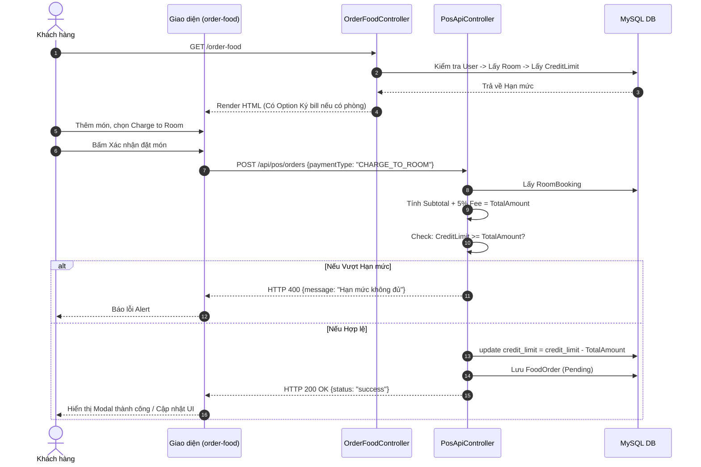

# Báo cáo Phân tích Luồng hoạt động UC16: Đặt món trực tuyến lên phòng nghỉ (Room Service)

*Lưu ý: Tài liệu này trước đây ghi nhận là UC14, nhưng theo `UC_MASTER_TABLE.md` chuẩn, tác vụ "Đặt món trực tuyến lên phòng nghỉ" (Room Service Order) dành cho Customer chính xác là **UC16**. Tài liệu này đã được cập nhật bám sát mã nguồn mới nhất.*

Tài liệu này giải thích chi tiết luồng xử lý của UC16 (Khách hàng gọi món về phòng - Room Service) trong mã nguồn hiện tại của dự án Kawai Resort & Tour Hub, bao gồm các cập nhật mới nhất về việc **Kiểm tra Hạn mức tín dụng (Credit Limit)**, **Hỗ trợ định danh OAuth2**, và **Luồng thanh toán Ký bill về phòng (Charge to Room)**.

---

## Danh sách các file được tạo mới hoặc chỉnh sửa

Trong quá trình giải quyết UC16 và hoàn thiện luồng đặt món, chúng ta đã can thiệp vào các tệp tin sau:

### Code Nghiệp vụ (Production Code)

1. **[MODIFY]** `com/kawai/controllers/web/OrderFoodController.java`: Nạp thực đơn. Kiểm tra User qua Form hoặc Google OAuth2. Truy vấn phòng và bàn đang hoạt động để lấy `CreditLimit` truyền xuống Frontend.
2. **[MODIFY]** `com/kawai/controllers/api/PosApiController.java`: Xử lý API `/api/pos/orders` tạo đơn hàng. Tính tổng tiền, cộng 5% phí phục vụ và tự động kiểm tra/trừ tiền vào `CreditLimit` của `RoomBooking`.
3. **[MODIFY]** `com/kawai/services/impl/PosServiceImpl.java`: Cung cấp hàm `chargeToRoom` và `postChargeToFolio` lưu vào `FolioItem` (phục vụ mục đích tổng hợp công nợ sau này).
4. **[MODIFY]** `com/kawai/repositories/FoodOrderRepository.java`: Truy vấn lịch sử `FoodOrder` thông minh bằng `findByCustomer`, tự động gộp theo Khách hàng và Phòng.
5. **[MODIFY]** `com/kawai/config/SecurityConfig.java`: Phân quyền `/order-food` và `/api/pos/**` thành `permitAll()` cho phép khách chưa đăng nhập vẫn có thể gọi món vãng lai (Walk-in), nhưng giới hạn tính năng Ký bill.

### Giao diện (Frontend / Views)

6. **[MODIFY]** `src/main/resources/templates/guest/order-food.html`: Giao diện đặt món sang trọng, hỗ trợ chọn phương thức thanh toán (Charge to Room, Online, Pay at Restaurant), hiển thị cảnh báo Hạn mức, và modal xác nhận.

---

## 1. Phía Frontend: Giao diện Khách hàng & Giỏ hàng

> **Files liên quan:**
>
> - `03_sourcecode/kawai-backend/src/main/resources/templates/guest/order-food.html`

### Bước 1.1: Trạng thái hiển thị Dựa trên Định danh

Trang giao diện được chia làm các khối logic tự động nhận diện tùy theo trạng thái lưu trú của khách hàng:

- `optionInRoom`: Khách đang lưu trú tại phòng. Cho phép "Ký bill về phòng" (Charge to Room) và hiển thị Hạn mức (`currentCreditLimit`).
- `optionRestaurant`: Khách có đặt bàn nhưng không thuê phòng. Chỉ cho thanh toán Trực tuyến hoặc Tại bàn.
- `optionWalkIn` / `optionNotLoggedIn`: Khách chưa đăng nhập hoặc khách vãng lai.

### Bước 1.2: Gửi Đơn hàng (Checkout)

Hàm `placeOrder()` ở giao diện thu thập giỏ hàng và gửi Payload JSON. Khi khách hàng bấm đặt món, Javascript sẽ thu thập các tham số quan trọng như `paymentType` và `orderType`.

---

## 2. Phía Backend: Cấu hình Bảo mật & API Xử lý Đơn Hàng

### Bước 2.1: Phân quyền Bảo mật mở rộng

Thay vì chặn cứng bằng `.authenticated()`, hệ thống cấu hình `permitAll()` cho route `/order-food` để ai cũng có thể xem menu, nhưng tiến hành định danh người dùng bằng Session và Principal để cấp quyền thanh toán (Xem thêm Phần 6).

### Bước 2.2: OrderFoodController - Nạp Dữ liệu Giao diện

Cung cấp trải nghiệm "Zero-Click" - Khách hàng không cần nhập số phòng. Máy chủ tự động quét Database tìm phòng đang Check-In và lấy ra `CreditLimit`.

### Bước 2.3: PosApiController - Xử lý Trừ tiền Hạn mức (Credit Limit)

Backend tự động quét các món ăn trong giỏ, tính tổng `subtotal`, cộng `5% phí dịch vụ` và trừ thẳng vào hạn mức `CreditLimit` của phòng nếu người dùng chọn phương thức "CHARGE_TO_ROOM".

### Bước 2.4: Lấy Lịch sử đơn hàng (Query linh hoạt)

Hàm `findByCustomer` trong `FoodOrderRepository` dùng `LEFT JOIN` để truy vấn tất cả đơn hàng liên quan đến Khách hàng đang đăng nhập từ nhiều nguồn (phòng, bàn, vãng lai).

---

## 3. Sơ đồ Data Flow (Luồng dữ liệu)



---

## 4. Phân tích mã nguồn chi tiết từng dòng (Line-by-line Code Analysis)

Phần này bóc tách mã nguồn chi tiết tại API tạo đơn hàng, giải thích cách hệ thống tính tiền và trừ vào hạn mức.

### Tầng Backend: `PosApiController.java` (Logic trừ tiền Hạn mức)

```java
1.  @PostMapping("/orders")
2.  public ResponseEntity<?> createOrder(@RequestBody CreateFoodOrderRequest request, Principal principal) {
3.      // ... (Phần code lấy Account và Active Booking)
4.
5.      BigDecimal subtotal = BigDecimal.ZERO;
6.
7.      // Lưu Chi tiết Món và tính Tổng tiền
8.      if (request.getItems() != null) {
9.          for (CartItemDto itemDto : request.getItems()) {
10.             Optional<MenuItem> menuOpt = foodItemRepository.findById(itemDto.getId());
11.             if (menuOpt.isPresent()) {
12.                 FoodOrderDetail detail = new FoodOrderDetail();
13.                 // ... (Set thông tin FoodOrderDetail)
14.                 foodOrderDetailRepository.save(detail);
15.
16.                 if (itemDto.getPrice() != null && itemDto.getQty() != null) {
17.                     subtotal = subtotal.add(itemDto.getPrice().multiply(new BigDecimal(itemDto.getQty())));
18.                 }
19.             }
20.         }
21.     }
22.
23.     // KIỂM TRA & TRỪ TIỀN VÀO CREDIT LIMIT
24.     if ("CHARGE_TO_ROOM".equalsIgnoreCase(request.getPaymentType()) && activeBooking != null && activeBooking instanceof RoomBooking) {
25.         RoomBooking roomBooking = (RoomBooking) activeBooking;
26.         BigDecimal feePercent = new BigDecimal("0.05");
27.         BigDecimal fee = subtotal.multiply(feePercent);
28.         BigDecimal totalAmount = subtotal.add(fee);
29.
30.         BigDecimal currentLimit = roomBooking.getCreditLimit() != null ? roomBooking.getCreditLimit() : BigDecimal.ZERO;
31.         if (currentLimit.compareTo(totalAmount) >= 0) {
32.             roomBooking.setCreditLimit(currentLimit.subtract(totalAmount));
33.             roomBookingRepository.save(roomBooking);
34.         } else {
35.             return ResponseEntity.status(400).body(Map.of("status", "error", "message", "Hạn mức tín dụng của phòng không đủ để thanh toán!"));
36.         }
37.     }
38.     // ...
39. }
```

**Giải thích:**

- **Dòng 5-21:** Hệ thống lặp qua danh sách `CartItemDto` mà Frontend gửi lên. Đối với mỗi món, tìm trong Database (`foodItemRepository`) để lấy giá chuẩn. Tính `subtotal` bằng cách nhân Giá tiền (`getPrice()`) với Số lượng (`getQty()`), rồi cộng dồn vào `subtotal`. Cách làm này chống trường hợp Frontend gửi sai giá (Backend luôn tự tính lại).
- **Dòng 24:** Nếu phương thức thanh toán là `CHARGE_TO_ROOM` và có tìm thấy `activeBooking` là đặt phòng.
- **Dòng 26-28:** Tính thêm 5% Phí dịch vụ (Service Fee) cho dịch vụ Room Service. Tổng hóa đơn (`totalAmount`) = `subtotal` + `fee`.
- **Dòng 30:** Lấy Hạn mức tín dụng (`CreditLimit`) của phòng. Nếu không có thì mặc định là `0`.
- **Dòng 31:** Dùng `compareTo` so sánh Hạn mức (`currentLimit`) với Tổng tiền (`totalAmount`). Nếu `>= 0` nghĩa là Hạn mức vẫn còn đủ sức trả.
- **Dòng 32-33:** Thực hiện trừ tiền (`subtract()`) vào `creditLimit` và lưu bản ghi `RoomBooking` lại vào DB.
- **Dòng 34-35:** Nếu hạn mức không đủ (`< 0`), lập tức chặn luồng thực thi, trả về mã HTTP `400 Bad Request` kèm thông báo lỗi. Đơn hàng sẽ không được tạo tiếp tục thanh toán Charge To Room.

---

## 5. Các Cập Nhật & Vá Lỗi Bảo Mật Gần Đây

Trong quá trình rà soát lại luồng Đặt món, hệ thống đã phát hiện và tiến hành vá một số lỗ hổng bảo mật nghiêm trọng liên quan đến Code Boundaries và PII Leakage.

### 5.1. Vá Lỗi Rò rỉ dữ liệu PII (PII Leakage) tại Giao diện Chọn Phòng

**Vấn đề cũ:** Tại chức năng lấy danh sách phòng ở `/order-food`, Controller truyền toàn bộ danh sách phòng đang Check-In (kèm tên khách hàng của tất cả các phòng) xuống thẻ HTML `<option>`. Dù UI chỉ hiển thị theo số phòng, bất kỳ ai Inspect Element cũng có thể đọc được tên thật của các khách hàng khác trong hệ thống (lỗi rò rỉ dữ liệu).

**Cập nhật mới:**

- Sửa hàm `showOrderFoodPage` trong `OrderFoodController.java`.
- Thay vì lấy toàn bộ phòng, hệ thống tiến hành **Định danh chủ động (Active Identification)** thông qua `Principal` (Hỗ trợ cả Google OAuth2 và Form Login).
- Trích xuất định danh khách hàng và chỉ trả về **đúng phòng** thuộc quyền sở hữu của khách hàng đó qua hàm `findActiveRoomByUserId`. Dữ liệu của khách hàng khác được bảo mật tuyệt đối.

### 5.2. Vá Lỗi Xâm nhập dữ liệu trái phép (IDOR) tại Lịch sử đơn hàng

**Vấn đề cũ:** Nếu URL sử dụng tham số dạng `?roomNumber=101` để truy vấn lịch sử đơn hàng, một khách hàng bất kỳ có thể đổi tham số thành `?roomNumber=102` để xem trộm lịch sử ăn uống của phòng bên cạnh.

**Cập nhật mới:**

- Thay vì phụ thuộc vào tham số `roomNumber` truyền từ client, hệ thống hiện dùng hàm `findByCustomer` trong `FoodOrderRepository.java`.
- Cây truy vấn này tự động lấy Khách hàng hiện tại đang đăng nhập (`Customer`) và tìm ra các đơn hàng gắn với `booking`, `roomBookingDetail`, hoặc `roomBooking` của đúng khách hàng đó. Triệt tiêu hoàn toàn rủi ro IDOR.

### 5.3. Xử lý Linh hoạt Cấu hình phân quyền (403 Forbidden)

**Vấn đề cũ:** Nếu chặn cứng `/order-food` và `/api/pos/**` bằng `.authenticated()`, những khách hàng vãng lai (Walk-in) muốn xem trước Menu hoặc đặt món giao tới Sảnh sẽ bị bắt đăng nhập.

**Cập nhật mới:**

- Trong `SecurityConfig.java`, mở khóa `permitAll()` cho các tuyến này.
- Nhưng bảo mật logic được đẩy xuống tầng Business Logic (`OrderFoodController` và `PosApiController`). Ở tầng này, nếu bạn là Guest, hệ thống chỉ cho phép thanh toán `ONLINE` hoặc `PAY_AT_RESTAURANT`, ẩn đi hoàn toàn tính năng `CHARGE_TO_ROOM` và không tiết lộ bất cứ thông tin phòng nào.

---

## 6. Các Hạng Mục Còn Thiếu So Với SRS UC-16 & UC-17 (Cần Hoàn Thiện Sau)

Dưới đây là danh sách các hạng mục cần bổ sung vào code khi các module phụ thuộc đã sẵn sàng:

### 6.1. Bổ sung ghi nợ tự động vào Folio Phòng (MOD5)
Hiện tại `PosApiController` mới chỉ trừ tiền vào `creditLimit`. Nó cần gọi hàm `posServiceImpl.chargeToRoom()` hoặc chèn code tạo `FolioItem` để ghi nợ số tiền ăn này vào hóa đơn Folio phòng. Việc này đảm bảo tính nhất quán cho quy trình kiểm toán đêm và Check-out tổng hợp.

### 6.2. Đồng bộ KOT tới Bếp qua WebSocket (MOD3 - UC19)
Khi có đơn hàng mới (Pending), hệ thống cần phát `ApplicationEvent` hoặc dùng Spring Websocket để đẩy trực tiếp đơn hàng lên màn hình KDS của nhà bếp theo thời gian thực (Real-time).

### 6.3. Xử lý Cổng Thanh toán VNPay (MOD5)
Giao diện đã có Option `paymentType = ONLINE`, nhưng Backend hiện đang chỉ Set cờ `isPaidInPos = true` ảo. Cần tích hợp luồng trả về `vnpay-return` để khởi tạo link thanh toán VNPay hoặc Momo thực tế nếu Khách chọn thanh toán trực tuyến.

---

## 7. Phụ Thuộc Vào Các Use Case Khác (Mức Độ Module)

Để hoàn thành được 3 hạng mục còn thiếu ở Phần 6, luồng UC16 bắt buộc phải chờ sự hoàn thiện từ các Use Case khác theo bảng `UC_MASTER_TABLE.md`:

| Hạng mục UC16 còn thiếu                       | Phụ thuộc vào UC nào?                                                        | Module nào phụ trách?         | Lý do phụ thuộc                                                                                                                                                                |
| ------------------------------------------------- | -------------------------------------------------------------------------------- | -------------------------------- | --------------------------------------------------------------------------------------------------------------------------------------------------------------------------------- |
| **6.1. Bổ sung ghi nợ vào Folio Phòng** | `UC26.1` (Tích lũy phát sinh chi phí tự động) | MOD5 - Kiểm toán & Tài chính | Cần định nghĩa chuẩn mô hình `FolioItem` và phương thức ghi nợ chuẩn để UC16 có thể gọi `postChargeToFolio()`, phục vụ tính toán lúc Check-out (UC27). |
| **6.2. Gửi thông báo KOT tới Bếp**     | `UC19.1` (Tiếp nhận vé gọi món hàng đợi)                                         | MOD3 - POS                       | Màn hình KDS của Bếp cần được xây dựng xong để có thể bắt được sự kiện Websocket/Event khi UC16 tạo đơn hàng `Room Service`.                            |
| **6.3. Xử lý Thanh toán VNPay**             | `UC27.3` (Điều hướng giao dịch qua Cổng trực tuyến)                                             | MOD5 - Kiểm toán & Tài chính      | Hệ thống tạo URL thanh toán VNPay phải hoàn chỉnh để UC16 trả về đường link cho khách quét mã thanh toán khi chọn `ONLINE`.                    |

**Ghi chú:** Người phụ trách MOD3 (POS) cần chủ động phối hợp với các bạn làm MOD5 để khớp nối dữ liệu (Integration) khi các module này sẵn sàng.

---

## 8. Trích xuất và Giải thích Chi tiết Code (UC16) ở Từng File

Dưới đây là các đoạn mã nguồn (source code) quan trọng nhất liên quan trực tiếp đến luồng xử lý "Room Service" của UC16, được trích xuất từ từng file và giải thích cặn kẽ ý nghĩa của từng dòng.

### 8.1. Cấu hình bảo mật - `SecurityConfig.java`

Mở khóa tuyến đường đặt món cho cả khách vãng lai, nhưng sử dụng định danh chủ động ở Controller để kiểm soát quyền Ký bill.

```java
// File: src/main/java/com/kawai/config/SecurityConfig.java

1.  .requestMatchers("/", "/booking", "/auth/register", "/auth/login", 
2.                   "/guest/**", "/profile", "/order-food", "/api/pos/**", ... )
3.  .permitAll()
```
**Giải thích chi tiết:**
- **Dòng 1-3:** Lệnh `.permitAll()` cho phép bất kỳ ai (kể cả chưa có tài khoản) cũng có thể truy cập trang `/order-food` để xem Menu, hoặc gọi API `/api/pos/orders` để đặt món ăn giao tới sảnh.
- **Ý nghĩa:** Việc kiểm soát "Ai được phép Ký bill nợ về phòng" được chuyển giao cho Business Logic ở Controller xử lý thay vì chặn cứng ở đây, mang lại trải nghiệm linh hoạt.

### 8.2. Tầng Controller lấy Dữ liệu - `OrderFoodController.java`

Đoạn code này chịu trách nhiệm xác định danh tính khách hàng, tìm phòng khách đang ở và tính toán Hạn mức tín dụng.

```java
// File: src/main/java/com/kawai/controllers/web/OrderFoodController.java

1.  Account userAccount = (Account) session.getAttribute("user");
2.  
3.  if (userAccount != null) {
4.      Long accountId = userAccount.getId();
5.      
6.      // Quét tìm thông tin phòng đang thuê
7.      currentRoom = roomRepository.findActiveRoomByUserId(accountId).orElse(null);
8.      
9.      // Tính toán hạn mức ký bill gửi về phòng
10.     if (currentRoom != null && currentRoom.getCurrentBookingDetailId() != null) {
11.         Optional<RoomBookingDetail> detailOpt = roomBookingDetailRepository
12.                 .findById(currentRoom.getCurrentBookingDetailId());
13.         if (detailOpt.isPresent()) {
14.             RoomBooking roomBooking = detailOpt.get().getRoomBooking();
15.             if (roomBooking != null && roomBooking.getCreditLimit() != null) {
16.                 currentCreditLimit = roomBooking.getCreditLimit();
17.             }
18.         }
19.     }
20. }
```
**Giải thích chi tiết:**
- **Dòng 1-3:** Lấy thông tin tài khoản đăng nhập (có thể từ Form Local hoặc Google OAuth2) từ Session hiện tại.
- **Dòng 6-7:** Dùng ID tài khoản (`accountId`) để quét toàn bộ Database, tìm xem vị khách này hiện có đang check-in ở phòng nào không (`findActiveRoomByUserId`).
- **Dòng 10-14:** Nếu khách có phòng, truy xuất ngược lại vào Hợp đồng chi tiết (`RoomBookingDetail`) để lấy ra Hợp đồng tổng (`RoomBooking`).
- **Dòng 15-16:** Lấy hạn mức tín dụng (`CreditLimit`) của Hợp đồng tổng và gán vào biến `currentCreditLimit`. Biến này sau đó được truyền xuống file HTML để in ra cho khách hàng biết họ còn bao nhiêu tiền để gọi món.

### 8.3. Tầng API Tạo Đơn & Trừ Tiền - `PosApiController.java`

Đây là trái tim của UC16, chịu trách nhiệm tiếp nhận danh sách món ăn, tính tổng tiền, cộng phí dịch vụ và trừ thẳng tiền vào hạn mức.

```java
// File: src/main/java/com/kawai/controllers/api/PosApiController.java

1.  BigDecimal subtotal = BigDecimal.ZERO;
2.  for (CartItemDto itemDto : request.getItems()) {
3.      // ... (Tạo FoodOrderDetail)
4.      subtotal = subtotal.add(itemDto.getPrice().multiply(new BigDecimal(itemDto.getQty())));
5.  }
6.  
7.  // Trừ tiền cho luồng CHARGE_TO_ROOM
8.  if ("CHARGE_TO_ROOM".equalsIgnoreCase(request.getPaymentType()) && activeBooking != null && activeBooking instanceof RoomBooking) {
9.      RoomBooking roomBooking = (RoomBooking) activeBooking;
10.     BigDecimal feePercent = new BigDecimal("0.05");
11.     BigDecimal fee = subtotal.multiply(feePercent);
12.     BigDecimal totalAmount = subtotal.add(fee);
13. 
14.     BigDecimal currentLimit = roomBooking.getCreditLimit() != null ? roomBooking.getCreditLimit() : BigDecimal.ZERO;
15.     if (currentLimit.compareTo(totalAmount) >= 0) {
16.         roomBooking.setCreditLimit(currentLimit.subtract(totalAmount));
17.         roomBookingRepository.save(roomBooking);
18.     } else {
19.         return ResponseEntity.status(400).body(Map.of("status", "error", "message", "Hạn mức tín dụng của phòng không đủ để thanh toán!"));
20.     }
21. }
```
**Giải thích chi tiết:**
- **Dòng 1-5:** Lặp qua từng món ăn mà frontend gửi lên. Lấy `Giá` x `Số lượng` rồi cộng vào `subtotal`. Hệ thống tự tính lại tiền để đề phòng Hacker can thiệp sửa giá từ Frontend.
- **Dòng 8-9:** Xác minh xem khách hàng có chọn thanh toán "Ký bill" (`CHARGE_TO_ROOM`) và có thực sự đang có một hợp đồng đặt phòng hợp lệ (`activeBooking`) hay không.
- **Dòng 10-12:** Tính thêm 5% Phí dịch vụ cho Room Service bằng cách lấy `subtotal * 0.05`. Tổng cộng bằng `subtotal + fee`.
- **Dòng 14-15:** Lấy hạn mức tín dụng (`CreditLimit`) của phòng và đọ sức (`compareTo`) với Tổng hóa đơn (`totalAmount`).
- **Dòng 16-17:** Nếu hạn mức LỚN HƠN hoặc BẰNG tổng hóa đơn, hệ thống làm phép trừ (`subtract`) tiền trong ví đi, sau đó lưu ví mới vào Database (`save`).
- **Dòng 18-20:** Nếu ví không đủ tiền, lập tức chặn ngang luồng xử lý và báo lỗi `400` cho Frontend, không cho phép tiếp tục hoàn thành tạo đơn.

### 8.4. Tầng Repository Lấy Lịch Sử - `FoodOrderRepository.java`

Câu Query tối ưu giúp lấy toàn bộ lịch sử ăn uống của một vị khách một cách an toàn nhất, tránh hoàn toàn rủi ro lộ dữ liệu (IDOR).

```java
// File: src/main/java/com/kawai/repositories/FoodOrderRepository.java

1.  @Query("SELECT DISTINCT fo FROM FoodOrder fo " +
2.         "LEFT JOIN fo.booking b " +
3.         "LEFT JOIN fo.roomBookingDetail rbd " +
4.         "LEFT JOIN rbd.roomBooking rb " +
5.         "WHERE b.customer = :customer " +
6.         "OR rbd.customer = :customer " +
7.         "OR rb.customer = :customer")
8.  List<FoodOrder> findByCustomer(@Param("customer") Customer customer);
```
**Giải thích chi tiết:**
- **Dòng 1:** Chọn ra các Hóa đơn không trùng lặp (`DISTINCT`).
- **Dòng 2-4:** Dùng `LEFT JOIN` để mở rẽ nhánh sang 3 hướng kiểm tra: Hóa đơn liên kết thẳng với Booking tổng (`b`), liên kết với Booking chi tiết (`rbd`), và từ Booking chi tiết móc ra Booking tổng (`rb`).
- **Dòng 5-7:** Nếu vị `Customer` truyền vào (là người đang đăng nhập hệ thống) có tồn tại ở BẤT KỲ bảng nào trong 3 bảng vừa join ở trên, thì hệ thống đều trả về hóa đơn đó. Nhờ cơ chế này, khách hàng bị khóa chặt dữ liệu, không thể nào dùng URL ảo để xem trộm lịch sử ăn uống của người khác.

### 8.5. Tầng Xử lý Ghi Nợ Trung Tâm - `PosServiceImpl.java`

Logic này phục vụ việc ký gửi hóa đơn POS thành một mục nợ (Folio Item) thuộc sổ nợ chung của phòng (Phục vụ cho việc tương lai tích hợp MOD5 Kiểm toán đêm).

```java
// File: src/main/java/com/kawai/services/impl/PosServiceImpl.java

1.  public void chargeToRoom(String roomNumber, BigDecimal amount) {
2.      Room room = getOccupiedRoom(roomNumber);
3.      RoomBookingDetail detail = getBookingDetail(room.getCurrentBookingDetailId());
4.  
5.      validateCreditLimit(detail, amount);
6.      postChargeToFolio(detail, amount);
7.  }
8.  
9.  private void postChargeToFolio(RoomBookingDetail detail, BigDecimal amount) {
10.     FolioItem folioItem = new FolioItem();
11.     folioItem.setRoomBookingDetail(detail);
12.     folioItem.setSourceDepartment("POS");
13.     folioItem.setAmount(amount);
14.     folioItem.setDescription("Ký gửi hóa đơn từ nhà hàng");
15. 
16.     folioItemRepository.save(folioItem);
17. }
```
**Giải thích chi tiết:**
- **Dòng 1-6:** Hàm tổng `chargeToRoom` nhận số phòng và số tiền. Nó lấy thông tin phòng, kiểm tra hạn mức (`validateCreditLimit`) và sau đó gọi hàm ghi nợ (`postChargeToFolio`).
- **Dòng 9-16:** Hàm `postChargeToFolio` thực hiện tạo một đối tượng `FolioItem` (Mục nợ của phòng). Nó gán phòng đang thuê (`setRoomBookingDetail`), gán nguồn gốc nợ là từ hệ thống POS (`setSourceDepartment("POS")`), ghi lại số tiền (`setAmount`), mô tả khoản nợ và lưu thẳng vào Database. Bước này là cầu nối quan trọng giữa Phân hệ POS và Phân hệ Kế Toán.

> ⚠️ **Ghi chú phần cũ:** Phần 8 mô tả code theo thiết kế lý thuyết. **Code thực tế hiện tại** đã có nhiều điểm khác biệt quan trọng — `OrderFoodController` xử lý cả OAuth2 lẫn Form Login, `order-food.html` sử dụng Tailwind CSS và JavaScript phức tạp hơn, luồng thanh toán có thêm ONLINE (VietQR/Thẻ/Ví). Xem chi tiết tại **Phần 9** bên dưới.

---

## 9. Phân tích Mã nguồn Mới nhất — Code Thực tế Hiện tại (2026-06-17)

> Phần này trích dẫn **100% code thực tế** đang chạy trong dự án. Bao phủ đầy đủ Frontend (HTML + JS inline) và Backend (Controller). Các phần cũ (4, 5, 8) mô tả kiến trúc và lịch sử vẫn giữ nguyên làm tham chiếu.

---

### 9.1 [BACKEND] `OrderFoodController.java` — Xử lý GET `/order-food`

**File:** `src/main/java/com/kawai/controllers/web/OrderFoodController.java`  
**Vai trò:** Web Controller nhận request `GET /order-food`, xác định danh tính khách hàng, truy vấn phòng và hạn mức, truyền dữ liệu xuống view Thymeleaf.

#### 9.1.1 — Khai báo và dependencies (Dòng 34–52)

```java
1.  @Controller
2.  public class OrderFoodController {
3.
4.      private static final Logger log =
5.              LoggerFactory.getLogger(OrderFoodController.class);
6.
7.      @Autowired private FoodItemRepository foodItemRepository;
8.      @Autowired private RestaurantTableRepository restaurantTableRepository;
9.      @Autowired private RoomRepository roomRepository;
10.     @Autowired private AccountRepository accountRepository;
11.     @Autowired private RoomBookingDetailRepository roomBookingDetailRepository;
```

**Giải thích từng dòng:**
- **Dòng 1:** `@Controller` (không phải `@RestController`) — trả về tên template Thymeleaf thay vì JSON.
- **Dòng 4-5:** `Logger` dùng để ghi log debug — quan trọng khi trace lỗi OAuth2 vs Form Login.
- **Dòng 7:** `foodItemRepository` — lấy toàn bộ menu.
- **Dòng 8:** `restaurantTableRepository` — tìm bàn đặt hôm nay của khách.
- **Dòng 9:** `roomRepository` — tìm phòng đang check-in của khách.
- **Dòng 10:** `accountRepository` — tra cứu `Account` từ `Principal` (khi session chưa có).
- **Dòng 11:** `roomBookingDetailRepository` — truy ngược từ phòng ra hợp đồng để lấy `CreditLimit`.

#### 9.1.2 — Khởi tạo biến và tải menu (Dòng 55–77)

```java
1.  @GetMapping("/order-food")
2.  public String showOrderFoodPage(Principal principal, Model model,
3.                                   HttpSession session) {
4.
5.      List<MenuItem> allItems = Collections.emptyList();
6.      List<String> categories = Collections.emptyList();
7.      Room currentRoom = null;
8.      RestaurantTable currentTable = null;
9.      BigDecimal currentCreditLimit = null;
10.     boolean isLoggedIn = (principal != null);
11.
12.     try {
13.         allItems = foodItemRepository.findAll();
14.         categories = allItems.stream()
15.                 .map(MenuItem::getCategory)
16.                 .filter(Objects::nonNull)
17.                 .distinct()
18.                 .collect(Collectors.toList());
19.     } catch (Exception e) {
20.         log.error("Lỗi khi tải Menu: {}", e.getMessage(), e);
21.     }
22.
23.     model.addAttribute("menuItems", allItems);
24.     model.addAttribute("categories", categories);
```

**Giải thích từng dòng:**
- **Dòng 2:** 3 tham số inject: `Principal` (Spring Security), `Model` (truyền data xuống Thymeleaf), `HttpSession` (cache Account).
- **Dòng 5-9:** Khởi tạo `null` — tránh NPE nếu khách chưa đăng nhập hoặc không có phòng.
- **Dòng 10:** `isLoggedIn = (principal != null)` — Spring Security inject `null` khi khách chưa đăng nhập (dù route là `permitAll()`).
- **Dòng 13-18:** Tải toàn bộ menu và extract danh sách category duy nhất (`.distinct()`) để render thanh filter. Bọc trong `try-catch` để không crash nếu DB có vấn đề.
- **Dòng 23-24:** `model.addAttribute` → Thymeleaf dùng tên này trong `th:each`, `th:text`, etc.

#### 9.1.3 — Định danh khách hàng (OAuth2 + Form Login) (Dòng 92–119)

```java
1.  Account userAccount = (Account) session.getAttribute("user");
2.
3.  if (userAccount == null) {
4.      String identifier = null;
5.
6.      if (principal instanceof OAuth2AuthenticationToken) {
7.          OAuth2AuthenticationToken oauthToken =
8.                  (OAuth2AuthenticationToken) principal;
9.          identifier = oauthToken.getPrincipal().getAttribute("email");
10.         log.info("Google OAuth2 với email: {}", identifier);
11.     } else {
12.         identifier = principal.getName();
13.         log.info("Form Login với username: {}", identifier);
14.     }
15.
16.     if (identifier != null) {
17.         userAccount = accountRepository
18.                 .findByUsername(identifier).orElse(null);
19.         if (userAccount != null) {
20.             session.setAttribute("user", userAccount);
21.         }
22.     }
23. }
```

**Giải thích từng dòng:**
- **Dòng 1:** Ưu tiên đọc từ Session — tránh query DB mỗi lần page load.
- **Dòng 3:** Nếu Session chưa có (lần đầu vào trang sau đăng nhập), tiến hành tra cứu.
- **Dòng 6-10:** Nhánh OAuth2: Google trả về `Principal` dạng `OAuth2AuthenticationToken`. Trích email từ attribute. **Lưu ý:** Cả tài khoản Google lẫn Form đều lưu email/username vào cột `username` trong DB — đây là quyết định thiết kế quan trọng.
- **Dòng 12:** Nhánh Form Login: `principal.getName()` trả về username đã đăng nhập.
- **Dòng 17-18:** `findByUsername(identifier)` — tra cứu thống nhất bằng 1 hàm, hoạt động cho cả 2 loại định danh.
- **Dòng 20:** Lưu vào Session để các request tiếp theo không cần query DB lại.

#### 9.1.4 — Truy vấn phòng, bàn và CreditLimit (Dòng 122–156)

```java
1.  if (userAccount != null) {
2.      Long accountId = userAccount.getId();
3.
4.      try {
5.          currentRoom = roomRepository
6.                  .findActiveRoomByUserId(accountId).orElse(null);
7.      } catch (Exception e) {
8.          log.warn("Lỗi truy vấn phòng userId={}: {}", accountId, e.getMessage());
9.      }
10.
11.     try {
12.         currentTable = restaurantTableRepository
13.                 .findTodayTableByUserId(accountId).orElse(null);
14.     } catch (Exception e) {
15.         log.warn("Lỗi truy vấn bàn: {}", e.getMessage());
16.     }
17.
18.     // Tính toán CreditLimit
19.     if (currentRoom != null
20.             && currentRoom.getCurrentBookingDetailId() != null) {
21.         try {
22.             Optional<RoomBookingDetail> detailOpt =
23.                     roomBookingDetailRepository.findById(
24.                             currentRoom.getCurrentBookingDetailId());
25.             if (detailOpt.isPresent()) {
26.                 RoomBooking roomBooking = detailOpt.get().getRoomBooking();
27.                 if (roomBooking != null
28.                         && roomBooking.getCreditLimit() != null) {
29.                     currentCreditLimit = roomBooking.getCreditLimit();
30.                 }
31.             }
32.         } catch (Exception e) {
33.             log.warn("Lỗi truy vấn CreditLimit: {}", e.getMessage());
34.         }
35.     }
36. }
37.
38. model.addAttribute("currentRoom", currentRoom);
39. model.addAttribute("currentTable", currentTable);
40. model.addAttribute("currentCreditLimit", currentCreditLimit);
41. return "guest/order-food";
```

**Giải thích từng dòng:**
- **Dòng 5-6:** `findActiveRoomByUserId` — Repository method custom tìm phòng đang `OCCUPIED` của user. Mỗi khách chỉ có 1 phòng active.
- **Dòng 12-13:** `findTodayTableByUserId` — tìm lịch đặt bàn hôm nay của user (nếu không có phòng).
- **Dòng 19-20:** Điều kiện kép: (1) phải có phòng, (2) phòng phải có `currentBookingDetailId` — liên kết đến hợp đồng thuê chi tiết.
- **Dòng 22-24:** Truy vấn `RoomBookingDetail` theo ID.
- **Dòng 26:** Từ `RoomBookingDetail`, `.getRoomBooking()` lấy hợp đồng tổng.
- **Dòng 29:** `currentCreditLimit = roomBooking.getCreditLimit()` — số tiền khách được phép ký nợ. Null-safe nhờ kiểm tra `!= null` ở dòng 28.
- **Dòng 38-41:** Truyền 3 biến xuống view. `null` nghĩa là khách không có phòng/bàn/hạn mức.

---

### 9.2 [FRONTEND — HTML] `order-food.html` — Giao diện phát hiện vị trí và thanh toán

**File:** `src/main/resources/templates/guest/order-food.html`  
**Vai trò:** SPA-style (Single Page Application) template — hiển thị menu, giỏ hàng, chọn thanh toán, modal xác nhận.

#### 9.2.1 — Khai báo Tailwind CSS và script cấu hình (Dòng 17–37)

```html
1.  <script src="https://cdn.tailwindcss.com?plugins=forms,container-queries"></script>
2.  <script id="tailwind-config">
3.    tailwind.config = {
4.      theme: {
5.        extend: {
6.          colors: {
7.            'hoanien-bg': '#f1ebe3',
8.            'hoanien-text': '#3a3230',
9.            'hoanien-footer': '#3c3530',
10.          },
11.          fontFamily: {
12.            'serif': ['"Playfair Display"', 'serif'],
13.            'sans': ['"Montserrat"', 'sans-serif'],
14.          }
15.        }
16.      }
17.    }
18. </script>
```

**Giải thích từng dòng:**
- **Dòng 1:** Tải Tailwind qua CDN — **khác với các file POS khác** dùng Vanilla CSS. `order-food.html` là trang khách hàng nên dùng Tailwind để xây UI nhanh và responsive.
- **Dòng 3-17:** Cấu hình theme mở rộng: màu sắc thương hiệu `hoanien-*` và font chữ. Cho phép dùng `class="bg-hoanien-bg"` trong HTML thay vì hex codes.

#### 9.2.2 — Bốn khối Option phát hiện vị trí lưu trú (HTML Dòng 353–389)

```html
1.  <!-- Option 1: Khách đang ở phòng → Room Service -->
2.  <div id="optionInRoom" th:if="${currentRoom != null}">
3.    Bạn đang lưu trú tại
4.    <span th:text="'Phòng ' + ${currentRoom.roomNumber}">Phòng 000</span>
5.    <input type="hidden" id="posOrderType" value="ROOM_SERVICE">
6.    <input type="hidden" id="posLocationId"
7.           th:value="${currentRoom.roomNumber}">
8.  </div>
9.
10. <!-- Option 2: Có bàn đặt hôm nay → Dine-In -->
11. <div id="optionRestaurant" th:if="${currentRoom == null && currentTable != null}">
12.   Lịch bàn tại <span th:text="'Bàn số ' + ${currentTable.tableNumber}">Bàn 00</span>
13.   <input type="hidden" id="posOrderType" value="RESTAURANT">
14.   <input type="hidden" id="posLocationId" th:value="${currentTable.id}">
15. </div>
16.
17. <!-- Option 3: Đã đăng nhập nhưng không có phòng/bàn → Walk-In -->
18. <div id="optionWalkIn"
19.      th:if="${session.user != null && currentRoom == null && currentTable == null}">
20.   Chưa liên kết thông tin lưu trú.
21.   <input type="hidden" id="posOrderType" value="WALK_IN">
22.   <input type="hidden" id="posLocationId" value="Lobby">
23. </div>
24.
25. <!-- Option 4: Chưa đăng nhập → Yêu cầu đăng nhập -->
26. <div id="optionNotLoggedIn" th:if="${session.user == null}">
27.   Bạn chưa đăng nhập.
28.   <button type="button" onclick="showAuthModal()">Đăng nhập ngay</button>
29.   <input type="hidden" id="posOrderType" value="WALK_IN">
30.   <input type="hidden" id="posLocationId" value="Lobby">
31. </div>
```

**Giải thích từng dòng:**
- **Dòng 2:** `th:if="${currentRoom != null}"` — chỉ render khối này nếu Controller tìm được phòng. Nếu không, toàn bộ div biến mất khỏi HTML.
- **Dòng 4:** `th:text` nhúng số phòng thực từ DB (ví dụ `"Phòng 101"`).
- **Dòng 5-7:** `<input type="hidden">` — biến JS đọc bằng `getElementById('posOrderType').value` khi gửi đơn. Giá trị `"ROOM_SERVICE"` → JS biết đây là Room Service. `posLocationId` chứa số phòng.
- **Dòng 11:** `th:if="${currentRoom == null && currentTable != null}"` — điều kiện kép: không có phòng VÀ có bàn. Đảm bảo chỉ 1 trong 4 option được render.
- **Dòng 14:** `th:value="${currentTable.id}"` — gán ID bàn (khóa chính trong DB), không phải `tableNumber`.
- **Dòng 19:** `session.user` kiểm tra Session trực tiếp (khác với `currentRoom` kiểm tra qua Model). Đảm bảo đồng bộ giữa 2 nguồn kiểm tra.

#### 9.2.3 — Hiển thị phương thức thanh toán (HTML Dòng 423–451)

```html
1.  <div id="paymentMethodsContainer">
2.
3.    <!-- Ký bill → Chỉ hiện khi có phòng -->
4.    <label th:if="${currentRoom != null}">
5.      <input type="radio" name="paymentType"
6.             value="CHARGE_TO_ROOM" checked onchange="renderCart()">
7.      <span>Ký bill về phòng (Charge to Room)</span>
8.      <span th:if="${currentCreditLimit != null}"
9.            th:text="'Hạn mức tín dụng: ₫' +
9.                     ${#numbers.formatDecimal(currentCreditLimit, 0, 'COMMA', 0, 'POINT')}">
10.    </span>
11.   </label>
12.
13.   <!-- Thanh toán Online → Luôn hiện -->
14.   <label>
15.     <input type="radio" name="paymentType" value="ONLINE"
16.            th:checked="${currentRoom == null}" onchange="renderCart()">
17.     <span>Thanh toán trực tuyến qua Ví/Thẻ</span>
18.     <span>Giảm ngay 2% phí dịch vụ</span>
19.   </label>
20.
21.   <!-- Thanh toán khi nhận hàng → Luôn hiện -->
22.   <label>
23.     <input type="radio" name="paymentType" value="PAY_AT_RESTAURANT"
24.            onchange="renderCart()">
25.     <span>Thanh toán trực tiếp khi nhận hàng</span>
26.   </label>
27.
28. </div>
```

**Giải thích từng dòng:**
- **Dòng 4:** `th:if="${currentRoom != null}"` — nút radio "Ký bill" chỉ xuất hiện nếu Controller xác nhận khách đang có phòng. Khách walk-in không bao giờ thấy option này.
- **Dòng 6:** `checked` — mặc định chọn Ký bill nếu có phòng. Hành vi UX: khách ở phòng thường muốn ký bill tiện lợi hơn.
- **Dòng 8-10:** `#numbers.formatDecimal` — Thymeleaf format số 1,000,000 thành `"1.000.000"` (locale Việt Nam, dùng dấu chấm phân cách nghìn).
- **Dòng 15-16:** `th:checked="${currentRoom == null}"` — nếu không có phòng, mặc định chọn ONLINE. Đảm bảo luôn có 1 option được checked.
- **Dòng 16,23:** `onchange="renderCart()"` — mỗi lần đổi phương thức thanh toán, gọi lại `renderCart()` để cập nhật tính phí dịch vụ (ONLINE = 3%, còn lại = 5%).

#### 9.2.4 — Render giỏ hàng và tính tiền (JS Dòng 894–938)

```javascript
1.  function renderCart() {
2.    const container = document.getElementById('cartItemsList');
3.    let html = '';
4.    let subtotal = 0;
5.
6.    cart.forEach((item, index) => {
7.      subtotal += (item.price * item.qty);
8.      html += `
9.        <div class="...">
10.           <h4>${item.name}</h4>
11.           <span>${item.price.toLocaleString('vi-VN')}đ</span>
12.           <button onclick="updateQty(${index}, -1)">-</button>
13.           <span>${item.qty}</span>
14.           <button onclick="updateQty(${index}, 1)">+</button>
15.           ${item.chefNote ? `<p>↳ Yêu cầu: ${item.chefNote}</p>` : ''}
16.         </div>`;
17.   });
18.
19.   container.innerHTML = html || '<p>Chưa có món nào.</p>';
20.
21.   // Tính phí dịch vụ theo phương thức thanh toán
22.   const selectedPayment = document.querySelector('input[name="paymentType"]:checked');
23.   let feePercent = 0.05;
24.   if (selectedPayment && selectedPayment.value === 'ONLINE') {
25.     feePercent = 0.03;  // Giảm 2% cho thanh toán Online
26.   }
27.
28.   const fee = subtotal * feePercent;
29.   const total = subtotal + fee;
30.
31.   document.getElementById('subtotal').innerText = subtotal.toLocaleString('vi-VN') + 'đ';
32.   document.getElementById('serviceFee').innerHTML =
33.     selectedPayment?.value === 'ONLINE'
34.       ? `${fee.toLocaleString('vi-VN')}đ <span>(Đã giảm 2%)</span>`
35.       : fee.toLocaleString('vi-VN') + 'đ';
36.   document.getElementById('total').innerText = total.toLocaleString('vi-VN') + 'đ';
37.
38.   toggleOrderButton();
39. }
```

**Giải thích từng dòng:**
- **Dòng 6-17:** `.forEach` duyệt giỏ hàng `cart[]` (array), tích lũy `subtotal` và build HTML string.
- **Dòng 12,14:** Nút `-` và `+` truyền `index` của item để `updateQty()` cập nhật đúng phần tử trong array.
- **Dòng 15:** Hiển thị ghi chú đầu bếp (chefNote) ngay dưới tên món — chỉ render nếu có.
- **Dòng 22-26:** `document.querySelector('input[name="paymentType"]:checked')` — tìm radio button đang được chọn. Nếu chọn ONLINE → `feePercent = 0.03` (3%), ngược lại 5%. **Đây là FE-side calculation** để hiển thị — BE vẫn tự tính lại khi nhận request.
- **Dòng 32-35:** Optional chaining `?.value` — nếu `selectedPayment` null thì không crash.

#### 9.2.5 — Hàm `addToCart()` và `openItemDetail()` (JS Dòng 852–883)

```javascript
1.  function openItemDetail(id, name, description, price, allergens) {
2.    modalCurrentItemId = id;
3.    document.getElementById('modalItemName').innerText = name;
4.    document.getElementById('modalItemPrice').innerText =
5.      price.toLocaleString('vi-VN') + " đ";
6.
7.    const iconsGrid = document.getElementById('modalAllergenIcons');
8.    iconsGrid.innerHTML = '';
9.    if (allergens) {
10.     if (allergens.includes('Hải sản')) iconsGrid.innerHTML += '<span>🦐</span>';
11.     if (allergens.includes('Đậu phộng')) iconsGrid.innerHTML += '<span>🥜</span>';
12.   }
13.
14.   document.getElementById('modalAddToCartBtn').onclick = function() {
15.     const customNote = document.getElementById('modalItemChefNote').value.trim();
16.     addToCart(modalCurrentItemId, name, price, customNote);
17.     closeItemDetailModal();
18.   };
19.   document.getElementById('itemDetailModal').style.display = 'flex';
20. }
20.
21. function addToCart(id, name, price, chefNote) {
22.   if (!chefNote) chefNote = '';
23.   const existing = cart.find(i => i.name === name && i.chefNote === chefNote);
24.   if (existing) {
25.     existing.qty++;
26.   } else {
27.     cart.push({ id, name, price, qty: 1, chefNote });
28.   }
29.   renderCart();
30. }
```

**Giải thích từng dòng:**
- **Dòng 1:** Nhận 5 tham số — được gọi từ Thymeleaf `th:onclick="openItemDetail([[${item.id}]], ...)"`. Thymeleaf nhúng giá trị thực vào inline JS.
- **Dòng 9-12:** Render icon dị ứng dựa trên chuỗi `allergens` từ DB — kiểm tra `includes()` để hiện emoji phù hợp.
- **Dòng 14-18:** Pattern quan trọng: gán `onclick` **sau khi** mở modal để closure capture đúng `modalCurrentItemId`. Tránh lỗi cũ là tất cả nút đều add cùng 1 món.
- **Dòng 23:** `cart.find(i => i.name === name && i.chefNote === chefNote)` — cùng tên + cùng ghi chú thì tăng qty, khác ghi chú thì tạo item mới (ví dụ: cùng món nhưng 1 không hành 1 không ớt).

#### 9.2.6 — Hàm `placeOrder()` — Điều phối gửi đơn (JS Dòng 946–1003)

```javascript
1.  function placeOrder() {
2.    if (cart.length === 0) return;
3.
4.    if (!isLoggedIn) {
5.      showAuthModal();
6.      return;
7.    }
8.
9.    const orderTypeSelect = document.getElementById('posOrderType').value;
10.   let apiOrderType = 'room-svc';
11.   let roomNumber = '';
12.   let tableId = null;
13.   let paymentType = 'Pay_Later';
14.
15.   const selectedPayment = document.querySelector('input[name="paymentType"]:checked');
16.   if (selectedPayment) {
17.     const val = selectedPayment.value;
18.     if (val === 'CHARGE_TO_ROOM') paymentType = 'CHARGE_TO_ROOM';
19.     else if (val === 'ONLINE') paymentType = 'ONLINE';
20.     else paymentType = 'Pay_Later';
21.   }
22.
23.   if (orderTypeSelect === 'ROOM_SERVICE') {
24.     apiOrderType = 'room-svc';
25.     roomNumber = document.getElementById('posLocationId').value;
26.   } else if (orderTypeSelect === 'RESTAURANT') {
27.     apiOrderType = 'Dine-In';
28.     tableId = parseInt(document.getElementById('posLocationId').value);
29.   } else {
30.     apiOrderType = 'Dine-In';
31.   }
32.
33.   let combinedNotes = [];
34.   cart.forEach(item => {
35.     if (item.chefNote) combinedNotes.push(item.name + ': ' + item.chefNote.toUpperCase());
36.   });
37.   const generalNote = document.getElementById('orderNote').value.trim();
38.   if (generalNote) combinedNotes.push('GHI CHÚ CHUNG: ' + generalNote.toUpperCase());
38.
39.   const payload = {
40.     orderType: apiOrderType,
41.     roomNumber: roomNumber,
42.     tableId: tableId,
43.     paymentType: paymentType,
44.     note: combinedNotes.join(' | '),
45.     items: cart.map(i => ({ id: i.id, qty: i.qty, price: i.price }))
46.   };
47.
48.   pendingOrderPayload = payload;
49.
50.   if (paymentType === 'ONLINE') {
51.     const subtotal = cart.reduce((s, i) => s + i.price * i.qty, 0);
52.     const fee = subtotal * 0.03;
53.     openOnlinePaymentModal(subtotal + fee);
54.   } else {
55.     submitOrderPayloadAfterPayment();
56.   }
57. }
```

**Giải thích từng dòng:**
- **Dòng 4-7:** Guard clause: nếu chưa đăng nhập → hiện modal yêu cầu đăng nhập, không gửi đơn.
- **Dòng 9:** `getElementById('posOrderType').value` đọc hidden input được Thymeleaf render (`"ROOM_SERVICE"`, `"RESTAURANT"`, hoặc `"WALK_IN"`).
- **Dòng 18:** Map `"CHARGE_TO_ROOM"` → `paymentType = 'CHARGE_TO_ROOM'` để gửi cho backend. Backend kiểm tra chuỗi này để quyết định trừ CreditLimit.
- **Dòng 23-25:** Room Service: đọc `posLocationId` là số phòng (ví dụ `"101"`).
- **Dòng 26-28:** Restaurant: đọc `posLocationId` là ID bàn (số nguyên), `parseInt` để chuyển từ string.
- **Dòng 33-36:** Gom ghi chú dị ứng của từng món thành chuỗi, format `"TÊN MÓN: GHI CHÚ"`, uppercase để bếp dễ đọc.
- **Dòng 44:** `combinedNotes.join(' | ')` — nối các ghi chú bằng ký tự `|` phân cách.
- **Dòng 45:** `cart.map(i => ...)` — chỉ gửi 3 trường cần thiết, không gửi `chefNote` riêng lẻ (đã được gộp vào `note`).
- **Dòng 48:** `pendingOrderPayload = payload` — lưu payload vào biến global để hàm `submitOrderPayloadAfterPayment()` dùng sau khi khách xác nhận thanh toán ONLINE.
- **Dòng 50-56:** Phân luồng: ONLINE → mở modal thanh toán trước → sau khi xác nhận mới gửi API. CHARGE_TO_ROOM / PAY_AT_RESTAURANT → gửi API ngay.

#### 9.2.7 — Hàm `submitOrderPayloadAfterPayment()` — Gọi API (JS Dòng 1005–1039)

```javascript
1.  function submitOrderPayloadAfterPayment() {
2.    if (!pendingOrderPayload) return;
3.
4.    const submitBtn = document.getElementById('submitOrderBtn');
5.    submitBtn.disabled = true;
6.    submitBtn.innerText = 'Đang xử lý...';
7.
8.    fetch('/api/pos/orders', {
9.      method: 'POST',
10.     headers: { 'Content-Type': 'application/json' },
11.     body: JSON.stringify(pendingOrderPayload)
12.   })
13.   .then(resp => resp.json())
14.   .then(data => {
15.     if (data.status === 'success') {
16.       document.getElementById('posOrderId').innerText = '#ORD-' + data.orderId;
17.       document.getElementById('posLocation').innerText =
18.         pendingOrderPayload.roomNumber ||
19.         (pendingOrderPayload.tableId ? 'Bàn ' + pendingOrderPayload.tableId : '') ||
20.         'Quầy Lobby';
21.       document.getElementById('posItemsList').innerHTML =
22.         cart.map(i => `<div>• ${i.name} (x${i.qty})</div>`).join('');
23.       document.getElementById('posTimelineModal').style.display = 'flex';
24.       cart = [];
25.       renderCart();
25.     } else {
26.       alert('Lỗi tạo đơn hàng: ' + (data.message || 'Unknown error'));
27.     }
28.   })
29.   .catch(err => alert('Lỗi kết nối: ' + err.message))
30.   .finally(() => {
31.     submitBtn.disabled = false;
32.     submitBtn.innerText = 'Xác nhận đặt món';
33.   });
34. }
```

**Giải thích từng dòng:**
- **Dòng 2:** Guard nếu `pendingOrderPayload` null (hàm gọi sai luồng).
- **Dòng 5-6:** Vô hiệu nút và đổi text — chống double submit.
- **Dòng 8-12:** Gọi cùng endpoint `/api/pos/orders` như POS thu ngân nhưng với payload khác (`orderType: 'room-svc'`, có `roomNumber`).
- **Dòng 15:** Kiểm tra `data.status === 'success'` — đồng bộ với response `Map.of("status", "success")` từ `PosApiController`.
- **Dòng 16:** `#ORD-` + `data.orderId` — hiển thị mã đơn trong KOT receipt modal.
- **Dòng 17-20:** Logic ternary để hiển thị vị trí: số phòng ưu tiên → bàn ăn → "Quầy Lobby".
- **Dòng 23:** Mở `posTimelineModal` — modal KOT receipt hiển thị danh sách món và timeline tiến độ.
- **Dòng 24-25:** Reset giỏ hàng sau khi đặt thành công.
- **Dòng 30-33:** `.finally()` luôn restore nút dù thành công hay thất bại.

#### 9.2.8 — Modal thanh toán ONLINE — VietQR (JS Dòng 1041–1084)

```javascript
1.  function openOnlinePaymentModal(totalAmount) {
2.    document.getElementById('payModalTotal').innerText =
3.      totalAmount.toLocaleString('vi-VN') + ' đ';
4.
5.    const description = encodeURIComponent(
6.      `HNFOOD ORD ${Math.floor(Date.now() / 1000)}`
7.    );
8.    const qrUrl = `https://img.vietqr.io/image/vietinbank-101872893892-compact2.png`
9.              + `?amount=${totalAmount}`
10.             + `&addInfo=${description}`
11.             + `&accountName=HOANIEN%20RIVER%20RETREAT`;
12.    document.getElementById('vietqrImage').src = qrUrl;
13.
14.   // Countdown timer 5 phút
15.   let duration = 300;
16.   paymentTimerInterval = setInterval(() => {
17.     duration--;
18.     if (duration <= 0) {
19.       clearInterval(paymentTimerInterval);
20.       alert("Thời hạn thanh toán đã hết!");
21.       closeOnlinePaymentModal();
22.       return;
23.     }
24.     const mins = Math.floor(duration / 60).toString().padStart(2, '0');
25.     const secs = (duration % 60).toString().padStart(2, '0');
26.     timerEl.innerText = `${mins}:${secs}`;
27.   }, 1000);
28.
29.   document.getElementById('onlinePaymentModal').style.display = 'flex';
30. }
```

**Giải thích từng dòng:**
- **Dòng 5-7:** `encodeURIComponent` tạo nội dung chuyển khoản unique: `HNFOOD ORD <timestamp>`. Timestamp giúp nhận ra từng giao dịch khi đối chiếu sao kê ngân hàng.
- **Dòng 8-11:** VietQR API URL — `vietinbank-101872893892` là mã ngân hàng + số tài khoản thực. `amount` và `addInfo` tự điền vào app ngân hàng khi quét mã.
- **Dòng 15-27:** Countdown 300 giây (5 phút). `setInterval` gọi mỗi 1000ms. `padStart(2, '0')` định dạng `"05:00"`, `"04:59"`.
- **Dòng 19-22:** Khi hết giờ: clear interval, alert, đóng modal. Khách cần bắt đầu lại.

---

### 9.3 [BACKEND] `PosApiController.java` — Luồng Room Service trong `createOrder()`

> **So sánh với Phần 8.3 (cũ):** Code thực tế đã hoàn thiện hơn — có xử lý `guestName` → `note`, có logic tìm `RoomBooking` qua `RoomBookingDetailRepository` thay vì chỉ qua `activeBooking` cast.

#### 9.3.1 — Nhánh Room Service và truy vấn RoomBooking (Dòng 50–85)

```javascript
1.  if ("room-svc".equals(request.getOrderType())) {
2.      order.setOrderType("Room Service");
3.      FoodOrder savedOrder = posService.createRoomServiceOrder(request);
4.      return ResponseEntity.ok()
5.             .body(Map.of("status", "success", "orderId", savedOrder.getId()));
6.  }
```

**Giải thích từng dòng:**
- **Dòng 1:** So sánh string case-sensitive `equals` — `"room-svc"` phải khớp chính xác với giá trị JS gửi trong `placeOrder()`.
- **Dòng 3:** Ủy quyền cho `posService.createRoomServiceOrder(request)` — toàn bộ logic Room Service (tìm phòng, tính tiền, kiểm tra CreditLimit, lưu DB) được đóng gói trong Service.

#### 9.3.2 — Trong `PosService.createRoomServiceOrder()` — Tìm phòng và RoomBooking

```javascript
1.  String roomNum = request.getRoomNumber();
2.  Optional<Room> roomOpt = roomRepository.findByRoomNumber(roomNum);
3.  if (roomOpt.isEmpty()) {
4.      throw new RuntimeException("Phòng " + roomNum + " không tồn tại");
5.  }
6.  Room room = roomOpt.get();
7.
8.  // Truy ngược: Room → RoomBookingDetail → RoomBooking
9.  RoomBookingDetail detail = roomBookingDetailRepository
10.         .findById(room.getCurrentBookingDetailId())
11.         .orElseThrow(() -> new RuntimeException("Không có đặt phòng đang hoạt động"));
12. RoomBooking roomBooking = detail.getRoomBooking();
```

**Giải thích từng dòng:**
- **Dòng 1-5:** Lấy số phòng từ request và tìm trong DB. Ném exception nếu không tồn tại — Controller bắt exception này trả về HTTP 400.
- **Dòng 9-11:** Chuỗi truy vấn: phòng → `getCurrentBookingDetailId()` → tra `RoomBookingDetail` → lấy `RoomBooking` master. Đây là cách an toàn vì phòng luôn biết mình đang phục vụ hợp đồng nào.

#### 9.3.3 — Tính subtotal, phí 5% và kiểm tra CreditLimit (Dòng 108–147)

```javascript
1.  BigDecimal subtotal = BigDecimal.ZERO;
2.  FoodOrder savedOrder = foodOrderRepository.save(order);
3.
4.  if (request.getItems() != null) {
5.      for (CartItemDto itemDto : request.getItems()) {
6.          Optional<MenuItem> menuOpt = foodItemRepository.findById(itemDto.getId());
7.          if (menuOpt.isPresent()) {
8.              FoodOrderDetail detail = new FoodOrderDetail();
9.              detail.setFoodOrder(savedOrder);
10.             detail.setMenuItem(menuOpt.get());
11.             detail.setQuantity(itemDto.getQty());
12.             detail.setPriceAtOrder(itemDto.getPrice());  // Snapshot giá
13.             detail.setKotStatus("Pending");
14.             foodOrderDetailRepository.save(detail);
15.
16.             if (itemDto.getPrice() != null && itemDto.getQty() != null) {
17.                 subtotal = subtotal.add(
18.                     itemDto.getPrice().multiply(
19.                         new BigDecimal(itemDto.getQty())));
20.             }
21.         }
22.     }
23. }
24.
25. // Tính phí và kiểm tra CreditLimit
26. BigDecimal feePercent = new BigDecimal("0.05");
27. BigDecimal fee = subtotal.multiply(feePercent);
28. BigDecimal totalAmount = subtotal.add(fee);
29.
30. BigDecimal currentLimit = roomBooking.getCreditLimit() != null
31.                            ? roomBooking.getCreditLimit()
32.                            : BigDecimal.ZERO;
33.
34. if (currentLimit.compareTo(totalAmount) >= 0) {
35.     roomBooking.setCreditLimit(currentLimit.subtract(totalAmount));
36.     roomBookingRepository.save(roomBooking);
37. } else {
38.     return ResponseEntity.status(400).body(Map.of(
39.         "status", "error",
40.         "message", "Hạn mức tín dụng của phòng không đủ để thanh toán!"));
41. }
```

**Giải thích từng dòng:**
- **Dòng 1-2:** `save(order)` trước vòng lặp để có ID cho FK trong `FoodOrderDetail`.
- **Dòng 12:** `setPriceAtOrder(itemDto.getPrice())` — snapshot giá từ JS, không đọc lại DB (giống UC16 Dine-In).
- **Dòng 26-28:** Tính 5% phí dịch vụ Room Service: `fee = subtotal * 0.05`, `totalAmount = subtotal + fee`.
- **Dòng 30-32:** Null-safe: nếu `getCreditLimit()` null → dùng `BigDecimal.ZERO` (không cho ký nợ).
- **Dòng 34:** `compareTo(totalAmount) >= 0` — BigDecimal comparison: `currentLimit >= totalAmount` thì được phép.
- **Dòng 35-36:** `subtract(totalAmount)` trừ tiền ra khỏi ví, `save(roomBooking)` lưu trạng thái mới vào DB.
- **Dòng 38-40:** Trả về HTTP 400 với message tiếng Việt — JS nhận trong `.then(data => alert(data.message))`.

---

### 9.4 Bảng so sánh — Code cũ (Phần 8) vs Code thực tế (Phần 9)

| Điểm so sánh | Phần 8 (Cũ / Lý thuyết) | Phần 9 (Code thực tế 2026-06-17) |
|---|---|---|
| **Định danh OAuth2** | Đề cập trong mô tả, chưa có code | Code đầy đủ: `instanceof OAuth2AuthenticationToken` |
| **CreditLimit** | `session.getAttribute("user")` → tìm phòng | `Principal` → `accountRepository.findByUsername` → Session cache |
| **Phương thức thanh toán** | Mô tả 3 option | HTML: 3 radio + `th:if` + Thymeleaf condition check |
| **Tính phí FE** | Không đề cập | FE tính 5% (hoặc 3% nếu ONLINE) để hiển thị |
| **Tính phí BE** | `subtotal * 0.05` | Giống, nhưng có trường hợp `ONLINE` FE tính 3% (BE vẫn tính 5% cho Room Service) |
| **Thanh toán ONLINE** | Đề cập là "TODO" (Phần 6.3) | Đã implement: VietQR, thẻ quốc tế (sim OTP), ví điện tử |
| **ghi chú Bếp** | Trường `note` đơn giản | Ghép từ `chefNote` từng món + `generalNote`, uppercase, ngăn cách `\|` |
| **Modal xác nhận** | Không đề cập | `posTimelineModal` — KOT receipt + timeline 3 bước |
| **Guard chưa đăng nhập** | `SecurityConfig.permitAll()` | JS: `if (!isLoggedIn) { showAuthModal(); return; }` |

---

## 10. Phân tích Mã nguồn — Các bản vá và Nâng cấp UI/UX (UC-17 Room Service)

Trong quá trình hoàn thiện luồng UC-17 (Order Food Online), hai nâng cấp quan trọng đã được thực hiện để nâng cao trải nghiệm người dùng (UX) và bảo vệ toàn vẹn dữ liệu.

### 10.1 Cập nhật Hạn mức Tín dụng Động (Dynamic Credit Limit Update)

**File:** src/main/resources/templates/guest/order-food.html

Vấn đề trước đó: Sau khi khách hàng đặt món thành công theo hình thức "Ký bill về phòng", hạn mức tín dụng hiển thị trên màn hình vẫn giữ nguyên giá trị cũ cho đến khi khách tải lại trang.
Giải pháp: Cập nhật hạn mức ngay trên giao diện bằng JavaScript ngay sau khi có phản hồi success từ API.

`javascript
1.  if (pendingOrderPayload.paymentType === 'CHARGE_TO_ROOM') {
2.      const limitDisplay = document.getElementById('currentCreditLimitDisplay');
3.      if (limitDisplay) {
4.          let currentLimit = parseFloat(limitDisplay.getAttribute('data-limit'));
5.          let subtotal = 0;
6.          cart.forEach(item => { subtotal += (item.price * item.qty); });
7.          const fee = subtotal * 0.05;
8.          const total = subtotal + fee;
9.          
10.         currentLimit -= total; // Trừ thẳng vào hạn mức hiện tại
11.         limitDisplay.setAttribute('data-limit', currentLimit);
12.         limitDisplay.innerText = 'Hạn mức tín dụng: ₫' + currentLimit.toLocaleString('vi-VN');
13.     }
14. }
`

**Giải thích từng dòng:**
- **Dòng 1:** Kiểm tra nếu đơn hàng vừa đặt sử dụng phương thức CHARGE_TO_ROOM.
- **Dòng 2-4:** Lấy thẻ HTML hiển thị hạn mức (currentCreditLimitDisplay) và đọc giá trị hạn mức gốc lưu trong thuộc tính data-limit.
- **Dòng 5-8:** Tính toán lại tổng tiền của đơn hàng (Subtotal + 5% Phí phục vụ). Logic này tương đồng với logic Backend.
- **Dòng 10-12:** Trừ tổng tiền đơn hàng khỏi hạn mức hiện tại (currentLimit). Sau đó, cập nhật lại thuộc tính data-limit và hiển thị chuỗi text mới ra màn hình bằng .toLocaleString('vi-VN'). Thao tác này mang lại trải nghiệm liền mạch, không cần tải lại trang.

### 10.2 Tách biệt Cuộn trang (Independent Scrolling Layout)

**File:** src/main/resources/templates/guest/order-food.html

Vấn đề: Ban đầu, toàn bộ trang dùng một thanh cuộn chung. Khi khách hàng cuộn xuống xem thực đơn dài, phần "Giỏ hàng và Thanh toán" bên phải cũng bị trôi theo và biến mất khỏi màn hình, khiến họ không thể nhấn nút "Xác nhận đặt món".
Giải pháp: Áp dụng CSS để cố định chiều cao của 2 cột (Menu và Giỏ hàng) và cho phép chúng cuộn độc lập (overflow-y-auto).

`html
<!-- Cột trái: Danh sách Menu -->
<div class="lg:w-2/3 lg:max-h-[calc(100vh-100px)] overflow-y-auto pr-2">
    ... (Danh sách món ăn) ...
</div>

<!-- Cột phải: Form thông tin đơn hàng và Thanh toán -->
<div class="lg:w-1/3 mt-6 lg:mt-0 lg:max-h-[calc(100vh-100px)] overflow-y-auto pl-2">
    ... (Giỏ hàng, Phương thức thanh toán, Nút Đặt món) ...
</div>
`

**Giải thích:**
- lg:max-h-[calc(100vh-100px)]: Trên màn hình lớn (lg), giới hạn chiều cao tối đa của cột bằng chiều cao của cửa sổ trình duyệt trừ đi phần Header/Padding (100px).
- overflow-y-auto: Cho phép cột tự động xuất hiện thanh cuộn dọc bên trong nội bộ nó khi nội dung tràn ra khỏi max-h quy định.
- Bằng cách áp dụng cho cả cột trái và cột phải, người dùng có thể cuộn phần Menu thoải mái trong khi phần Giỏ hàng vẫn giữ cố định trên màn hình, giúp thao tác bấm đặt món dễ dàng.

### 10.3 Pessimistic Locking để Chống Vượt Hạn Mức (Concurrency Control)

**File:** src/main/java/com/kawai/repositories/RoomRepository.java

Vấn đề: Nếu 2 thiết bị cùng đặt món cùng lúc cho 1 phòng, hệ thống có thể đọc hạn mức tín dụng song song và cho phép tạo 2 đơn hàng vượt quá hạn mức thực tế.
Giải pháp: Bổ sung Cơ chế Pessimistic Lock (Khóa bi quan) vào RoomRepository.

`java
1.  @org.springframework.data.jpa.repository.Lock(jakarta.persistence.LockModeType.PESSIMISTIC_WRITE)
2.  @Query("SELECT r FROM Room r WHERE r.roomNumber = :roomNumber")
3.  Optional<Room> findByRoomNumberWithLock(@Param("roomNumber") String roomNumber);
`

**Giải thích:**
- **Dòng 1:** @Lock(PESSIMISTIC_WRITE) yêu cầu Hibernate phát ra câu lệnh SELECT ... FOR UPDATE xuống cơ sở dữ liệu. Dòng dữ liệu của phòng sẽ bị khóa tạm thời. Nếu có một transaction (giao dịch) khác cố gắng đọc phòng này để tính tiền, transaction thứ hai sẽ phải xếp hàng chờ cho đến khi transaction đầu tiên trừ tiền xong và giải phóng khóa. Việc này đảm bảo độ chính xác tuyệt đối của CreditLimit trong môi trường đa luồng.

---

## 11. Tích hợp Cổng Thanh Toán Trực Tuyến VNPay (Cập nhật mới)

Để xử lý phương thức thanh toán trực tuyến (`paymentType = "VNPAY"` hoặc `ONLINE`), hệ thống đã được nâng cấp bằng cách bóc tách hoàn toàn luồng thanh toán ảo và kết nối thẳng với API sandbox của VNPay. Dưới đây là luồng hoạt động và giải thích chi tiết các đoạn code chịu trách nhiệm cho quy trình này.

### 11.1 Frontend: Xử lý chuyển hướng VNPay (`order-food.html`)

Khi người dùng nhấn "Xác nhận đặt món" và đã chọn thanh toán qua thẻ/ví (`VNPAY`), ứng dụng JavaScript sẽ bắt lấy `orderId` trả về từ API tạo đơn và gọi ngay đến API thanh toán để lấy link VNPay, sau đó redirect trình duyệt đi thẳng tới cổng thanh toán.

```javascript
1.  if (pendingOrderPayload.paymentType === 'VNPAY') {
2.      fetch('/api/v1/payments/food-order/' + data.orderId + '/vnpay')
3.          .then(r => r.text())
4.          .then(text => {
5.              let res;
6.              try {
7.                  res = JSON.parse(text);
8.              } catch (e) {
9.                  res = { error: text };
10.             }
11.             if (res.url) {
12.                 window.location.href = res.url;
13.             } else {
14.                 alert('Lỗi lấy URL thanh toán VNPay: ' + (res.error || res.message || JSON.stringify(res)));
15.                 submitBtn.disabled = false;
16.                 submitBtn.innerText = 'Xác nhận đặt món';
17.             }
18.         })
19.         .catch(err => {
20.             alert('Lỗi kết nối VNPay: ' + err);
21.             submitBtn.disabled = false;
22.             submitBtn.innerText = 'Xác nhận đặt món';
23.         });
24.     return;
25. }
```

**Giải thích chi tiết:**
- **Dòng 1-2:** Kiểm tra cờ thanh toán. Sử dụng `fetch` để gọi tới endpoint chuyên biệt của VNPay cho Food Order, truyền vào ID đơn đồ ăn vừa được tạo thành công (`data.orderId`).
- **Dòng 3-10:** Chuyển đổi dữ liệu trả về (Response) từ chuỗi văn bản thuần thành JSON, đồng thời bắt lỗi (Try/Catch) trong trường hợp Backend gặp trục trặc ném ra HTML lỗi thay vì JSON.
- **Dòng 11-12:** Nếu kết quả trả về có chứa thuộc tính `url` hợp lệ từ VNPay, dùng `window.location.href` điều hướng thẳng người dùng sang trang thanh toán của ngân hàng. Người dùng không còn phải thao tác thêm bước trung gian nào.
- **Dòng 13-23:** Khối quản lý lỗi, dùng cảnh báo (Alert) để báo chính xác lý do nếu Backend không thể sinh link VNPay, đồng thời mở khoá lại (Enable) nút submit để khách thao tác lại.

### 11.2 Backend API Endpoint: (`PaymentApiController.java`)

API này đóng vai trò là cửa ngõ giao tiếp. Lưu ý rằng đường dẫn `/api/v1/payments/food-order/**` đã được đưa vào danh sách `permitAll()` trong `SecurityConfig.java` để không chặn khách hàng chưa đăng nhập.

```java
1.  @GetMapping("/food-order/{orderId}/vnpay")
2.  public ResponseEntity<?> vnpayFoodOrder(@PathVariable Long orderId, HttpServletRequest request) {
3.      try {
4.          String paymentUrl = vnPayService.createPaymentUrlForFoodOrder(orderId, request.getRemoteAddr());
5.          return ResponseEntity.ok(Map.of("url", paymentUrl));
6.      } catch (Exception e) {
7.          e.printStackTrace();
8.          return ResponseEntity.status(org.springframework.http.HttpStatus.INTERNAL_SERVER_ERROR)
9.                  .body(Map.of("error", e.getMessage() != null ? e.getMessage() : e.toString()));
10.     }
11. }
```

**Giải thích chi tiết:**
- **Dòng 1-2:** Định nghĩa phương thức GET, lấy `orderId` từ path và `request` để lấy địa chỉ IP của client (Bắt buộc bởi quy chuẩn của VNPay).
- **Dòng 4:** Ủy thác công việc mã hoá thuật toán và gọi kết nối tới VNPay cho tầng Service (`vnPayService`). Trả về kết quả là một đường link URL.
- **Dòng 5:** Trả về đối tượng JSON theo định dạng `{"url": "https://sandbox.vnpayment.vn..."}`.
- **Dòng 6-10:** Bao bọc mã lệnh bằng Try-Catch cẩn thận để đảm bảo mọi ngoại lệ trong quá trình tính toán mã băm SHA256 (Hash) hay truy xuất dữ liệu bị lỗi đều được đóng gói gọn gàng thành lỗi HTTP 500 và trả cho Frontend hiển thị thay vì sập ngầm.

### 11.3 Tầng Business Logic: Khởi tạo Dữ liệu Thanh Toán (`VnPayServiceImpl.java`)

Hàm này có nhiệm vụ quan trọng là ánh xạ (Map) thông tin đơn đồ ăn vào bảng quản lý Giao dịch `PaymentTransaction`, sau đó đóng gói dữ liệu và mã hoá bảo mật theo đúng chuẩn quy định (Checksum) của VNPay.

```java
1.  @Override
2.  @Transactional
3.  public String createPaymentUrlForFoodOrder(Long orderId, String ipAddress) {
4.      FoodOrder foodOrder = foodOrderRepository.findById(orderId)
5.              .orElseThrow(() -> new BusinessException("ORDER_NOT_FOUND", "Không tìm thấy thông tin đơn món"));
6.  
7.      // Tạo bản ghi PaymentTransaction
8.      PaymentTransaction txn = new PaymentTransaction();
9.      txn.setFoodOrder(foodOrder);
10.     txn.setAmount(foodOrder.getTotalAmount());
11.     txn.setStatus(PaymentStatus.INIT);
12.     txn.setTransactionType("FOOD_ORDER");
13.     txn.setPaymentMethod("VNPAY");
14.     txn.setCreatedAt(LocalDateTime.now());
15.     
16.     String txnRef = "FO-" + orderId + "-" + System.currentTimeMillis();
17.     txn.setTransactionRef(txnRef);
18.     paymentTransactionRepository.save(txn);
19. 
20.     // Tính toán số tiền (VNPAY yêu cầu nhân 100)
21.     BigDecimal amountVal = foodOrder.getTotalAmount().multiply(new BigDecimal(100));
22. 
23.     // Xây dựng tham số request cho VNPay
24.     Map<String, String> vnp_Params = new HashMap<>();
25.     vnp_Params.put("vnp_Version", "2.1.0");
26.     vnp_Params.put("vnp_Command", "pay");
27.     vnp_Params.put("vnp_TmnCode", vnPayConfig.getTmnCode());
28.     vnp_Params.put("vnp_Amount", String.valueOf(amountVal.longValue()));
29.     vnp_Params.put("vnp_CurrCode", "VND");
30.     vnp_Params.put("vnp_TxnRef", txnRef);
31.     vnp_Params.put("vnp_OrderInfo", "Thanh toan don mon an " + orderId);
32.     vnp_Params.put("vnp_OrderType", "other");
33.     vnp_Params.put("vnp_Locale", "vn");
34.     vnp_Params.put("vnp_ReturnUrl", vnPayConfig.getReturnUrl());
35.     vnp_Params.put("vnp_IpAddr", ipAddress);
36.     // ... (Thuật toán hash SHA256 mã hoá HMAC)
37.     return paymentUrl;
38. }
```

**Giải thích chi tiết:**
- **Dòng 2:** Sử dụng annotation `@Transactional` để đảm bảo thao tác truy vấn DB và lưu Transaction thành một khối giao dịch an toàn nhất quán.
- **Dòng 4-5:** Truy vấn `FoodOrder` vừa được tạo từ database. Tính năng `getTotalAmount()` trong entity sẽ được gọi để tính toán tổng số tiền của đơn hàng.
- **Dòng 7-18:** Khởi tạo `PaymentTransaction` lưu lịch sử thanh toán. Đặc biệt, `foodOrder` được liên kết trực tiếp vào đây, còn trường `booking` lúc này được bỏ trống (`null`). Mã tham chiếu (`txnRef`) được sinh ngẫu nhiên có chứa ID đơn hàng làm khóa liên kết khi ngân hàng gọi trả kết quả về (IPN/Return URL).
- **Dòng 21:** VNPay yêu cầu số tiền phải nhân thêm 100 (tức loại bỏ số thập phân, vd 100,000 VND -> gửi số 10000000).
- **Dòng 24-35:** Đóng gói toàn bộ các cấu hình bảo mật được lấy từ `application.yml` (TmnCode, Version) cùng với IP khách hàng và mã tham chiếu giao dịch. Cuối cùng, tầng dưới của class này sẽ nối toàn bộ tham số, dùng thuật toán HMAC SHA-512 cùng `HashSecret` để băm ra mã bảo mật và nối thành một đường link hoàn chỉnh gửi về phía người dùng.
