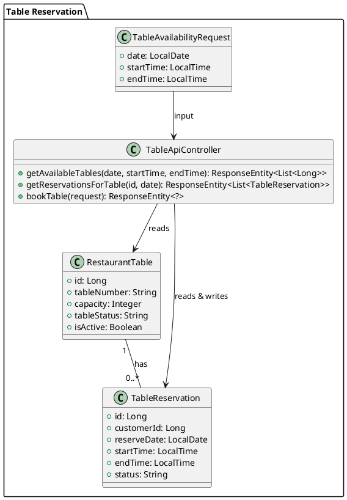
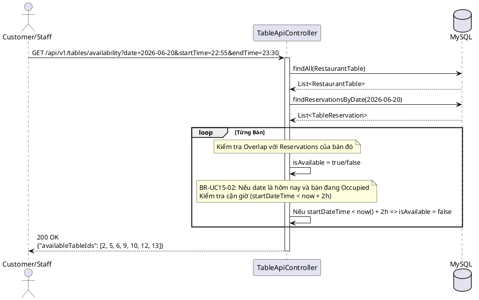

# ENGINEERING DOCUMENTATION STANDARD (EDS) v2.0

## UC-15: Reserve a Restaurant Table (Table Management) — Đặc tả Kỹ thuật & Hiện thực hóa

| Field                    | Value                                                                 |
| ------------------------ | --------------------------------------------------------------------- |
| **Document ID**    | `KAWAI-EDS-MOD3-UC15-001`                                           |
| **Version**        | 2.0                                                                   |
| **Date**           | 2026-06-20                                                            |
| **Status**         | Approved                                                              |
| **Document Owner** | Trịnh Minh Đức                                                     |
| **Author**         | Trịnh Minh Đức — Developer                                        |
| **Reviewed by**    | Nguyễn Xuân Lưu — Tech Lead                                      |
| **DPO Sign-off**   | `[x] Approved – 2026-06-20 – Trịnh Minh Đức`                   |
| **Approved by**    | `[x] Trịnh Minh Đức – 2026-06-20`                               |
| **Last Review**    | 2026-06-20                                                            |
| **Based on EDS**   | v2.0                                                                  |

---

### CHANGELOG

> [!IMPORTANT]
> **Policy 4.4 — Immutable History:** Không bao giờ xóa thông tin cũ. Mọi thay đổi phải ghi vào bảng này.

| Ngày       | Người thực hiện  | Nội dung thay đổi                                                                                                                                                                                       |
| ---------- | ----------------- | ---------------------------------------------------------------------------------------------------------------------------------------------------------------------------------------------------------- |
| 2026-06-20 | Antigravity Agent | Cập nhật chi tiết bảng usecase specification số 2.1.19 (Reserve a Restaurant Table) từ SRS vào chuẩn EDS v2.0. Bổ sung các Business Rule về thời gian (Overlap check) và Trạng thái vật lý (Physical Status). |
| 2026-06-15 | Trịnh Minh Đức | Tạo tài liệu lần đầu — Bản sơ khai.                                                                                                                                        |

---

### MỤC LỤC

1. [Tổng quan Module](#1-tong-quan-module)
2. [Ma trận Truy vết (Traceability Matrix)](#2-ma-tran-truy-vet-traceability-matrix)
3. [Architecture Decision Records (ADR)](#3-architecture-decision-records-adr)
4. [Non-Functional Requirements & SLA](#4-non-functional-requirements--sla)
5. [Static Modeling (Mô hình Tĩnh)](#5-static-modeling-mo-hinh-tinh)
6. [Dynamic Modeling (Mô hình Động)](#6-dynamic-modeling-mo-hinh-dong)
7. [Domain Event Catalog](#7-domain-event-catalog)
8. [Interface Specification (Đặc tả Giao diện)](#8-interface-specification-dac-ta-giao-dien)
9. [API Specification](#9-api-specification)
10. [Bảng mã lỗi (Error Codes)](#10-bang-ma-loi-error-codes)
11. [Quy trình Triển khai (Step-by-Step)](#11-quy-trinh-trien-khai-step-by-step)
12. [Rollback & Incident Runbook](#12-rollback--incident-runbook)
13. [Kịch bản Kiểm thử Chi tiết](#13-kich-ban-kiem-thu-chi-tiet)
14. [Phương pháp Xác minh](#14-phuong-phap-xac-minh)
15. [Mẫu thử thực tế (API Verification Samples)](#15-mau-thu-thuc-te-api-verification-samples)
16. [Bảng tổng hợp phân quyền (Authorization Matrix)](#16-bang-tong-hop-phan-quyen-authorization-matrix)
17. [Phụ lục](#17-phu-luc)

---

### 1. Tổng quan Module

Mô tả chức năng **Reserve a Restaurant Table (Table Management)**: Cho phép khách hàng hoặc nhân viên nhà hàng (F&B Staff) tiến hành đặt bàn ăn trước. Hệ thống quản lý danh sách bàn, trạng thái vật lý của bàn, kiểm tra tính khả dụng (chống trùng lịch) và hỗ trợ sơ đồ bàn trực quan trên POS.

| Field                           | Value                                                                              |
| ------------------------------- | ---------------------------------------------------------------------------------- |
| **Module Name**           | `Table Management — UC-15 (Reserve a Restaurant Table)`                             |
| **Parent Module**         | `MOD3 — Restaurant POS & F&B Operations`                                        |
| **Bounded Context**       | `POS & F&B`                                                                      |
| **Data Classification**   | Internal (Dữ liệu đặt bàn nội bộ)               |
| **Compliance Scope**      | Nội bộ                                                                           |
| **Upstream Dependencies** | `Account/Customer` — Nhận diện khách đặt bàn       |
| **Downstream Consumers**  | `Food Order` (Tạo đơn ăn tại bàn)              |
| **Primary Actor**         | Customer (Khách hàng), F&B Staff (Nhân viên nhà hàng)                                                   |
| **Secondary Actors**      | System                                                  |

**Phạm vi trách nhiệm của UC-15:**

- ✅ Cung cấp API kiểm tra tính khả dụng của bàn (isAvailable).
- ✅ Xử lý logic đặt bàn, chống trùng lịch đặt (Overlap Reservation).
- ✅ Kiểm tra trạng thái vật lý thực tế của bàn (`Occupied`, `Cleaning`) cho các đơn đặt cận giờ (dưới 2 tiếng).
- ✅ Quản lý trạng thái vật lý trên sơ đồ bàn (POS).

**Ngoài phạm vi UC-15:**

- ❌ Gọi món và thanh toán (Xử lý bởi UC-18, UC-19).

---

### 2. Ma trận Truy vết (Traceability Matrix)

Ánh xạ: `[Mã yêu cầu] → [Thành phần Code] → [Mục tiêu Tuân thủ]`

| Requirement ID | Loại (BR/ADR) | Mô tả yêu cầu                                                                                                         | Thành phần Code                                             | Compliance Target           | ADR liên quan |
| -------------- | -------------- | ------------------------------------------------------------------------------------------------------------------------- | ------------------------------------------------------------- | --------------------------- | -------------- |
| BR-UC15-01     | Business Rule  | Bàn không được phép bị đặt trùng lặp thời gian (Overlapping)                                     | `TableApiController.getAvailableTables()`      | SRS UC-2.1.19      | ADR-UC15-001   |
| BR-UC15-02     | Business Rule  | Đối với đặt bàn trong cùng ngày, nếu giờ đặt cách hiện tại < 2 tiếng, hệ thống phải kiểm tra trạng thái vật lý của bàn. Nếu đang `Occupied` hoặc `Cleaning`, báo bàn bận. | `TableApiController.getAvailableTables()` — Check Physical Status | SRS UC-2.1.19 / Thực tế vận hành                | ADR-UC15-002   |
| BR-UC15-03     | Business Rule  | Bàn giữ tối đa 30 phút sau giờ đặt. Nếu khách không đến, giải phóng bàn (Auto release)                                           | Background Task (TBD)                             | SRS BR-FB-03                | —             |
| BR-ATOMIC-01   | ADR            | Việc kiểm tra khả dụng và lưu đặt bàn (Booking) phải đồng bộ để tránh Race Condition                                          | `TableApiController.bookTable()` (Transaction)          | Data Integrity / ACID-like | ADR-UC15-003   |

---

### 3. Architecture Decision Records (ADR)

#### ADR-UC15-001 — Xử lý Check Trùng Lịch (Overlap Checking)

| Field              | Value             |
| ------------------ | ----------------- |
| **Status**   | Accepted          |
| **Deciders** | Trịnh Minh Đức |
| **Date**     | 2026-06-20        |

**Quyết định (Decision)**
Sử dụng logic query và filter bằng Java Streams thay vì viết một câu SQL khổng lồ để lọc. Lấy tất cả reservation của ngày đó lên, sau đó đối chiếu giờ (start/end) bằng `isBefore` và `isAfter` của java.time.LocalTime.

**Hệ quả (Consequences)**
- ✅ Code dễ đọc, dễ debug, dễ maintain.
- ⚠️ Cần đánh index cột `reserve_date` trong bảng `table_reservations` để query nhanh hơn khi dữ liệu lớn.

---

#### ADR-UC15-002 — Xử lý Time Wrap-around Bug bằng LocalDateTime

| Field              | Value      |
| ------------------ | ---------- |
| **Status**   | Accepted   |
| **Deciders** | Antigravity  |
| **Date**     | 2026-06-20 |

**Quyết định (Decision)**
Lúc đầu hệ thống sử dụng `LocalTime.now().plusHours(2)` để kiểm tra các đơn đặt cận giờ (BR-UC15-02). Tuy nhiên, nếu thời gian hiện tại là 22:50, cộng 2 tiếng sẽ ra 00:50, dẫn đến sai logic do 22:55 > 00:50. Giải pháp: Chuyển sang sử dụng `LocalDateTime.now().plusHours(2)` và ráp `reserveDate` với `startTime` thành `LocalDateTime` để so sánh chính xác qua các mốc nửa đêm.

---

### 4. Non-Functional Requirements & SLA

#### 4.1. Performance & Availability

| Category               | Requirement         | Target SLA | Measurement Method | Compliance Basis |
| ---------------------- | ------------------- | ---------- | ------------------ | ---------------- |
| **Latency**      | Availability API (p99)     | < 200ms    | k6 load test       | —               |
| **Availability** | Uptime (monthly)    | 99.9%      | Uptime monitor     | —               |

#### 4.2. Data Integrity & Retention

| Category              | Requirement                     | Target  | Verification Method                                | Compliance Basis |
| --------------------- | ------------------------------- | ------- | -------------------------------------------------- | ---------------- |
| **Consistency** | Ngăn chặn hoàn toàn Overbooking bàn          | 100%    | Integration Test (Multiple Threads)                            | SRS BR-FO-01        |

---

### 5. Static Modeling (Mô hình Tĩnh)

#### 5.1. Class Diagram (PlantUML)



#### 5.2. Data Structure (JPA Entities)

```java
@Entity
@Table(name = "restaurant_tables")
public class RestaurantTable {
    @Id @GeneratedValue
    private Long id;
    private String tableNumber; // "T01"
    private Integer capacity;
    private String tableStatus; // "Vacant" | "Occupied" | "Cleaning"
    private Boolean isActive;
}

@Entity
@Table(name = "table_reservations")
public class TableReservation {
    @Id @GeneratedValue
    private Long id;
    private Long customerId;
    
    @ManyToOne
    @JoinColumn(name = "table_id")
    private RestaurantTable table;
    
    private LocalDate reserveDate;
    private LocalTime startTime;
    private LocalTime endTime;
    private BigDecimal depositAmount;
    private String status; // "Pending" | "Confirmed" | "Cancelled"
}
```

---

### 6. Dynamic Modeling (Mô hình Động)

#### 6.1. Sequence Diagram — Check Availability



---

### 7. Domain Event Catalog

| Event Name             | Trigger                     | Publisher            | Subscriber(s)                   | Payload Schema          | Async? |
| ---------------------- | --------------------------- | -------------------- | ------------------------------- | ----------------------- | ------ |
| `TableReservedEvent` | Tạo reservation thành công     | `TableApiController` | `Notification Service`, `Folio`   | `TableReservedEvent` | Yes     |

---

### 8. Interface Specification (Đặc tả Giao diện)

#### 8.1. Controller Interface

```java
// @version 2.0
// @since UC-15 Reserve a Restaurant Table
@RestController
@RequestMapping("/api/v1/tables")
public class TableApiController {

    /**
     * Lấy danh sách ID các bàn trống theo giờ.
     * Áp dụng luật chống trùng lịch (Overlap check)
     * Áp dụng luật kiểm tra trạng thái vật lý cận giờ (Physical check < 2h)
     */
    @GetMapping("/availability")
    public ResponseEntity<?> getAvailableTables(...)

    /**
     * Lấy lịch trình đặt của 1 bàn cụ thể trong ngày (Dành cho POS hiển thị panel phải)
     */
    @GetMapping("/{id}/reservations")
    public ResponseEntity<?> getReservationsForTable(...)
}
```

---

### 9. API Specification

| Method | Path                | Auth Level     | Required Roles                | Rate Limit |
| ------ | ------------------- | -------------- | ----------------------------- | ---------- |
| GET    | `/api/v1/tables/availability` | Public / Auth  | GUEST, CUSTOMER, F&B_STAFF    | 60/min     |
| GET    | `/api/v1/tables/{id}/reservations` | Authenticated  | F&B_STAFF, ADMIN    | 60/min     |

---

### 10. Bảng mã lỗi (Error Codes)

| Code              | HTTP Status | Message (EN)                         | Message (VI)                                | Trigger Condition                                               |
| ----------------- | ----------- | ------------------------------------ | ------------------------------------------- | --------------------------------------------------------------- |
| `MOD3-UC15-001` | 400         | `Table is not available`                   | Bàn đã được đặt hoặc đang bận!                    | Bàn bị trùng lịch hoặc đang Occupied ở giờ hiện tại   |

---

### 11. Quy trình Triển khai (Step-by-Step)

- [x] Sửa logic LocalTime -> LocalDateTime để fix Time wrap-around bug.
- [x] Bổ sung logic hiển thị lịch của bàn vào POS (`table-management.html` & `js`).
- [x] Bổ sung viền tô đậm (box-shadow) để làm nổi bật bàn đang được chọn trên giao diện.
- [x] Loại bỏ giao diện "Phục vụ ngay" dư thừa trên POS.

---

### 12. Rollback & Incident Runbook

| Điều kiện                               | Ngưỡng              | Người quyết định |
| ----------------------------------------- | ---------------------- | --------------------- |
| **Race Condition gây Overbooking**       | > 1 vụ / ngày     | Tech Lead             |

**Rollback Procedure:** `git checkout tags/v[previous-stable]`

---

### 13. Kịch bản Kiểm thử Chi tiết

#### 13.1. Unit Tests

**TC-M3-UC15-001 — Trùng lịch (Overlap)**
- Scenario: Khách A đặt bàn số 4 lúc 18:00 - 20:00. Khách B tìm bàn trống lúc 19:00 - 21:00.
- Expected: Bàn số 4 KHÔNG xuất hiện trong danh sách `availableTableIds`.

**TC-M3-UC15-002 — Trạng thái vật lý cận giờ (Physical Check)**
- Scenario: Lúc 22:50 ngày 20/06, Bàn số 1 đang `Occupied`. Khách C tìm bàn trống lúc 22:55 - 23:30.
- Expected: Mặc dù Bàn số 1 không có Reservation nào lúc 22:55, nhưng do giờ tìm kiếm (22:55) nằm trong khoảng 2 tiếng từ hiện tại (22:50), và bàn đang Occupied, Bàn số 1 KHÔNG khả dụng.

**TC-M3-UC15-003 — Time Wrap-around Bug**
- Scenario: Cùng điều kiện TC-002, dùng LocalDateTime để kiểm tra qua 00:00 giờ.
- Expected: Logic không bị lỗi, bàn số 1 vẫn bị chặn chính xác.

---

### 14. Phương pháp Xác minh

Dùng SQL query để kiểm tra tính đúng đắn của dữ liệu Database sau khi thao tác:
```sql
SELECT id, table_id, reserve_date, start_time, end_time, status
FROM table_reservations
WHERE reserve_date = CURDATE();
```

---

### 15. Mẫu thử thực tế (API Verification Samples)

```bash
# Lọc bàn trống từ 22:55 đến 23:30 ngày 20/06/2026
curl "http://localhost:8080/api/v1/tables/availability?date=2026-06-20&startTime=22:55&endTime=23:30"
```

---

### 16. Bảng tổng hợp phân quyền (Authorization Matrix)

| Tác vụ / Endpoint                     | GUEST | CUSTOMER | F&B STAFF | RECEPTIONIST | ADMIN / MANAGER |
| --------------------------------------- | :---: | :------: | :-------: | :----------: | :-------------: |
| Tìm bàn trống (Availability)            |  ✅   |    ✅    |     ✅    |      ❌      |       ✅       |
| Đặt bàn (Book Table)                    |  ❌   |    ✅    |     ✅    |      ❌      |       ✅       |
| Xem lịch trình bàn (Reservations)       |  ❌   |    ❌    |     ✅    |      ❌      |       ✅       |

---

### 17. Phụ lục

#### 17.1 Thuật ngữ

| Thuật ngữ | Ý nghĩa |
|-----------|---------|
| **Physical Status** | Trạng thái thực tế ngoài đời của bàn (Occupied: đang có khách ngồi, Cleaning: nhân viên đang dọn dẹp, Vacant: trống). |
| **Overlap Reservation** | Hiện tượng hai hoặc nhiều lịch đặt bị giao thoa (chồng lấn) thời gian lên cùng một bàn. |