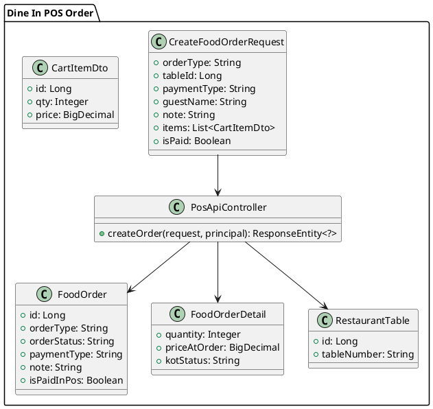
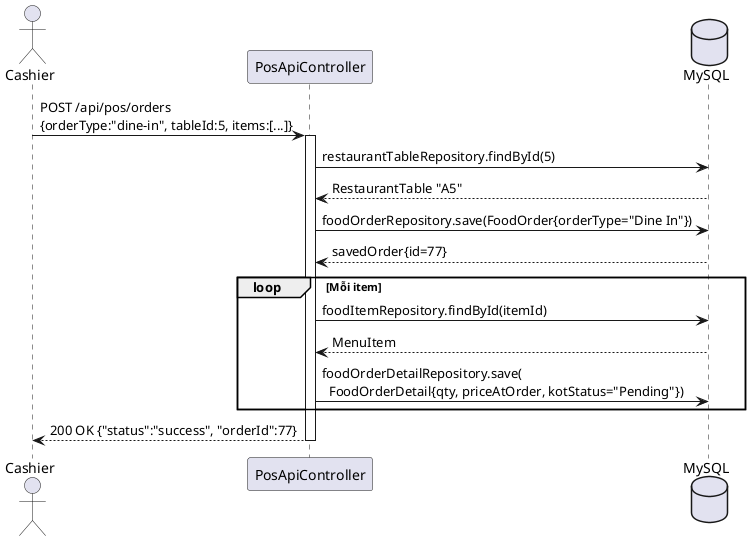

# ENGINEERING DOCUMENTATION STANDARD (EDS) v2.0

## UC-19: Create Dine-In Order (Gọi món tại bàn) — Đặc tả Kỹ thuật & Hiện thực hóa

| Field                    | Value                                                                 |
| ------------------------ | --------------------------------------------------------------------- |
| **Document ID**    | `KAWAI-EDS-MOD3-UC19-001`                                           |
| **Version**        | 2.0                                                                   |
| **Date**           | 2026-06-19                                                            |
| **Status**         | Approved                                                              |
| **Document Owner** | Trịnh Minh Đức                                                     |
| **Author**         | Trịnh Minh Đức — Developer                                        |
| **Reviewed by**    | Nguyễn Xuân Lưu — Tech Lead                                      |
| **DPO Sign-off**   | `[x] Approved – 2026-06-19 – Trịnh Minh Đức`                   |
| **Approved by**    | `[x] Trịnh Minh Đức – 2026-06-19`                               |
| **Last Review**    | 2026-06-19                                                            |
| **Based on EDS**   | v2.0                                                                  |

---

### CHANGELOG

> [!IMPORTANT]
> **Policy 4.4 — Immutable History:** Không bao giờ xóa thông tin cũ. Mọi thay đổi phải ghi vào bảng này.

| Ngày       | Người thực hiện  | Nội dung thay đổi                                                                                                                                                                                       |
| ---------- | ----------------- | ---------------------------------------------------------------------------------------------------------------------------------------------------------------------------------------------------------- |
| 2026-06-19 | Antigravity Agent | Đổi tên Use Case từ UC16 thành UC-19 (Create Dine-In Order) theo đúng SRS. Viết lại toàn bộ 17 sections theo chuẩn EDS v2.0. Bổ sung test case Unit + Integration bám sát Normal Flow, Alternative Flows, và Exceptions. |
| 2026-06-17 | Trịnh Minh Đức | Cập nhật cấu trúc API thực tế (`PosApiController`), cập nhật luồng tương tác Dine-In.                                                                                                              |
| 2026-06-15 | Trịnh Minh Đức | Tạo tài liệu lần đầu — Bản sơ khai theo chuẩn 17 sections.                                                                                                                                        |

---

### MỤC LỤC

1. [Tổng quan Module](#1-tong-quan-module)
2. [Ma trận Truy vết (Traceability Matrix)](#2-ma-tran-truy-vet-traceability-matrix)
3. [Architecture Decision Records (ADR)](#3-architecture-decision-records-adr)
4. [Non-Functional Requirements & SLA](#4-non-functional-requirements--sla)
5. [Static Modeling (Mô hình Tĩnh)](#5-static-modeling-mo-hinh-tinh)
6. [Dynamic Modeling (Mô hình Động)](#6-dynamic-modeling-mo-hinh-dong)
7. [Domain Event Catalog](#7-domain-event-catalog)
8. [Interface Specification (Đặc tả Giao diện)](#8-interface-specification-dac-ta-giao-dien)
9. [API Specification](#9-api-specification)
10. [Bảng mã lỗi (Error Codes)](#10-bang-ma-loi-error-codes)
11. [Quy trình Triển khai (Step-by-Step)](#11-quy-trinh-trien-khai-step-by-step)
12. [Rollback & Incident Runbook](#12-rollback--incident-runbook)
13. [Kịch bản Kiểm thử Chi tiết](#13-kich-ban-kiem-thu-chi-tiet)
14. [Phương pháp Xác minh](#14-phuong-phap-xac-minh)
15. [Mẫu thử thực tế (API Verification Samples)](#15-mau-thu-thuc-te-api-verification-samples)
16. [Bảng tổng hợp phân quyền (Authorization Matrix)](#16-bang-tong-hop-phan-quyen-authorization-matrix)
17. [Phụ lục](#17-phu-luc)

---

### 1. Tổng quan Module

Mô tả chức năng **Create Dine-In Order**: Cho phép thu ngân (Cashier) hoặc nhân viên phục vụ sử dụng hệ thống POS để lên đơn cho khách ăn tại chỗ (Dine-In) ở nhà hàng. Tính năng này ghi nhận bàn đang phục vụ, danh sách món ăn, và lưu lại giá tại thời điểm khách gọi (snapshot pricing).

| Field                           | Value                                                                              |
| ------------------------------- | ---------------------------------------------------------------------------------- |
| **Module Name**           | `Create Dine-In Order — UC-19`                                                   |
| **Parent Module**         | `MOD3 — Restaurant POS & F&B Operations`                                        |
| **Bounded Context**       | `POS & F&B`                                                                      |
| **Data Classification**   | Internal (Dữ liệu đơn hàng nội bộ, không chứa PII nhạy cảm)               |
| **Compliance Scope**      | Nội bộ                                                                           |
| **Upstream Dependencies** | `RestaurantTable` (để gán bàn), `MenuItem` (để lấy thông tin món)                |
| **Downstream Consumers**  | `KDS — Kitchen Display System (Bếp)`, `Folio (nếu trả chung)`                 |
| **Primary Actor**         | Cashier / F&B Staff                                                              |
| **Secondary Actors**      | System, Kitchen Staff                                                            |

**Phạm vi trách nhiệm của UC-19:**

- ✅ Tạo `FoodOrder` loại `Dine In`
- ✅ Gán đơn hàng vào `RestaurantTable`
- ✅ Hỗ trợ thanh toán ngay lập tức (`isPaid = true` → `PAID`)
- ✅ Chuyển KOT tới bếp với `kotStatus="Pending"`
- ✅ Ghi nhận special note (tên khách, lưu ý món ăn)

**Ngoài phạm vi UC-19:**

- ❌ Kiểm tra Hạn mức tín dụng / Charge to Room → (Thuộc UC-17 Room Service)
- ❌ Cập nhật trạng thái chuẩn bị món của bếp → KDS Module
- ❌ In hóa đơn, báo cáo doanh thu → Admin/Accounting

---

### 2. Ma trận Truy vết (Traceability Matrix)

| Requirement ID | Loại (BR/ADR) | Mô tả yêu cầu                                                                                                         | Thành phần Code                                             | Compliance Target           | ADR liên quan |
| -------------- | -------------- | ------------------------------------------------------------------------------------------------------------------------- | ------------------------------------------------------------- | --------------------------- | -------------- |
| BR-UC19-01     | Business Rule  | Bàn ăn phải tồn tại trong hệ thống mới được phép lên đơn                                                      | `PosApiController` — `restaurantTableRepository.findById`  | SRS UC-19 E1                | —             |
| BR-UC19-02     | Business Rule  | Mỗi dòng item phải tồn tại trong `menu_items` tại thời điểm đặt hàng                                           | `foodItemRepository.findById()`                             | SRS UC-19 E2                | —             |
| BR-UC19-03     | Business Rule  | Giá tại thời điểm đặt (`priceAtOrder`) là snapshot bất biến — không phụ thuộc vào giá MenuItem thay đổi sau | `FoodOrderDetail.setPriceAtOrder(itemDto.getPrice())`       | Tính toàn vẹn dữ liệu   | ADR-UC19-002   |
| BR-UC19-04     | Business Rule  | Thu ngân thanh toán ngay (`isPaid = true`) → orderStatus = `PAID`, `isPaidInPos = true`                     | `request.getIsPaid()` trong `PosApiController`              | Quy trình F&B               | —             |
| BR-UC19-05     | Business Rule  | Ghi chú đặc biệt của khách (Special Request) phải được đính kèm vào FoodOrder và gửi đến bếp             | `order.setNote(finalNote)`                                  | SRS UC-19 AF2               | —             |
| BR-ATOMIC-01   | ADR            | Toàn bộ việc tạo order + details là 1 luồng xử lý nhất quán                                                   | `PosApiController.createOrder()` — try/catch block          | Data Integrity / ACID-like | ADR-UC19-001   |

---

### 3. Architecture Decision Records (ADR)

#### ADR-UC19-001 — Xử lý Dine-In trong cùng endpoint với Room Service

| Field              | Value             |
| ------------------ | ----------------- |
| **Status**   | Accepted          |
| **Deciders** | Trịnh Minh Đức |
| **Date**     | 2026-06-17        |

**Quyết định (Decision)**
Dùng chung endpoint `POST /api/pos/orders` cho cả UC-17 và UC-19, phân biệt bằng trường `orderType`:
- `"room-svc"` → UC-17 Room Service (Xử lý `roomNumber` + `creditLimit`)
- Khác `"room-svc"` (ví dụ: `"dine-in"`) → UC-19 Dine-In (Xử lý `tableId`, bỏ qua `creditLimit`)

**Hệ quả (Consequences)**
- ✅ Giảm lượng code controller.
- ⚠️ Yêu cầu client truyền chính xác thông số để rẽ nhánh.

#### ADR-UC19-002 — Lưu giá snapshot (priceAtOrder) thay vì tham chiếu MenuItem

| Field              | Value      |
| ------------------ | ---------- |
| **Status**   | Accepted   |
| **Deciders** | Tech Lead  |

**Quyết định (Decision)**
Giá của `FoodOrderDetail` được lấy trực tiếp từ `CartItemDto` do frontend đẩy lên, để đảm bảo hóa đơn phản ánh giá tại chính xác thời điểm thực khách gọi món.

---

### 4. Non-Functional Requirements & SLA

#### 4.1. Performance & Availability

| Category               | Requirement         | Target SLA | Measurement Method |
| ---------------------- | ------------------- | ---------- | ------------------ |
| **Latency**      | Order API (p99)     | < 300ms    | k6 load test       |
| **Availability** | Uptime (monthly)    | 99.9%      | Uptime monitor     |

---

### 5. Static Modeling (Mô hình Tĩnh)

#### 5.1. Class Diagram (PlantUML)



#### 5.2. Data Structure (JPA Entities)

- **`food_orders`**: Lưu thông tin chung. `order_type` = 'Dine In'. `table_id` = khóa ngoại trỏ tới `restaurant_tables`.
- **`food_order_details`**: Lưu từng món. `kot_status` = 'Pending', `price_at_order` = giá snapshot.
- **`restaurant_tables`**: Danh sách bàn trong nhà hàng.

---

### 6. Dynamic Modeling (Mô hình Động)

#### 6.1. Sequence Diagram — Happy Path (PlantUML)



---

### 7. Domain Event Catalog

| Event Name             | Trigger                     | Publisher            | Subscriber(s)                   | Async? |
| ---------------------- | --------------------------- | -------------------- | ------------------------------- | ------ |
| `DineInOrderCreated` | Tạo order thành công     | `PosApiController` | `KDS (Kitchen System)`       | No     |
| `DineInOrderPaid`    | Đơn hàng thanh toán ngay | `PosApiController` | `Accounting / Folio`          | No     |

---

### 8. Interface Specification (Đặc tả Giao diện)

#### 8.1. Controller Interface

```java
// @version 1.0
// @since UC-19 Create Dine-In Order
@RestController
@RequestMapping("/api/pos")
public class PosApiController {

    /**
     * Tạo đơn hàng Dine-In.
     *
     * Luồng UC-19:
     * 1. Tìm table theo tableId → validate (BR-UC19-01)
     * 2. Lưu FoodOrder với orderType="Dine In"
     * 3. Lưu FoodOrderDetail với priceAtOrder (BR-UC19-03)
     * 4. Nếu isPaid=true → status = "PAID", isPaidInPos = true (BR-UC19-04)
     *
     * @param request chứa orderType="dine-in" và tableId
     */
    @PostMapping("/orders")
    public ResponseEntity<?> createOrder(
        @RequestBody CreateFoodOrderRequest request,
        Principal principal
    );
}
```

---

### 9. API Specification

#### 9.1. Endpoints

| Method | Path                | Auth Level     | Required Roles                | Rate Limit |
| ------ | ------------------- | -------------- | ----------------------------- | ---------- |
| POST   | `/api/pos/orders` | Authenticated  | F&B_STAFF, ADMIN, CASHIER     | 30/min     |

#### 9.2. Request Body — Dine-In

```json
{
  "orderType": "dine-in",
  "tableId": 5,
  "paymentType": "Pay_Later",
  "guestName": "Khách VIP",
  "note": "Ít cay",
  "isPaid": false,
  "items": [
    { "id": 10, "qty": 2, "price": 120000 },
    { "id": 11, "qty": 1, "price": 85000 }
  ]
}
```

---

### 10. Bảng mã lỗi (Error Codes)

| Code              | HTTP Status | Message (EN)                         | Message (VI)                                | Trigger Condition                                               |
| ----------------- | ----------- | ------------------------------------ | ------------------------------------------- | --------------------------------------------------------------- |
| `MOD3-UC19-001` | 400         | `Table not found`                  | Bàn ăn không tồn tại!                   | `restaurantTableRepository.findById()` trả rỗng              |
| `MOD3-UC19-002` | 400         | `Menu item not found`              | Món ăn không tồn tại!                  | `foodItemRepository.findById()` trả rỗng                     |
| `MOD3-UC19-003` | 500         | `Internal Server Error`            | Lỗi hệ thống khi tạo đơn hàng!      | RuntimeException                                                |

---

### 11. Quy trình Triển khai (Step-by-Step)

Đã implement tại `PosApiController.createOrder()`. Run test:
`.\mvnw test -Dtest=PosApiControllerUC19Test` (PASS 100%)

---

### 12. Rollback & Incident Runbook

| Điều kiện                               | Ngưỡng              | Người quyết định |
| ----------------------------------------- | ---------------------- | --------------------- |
| **Order tạo nhưng không in bếp (KOT)** | > 3 lỗi / giờ       | On-call Engineer      |
| **Lỗi 500 khi lên đơn Dine-In**       | > 5% trong 5 phút     | On-call Engineer      |

---

### 13. Kịch bản Kiểm thử Chi tiết

> [!IMPORTANT]
> Toàn bộ test cases đã được implement trong `PosApiControllerUC19Test.java`.

**TC-M3-006 — Happy Path: Tạo order Dine-In thành công**
- Gửi request `tableId=5`.
- Verify HTTP 200, DB lưu 1 FoodOrder, 2 FoodOrderDetail. KHÔNG gọi roomBookingRepository.

**TC-M3-006b — Verify giá snapshot (priceAtOrder)**
- Request món giá 120,000 VND.
- Verify `FoodOrderDetail.priceAtOrder` là 120,000 VND.

**TC-M3-006c — Dine-In với ghi chú đặc biệt**
- Gửi `guestName` và `note`.
- Verify `FoodOrder.note` có chứa cả hai thông tin này.

**TC-M3-006d — Thanh toán ngay tại POS (isPaid = true)**
- Gửi `isPaid=true`.
- Verify `orderStatus` là `PAID` và `isPaidInPos` là `true`.

**TC-M3-006e — Lỗi khi Bàn không tồn tại**
- Gửi `tableId=999` (bàn không có trong DB).
- Verify HTTP 400 Bad Request `"Bàn ăn không tồn tại!"`.

**TC-M3-006f — Lỗi khi Món ăn không tồn tại**
- Gửi món có `id` không tồn tại trong DB.
- Verify HTTP 400 Bad Request `"Món ăn không tồn tại!"`.

---

### 14. Phương pháp Xác minh

```sql
SELECT fo.id, fo.order_type, fo.order_status, rt.table_number
FROM food_orders fo
JOIN restaurant_tables rt ON fo.table_id = rt.id
WHERE fo.order_type = 'Dine In'
ORDER BY fo.id DESC LIMIT 10;
```

---

### 15. Mẫu thử thực tế (API Verification Samples)

```bash
# [POST] Đặt món Dine-In
curl -X POST http://localhost:8080/api/pos/orders \
  -H "Content-Type: application/json" \
  -d '{
    "orderType": "dine-in",
    "tableId": 5,
    "paymentType": "Pay_Later",
    "guestName": "Nguyễn Văn B",
    "note": "Không hành",
    "items": [{ "id": 10, "qty": 2, "price": 120000 }]
  }'
```

---

### 16. Bảng tổng hợp phân quyền (Authorization Matrix)

| Endpoint                          | GUEST | CUSTOMER | F&B STAFF / CASHIER | ADMIN |
| --------------------------------- | :---: | :------: | :-----------------: | :---: |
| `POST /api/pos/orders` (Dine-In) |  ❌  |    ❌    |         ✅          |   ✅  |

---

### 17. Phụ lục

#### A. Glossary (Thuật ngữ)
| Thuật ngữ               | Định nghĩa |
| ------------------------- | ---------- |
| **Dine-In**           | Dịch vụ khách ăn uống tại nhà hàng, gọi món tại bàn. |
| **Cashier**           | Thu ngân nhà hàng — người trực tiếp thao tác lên đơn. |
| **Snapshot Pricing**  | Lưu giá cố định lúc gọi món để không bị ảnh hưởng nếu menu đổi giá sau này. |

#### B. Tài liệu tham chiếu
| Document                                    | Link / Path |
| ------------------------------------------- | ----------- |
| TDD Spec UC-19 (Unit Tests)                 | `06-Testing/mod3_pos/uc16/TDD_uc16_SPEC.md` |
| JUnit Test File UC-19 (Dine-In)             | `05-Development/kawai-backend/src/test/.../PosApiControllerUC19Test.java` |

---
*EDS v2.0 — UC-19 Create Dine-In Order — MOD3 Restaurant POS & F&B Operations*