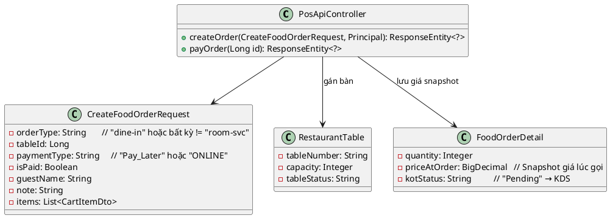
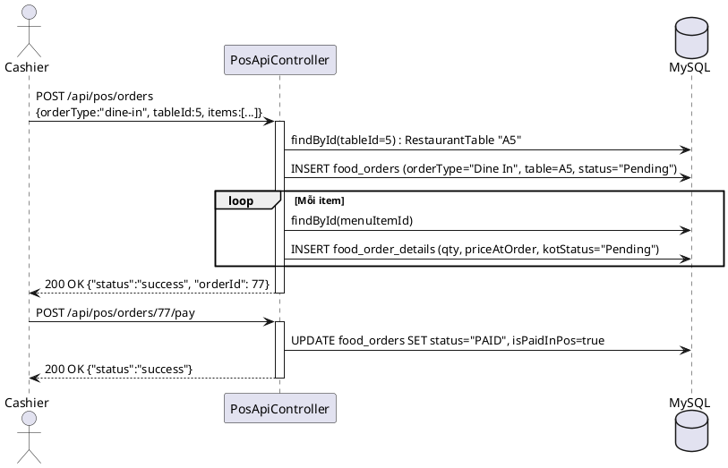

# ENGINEERING DOCUMENTATION STANDARD (EDS) v2.0

## UC16 (File) — Gọi món Dine-In tại quầy (POS Nhân viên lên đơn tại bàn)
*(Theo cấu trúc thư mục dự án: folder uc16/ chứa nội dung Dine-In POS)*

| Field | Value |
|-------|-------|
| **Document ID** | `KAWAI-EDS-MOD3-UC16-001` |
| **Version** | 2.0 |
| **Date** | 2026-06-17 |
| **Status** | Approved |
| **Document Owner** | Trịnh Minh Đức |
| **Author** | Trịnh Minh Đức — Developer |
| **Reviewed by** | Trịnh Minh Đức — Tech Lead |
| **DPO Sign-off** | `[x] Approved – 2026-06-17 – Trịnh Minh Đức` |
| **Approved by** | `[x] Trịnh Minh Đức – 2026-06-17` |
| **Last Review** | 2026-06-17 |
| **Based on EDS** | v2.0 |

---

### CHANGELOG
| Ngày | Người thực hiện | Nội dung thay đổi |
|------|-----------------|-------------------|
| 2026-06-17 | Trịnh Minh Đức | **v2.0** — Cập nhật API thực tế `PosApiController`, luồng Dine-In, mã TC-M3-005/006, test file `PosApiControllerUC17Test.java`. |
| 2026-06-15 | Trịnh Minh Đức | v1.0 — Khởi tạo theo chuẩn 17 sections |

---

### MỤC LỤC
1. [Tổng quan Module](#1)
2. [Ma trận Truy vết](#2)
3. [ADR](#3)
4. [Non-Functional & SLA](#4)
5. [Static Modeling](#5)
6. [Dynamic Modeling](#6)
7. [Domain Event Catalog](#7)
8. [Interface Specification](#8)
9. [API Specification](#9)
10. [Bảng mã lỗi](#10)
11. [Quy trình Triển khai](#11)
12. [Rollback & Incident Runbook](#12)
13. [Kịch bản Kiểm thử](#13)
14. [Phương pháp Xác minh](#14)
15. [Mẫu thử thực tế](#15)
16. [Authorization Matrix](#16)
17. [Phụ lục](#17)

---

### 1. Tổng quan Module

| Field | Value |
|-------|-------|
| **Module Name** | POS Dine-In Order |
| **Bounded Context** | POS & F&B |
| **Use Case** | Thu ngân (Cashier) mở POS, lên đơn gọi món Dine-In, ghi nhận bàn ăn, giá tại thời điểm gọi, ghi chú khách hàng. |
| **Data Classification** | Internal |
| **Compliance Scope** | Nội bộ |
| **Upstream Dependencies** | `RestaurantTable` (tableId), `MenuItem` (priceAtOrder) |
| **Downstream Consumers** | KDS Bếp (kotStatus), Folio (nếu CHARGE_TO_ROOM), Cashier POS |

---

### 2. Ma trận Truy vết

| Requirement ID | Loại | Mô tả | Thành phần Code | Compliance | ADR |
|----------------|------|-------|-----------------|------------|-----|
| UC16_REQ_01 | US | Thu ngân lên đơn Dine-In với bàn ăn, món ăn, giá đúng thời điểm. | `PosApiController.createOrder()` | — | ADR-001 |
| UC16_REQ_02 | US | Thanh toán ngay tại POS → `orderStatus = PAID`, `isPaidInPos = true`. | `PosApiController.payOrder()` | — | ADR-001 |
| UC16_REQ_03 | BR | Giá snapshot tại thời điểm gọi món (`priceAtOrder`) không phụ thuộc giá menu thay đổi sau. | `FoodOrderDetail.priceAtOrder` | — | ADR-002 |

---

### 3. Architecture Decision Records (ADR)

#### ADR-001 — Xử lý Dine-In trong cùng endpoint với Room Service

| Field | Value |
|-------|-------|
| **Status** | Accepted |
| **Deciders** | Trịnh Minh Đức |
| **Date** | 2026-06-17 |

**Bối cảnh:** Cả Room Service và Dine-In đều tạo `FoodOrder` — chỉ khác nhau `orderType` và các thông tin bổ sung (phòng vs bàn).  
**Quyết định:** Dùng chung endpoint `POST /api/pos/orders`, phân biệt bằng field `orderType`:  
- `"room-svc"` → Room Service (UC16 Master Table)  
- Bất kỳ giá trị khác → Dine-In (UC17 Master Table)  
**Hệ quả:** Controller đơn giản, nhưng cần tham số rõ ràng để tránh nhầm lẫn.

#### ADR-002 — Lưu giá snapshot (priceAtOrder) thay vì tham chiếu MenuItem

| Field | Value |
|-------|-------|
| **Status** | Accepted |

**Quyết định:** Khi lưu `FoodOrderDetail`, copy giá từ `CartItemDto.price` vào `priceAtOrder` — không đọc lại từ `MenuItem`.  
**Lý do:** Giá menu có thể thay đổi sau khi gọi món, cần đảm bảo hóa đơn phản ánh giá thực tế lúc gọi.

---

### 4. Non-Functional Requirements & SLA

#### 4.1. Performance & Availability

| Category | Requirement | Target SLA | Measurement |
|----------|-------------|------------|-------------|
| **Latency** | Response time (p99) | < 300ms | k6 load test |
| **Availability** | Uptime (monthly) | 99.9% | Uptime monitor |

---

### 5. Static Modeling

#### 5.1. Class Diagram



#### 5.2. Data Structure

```sql
-- Bảng: food_orders
-- order_type = 'Dine In', order_status = 'Pending' / 'PAID'
-- table_id FK → restaurant_tables

-- Bảng: food_order_details
-- price_at_order = Giá snapshot tại thời điểm gọi món
-- kot_status = 'Pending' → Bếp nhận đơn
```

---

### 6. Dynamic Modeling

#### 6.1. Sequence Diagram



---

### 7. Domain Event Catalog

| Event Name | Trigger | Publisher | Subscriber(s) | Async? |
|------------|---------|-----------|---------------|--------|
| `DineInOrderCreated` | Tạo order thành công | `PosApiController` | KDS (kotStatus=Pending) | No |
| `DineInOrderPaid` | Gọi `/pay` thành công | `PosApiController` | Folio, Accounting | No |

---

### 8. Interface Specification

```java
@RestController
@RequestMapping("/api/pos")
public class PosApiController {
    // UC16 (Dine-In): orderType != "room-svc", có tableId
    @PostMapping("/orders")
    public ResponseEntity<?> createOrder(
        @RequestBody CreateFoodOrderRequest request,
        Principal principal
    );

    // Thanh toán order tại POS
    @PostMapping("/orders/{id}/pay")
    public ResponseEntity<?> payOrder(@PathVariable Long id);
}
```

---

### 9. API Specification

| Method | Path | Auth | Roles | Rate Limit | Idempotent? |
|--------|------|------|-------|------------|-------------|
| POST | `/api/pos/orders` | `.permitAll()` | Cashier | 30/min | No |
| POST | `/api/pos/orders/{id}/pay` | `.permitAll()` | Cashier | 30/min | No |

**Request Body tạo Dine-In:**
```json
{
  "orderType": "dine-in",
  "tableId": 5,
  "paymentType": "Pay_Later",
  "guestName": "Nguyễn Văn A",
  "note": "Không nước mắm",
  "items": [
    { "id": 10, "qty": 2, "price": 120000 },
    { "id": 11, "qty": 3, "price": 85000 }
  ]
}
```

---

### 10. Bảng mã lỗi

| Code | HTTP | Message (EN) | Message (VI) | Trigger |
|------|------|--------------|--------------|---------|
| `POS-001` | 400 | Invalid Request | Yêu cầu không hợp lệ | Thiếu items hoặc tableId |
| `POS-002` | 404 | Order Not Found | Không tìm thấy đơn hàng | Gọi `/pay` với orderId sai |

---

### 11. Quy trình Triển khai

#### 11.1. Prerequisites
- [x] Bảng `food_orders`, `food_order_details`, `restaurant_tables` đã tồn tại.

#### 11.2. Deployment
```bash
mvn clean package -DskipTests
```

---

### 12. Rollback & Incident Runbook

| Điều kiện | Ngưỡng | Người quyết định |
|-----------|--------|-------------------|
| Order Dine-In không tạo được | > 5 lỗi / giờ | Thu ngân / Manager |

**Rollback:** `git checkout -- src/main/java/com/kawai/controllers/api/PosApiController.java`

---

### 13. Kịch bản Kiểm thử

#### 13.1. Unit Tests (4 test case — tất cả PASS)
- `TC-M3-005`: Tạo Dine-In thành công → HTTP 200, bàn gán đúng, 2 FoodOrderDetail được lưu.
- `TC-M3-006`: Thanh toán ngay tại POS → `orderStatus = PAID`, `isPaidInPos = true`.
- `TC-M3-006b`: `priceAtOrder` là snapshot giá lúc gọi món, `kotStatus = "Pending"`.
- `TC-M3-006c`: Ghi chú đặc biệt + tên khách được lưu vào `note`.

**Test File:** `PosApiControllerUC17Test.java`

---

### 14. Phương pháp Xác minh

```sql
SELECT id, order_type, order_status, is_paid_in_pos, table_id
FROM food_orders ORDER BY id DESC LIMIT 10;

SELECT id, food_order_id, price_at_order, quantity, kot_status
FROM food_order_details WHERE food_order_id = <orderId>;
```

---

### 15. Mẫu thử thực tế

```bash
# Tạo order Dine-In
curl -X POST http://localhost:8080/api/pos/orders \
  -H "Content-Type: application/json" \
  -d '{
    "orderType": "dine-in",
    "tableId": 5,
    "paymentType": "Pay_Later",
    "guestName": "Khách VIP",
    "items": [{"id": 10, "qty": 2, "price": 120000}]
  }'

# Thanh toán order
curl -X POST http://localhost:8080/api/pos/orders/77/pay
```

---

### 16. Authorization Matrix

| Endpoint | GUEST | CUSTOMER | CASHIER | ADMIN |
|----------|:-----:|:--------:|:-------:|:-----:|
| `POST /api/pos/orders` (dine-in) | ❌ | ❌ | ✔️ | ✔️ |
| `POST /api/pos/orders/{id}/pay` | ❌ | ❌ | ✔️ | ✔️ |

*(Về mặt kỹ thuật API dùng `.permitAll()`, nhưng về nghiệp vụ chỉ Cashier mới có quyền.)*

---

### 17. Phụ lục

#### A. Glossary
| Thuật ngữ | Định nghĩa |
|-----------|------------|
| **KOT** | Kitchen Order Ticket — vé gọi món bếp nhận |
| **priceAtOrder** | Giá snapshot tại thời điểm gọi món, không thay đổi dù menu cập nhật sau |
| **Dine-In** | Khách ngồi tại bàn nhà hàng, thu ngân lên đơn trực tiếp |

#### B. Tài liệu tham chiếu
| Document | Path |
|----------|------|
| TDD UC16 (Dine-In) | `06-Testing/mod3_pos/uc16/TDD_uc16_SPEC.md` |
| Test File | `src/test/java/com/kawai/controllers/api/PosApiControllerUC17Test.java` |

---

*EDS v2.0*