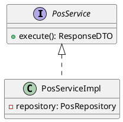
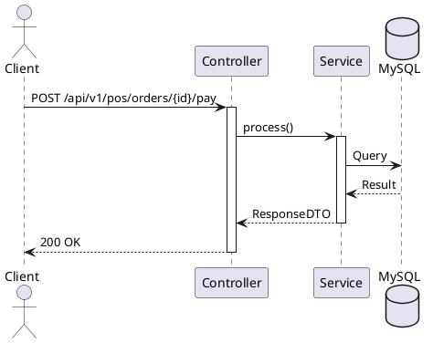

# ENGINEERING DOCUMENTATION STANDARD (EDS) v2.0

## UC16 — POS Dine-In & Payment

| Field | Value |
|-------|-------|
| **Document ID** | `KAWAI-EDS-MOD3-UC16-001` |
| **Version** | 1.0 |
| **Date** | 2026-06-15 |
| **Status** | Approved |
| **Document Owner** | Trịnh Minh Đức |
| **Author** | Trịnh Minh Đức — Developer |
| **Reviewed by** | Trịnh Minh Đức — Tech Lead |
| **DPO Sign-off** | `[x] Approved – 2026-06-15 – Trịnh Minh Đức` |
| **Approved by** | `[x] Trịnh Minh Đức – 2026-06-15` |
| **Last Review** | 2026-06-15 |
| **Based on EDS** | v2.0 |

---

### CHANGELOG
| Ngày | Người thực hiện | Nội dung thay đổi |
|------|-----------------|-------------------|
| 2026-06-15 | Trịnh Minh Đức | Cập nhật tài liệu theo chuẩn 17 sections |

---

### MỤC LỤC
1. [Tổng quan Module](#1)
2. [Ma trận Truy vết](#2)
3. [ADR](#3)
4. [Non-Functional & SLA](#4)
5. [Static Modeling](#5)
6. [Dynamic Modeling](#6)
7. [Domain Event Catalog](#7)
8. [Interface Specification](#8)
9. [API Specification](#9)
10. [Bảng mã lỗi](#10)
11. [Quy trình Triển khai](#11)
12. [Rollback & Incident Runbook](#12)
13. [Kịch bản Kiểm thử](#13)
14. [Phương pháp Xác minh](#14)
15. [Mẫu thử thực tế](#15)
16. [Authorization Matrix](#16)
17. [Phụ lục](#17)

---

### 1. Tổng quan Module

| Field | Value |
|-------|-------|
| **Module Name** | POS & Thanh toán |
| **Bounded Context** | POS & F&B |
| **Use Case** | Tạo order Dine-In, thanh toán tiền mặt tại POS. |
| **Data Classification** | Internal |
| **Compliance Scope** | Nội bộ |
| **Upstream Dependencies** | — |
| **Downstream Consumers** | Folio, Inventory |

---

### 2. Ma trận Truy vết

| Requirement ID | Loại | Mô tả | Thành phần Code | Compliance | ADR |
|----------------|------|-------|-----------------|------------|-----|
| UC16_REQ_01 | US | Tạo order Dine-In, thanh toán tiền mặt tại POS. | `PosService` | — | ADR-001 |

---

### 3. Architecture Decision Records (ADR)

#### ADR-001 — Cơ chế xử lý POS & Thanh toán

| Field | Value |
|-------|-------|
| **Status** | Accepted |
| **Deciders** | Trịnh Minh Đức |
| **Date** | 2026-06-15 |

**Bối cảnh:** Cần xử lý logic cho POS & Thanh toán một cách hiệu quả và dễ mở rộng.
**Quyết định:** Sử dụng Event-driven architecture cho các tác vụ bất đồng bộ.
**Hệ quả:** Hệ thống dễ scale nhưng phức tạp trong việc tracking luồng xử lý.

---

### 4. Non-Functional Requirements & SLA

#### 4.1. Performance & Availability

| Category | Requirement | Target SLA | Measurement |
|----------|-------------|------------|-------------|
| **Latency** | Response time (p99) | < 300ms | k6 load test |
| **Availability** | Uptime (monthly) | 99.9% | Uptime monitor |

---

### 5. Static Modeling

#### 5.1. Class Diagram



#### 5.2. Data Structure

```sql
-- Dữ liệu mẫu cho pos_order, pos_order_item, payment_transaction
```

---

### 6. Dynamic Modeling

#### 6.1. Sequence Diagram



---

### 7. Domain Event Catalog

| Event Name | Trigger | Publisher | Subscriber(s) | Async? |
|------------|---------|-----------|---------------|--------|
| `OrderCreated, OrderPaid` | Hoàn tất tác vụ | `PosService` | `FolioService`, `AuditService` | Yes |

---

### 8. Interface Specification

```java
public interface PosService {
    ResponseDTO processRequest(RequestDTO req);
}
```

---

### 9. API Specification

| Method | Path | Auth | Roles | Rate Limit | Idempotent? |
|--------|------|------|-------|------------|-------------|
| POST/GET | `/api/v1/pos/orders, /api/v1/pos/orders/{id}/pay` | JWT | All | 30/min | No |

---

### 10. Bảng mã lỗi

| Code | HTTP | Message (EN) | Message (VI) | Trigger |
|------|------|--------------|--------------|---------|
| `POS-001` | 400 | Invalid Request | Yêu cầu không hợp lệ | Tham số sai |
| `POS-003` | 400 | Credit Limit Exceeded | Vượt hạn mức nợ | Vượt mức credit |

---

### 11. Quy trình Triển khai

#### 11.1. Prerequisites
- [x] Database tables đã được tạo (`pos_order, pos_order_item, payment_transaction`)

#### 11.2. Deployment
```bash
mvn clean package -DskipTests
```

---

### 12. Rollback & Incident Runbook

| Điều kiện | Ngưỡng | Người quyết định |
|-----------|--------|-------------------|
| Lỗi API liên tục | > 10% trong 5 phút | On-call Engineer |

**Rollback:** `git checkout tags/v1.0.0`

---

### 13. Kịch bản Kiểm thử

#### 13.1. Unit Tests
- TC-UC16-001: POS tạo order Dine-In — ghi đúng bàn, đúng món, đúng giá
- TC-UC16-002: POS thanh toán tiền mặt — đơn hàng chuyển PAID

---

### 14. Phương pháp Xác minh

```sql
SELECT * FROM pos_order ORDER BY id DESC LIMIT 10;
```

---

### 15. Mẫu thử thực tế

```bash
curl -X POST https://api.kawairesort.com/api/v1/pos/orders \
  -H "Authorization: Bearer [JWT]" \
  -H "Content-Type: application/json" \
  -d '{}'
```

---

### 16. Authorization Matrix

| Endpoint | GUEST | CUSTOMER | RECEPTIONIST | ADMIN |
|----------|:-----:|:--------:|:------------:|:-----:|
| `/api/v1/pos/orders` | ✔️ | ✔️ | ✔️ | ✔️ |

---

### 17. Phụ lục

#### A. Glossary
| Thuật ngữ | Định nghĩa |
|-----------|------------|
| **KOT** | Kitchen Order Ticket |
| **Folio** | Hồ sơ thanh toán của phòng |

#### B. Tài liệu tham chiếu
| Document | Path |
|----------|------|
| TDD UC16 | `06-Testing/mod3_pos/uc16/TDD_uc16_SPEC.md` |

---

*EDS v2.0*