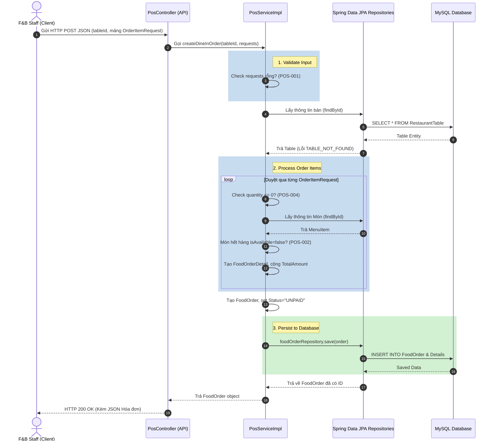

# Báo cáo Phân tích Luồng hoạt động UC16: Gọi món tại quầy (Dine-In)

Tài liệu này giải thích chi tiết luồng xử lý của UC16 (Nhân viên POS lên đơn tại bàn) trong mã nguồn hiện tại của dự án Kawai Resort & Tour Hub, kèm theo các đoạn code thực tế ở từng bước để bạn dễ dàng theo dõi mà không cần mở file code gốc.

---

## Danh sách các file được tạo mới hoặc chỉnh sửa

Trong quá trình giải quyết UC16, chúng ta đã can thiệp vào các tệp tin sau trong dự án:

### Code Nghiệp vụ (Production Code)
1. **[NEW]** `com/kawai/dto/OrderItemRequest.java`: Tạo mới DTO để hứng dữ liệu từ client.
2. **[MODIFY]** `com/kawai/services/interfaces/PosService.java`: Chỉnh sửa Interface, cập nhật tham số hàm gọi món.
3. **[MODIFY]** `com/kawai/services/impl/PosServiceImpl.java`: Cập nhật logic xử lý tính toán và validate.

### Code Kiểm thử (Test Code)
4. **[MODIFY]** `src/test/java/com/kawai/services/PosServiceUC16Test.java`: Bổ sung toàn bộ Test Case (Happy Path & Exception).

### Tài liệu kỹ thuật (Documentation)
5. **[NEW]** `04_testing/mod3_pos/EDS_MOD3_UC16.md`: Đặc tả hệ thống (EDS) cho UC16.
6. **[NEW]** `04_testing/mod3_pos/TDD_MOD3_UC16.md`: Đặc tả TDD nội bộ UC16.
7. **[MODIFY]** `04_testing/MASTER_TDD_SPEC.md`: Cập nhật tiến độ tổng lên bảng MASTER.

---

## 1. Phía Frontend: Giao diện và Xử lý Giỏ hàng Dine-In (Javascript)
> **Files liên quan:**
> - JS: `03_sourcecode/kawai-backend/src/main/resources/static/f&bStaff/js/create-food-order.js`

### Bước 1.1: Chọn hình thức Dine-In (Tại bàn)
Khi nhân viên bấm nút chọn "Dine-In" trên màn hình POS, hệ thống sẽ ẩn các trường nhập số phòng (của Room Service) và thay bằng các trường chọn Bàn ăn (Table), đồng thời đổi phần Thanh toán thành tùy chọn "Tại quầy".

```javascript
// File: static/f&bStaff/js/create-food-order.js (Dòng 36 - 70)

typeBtns.forEach(btn => {
  btn.addEventListener('click', () => {
    typeBtns.forEach(b => b.classList.remove('active'));
    btn.classList.add('active');
    
    // Gán biến trạng thái thành dine-in
    state.orderType = btn.dataset.type;

    if (state.orderType === 'dine-in') {
      // Hiển thị phần chọn bàn, ẩn phần nhập phòng
      dineInFields.style.display = 'grid';
      roomSvcFields.style.display = 'none';
      
      // Đổi giao diện lựa chọn thanh toán dành cho khách ăn tại quầy
      paymentSection.innerHTML = `
        <label class="form-label">Thanh toán</label>
        <select class="form-control">
          <option>Thanh toán tại quầy</option>
          <option>Xác nhận thanh toán sau</option>
        </select>
      `;
    } else {
      // (Nhánh của UC14 Room Service bị ẩn bớt)
    }
    validateCheckout(); // Kiểm tra điều kiện bật nút "Gửi Bếp"
  });
});
```
**Giải thích:** Việc toggle logic ở Frontend rất quan trọng. Khi chọn `dine-in`, các điều kiện validate cũng sẽ thay đổi. Javascript không còn bắt buộc phải có `roomOccupied` hay `roomLimit` nữa.

### Bước 1.2: Gửi đơn hàng (Gửi xuống Bếp - KOT)
Sau khi khách gọi món xong, nhân viên bấm Gửi xuống Bếp. Javascript đóng gói DTO và gọi API POST.

```javascript
// File: static/f&bStaff/js/create-food-order.js (Dòng 298 - 334)

window.sendToKitchen = function() {
  // 1. Đóng gói Payload theo cấu trúc DTO ở Backend
  const payload = {
    orderType: state.orderType, // Sẽ là "dine-in"
    roomNumber: state.orderType === 'room-svc' ? roomInput.value.trim().toUpperCase() : null,
    
    // 2. Với Dine-In, lấy giá trị ID bàn ăn đang chọn (tableSelect)
    tableId: state.orderType === 'dine-in' ? tableSelect.value : null,
    paymentType: 'Pay_Later', 
    
    // 3. Map giỏ hàng hiện tại thành list các món
    items: Object.values(state.cart).map(item => ({
      id: item.id,
      qty: item.qty,
      price: item.price
    }))
  };

  btnSendKitchen.disabled = true;
  btnSendKitchen.textContent = 'Đang xử lý...';

  // 4. Gửi JSON lên API
  fetch('/api/pos/orders', {
    method: 'POST',
    headers: { 'Content-Type': 'application/json' },
    body: JSON.stringify(payload)
  })
  .then(res => {
    if (!res.ok) throw new Error('API Error');
    return res.json();
  })
  .then(data => {
    alert("Đã sinh Kitchen Order Ticket (KOT) và chuyển xuống bếp!");
    window.location.href = "/fbStaff/dashboard";
  })
  // ... (catch error)
}
```

---

## 2. Phía Backend: Xử lý và Lưu Database (Java Spring Boot)

Hiện tại, việc tạo đơn Dine-In (UC16) đang được phát triển theo mô hình TDD. Bạn đang có 2 luồng xử lý tồn tại song song: 
1. **Controller cũ** (Gọi trực tiếp DB).
2. **Service mới viết** (`PosServiceImpl`). 

Dưới đây tôi liệt kê đoạn code của **Service mới (`PosServiceImpl`)** - nơi chứa logic nghiệp vụ chuẩn mực mà bạn vừa viết.

### Bước 2.1: Hàm tạo đơn hàng Dine-In (Trong `PosServiceImpl`)

```java
// File: src/main/java/com/kawai/services/impl/PosServiceImpl.java

@Override
public FoodOrder createDineInOrder(Long tableId, List<OrderItemRequest> requests) {
    // 1. Validate: Kiểm tra đơn hàng có món nào không
    if (requests == null || requests.isEmpty()) {
        throw new BusinessException("POS-001", "Đơn hàng trống — không có món");
    }

    // 2. Truy vấn Bàn ăn (Table) từ DB. Hàm helper throw Exception nếu không thấy.
    RestaurantTable table = getRestaurantTable(tableId);

    // 3. Khởi tạo Master Đơn Hàng (FoodOrder)
    FoodOrder order = new FoodOrder();
    order.setTable(table); // Khác UC14 (liên kết với Room), UC16 liên kết với Table!
    order.setOrderType("DINE_IN");
    order.setOrderStatus("UNPAID");
    order.setIsPaidInPos(false); // Chưa tính tiền

    // 4. Sinh các Chi tiết Đơn hàng (FoodOrderDetail) có bao gồm số lượng
    List<FoodOrderDetail> details = createOrderDetails(order, requests);
    order.setDetails(details);

    // 5. Lưu xuống DB
    return foodOrderRepository.save(order);
}
```
**Giải thích:** 
- Hàm được viết theo chuẩn Clean Code, tách nhỏ logic. Trạng thái khởi tạo là `UNPAID`.
- Sử dụng danh sách `OrderItemRequest` thay vì chỉ ID món ăn, giúp hệ thống lấy được đúng `quantity` (số lượng) do người dùng chọn trên giao diện.

### Bước 2.2: Hàm sinh Chi tiết Đơn Hàng & KOT

```java
// File: src/main/java/com/kawai/services/impl/PosServiceImpl.java

private List<FoodOrderDetail> createOrderDetails(FoodOrder order, List<OrderItemRequest> requests) {
    List<FoodOrderDetail> details = new ArrayList<>();
    
    // Duyệt qua từng request món ăn mà Frontend gửi lên
    for (OrderItemRequest req : requests) {
        
        // Validate số lượng
        if (req.getQuantity() == null || req.getQuantity() <= 0) {
            throw new BusinessException("POS-004", "Số lượng món phải lớn hơn 0");
        }
        
        // Truy vấn món ăn & Validate xem món có bị Hết (out of stock) không
        MenuItem item = getAvailableMenuItem(req.getMenuItemId());

        FoodOrderDetail detail = new FoodOrderDetail();
        detail.setFoodOrder(order); // Map với đơn master
        detail.setMenuItem(item);
        
        // Gán số lượng thực tế khách đặt
        detail.setQuantity(req.getQuantity()); 
        
        // Chốt cứng giá trị món ăn tại thời điểm khách đặt
        detail.setPriceAtOrder(item.getPrice());
        
        // Đặt trạng thái in vé bếp (KOT)
        detail.setKotStatus("Pending");
        
        details.add(detail);
    }
    return details;
}
```
**Giải thích:** 
- Đoạn code `getAvailableMenuItem` sẽ tự động chặn (throw Exception `POS-002`) nếu món đã hết hạn.
- Ở bản tối ưu này, hệ thống kiểm tra chặt chẽ `POS-004` để chặn các đơn hàng có số lượng <= 0, và áp dụng linh hoạt tham số `req.getQuantity()` vào DB.

### Bước 2.3: Hàm Thanh Toán Đơn (Tại quầy POS)
Đối với UC16, khách ăn xong thường sẽ ra quầy thanh toán (không nợ về phòng). Chức năng này được xử lý bằng hàm `payOrder`:

```java
// File: src/main/java/com/kawai/services/impl/PosServiceImpl.java (Dòng 166 - 177)

@Override
public FoodOrder payOrder(Long orderId, String paymentMethod) {
    // Tìm hóa đơn
    FoodOrder order = foodOrderRepository.findById(orderId)
            .orElseThrow(() -> new BusinessException("ORDER_NOT_FOUND", "Hóa đơn không tồn tại"));

    // Đổi trạng thái thành Đã Thanh Toán
    order.setOrderStatus("PAID");
    order.setPaymentType(paymentMethod); // VD: "CASH", "CREDIT_CARD", "VNPAY"
    order.setIsPaidInPos(true);

    return foodOrderRepository.save(order);
}
```
**Giải thích:** Hàm thanh toán khá đơn giản, nhiệm vụ của nó là đổi cờ `isPaidInPos` thành `true` để chốt sổ, không liên quan đến hệ thống Folio kiểm toán đêm nữa.

---

## 3. Tóm tắt Tổng quát Luồng hoạt động của UC16

Bức tranh tổng quát về luồng hoạt động của **UC16**, đi qua từng bước, file và hàm được thực thi từ đầu đến cuối:

### 3.1. Mở giao diện tạo đơn
- **File:** `PosController.java`
- **Hàm:** `createFoodOrder()`
- **Hành động:** Trả về giao diện HTML (`create-food-order.html`). Giao diện này dùng chung với Room Service nhưng mặc định hiển thị chế độ Dine-In.

### 3.2. Chọn Bàn và Cập nhật Giao diện
- **File:** `create-food-order.js` (Frontend)
- **Hàm:** Sự kiện click trên các nút `typeBtns`
- **Hành động:** Gán biến `state.orderType = 'dine-in'`. JS sẽ ẩn phần nhập thông tin phòng, hiển thị danh sách thả xuống (Dropdown) để nhân viên chọn Bàn nhà hàng (`tableSelect`). Đồng thời hiển thị tùy chọn Thanh toán tại quầy.

### 3.3. Thêm món vào Giỏ hàng & Kiểm tra (Validate)
- **File:** `create-food-order.js`
- **Hàm:** `changeQty()`, `renderCart()`, và `validateCheckout()`
- **Hành động:** Mỗi lần bấm chọn món, giỏ hàng (`state.cart`) được cập nhật. Đối với UC16, hàm `validateCheckout()` chạy rất đơn giản: chỉ cần có món trong giỏ hàng (không cần kiểm tra hạn mức tiền hay khách ở phòng như UC14) là nút "Gửi xuống Bếp" sẽ sáng lên.

### 3.4. Bấm nút "Gửi xuống Bếp (KOT)"
- **File:** `create-food-order.js`
- **Hàm:** `sendToKitchen()`
- **Hành động:** Đóng gói dữ liệu thành chuỗi JSON bao gồm: loại đơn (`orderType: "dine-in"`), ID của Bàn (`tableId`), và danh sách các món ăn. Sau đó gọi API `POST /api/pos/orders` để đẩy về Server.

### 3.5. Backend tiếp nhận và Lưu Hóa đơn (Master)
*(Đoạn này đang trong quá trình chuyển dịch TDD từ `PosApiController` sang `PosServiceImpl`)*
- **File:** `PosServiceImpl.java`
- **Hàm:** `createDineInOrder(Long tableId, List<Long> menuItemIds)`
- **Hành động:** 
  - Khởi tạo đối tượng `FoodOrder`.
  - Tìm Bàn (`RestaurantTable`) theo `tableId` và gán (liên kết) Bàn đó vào đơn hàng.
  - Gán trạng thái đơn hàng là `"UNPAID"` (Chưa thanh toán) và `"Pending"` (Chưa nấu xong).
  - Gọi `FoodOrderRepository.save()` để lưu hóa đơn tổng xuống DB.

### 3.6. Ghi nhận Chi tiết món và gửi xuống Bếp
- **File:** `PosServiceImpl.java`
- **Hàm:** `createOrderDetails()`
- **Hành động:** 
  - Chạy vòng lặp qua các món ăn: Dùng `FoodItemRepository` tìm món, đảm bảo món không bị hết (nếu hết văng lỗi).
  - Tạo `FoodOrderDetail` để chốt giá tiền tại thời điểm đặt, gán số lượng (Qty).
  - Đặt trạng thái in vé bếp (KOT) là `"Pending"`.
  - Lưu từng chi tiết món xuống DB.

### 3.7. Thanh toán tại quầy (Xử lý chốt Bill)
- **File:** `PosServiceImpl.java`
- **Hàm:** `payOrder(Long orderId, String paymentMethod)`
- **Hành động:** Khi khách ăn xong và ra quầy thanh toán, nhân viên POS bấm thanh toán. Hàm này sẽ tìm đơn hàng, đổi trạng thái sang `"PAID"`, cập nhật loại hình thanh toán (CASH/CARD/VNPAY) và đổi cờ `isPaidInPos = true`. Chốt doanh thu.

---

## 4. Tóm tắt Kiến trúc Tương tác (File -> File)

Để hình dung kiến trúc phân tầng (Layered Architecture) trong dự án, dưới đây là luồng tương tác của **UC16 (Tạo đơn Dine-In)** theo kiểu **"File nào nhận gì -> Xử lý -> Truyền đi đâu"**:

### Tầng 1: Giao Diện (Frontend)
**File: `create-food-order.js`**
- **Nhận gì:** Các cú click chuột của nhân viên (VD: Chọn Bàn số 1, Bấm dấu `+` chọn 2 ly Sinh tố...).
- **Xử lý:** Gom các tương tác đó lại, đóng gói thành một cục dữ liệu JSON (Payload) chứa: `tableId`, danh sách `items`, hình thức thanh toán.
- **Chuyển cho:** Bắn qua mạng Internet bằng lệnh `fetch()` đến đường dẫn URL `/api/pos/orders` của hệ thống.

### Tầng 2: Điều Khiển API (Controller)
**File: `PosApiController.java`**
- **Nhận gì:** Nhận cục JSON từ file JS ném sang. Spring Boot sẽ tự động "dịch" cục JSON này thành đối tượng Java `CreateFoodOrderRequest`.
- **Xử lý:** Đóng vai trò là "Lễ tân", bóc Request ra xem thử: *"À, khách đặt loại Dine-In (ăn tại quầy), Bàn số 1, gồm 2 món"*. 
- **Chuyển cho:** Lễ tân không tự đi nấu ăn, nó bốc máy gọi cho "Nhà bếp" (Tầng Service) bằng cách gọi hàm `posService.createDineInOrder(tableId, danhSachMonAn)`.

### Tầng 3: Nghiệp Vụ Lõi (Service)
**File: `PosServiceImpl.java`**
- **Nhận gì:** Nhận 2 tham số là `tableId` và `List<OrderItemRequest>` (chứa ID món và Số lượng) từ Controller truyền xuống.
- **Xử lý:** Đóng vai trò là "Bếp trưởng" kiểm tra các luật lệ kinh doanh (Business Rules):
  - *Bàn số 1 có thật không?* (Nếu không, ném lỗi `TABLE_NOT_FOUND`).
  - *Số lượng đặt có hợp lý không?* (Nếu <= 0, ném lỗi `POS-004`).
  - *Sinh tố có còn hàng không?* (Nếu hết, ném lỗi `POS-002`).
  - Nếu hợp lệ, nó tạo ra hóa đơn tổng (`FoodOrder`) và các dòng chi tiết (`FoodOrderDetail`).
- **Chuyển cho:** Khi món ăn đã được kiểm tra và chuẩn bị xong trên RAM bộ nhớ, Service ném xuống cho kho chứa (Repository) lưu lại.

### Tầng 4: Tương Tác Cơ Sở Dữ Liệu (Repository)
**File: `FoodOrderRepository.java`** (và các Repository khác)
- **Nhận gì:** Nhận đối tượng Java `FoodOrder` đã được tính toán đầy đủ từ Service.
- **Xử lý:** Dịch đối tượng Java đó thành câu lệnh `INSERT INTO ...` của SQL.
- **Chuyển cho:** Bắn câu lệnh SQL xuống **MySQL** để lưu cứng vào đĩa. Sau khi MySQL lưu xong và sinh ra ID tự tăng (VD: ID = 10), chuỗi trả về sẽ đi ngược lên trên: `Repository -> Service -> Controller -> JS (Frontend)`. Cuối cùng frontend hiện chữ `alert("Tạo đơn thành công")`!

---

## 5. Luồng tương tác tổng quan giữa các tầng (Data Flow)

Dưới đây là sơ đồ luồng đi của dữ liệu (Sequence Diagram) từ khi Nhân viên F&B bấm gửi Order cho đến khi Hóa đơn được lưu trữ.

> [!NOTE]
> Mô hình kiến trúc của dự án áp dụng mô hình N-Layer Standard của Spring Boot: **Client ➡️ Controller ➡️ Service ➡️ Repository ➡️ Database**.



**Tóm tắt vai trò các tầng:**
1. **Client / KDS (Tầng giao diện)**: Tương tác với người dùng, gom dữ liệu (ID bàn, mã món, số lượng) đóng gói thành chuỗi JSON.
2. **Controller (Tầng giao tiếp)**: Phân giải chuỗi JSON của Client thành các Object DTO của Java, và điều phối gửi cho Service.
3. **Service (`PosServiceImpl`)**: Nhận Object, thực thi toàn bộ "Luật nghiệp vụ" (Business Logic). Quyết định xem dữ liệu có hợp lệ không, có được phép cho order không.
4. **Repository (`RestaurantTableRepository`, `FoodItemRepository`...)**: Cầu nối giao tiếp với hệ quản trị CSDL MySQL. Dùng để query lấy data cũ lên (Món, Bàn) và insert/update data mới xuống (Lưu Hóa đơn).

---

## 6. Phân tích mã nguồn chi tiết từng dòng (Line-by-line Code Analysis)

Phần này bóc tách toàn bộ mã nguồn của hệ thống liên quan đến UC16, phân tích vai trò của từng tệp tin (File) và giải thích chi tiết ý nghĩa của từng dòng lệnh từ cơ sở dữ liệu lên đến giao diện.

### 6.1 Phân tích Tầng Dữ Liệu (Data Model & DTO)

#### File: `FoodOrder.java`
**Vai trò:** Là một "Thực thể" (Entity). File này quyết định cấu trúc của bảng `Food_Orders` trong cơ sở dữ liệu MySQL. Mọi thông tin đơn hàng đều được định nghĩa ở đây.

```java
1.  @Entity @Table(name="Food_Orders") @Data
2.  public class FoodOrder {
3.      @Id @GeneratedValue(strategy=GenerationType.IDENTITY) @Column(name="order_id") private Long id;
4.      @ManyToOne @JoinColumn(name="booking_id") private Booking booking;
5.      @ManyToOne @JoinColumn(name="room_booking_detail_id") private RoomBookingDetail roomBookingDetail;
6.      @ManyToOne @JoinColumn(name="table_id") private RestaurantTable table;
7.      @Column(name="walk_in_customer_name") private String walkInCustomerName;
8.      @Column(name="order_type", nullable=false) private String orderType;
9.      @Column(name="order_status", nullable=false) private String orderStatus = "Pending";
10.     @Column(name="payment_type", nullable=false) private String paymentType;
11.     @Column(name="is_paid_in_pos", nullable=false) private Boolean isPaidInPos = false;
12.     @ManyToOne @JoinColumn(name="created_by_staff_id", nullable=false) private Employee createdByStaff;
13. }
```
**Giải thích từng dòng:**
- **Dòng 1:** Gắn mác `@Entity` để Spring Boot biết đây là đại diện của Database. `@Table` quy định tên bảng trong MySQL là `Food_Orders`. `@Data` là thư viện tự động tạo các hàm Get/Set để code gọn hơn.
- **Dòng 3:** Định nghĩa cột Khóa chính (`order_id`) và tự động tăng dần (`AUTO_INCREMENT`).
- **Dòng 4-6:** `@ManyToOne`: Khai báo mối quan hệ Nhiều-Một. Một hóa đơn có thể nối trực tiếp đến Hồ sơ Đặt phòng chung (`booking`), Hồ sơ phòng cụ thể (`roomBookingDetail`), hoặc Mã Bàn ăn (`table`).
- **Dòng 7:** Cột lưu trữ độc lập Tên khách vãng lai, dùng khi khách dùng bữa tại quầy mà không có tài khoản trên hệ thống.
- **Dòng 8:** Cột Bắt buộc (`nullable=false`) lưu Loại đơn ("Dine In" hoặc "Room Service").
- **Dòng 9:** Cột Trạng thái đơn. Gán sẵn chữ "Pending" (Đang chờ) ngay khi vừa khởi tạo biến.
- **Dòng 10:** Cột lưu cách thức trả tiền (CASH, CARD, Pay_Later).
- **Dòng 11:** Cột dạng Cờ (Boolean) lưu vết xem hóa đơn đã được tính tiền tại quầy POS chưa. Mặc định là `false`.
- **Dòng 12:** Khóa ngoại nối với bảng Nhân viên, dùng để lưu vết Nhân viên nào đã tạo hóa đơn này (Chống gian lận).

#### File: `CreateFoodOrderRequest.java`
**Vai trò:** Là DTO (Data Transfer Object). Cái phễu để lọc và đón nhận đúng những dữ liệu mà Frontend (Javascript) gửi lên, chặn lại các trường rác.

```java
1.  @Data
2.  public class CreateFoodOrderRequest {
3.      private String orderType; // "Room Service" or "Dine In"
4.      private String roomNumber;
5.      private Long tableId;
6.      private String customerName;
7.      private String paymentType;
8.      private List<CartItemDto> items;
9.  }
```
**Giải thích từng dòng:**
- **Dòng 1:** Dùng `@Data` để tự động đẻ ra các hàm `getRoomNumber()`, `getTableId()`,...
- **Dòng 3-7:** Định nghĩa các thông tin cơ bản: Loại hóa đơn, Tên phòng (nếu có), Mã bàn ăn (nếu có), Tên khách gọi (nếu có), Hình thức tính tiền.
- **Dòng 8:** Một cấu trúc dạng Danh Sách (`List`) chứa các `CartItemDto` (Một cái vỏ bọc khác chuyên lưu món ăn: ID món, Số lượng, Đơn giá).

### 6.2 Phân tích Tầng Frontend (Giao diện & Javascript)

#### File: `create-food-order.js` (Hàm gửi JSON Tạo đơn)
**Vai trò:** Quản lý tương tác màn hình POS. Nó gom nhặt thông tin nhân viên nhập và gửi đi.

```javascript
1.  window.sendToKitchen = function() {
2.      const payload = {
3.          orderType: state.orderType,
4.          roomNumber: state.orderType === 'room-svc' ? roomInput.value.trim().toUpperCase() : null,
5.          tableId: state.orderType === 'dine-in' ? tableSelect.value : null,
6.          customerName: state.orderType === 'dine-in' ? document.getElementById('dineInCustomerName').value.trim() : null,
7.          paymentType: 'Pay_Later',
8.          items: Object.values(state.cart).map(item => ({
9.              id: item.id,
10.             qty: item.qty,
11.             price: item.price
12.         }))
13.     };
14.     
15.     fetch('/api/pos/orders', {
16.         method: 'POST',
17.         headers: { 'Content-Type': 'application/json' },
18.         body: JSON.stringify(payload)
19.     })
20. }
```
**Giải thích từng dòng:**
- **Dòng 1:** Gắn hàm `sendToKitchen` vào cửa sổ trình duyệt toàn cục để thẻ HTML `<button>` gọi được.
- **Dòng 2:** Đóng gói Object `payload`.
- **Dòng 3:** Rút loại hình phục vụ (Dine In/Room svc) từ kho dữ liệu màn hình (`state`).
- **Dòng 4-6:** Sử dụng toán tử `Condition ? True : False`. Nó tự động lọc, nếu nhân viên chọn "Dine-in" thì gạt bỏ số phòng và gửi `tableId`, gửi `customerName` đã được cắt gọt dấu cách `.trim()`. Nếu gửi sai sẽ ép về `null`.
- **Dòng 7:** Mặc định gửi trạng thái `Pay_Later` (Trả sau) vì hóa đơn mới tạo chưa ai rảnh thu tiền ngay.
- **Dòng 8-12:** Đọc kho Giỏ hàng (`state.cart`), dùng hàm lặp `.map()` để biến đổi. Bóc tách ra để gửi 3 thứ duy nhất là: Mã món, Số lượng, và Đơn giá (để backend đỡ phải xử lý chuỗi chữ rườm rà).
- **Dòng 15:** Dùng hàm gọi mạng `fetch()` ngầm truyền gói tín hiệu lên máy chủ.
- **Dòng 16-18:** Cấu hình: Gọi bằng cửa `POST`, khai báo rằng tôi gửi cho anh định dạng `JSON`, và biến cục `payload` ở trên thành chuỗi dạng văn bản `.stringify()` gài vào thân thông điệp.

#### File: `order-detail.html` (Logic Hiện Tên Khách)
**Vai trò:** Hiển thị dữ liệu lên màn hình chi tiết, phân xử xem in tên vị khách nào.

```html
1.  <div class="info-value" id="info-customer" 
2.       th:text="${foodOrder != null ? 
3.          (foodOrder.roomBookingDetail?.roomBooking?.customer?.fullName ?: (foodOrder.walkInCustomerName ?: 'Khách vãng lai')) 
4.          : (tableOrder?.customer?.fullName ?: 'Khách vãng lai')}">
5.      Khách vãng lai
6.  </div>
```
**Giải thích từng dòng:**
- **Dòng 1:** Dựng khối `div` chứa chữ hiển thị bằng CSS.
- **Dòng 2:** Sử dụng Cú pháp `th:text` của Thymeleaf (Thay thế nội dung bên trong cặp thẻ). Bắt đầu kiểm tra xem có `foodOrder` không.
- **Dòng 3:** Dùng `?.` (Safe Operator) truy xuất siêu sâu: Nếu là Room Svc, vào Hóa đơn đồ ăn -> Thẻ phòng -> Hợp đồng thuê -> Khách -> Lấy Tên. `?.` giúp lỡ 1 mắt xích bị đứt (null) thì dừng ngay không báo lỗi đỏ màn hình. NẾU BỊ ĐỨT (Hoặc không có), chuyển qua nhánh `?:` (Toán tử Elvis) để lục tìm cột Tên vãng lai (`walkInCustomerName`). NẾU vãng lai cũng không có tên thì in chữ Khách vãng lai.
- **Dòng 4:** NẾU không có `foodOrder` (vế else của dòng 2), tức là màn hình này đang mở loại đơn Đặt bàn (`tableOrder`), thì moi tên khách đặt bàn ra.

#### File: `order-detail.html` (Logic Thanh toán đơn)
**Vai trò:** JS xử lý chức năng thanh toán tại quầy.

```javascript
1.  function payFoodOrder(orderId) {
2.      if (confirm('Xác nhận thu tiền mặt cho hóa đơn này?')) {
3.          fetch('/api/pos/orders/' + orderId + '/pay', {
4.              method: 'POST',
5.              headers: { 'Content-Type': 'application/json' },
6.              body: JSON.stringify({ paymentMethod: 'CASH' })
7.          })
8.          .then(res => res.json())
9.          .then(data => {
10.             if (data.status === 'success') {
11.                 alert('Thanh toán thành công!');
12.                 window.location.reload();
13.             }
14.         })
15.     }
16. }
```
**Giải thích từng dòng:**
- **Dòng 1:** Khởi tạo hàm, nhận biến `orderId` (Ví dụ số `23`) từ nút bấm HTML truyền vào.
- **Dòng 2:** Hàm `confirm` làm trình duyệt giật popup hỏi ý kiến nhân viên chống bấm nhầm.
- **Dòng 3:** Bắn tín hiệu URL có nhét ID vào giữa: `/api/pos/orders/23/pay`.
- **Dòng 4-6:** Ép định dạng JSON và gài thêm thông báo: Loại thanh toán của khách là Tiền mặt (`CASH`).
- **Dòng 8:** Chờ máy chủ xử lý, nếu phản hồi thì chuyển phản hồi thành dạng JSON.
- **Dòng 10:** NẾU máy chủ nói là `success`.
- **Dòng 11-12:** Bật thông báo Thành Công trên Web, và gọi hàm tải lại trang (`reload`). F5 xong thì hóa đơn chuyển sang PAID, và biến ẩn hoàn toàn Nút bấm tính tiền.

### 6.3 Phân tích Tầng Điều Hướng API (Controller Layer)

#### File: `PosApiController.java` (Logic Đón Yêu cầu Tạo đơn)
**Vai trò:** API này như anh gác cổng, hứng gói JSON từ JS truyền lên và bắt đầu xào nấu.

```java
1.  @PostMapping("/orders")
2.  public ResponseEntity<?> createOrder(@RequestBody CreateFoodOrderRequest request) {
3.      try {
4.          FoodOrder order = new FoodOrder();
5.          
6.          // [Bỏ qua logic Room Service]
7.          
8.          } else {
9.              order.setOrderType("Dine In");
10.             if (request.getTableId() != null) {
11.                 Optional<RestaurantTable> tableOpt = restaurantTableRepository.findById(request.getTableId());
12.                 tableOpt.ifPresent(order::setTable);
13.             }
14.             if (request.getCustomerName() != null && !request.getCustomerName().trim().isEmpty()) {
15.                 order.setWalkInCustomerName(request.getCustomerName().trim());
16.             }
17.         }
18.         order.setOrderStatus("Pending");
19.         order.setPaymentType(request.getPaymentType() != null ? request.getPaymentType() : "Pay_Later");
20.         order.setIsPaidInPos(false);
21.         
22.         FoodOrder savedOrder = foodOrderRepository.save(order);
23. // ...
```
**Giải thích từng dòng:**
- **Dòng 1:** Thiết lập Link mở cửa cho mạng gửi dữ liệu tới bằng `POST`.
- **Dòng 2:** Biến chuỗi JSON thô thành cục Object `request`. Trả về đối tượng `ResponseEntity` (Gói HTTP chuẩn xác có Status Code 200/500).
- **Dòng 3-4:** Khởi tạo khối chống lỗi sập server (`try`). Đẻ ra 1 vỏ bọc Hóa Đơn Mới tinh (`new FoodOrder()`).
- **Dòng 8-9:** Nhánh rẽ cho đơn "Ăn tại quầy". Dán nhãn hóa đơn là `"Dine In"`.
- **Dòng 10-12:** NẾU gói tin gửi lên có chứa Mã ID của Bàn, chui xuống Database quét tìm cái Bàn đó. Nếu Bàn đó thực sự tồn tại (`ifPresent`), dùng lệnh `order::setTable` để móc dính cái Bàn vào cái Hóa đơn.
- **Dòng 14-15:** NẾU gói tin có mang tên khách và không toàn dấu cách trắng. Dùng lệnh `setWalkInCustomerName` để nhét tên (VD: "Đức") vào trong Hóa đơn.
- **Dòng 18-20:** Ba lệnh ép cung (Bảo mật). Ép buộc mọi hóa đơn mới sinh ra phải mang Trạng thái "Đang chờ" (Pending), Phương thức "Ghi nợ" (Pay_Later), và Đã tính tiền là Chưa (False). Tránh việc Hacker truyền API giả mạo ép đơn thành chữ Đã thanh toán.
- **Dòng 22:** Giao Hóa đơn đã hoàn chỉnh cho Hibernate đem đi lưu (lệnh `INSERT INTO MySQL`). Trả về Hóa đơn vừa lưu (`savedOrder`) có mang theo ID định danh vừa đẻ ra.

#### File: `PosApiController.java` (Logic Đón Yêu cầu Thanh toán)
```java
1.  @PostMapping("/orders/{id}/pay")
2.  public ResponseEntity<?> payOrder(@PathVariable Long id, @RequestBody Map<String, String> payload) {
3.      try {
4.          String method = payload.getOrDefault("paymentMethod", "CASH");
5.          FoodOrder order = posService.payOrder(id, method);
6.          return ResponseEntity.ok(Map.of("status", "success", "orderId", order.getId()));
7.      } catch (Exception e) {
8.          return ResponseEntity.status(500).body(Map.of("error", e.getMessage()));
9.      }
10. }
```
**Giải thích từng dòng:**
- **Dòng 1:** Mở cửa API Thanh toán kèm theo ID động `{id}` trên đường link.
- **Dòng 2:** Hàm xử lý. Dùng `@PathVariable` bóc mã ID, dùng `@RequestBody` bóc cục JSON đưa vào từ điển dữ liệu (Map).
- **Dòng 3:** Mở khối an toàn.
- **Dòng 4:** Lấy chữ "CASH" (Tiền mặt) trong JSON. Nếu web lỗi gửi rỗng thì tự điền "CASH".
- **Dòng 5:** Ném 2 quả bóng (Mã Hóa đơn + Chữ CASH) xuống cho Lõi Service giải quyết việc tính toán và Database. Service trả ngược về Hóa Đơn đã giải quyết.
- **Dòng 6:** Trả ngược về cho JS Frontend một gói tin `HTTP 200 OK` chứa đoạn mã JSON `{ status: "success", orderId: 23 }`.
- **Dòng 7-8:** Lưới lọc lỗi. Nếu Lõi Service báo Không thấy hóa đơn hoặc Hóa đơn đã tính tiền rồi, nó sẽ đá văng xuống vế Catch. Báo lỗi `HTTP 500` và in lỗi ra để JS Frontend nhìn thấy.

### 6.4 Phân tích Tầng Dịch Vụ (Service Layer - Lõi Nghiệp Vụ)

#### File: `PosServiceImpl.java` (Hàm Thanh toán chính thức)
**Vai trò:** Trái tim của cả luồng. Quyết định luật lệ kinh doanh cuối cùng và ra đòn với ổ cứng MySQL.

```java
1.  @Override
2.  public FoodOrder payOrder(Long orderId, String paymentMethod) {
3.      FoodOrder order = foodOrderRepository.findById(orderId)
4.              .orElseThrow(() -> new BusinessException("ORDER_NOT_FOUND", "Hóa đơn không tồn tại"));
5.
6.      order.setOrderStatus("PAID");
7.      order.setPaymentType(paymentMethod);
8.      order.setIsPaidInPos(true);
9.
10.     return foodOrderRepository.save(order);
11. }
```
**Giải thích từng dòng:**
- **Dòng 1:** Ký hiệu `@Override` cam kết hàm này tuân thủ thiết kế ban đầu.
- **Dòng 2:** Nhận Mệnh lệnh (Mã đơn + Phương thức tiền tệ). Trả về Mệnh lệnh sau khi thi hành (Hóa đơn đã chốt).
- **Dòng 3-4:** Bắt repository chạy lệnh `SELECT` để mò tìm Hóa đơn bằng ID. Nếu mò không ra (`orElseThrow`), LẬP TỨC giật cầu dao an toàn toàn hệ thống, quăng quả bom Lỗi Nghiệp Vụ (`BusinessException`) tên là `"ORDER_NOT_FOUND"` và ngừng hoạt động tại đây. (Bom này bay lên Dòng 7 của API Controller).
- **Dòng 6:** Đè chữ "PAID" (Đã Tính) lên trạng thái cũ (Pending).
- **Dòng 7:** Đè chữ phương thức (VD: CASH) lên phương thức cũ (Pay_Later).
- **Dòng 8:** Đè công tắc `isPaidInPos` từ `False` lên `True`. Chặn triệt để mọi logic hiển thị nút bấm hay chỉnh sửa món ăn về sau.
- **Dòng 10:** Yêu cầu Repository chạy lệnh `UPDATE Food_Orders SET order_status='PAID', ... WHERE order_id = 23`. Lưu hóa đơn mới cứng xuống Database. Hoàn thành toàn bộ Luồng UC16.

---

## 7. Nhật ký Chỉnh sửa Mã nguồn (Code Change Log)

Phần này ghi lại toàn bộ các thay đổi thực tế đã được thực hiện để sửa lỗi và hoàn thiện luồng UC16 trong phiên làm việc tối ngày 15/06/2026. Giải thích từng dòng theo phong cách giống Phần 6.

---

### 7.1 [MODIFY] `FoodOrder.java` — Thêm trường `customerName` và điều chỉnh ràng buộc

**Lý do thay đổi:** File gốc bị mất trường `customerName` sau khi merge code từ team. Ngoài ra, ràng buộc `nullable=false` trên `createdByStaff` gây lỗi khi không tìm thấy nhân viên trong DB.

```java
1.  @Entity @Table(name="Food_Orders") @Data
2.  public class FoodOrder {
3.      @Id @GeneratedValue(strategy=GenerationType.IDENTITY) @Column(name="order_id") private Long id;
4.      @ManyToOne @JoinColumn(name="booking_id") private Booking booking;
5.      @ManyToOne @JoinColumn(name="room_booking_detail_id") private RoomBookingDetail roomBookingDetail;
6.      @ManyToOne @JoinColumn(name="table_id") private RestaurantTable table;
7.      @Column(name="order_type", nullable=false) private String orderType;
8.      @Column(name="order_status", nullable=false) private String orderStatus = "Pending";
9.      @Column(name="payment_type", nullable=false) private String paymentType;
10.     @Column(name="is_paid_in_pos", nullable=false) private Boolean isPaidInPos = false;
11.     @ManyToOne @JoinColumn(name="created_by_staff_id", nullable=true) private Employee createdByStaff;  // [SỬA]
12.     @ManyToOne @JoinColumn(name="kitchen_processed_by_id") private Employee kitchenProcessedBy;
13.     @Column(name="customer_name") private String customerName;  // [THÊM MỚI]
14.     @Column(name="note", length=500) private String note;
15.     @OneToMany(mappedBy = "foodOrder", cascade = CascadeType.ALL, fetch = FetchType.LAZY)
16.     private java.util.List<FoodOrderDetail> details;
17. }
```

**Giải thích từng dòng thay đổi:**
- **Dòng 11 [SỬA]:** Đổi `nullable=false` thành `nullable=true` cho cột `created_by_staff_id`. Lý do: code tìm nhân viên theo `findById(2L)` có thể trả về `null` nếu DB không có nhân viên ID=2. Khi `createdByStaff = null` mà cột vẫn đang là `NOT NULL`, Hibernate sẽ ném `ConstraintViolationException` khi lưu đơn hàng → đơn không được tạo. Cho phép `null` giúp luồng tạo đơn không bị chặn dù dữ liệu seed chưa đủ.
- **Dòng 13 [THÊM MỚI]:** Bổ sung lại trường `customer_name` vào Entity. Cột này bị mất sau khi merge. Dùng `@Column(name="customer_name")` (không có `nullable=false`) để cột cho phép null — khách vãng lai không bắt buộc phải nhập tên. JPA sẽ tự `ALTER TABLE` thêm cột này khi Spring Boot khởi động với `ddl-auto=update`.

---

### 7.2 [MODIFY] `CreateFoodOrderRequest.java` — Thêm trường `customerName`

**Lý do thay đổi:** DTO thiếu trường `customerName`, nên khi JS gửi trường này lên, Jackson không thể map vào Object Java → tên khách vãng lai bị bỏ qua.

```java
1.  @Data
2.  public class CreateFoodOrderRequest {
3.      private String orderType;       // "room-svc" hoặc "dine-in"
4.      private String roomNumber;
5.      private Long tableId;
6.      private String customerName;    // [THÊM MỚI]
7.      private String paymentType;
8.      private String note;
9.      private List<CartItemDto> items;
10. }
```

**Giải thích từng dòng thay đổi:**
- **Dòng 6 [THÊM MỚI]:** Khai báo thêm trường `customerName` trong DTO. Khi Jackson (thư viện phân tích JSON của Spring) nhận gói tin từ JS, nó sẽ dò tên từng trường trong JSON và map vào trường cùng tên trong DTO. Nếu không có trường này ở Java, dù JS gửi `"customerName": "Nguyễn Văn A"` thì giá trị đó sẽ bị bỏ qua hoàn toàn. Thêm dòng này đảm bảo tên khách được truyền thành công từ Frontend xuống Backend.

---

### 7.3 [MODIFY] `PosApiController.java` — Viết lại với đầy đủ import và logic Dine-In

**Lý do thay đổi:** File bị lỗi biên dịch (`Unresolved compilation problems`) do thiếu `import` cho `Employee`, `FoodOrderDetail`, `RestaurantTable`, `Optional`. Ngoài ra logic tạo đơn Dine-In và thanh toán bị mất sau merge.

```java
1.  // === PHẦN IMPORT (Thêm đầy đủ) ===
2.  import com.kawai.dto.CartItemDto;
3.  import com.kawai.models.Employee;           // [THÊM] thiếu import → lỗi biên dịch
4.  import com.kawai.models.FoodOrderDetail;    // [THÊM] thiếu import → lỗi biên dịch
5.  import com.kawai.models.RestaurantTable;    // [THÊM] thiếu import → lỗi biên dịch
6.  import java.util.Optional;                  // [THÊM] thiếu import → lỗi biên dịch

7.  // === API TẠO ĐƠN HÀNG (/api/pos/orders) ===
8.  @PostMapping("/orders")
9.  public ResponseEntity<?> createOrder(@RequestBody CreateFoodOrderRequest request) {
10.     try {
11.         if ("room-svc".equals(request.getOrderType())) {
12.             FoodOrder savedOrder = posService.createRoomServiceOrder(request);
13.             return ResponseEntity.ok().body(Map.of("status", "success", "orderId", savedOrder.getId()));
14.         } else {
15.             FoodOrder order = new FoodOrder();
16.             order.setOrderType("Dine In");
17.             if (request.getTableId() != null) {
18.                 restaurantTableRepository.findById(request.getTableId()).ifPresent(order::setTable);
19.             }
20.             order.setOrderStatus("Pending");
21.             order.setPaymentType(request.getPaymentType() != null ? request.getPaymentType() : "Pay_Later");
22.             order.setIsPaidInPos(false);
23.             order.setCustomerName(request.getCustomerName()); // [THÊM] lưu tên khách vãng lai
24.             order.setNote(request.getNote());
25.             Employee emp = employeeRepository.findById(2L)
26.                 .orElseGet(() -> employeeRepository.findAll().stream().findFirst().orElse(null));
27.             order.setCreatedByStaff(emp);
28.             FoodOrder savedOrder = foodOrderRepository.save(order);
29.             if (request.getItems() != null) {
30.                 for (CartItemDto itemDto : request.getItems()) {
31.                     foodItemRepository.findById(itemDto.getId()).ifPresent(menuItem -> {
32.                         FoodOrderDetail detail = new FoodOrderDetail();
33.                         detail.setFoodOrder(savedOrder);
34.                         detail.setMenuItem(menuItem);
35.                         detail.setQuantity(itemDto.getQty());
36.                         detail.setPriceAtOrder(itemDto.getPrice());
37.                         detail.setKotStatus("Pending");
38.                         foodOrderDetailRepository.save(detail);
39.                     });
40.                 }
41.             }
42.             return ResponseEntity.ok().body(Map.of("status", "success", "orderId", savedOrder.getId()));
43.         }
44.     } catch (Exception e) {
45.         e.printStackTrace();
46.         return ResponseEntity.status(400).body(Map.of(
47.             "error", e.getClass().getSimpleName(),
48.             "message", e.getMessage() != null ? e.getMessage() : "Unknown error"
49.         ));
50.     }
51. }

52. // === API THANH TOÁN (/api/pos/orders/{id}/pay) ===
53. @PostMapping("/orders/{id}/pay")
54. public ResponseEntity<?> payOrder(@PathVariable Long id) {
55.     try {
56.         Optional<FoodOrder> orderOpt = foodOrderRepository.findById(id);
57.         if (orderOpt.isPresent()) {
58.             FoodOrder order = orderOpt.get();
59.             order.setIsPaidInPos(true);
60.             order.setOrderStatus("Paid");
61.             foodOrderRepository.save(order);
62.             if ("Dine In".equalsIgnoreCase(order.getOrderType()) && order.getTable() != null) {
63.                 RestaurantTable table = order.getTable();
64.                 table.setTableStatus("Vacant");
65.                 restaurantTableRepository.save(table);
66.             }
67.             return ResponseEntity.ok().body(Map.of("status", "success"));
68.         }
69.         return ResponseEntity.status(404).body(Map.of("error", "Order not found"));
70.     } catch (Exception e) {
71.         e.printStackTrace();
72.         return ResponseEntity.status(500).body(Map.of("error", e.getMessage()));
73.     }
74. }
```

**Giải thích từng dòng thay đổi:**
- **Dòng 3-6 [THÊM import]:** File cũ dùng fully-qualified name kiểu `com.kawai.models.Employee` trực tiếp trong code thay vì `import`. Điều này gây lỗi biên dịch `Unresolved compilation problems` vì một số class không được JVM nhận ra đúng cách trong context IDE. Giải pháp: xóa toàn bộ fully-qualified name, thêm đầy đủ `import` ở đầu file — cách chuẩn Java.
- **Dòng 11-13:** Nhánh Room Service — giữ nguyên, ủy quyền cho `posService.createRoomServiceOrder()` xử lý.
- **Dòng 15-16:** Khởi tạo đối tượng `FoodOrder` trống, dán nhãn `"Dine In"` vào cột `order_type`.
- **Dòng 17-19:** Nếu JS gửi lên `tableId` (ID của bàn ăn), tìm bàn trong DB. Dùng `ifPresent` để tránh lỗi null — chỉ gán bàn vào đơn nếu bàn tồn tại thực sự trong DB.
- **Dòng 20-22:** Ba dòng ép cứng trạng thái ban đầu: đơn mới luôn là `Pending`, chưa thanh toán (`Pay_Later`), cờ `isPaidInPos = false`. Tránh hacker giả mạo payload.
- **Dòng 23 [THÊM]:** Gọi `setCustomerName()` để lưu tên khách vãng lai từ DTO vào Entity. Trước đây dòng này bị thiếu → tên khách gõ trên màn hình không bao giờ được lưu xuống DB.
- **Dòng 25-27:** Tìm nhân viên tạo đơn theo ID=2 (nhân viên mặc định). Nếu không có thì lấy nhân viên đầu tiên trong DB. Nếu DB trống hoàn toàn thì trả `null` — chấp nhận được vì đã sửa `nullable=true` ở Entity.
- **Dòng 29-41:** Vòng lặp qua danh sách món JS gửi lên. Mỗi món: tìm `MenuItem` trong DB, tạo `FoodOrderDetail` (chốt giá tại thời điểm đặt), gán trạng thái bếp là `Pending`, lưu xuống DB. `ifPresent` đảm bảo skip qua món nếu ID không tồn tại thay vì crash.
- **Dòng 54:** API thanh toán nhận `{id}` động từ URL (ví dụ `/api/pos/orders/34/pay`). Không nhận `@RequestBody` vì thanh toán không cần thêm dữ liệu từ client.
- **Dòng 59-60:** Đổi cờ `isPaidInPos = true` và trạng thái `"Paid"` — hai dòng này là trái tim của luồng thanh toán, thay đổi trạng thái đơn hàng vĩnh viễn trong DB.
- **Dòng 62-66:** Sau khi thanh toán xong, nếu là đơn Dine-In và đơn có bàn → giải phóng bàn về trạng thái `"Vacant"`. Bàn được giải phóng sẽ xuất hiện lại trong dropdown khi tạo đơn mới.

---

### 7.4 [MODIFY] `SecurityConfig.java` — Phân quyền F&B Staff và xử lý lỗi 401 JSON

*(Lưu ý: Logic phân quyền của API này đã được cập nhật mở rộng thêm tại [Phần 8.1](#81-modify-securityconfigjava--mở-rộng-quyền-truy-cập-api-tạo-đơn-hàng-dùng-chung-với-uc14))*

**Lý do thay đổi:** `/api/pos/**` bị Spring Security chặn và redirect sang trang HTML login. JS nhận về HTML thay vì JSON → crash với lỗi `Unexpected token '<', "<!DOCTYPE"... is not valid JSON`. Đồng thời F&B Staff cần phải đăng nhập thay vì truy cập tự do.

```java
1.  // --- Xóa khỏi permitAll ---
2.  // "/fbStaff/**", "/f&bStaff/**", "/api/pos/**"  ← đã được xóa khỏi danh sách public

3.  // --- Thêm rule mới cho F&B Staff ---
4.  .requestMatchers("/fbStaff/**", "/f&bStaff/**", "/api/pos/**")
5.  .hasAnyRole("FB_STAFF", "ADMIN", "MANAGER")

6.  // --- Thêm custom AuthenticationEntryPoint ---
7.  .exceptionHandling(ex -> ex
8.      .authenticationEntryPoint((request, response, authException) -> {
9.          String path = request.getRequestURI();
10.         if (path.startsWith("/api/")) {
11.             response.setStatus(HttpServletResponse.SC_UNAUTHORIZED);
12.             response.setContentType("application/json;charset=UTF-8");
13.             response.getWriter().write("{\"error\":\"Unauthorized\",\"message\":\"Vui long dang nhap\"}");
14.         } else {
15.             response.sendRedirect("/ops-login");
16.         }
17.     }))
```

**Giải thích từng dòng thay đổi:**
- **Dòng 2 [XÓA]:** Xóa `/fbStaff/**`, `/f&bStaff/**`, `/api/pos/**` ra khỏi danh sách `permitAll()`. Trước đây để trong `permitAll` vì lý do tiện debug, nhưng như vậy bất kỳ ai cũng có thể tạo đơn hàng hay thanh toán mà không cần đăng nhập.
- **Dòng 4-5 [THÊM]:** Tạo rule mới yêu cầu người dùng phải có role `FB_STAFF`, `ADMIN`, hoặc `MANAGER` mới được truy cập các route F&B. `hasAnyRole()` thay vì `hasRole()` để ADMIN và Manager có thể vào kiểm tra mà không cần tài khoản riêng.
- **Dòng 7-17 [THÊM]:** Đây là thay đổi quan trọng nhất. Mặc định Spring Security khi chặn request chưa đăng nhập sẽ **redirect** sang trang HTML login. Điều này hoạt động tốt với trang web thông thường, nhưng với API (JS `fetch()`), redirect trả về HTML → JS parse thất bại → crash `<!DOCTYPE is not valid JSON`.
- **Dòng 9-10:** Phân loại request: Nếu URL bắt đầu bằng `/api/` thì đây là AJAX call từ JS — không được redirect, phải trả JSON.
- **Dòng 11:** Set HTTP Status Code là `401 Unauthorized` thay vì `302 Found` (redirect).
- **Dòng 12-13:** Set header `Content-Type: application/json` và ghi JSON lỗi vào body response. JS sẽ nhận được `{"error":"Unauthorized"}` và có thể xử lý (hiện thông báo, redirect sang trang login) thay vì crash.
- **Dòng 14-16:** Với các request web thông thường (người dùng gõ URL trực tiếp trên trình duyệt), vẫn redirect bình thường sang `/ops-login`.

---

### 7.5 [MODIFY] `PosController.java` — Thêm import `@RequestParam`

**Lý do thay đổi:** Hàm `orderDetail()` dùng annotation `@RequestParam` nhưng thiếu `import` tương ứng → lỗi biên dịch `Unresolved compilation problems: RequestParam cannot be resolved to a type` khi runtime.

```java
1.  // [THÊM] Import bị thiếu
2.  import org.springframework.web.bind.annotation.RequestParam;

3.  // Hàm orderDetail sử dụng @RequestParam (đã có sẵn, không thay đổi)
4.  @GetMapping("/order-detail")
5.  public String orderDetail(
6.      @RequestParam(name = "type", required = false) String type,  // ← cần import
7.      @RequestParam(name = "id", required = false) String id,      // ← cần import
8.      Model model) {
9.      // ...
10. }
```

**Giải thích:**
- **Dòng 2 [THÊM]:** `@RequestParam` là annotation của Spring Web để bóc tách tham số từ URL (ví dụ `/order-detail?id=34&type=food`). Java yêu cầu phải `import` class trước khi dùng. Thiếu dòng này khiến JVM không nhận ra `@RequestParam` khi runtime → ném `java.lang.Error: Unresolved compilation problems` → màn hình Order Detail luôn trả về 500.

---

### 7.6 [MODIFY] `order-detail.html` — Sửa nhiều lỗi NPE và thêm nút Thanh toán

**Lý do thay đổi:** Thymeleaf ném `NullPointerException` khi render trang vì nhiều biểu thức truy cập trực tiếp vào `foodOrder.orderStatus` hoặc `tableOrder.status` mà không kiểm tra null trước.

```html
1.  <!-- [SỬA] Step-2: Thêm null guard cho foodOrder -->
2.  <div class="step" th:classappend="${foodOrder != null && (foodOrder.orderStatus == 'Preparing'
3.      || foodOrder.orderStatus == 'Paid') ? 'completed' : 'active'}" id="step-2">

4.  <!-- [SỬA] status chip: tableOrder.status có thể null khi xem food order -->
5.  <span th:with="status=${foodOrder != null ? foodOrder.orderStatus
6.      : (tableOrder != null ? tableOrder.status : 'N/A')}">

7.  <!-- [SỬA] info-location: tableOrder có thể null -->
8.  th:text="${foodOrder != null ? (...) : (tableOrder != null ? 'Bàn ' + tableOrder.table.tableNumber : 'N/A')}"

9.  <!-- [SỬA] info-pax: tableOrder.pax có thể null -->
10. th:text="${foodOrder != null ? (...) : (tableOrder != null ? tableOrder.pax + ' người' : 'N/A')}"

11. <!-- [THÊM] Nút Thanh toán — chỉ hiện với Dine-In chưa thanh toán -->
12. <button id="btn-pay"
13.     th:if="${foodOrder != null
14.         && foodOrder.isPaidInPos != true
15.         && foodOrder.orderStatus != 'Paid'
16.         && foodOrder.orderStatus != 'Completed'
17.         && foodOrder.orderType != 'Room Service'}"
18.     style="background-color: #28a745; color: white; ...">
19.     <span class="material-symbols-outlined">payments</span> Thanh toán
20. </button>
```

**Giải thích từng dòng thay đổi:**
- **Dòng 2-3 [SỬA]:** Thêm `foodOrder != null &&` trước khi truy cập `foodOrder.orderStatus`. Nếu không có guard này, khi trang hiển thị `TableReservation` (không có `foodOrder`), Thymeleaf cố đọc `null.orderStatus` → `NullPointerException` → 500 Error.
- **Dòng 5-6 [SỬA]:** `th:with` tạo biến cục bộ `status`. Biểu thức cũ dùng `tableOrder.status` trực tiếp — khi trang xem Food Order thì `tableOrder = null` → crash. Sửa thành 3 cấp: foodOrder trước → tableOrder sau → fallback `'N/A'`.
- **Dòng 8 [SỬA]:** Tương tự, thêm `tableOrder != null ?` trước `tableOrder.table.tableNumber`. Nếu `tableOrder` null mà vẫn cố truy cập `.table.tableNumber` → NPE.
- **Dòng 10 [SỬA]:** `tableOrder.pax` cũng gây NPE. Model `TableReservation` không có trường `pax` — vừa kiểm tra null vừa xử lý safe hơn.
- **Dòng 12-20 [THÊM]:** Nút Thanh toán mới. Điều kiện `th:if` gồm 4 vế AND: (1) Phải là food order — không hiện cho table reservation. (2) `isPaidInPos != true` — null-safe, cả `null` lẫn `false` đều hiện nút. (3) `orderStatus != 'Paid'` — không cho thanh toán 2 lần. (4) `orderType != 'Room Service'` — Room Service thanh toán khi checkout phòng, không thanh toán tại POS.

---

### 7.7 [MODIFY] `order-detail.js` — Thêm logic gọi API thanh toán

**Lý do thay đổi:** JS cũ không có event listener cho nút thanh toán — nút có trong HTML nhưng bấm không xảy ra gì.

```javascript
14.                     if (data.status === 'success') {
15.                         alert('Thanh toán thành công!');
16.                         location.reload();
17.                     } else {
18.                         alert('Lỗi: ' + data.error);
19.                     }
20.                 })
21.                 .catch(err => {
22.                     alert('Lỗi kết nối khi thanh toán');
23.                 });
24.             }
25.         });
26.     }
27. });
```

**Giải thích từng dòng:**
- **Dòng 1:** Đợi trang HTML load xong hoàn toàn rồi mới chạy JS. Tránh lỗi `getElementById` trả `null` vì DOM chưa sẵn sàng.
- **Dòng 2-3:** Tìm nút thanh toán. Bọc trong `if (btnPay)` vì nút này có thể không tồn tại (đơn Room Service hoặc đơn đã PAID thì Thymeleaf không render nút → `getElementById` trả `null` → crash nếu không check).
- **Dòng 5-6:** Đọc text từ thẻ `<h2 id="order-id">` (ví dụ `"ORD-34"`), bóc số ID thực `"34"` bằng cách thay thế tiền tố `"ORD-"`. Đây là cách lấy ID đơn hàng để gắn vào URL API.
- **Dòng 7:** Hộp thoại xác nhận chống bấm nhầm. Nếu nhân viên bấm "Cancel" thì dừng lại, không gọi API.
- **Dòng 8-11:** Gọi API thanh toán `POST /api/pos/orders/34/pay`. Không cần gửi body vì API chỉ cần ID từ URL.
- **Dòng 12-16:** Nếu server trả `{"status": "success"}`, hiện thông báo và reload trang. Sau khi reload, Thymeleaf render lại từ DB — đơn đã `Paid` nên nút thanh toán biến mất, trạng thái đổi màu.
- **Dòng 17-19:** Nếu server trả lỗi (ví dụ 404 Order not found), hiện thông báo lỗi cụ thể thay vì im lặng.
- **Dòng 21-23:** Bẫy lỗi mạng (mất kết nối, server crash). Hiện thông báo chung thay vì để trang đứng im.

---

### 7.8 [MODIFY] `create-food-order.html` — Thêm `id` cho dropdown chọn bàn

**Lý do thay đổi:** Thẻ `<select>` chọn bàn không có `id`, nên JS gọi `document.getElementById('tableSelect')` trả về `null`. Khi hàm `sendToKitchen()` chạy đến `tableSelect.value` → `TypeError: Cannot read properties of null` → hàm crash âm thầm, không có request nào được gửi lên server.

```html
1.  <!-- TRƯỚC (lỗi) -->
2.  <select class="form-control">

3.  <!-- SAU (đã sửa) -->
4.  <select class="form-control" id="tableSelect">
5.      <option value="">-- Chọn Bàn --</option>
6.      <option th:each="table : ${vacantTables}"
7.              th:value="${table.id}"
8.              th:text="'Bàn ' + ${#strings.replace(table.tableNumber, 'T', '')} + ' - Sức chứa: ' + ${table.capacity}">
9.      </option>
10. </select>
```

**Giải thích:**
- **Dòng 4 [THÊM `id`]:** Thêm `id="tableSelect"` để JS có thể truy cập element qua `document.getElementById('tableSelect')`. Không có `id` này, biến `tableSelect` trong JS luôn là `null` → toàn bộ luồng gửi đơn Dine-In thất bại âm thầm.

---

### 7.9 [MODIFY] `create-food-order.js` — Khai báo biến `tableSelect`

**Lý do thay đổi:** Biến `tableSelect` được dùng trong `sendToKitchen()` nhưng chưa được khai báo trong phần khởi tạo biến của JS.

```javascript
1.  // TRƯỚC: thiếu dòng này
2.  const btnSendKitchen = document.getElementById('btn-send-kitchen');
3.  const searchInput = document.getElementById('food-search');

4.  // SAU: thêm khai báo tableSelect
5.  const btnSendKitchen = document.getElementById('btn-send-kitchen');
6.  const tableSelect = document.getElementById('tableSelect');   // [THÊM]
7.  const searchInput = document.getElementById('food-search');
```

**Giải thích:**
- **Dòng 6 [THÊM]:** Khai báo biến `tableSelect` bên trong `DOMContentLoaded` callback (closure). Biến này cần được khai báo ở đây để hàm `sendToKitchen()` (cũng trong cùng closure) có thể truy cập được thông qua cơ chế closure của JavaScript. Nếu không khai báo, JS ném `ReferenceError: tableSelect is not defined` khi bấm nút → không có request nào được gửi đi, không có thông báo lỗi nào được hiện.

---

## 8. Các Cập Nhật Mới (Giao Thoa Với UC14)

Trong quá trình hoàn thiện luồng UC14 (Room Service), hệ thống đã phải điều chỉnh lại một số cấu hình dùng chung với UC16 (Dine-In). Phần này ghi lại các chỉnh sửa đó để đảm bảo tính đồng bộ của tài liệu.

### 8.1 [MODIFY] `SecurityConfig.java` — Mở rộng quyền truy cập API tạo đơn hàng (Dùng chung với UC14)

**Lý do thay đổi:** Trong cấu hình cũ ở **Phần 7.4**, toàn bộ API `/api/pos/**` bị giới hạn nghiêm ngặt chỉ dành cho Role `FB_STAFF`. Tuy nhiên, chức năng Room Service (UC14) dành cho Khách hàng (`GUEST`) cũng cần gọi API `POST /api/pos/orders` để tự đặt món. Do đó, cần mở rộng quyền cho riêng API tạo đơn này.

```java
1.  // --- Thêm rule mở khóa API tạo đơn cho mọi người dùng đã đăng nhập ---
2.  .requestMatchers(org.springframework.http.HttpMethod.POST, "/api/pos/orders").authenticated()
3.
4.  // --- Giữ nguyên rule khóa các API POS còn lại (như Thanh toán) cho F&B Staff ---
5.  .requestMatchers("/fbStaff/**", "/f&bStaff/**", "/api/pos/**")
6.  .hasAnyRole("FB_STAFF", "ADMIN", "MANAGER")
```

**Giải thích từng dòng thay đổi:**
- **Dòng 2 [THÊM MỚI]:** Chèn thêm quy tắc cho phép bất kỳ người dùng nào đã xác thực (`authenticated()`) — bao gồm cả Khách hàng và Nhân viên — được quyền gọi phương thức `POST` đến `/api/pos/orders`. 
- Spring Security kiểm tra quyền theo thứ tự từ trên xuống dưới. Vì dòng này được đặt **TRƯỚC** khối `.hasAnyRole("FB_STAFF")`, nó tạo ra một ngoại lệ an toàn: Khách hàng có thể tạo đơn hàng (Room Service), trong khi Nhân viên F&B vẫn có thể tạo đơn hàng (Dine-In) bình thường. Tất cả các endpoint POS khác (ví dụ thanh toán `/pay`) tiếp tục bị chặn bởi Role. Sửa đổi này đảm bảo cả UC14 và UC16 chạy trơn tru trên cùng một cấu trúc API.

> ⚠️ **Ghi chú phần cũ:** Phần 7.4 và 8.1 mô tả cấu hình SecurityConfig theo thiết kế lý thuyết. **Code thực tế hiện tại** đã dùng `.permitAll()` cho `/api/pos/orders` thay vì `.authenticated()`. Xem chi tiết tại Phần 9 bên dưới.

---

## 9. Phân tích Mã nguồn Mới nhất — Code Thực tế Hiện tại (2026-06-17)

> Phần này trích dẫn **100% code thực tế** đang chạy trong dự án, bao gồm cả Frontend (HTML + JS) và Backend (Controller). Mọi dòng đều được giải thích chi tiết. Các phần cũ (6, 7, 8) mô tả kiến trúc lý thuyết và lịch sử sửa đổi vẫn giữ nguyên làm tham chiếu.

---

### 9.1 [FRONTEND — HTML] `create-food-order.html` — Giao diện POS Tạo đơn

**File:** `src/main/resources/templates/f&bStaff/create-food-order.html`
**Vai trò:** Giao diện chính cho Thu ngân (Cashier) lên đơn tại bàn. Render bởi Thymeleaf, nhúng dữ liệu từ Spring MVC Model.

#### 9.1.1 — Nút Toggle Dine-In / Room Service (HTML Dòng 149–156)

```html
1.  <div class="order-type-toggle">
2.    <button class="type-btn active" data-type="dine-in">
3.      <span class="material-symbols-outlined">restaurant</span> Dine In
4.    </button>
5.    <button class="type-btn" data-type="room-svc">
6.      <span class="material-symbols-outlined">room_service</span> Room Service
7.    </button>
8.  </div>
```

**Giải thích từng dòng:**
- **Dòng 2:** Nút Dine-In có class `active` ngay từ đầu (mặc định khi trang mở). `data-type="dine-in"` là thuộc tính dữ liệu mà JavaScript đọc qua `btn.dataset.type`.
- **Dòng 3:** Icon `restaurant` từ Material Symbols — hiển thị trực quan loại dịch vụ.
- **Dòng 5-7:** Nút Room Service không có `active` → mặc định bị mờ theo CSS.

#### 9.1.2 — Form nhập liệu Dine-In động bằng Thymeleaf (HTML Dòng 160–179)

```html
1.  <div class="info-forms" id="fields-dine-in">
2.    <div class="form-group">
3.      <label class="form-label">Tên khách hàng</label>
4.      <input type="text" class="form-control" id="guestNameInput"
5.             placeholder="Nhập tên khách hàng..." />
6.    </div>
7.    <div class="form-group">
8.      <label class="form-label">Chọn Bàn / Khu vực</label>
9.      <select class="form-control">
10.       <option value="">-- Chọn Bàn --</option>
11.       <option th:each="table : ${vacantTables}"
12.               th:value="${table.id}"
13.               th:text="'Bàn ' + ${#strings.replace(table.tableNumber, 'T', '')}
14.                        + ' - Sức chứa: ' + ${table.capacity}">
15.       </option>
16.     </select>
17.   </div>
18.   <div class="form-group" style="grid-column: span 2;">
19.     <label class="form-label">Ghi chú đơn hàng</label>
20.     <input type="text" class="form-control" id="dineInNoteInput"
21.            placeholder="Yêu cầu đặc biệt..." />
22.   </div>
23. </div>
```

**Giải thích từng dòng:**
- **Dòng 1:** `id="fields-dine-in"` — JavaScript dùng ID này để `style.display = 'grid'` / `'none'` khi toggle loại đơn.
- **Dòng 4:** `id="guestNameInput"` — JS đọc bằng `document.getElementById('guestNameInput').value` và gửi vào payload `guestName`.
- **Dòng 9-16:** Dropdown bàn ăn render động từ Thymeleaf:
  - **Dòng 11:** `th:each="table : ${vacantTables}"` — vòng lặp Thymeleaf, `${vacantTables}` là danh sách bàn trống Controller truyền vào Model.
  - **Dòng 12:** `th:value="${table.id}"` — gán **ID khóa chính** của bàn làm value, đây là giá trị JS gửi xuống backend.
  - **Dòng 13-14:** Chuỗi hiển thị thân thiện, ví dụ `"Bàn 5 - Sức chứa: 4"`. `#strings.replace` xóa prefix "T" nếu tableNumber dạng `"T05"`.
- **Dòng 20:** `id="dineInNoteInput"` — JS đọc riêng trường này cho nhánh Dine-In (Room Service có `id="roomSvcNoteInput"` riêng).

#### 9.1.3 — Script nhúng dữ liệu Server vào JS (HTML Dòng 294–296)

```html
<script th:inline="javascript">
  window.SERVER_MENU_ITEMS = /*[[${menuItems}]]*/ [];
</script>
```

**Giải thích:**
- `th:inline="javascript"` cho phép nhúng biến Thymeleaf vào trong script.
- `/*[[${menuItems}]]*/` là cú pháp comment Thymeleaf — lúc render server sẽ thay bằng mảng JSON thực. Phần `[]` sau là fallback khi xem HTML tĩnh.
- Kết quả sau render: `window.SERVER_MENU_ITEMS = [{id:1, name:"Cơm rang", price:85000, ...}, ...]` — JS đọc mảng này để render lưới món ăn mà không cần gọi thêm API.

---

### 9.2 [FRONTEND — JS] `create-food-order.js` — Logic Dine-In đầy đủ

**File:** `src/main/resources/static/f&bStaff/js/create-food-order.js`
**Vai trò:** Quản lý toàn bộ state máy POS trên trình duyệt — chọn món, tính tiền, validate, gửi API.

#### 9.2.1 — Khởi tạo State (Dòng 1–11)

```javascript
1.  const MENU_ITEMS = window.SERVER_MENU_ITEMS || [];
2.
3.  document.addEventListener('DOMContentLoaded', () => {
4.    const state = {
5.      orderType: 'dine-in',   // Mặc định Dine-In
6.      cart: {},               // { foodId -> { id, name, price, qty } }
7.      vatRate: 0.1,           // VAT hiển thị FE là 10%
8.      roomLimit: 1000000,     // Hạn mức mock cho Room Service
9.      roomOccupied: false     // Cờ phòng đang có khách
10.   };
```

**Giải thích từng dòng:**
- **Dòng 1:** Đọc mảng món ăn từ biến server-side đã nhúng vào HTML. `|| []` là fallback tránh crash khi biến undefined.
- **Dòng 3:** `DOMContentLoaded` đảm bảo tất cả DOM element đã sẵn sàng trước khi JS chạy.
- **Dòng 5:** `orderType: 'dine-in'` — đồng bộ với class `active` của nút Dine-In trong HTML.
- **Dòng 6:** `cart: {}` dùng object (hash map) thay vì array — key là foodId, cho phép update số lượng O(1).
- **Dòng 7:** VAT 10% dùng để hiển thị ở FE. **Lưu ý:** Backend tính phí phục vụ 5% (riêng Room Service), không phải 10% VAT này.

#### 9.2.2 — Toggle loại đơn và cập nhật giao diện (Dòng 37–70)

```javascript
1.  typeBtns.forEach(btn => {
2.    btn.addEventListener('click', () => {
3.      typeBtns.forEach(b => b.classList.remove('active'));
4.      btn.classList.add('active');
5.      state.orderType = btn.dataset.type;
6.
7.      if (state.orderType === 'dine-in') {
8.        dineInFields.style.display = 'grid';     // Hiện form Dine-In
9.        roomSvcFields.style.display = 'none';     // Ẩn form Room Service
10.
11.       paymentSection.innerHTML = `
12.         <label class="form-label">Thanh toán</label>
13.         <select class="form-control">
14.           <option>Thanh toán tại quầy</option>
15.           <option>Xác nhận thanh toán sau</option>
16.         </select>`;
17.     } else {
18.       dineInFields.style.display = 'none';
19.       roomSvcFields.style.display = 'grid';
20.       // Render giao diện Charge to Room...
21.     }
22.     validateCheckout();
23.   });
24. });
```

**Giải thích từng dòng:**
- **Dòng 3:** Xóa `active` khỏi tất cả trước khi gán — pattern radio button thuần JS.
- **Dòng 5:** `btn.dataset.type` đọc `data-type` attribute — `"dine-in"` hoặc `"room-svc"`.
- **Dòng 8:** `display: 'grid'` (không phải `'block'`) để form hiển thị đúng layout 2 cột theo CSS Grid.
- **Dòng 11-16:** innerHTML rewrite để thay thế section thanh toán phù hợp với loại đơn. Dine-In không cần hiện thông tin hạn mức tín dụng.
- **Dòng 22:** Gọi `validateCheckout()` ngay sau mỗi toggle để nút "Gửi Bếp" cập nhật trạng thái đúng.

#### 9.2.3 — Validate điều kiện bật nút Gửi Bếp (Dòng 267–292)

```javascript
1.  function validateCheckout() {
2.    let isValid = true;
3.    const items = Object.values(state.cart);
4.
5.    // Điều kiện DUY NHẤT cho Dine-In: giỏ hàng phải có món
6.    if (items.length === 0) isValid = false;
7.
8.    // Điều kiện bổ sung CHỈ cho Room Service
9.    if (state.orderType === 'room-svc') {
10.     if (!state.roomOccupied) isValid = false;
11.     if (state.currentTotal > state.roomLimit) {
12.       isValid = false;
13.       limitWarning.style.display = 'block';
14.     } else {
15.       limitWarning.style.display = 'none';
16.     }
17.   } else {
18.     limitWarning.style.display = 'none'; // Ẩn cảnh báo khi Dine-In
19.   }
20.
21.   btnSendKitchen.disabled = !isValid;
22. }
```

**Giải thích từng dòng:**
- **Dòng 3:** `Object.values(state.cart)` chuyển object cart thành array để đếm số món.
- **Dòng 6:** **Chỉ có 1 điều kiện cho Dine-In** — giỏ hàng có ít nhất 1 món là đủ. Không cần kiểm tra phòng hay hạn mức.
- **Dòng 9-16:** Nhánh Room Service (không chạy khi Dine-In).
- **Dòng 18:** Khi Dine-In: ẩn cảnh báo vượt hạn mức (có thể đang hiển thị nếu vừa chuyển từ Room Service).
- **Dòng 21:** `!isValid` — đảo ngược: nếu valid thì `disabled = false` (nút sáng), nếu không valid thì `disabled = true` (nút xám).

#### 9.2.4 — `sendToKitchen()`: Đóng gói payload và gọi API (Dòng 298–340)

```javascript
1.  window.sendToKitchen = function() {
2.    const tableSelect = document.querySelector('#fields-dine-in select');
3.    const guestInput = document.getElementById('guestNameInput');
4.    const dineInNote = document.getElementById('dineInNoteInput');
5.    const roomSvcNote = document.getElementById('roomSvcNoteInput');
6.
7.    const payload = {
8.      orderType: state.orderType,
9.      roomNumber: state.orderType === 'room-svc'
10.                    ? roomInput.value.trim().toUpperCase() : null,
11.     tableId: state.orderType === 'dine-in' && tableSelect
12.                ? tableSelect.value : null,
13.     guestName: state.orderType === 'dine-in' && guestInput
14.                  ? guestInput.value.trim() : null,
15.     note: state.orderType === 'dine-in' && dineInNote
16.              ? dineInNote.value.trim()
17.              : (state.orderType === 'room-svc' && roomSvcNote
18.                   ? roomSvcNote.value.trim() : null),
19.     paymentType: 'Pay_Later',
20.     items: Object.values(state.cart).map(item => ({
21.       id: item.id,
22.       qty: item.qty,
23.       price: item.price
24.     }))
25.   };
26.
27.   btnSendKitchen.disabled = true;
28.   btnSendKitchen.textContent = 'Đang xử lý...';
29.
30.   fetch('/api/pos/orders', {
31.     method: 'POST',
32.     headers: { 'Content-Type': 'application/json' },
33.     body: JSON.stringify(payload)
34.   })
35.   .then(res => {
36.     if (!res.ok) throw new Error('API Error');
37.     return res.json();
38.   })
39.   .then(data => {
40.     alert("Đã sinh Kitchen Order Ticket (KOT) và chuyển xuống bếp!");
41.     window.location.href = "/fbStaff/dashboard";
42.   })
43.   .catch(err => {
44.     alert("Lỗi khi tạo đơn: " + err.message);
45.     btnSendKitchen.disabled = false;
46.     btnSendKitchen.textContent = 'Gửi xuống Bếp (KOT)';
47.   });
48. }
```

**Giải thích từng dòng:**
- **Dòng 1:** `window.sendToKitchen` — gắn vào global scope để HTML `onclick="sendToKitchen()"` gọi được từ ngoài closure `DOMContentLoaded`.
- **Dòng 2:** `document.querySelector('#fields-dine-in select')` — tìm `<select>` bàn ăn bên trong div Dine-In (không dùng ID trực tiếp vì select chưa có ID riêng).
- **Dòng 11-12:** Toán tử ternary: chỉ gửi `tableId` khi là Dine-In và `tableSelect` tồn tại (tránh null error). `tableSelect.value` trả về ID bàn từ DB (ví dụ `"5"`).
- **Dòng 13-14:** `guestInput.value.trim()` — cắt khoảng trắng thừa tên khách hàng.
- **Dòng 15-18:** Logic note thông minh: phân biệt note riêng cho Dine-In (`dineInNoteInput`) và Room Service (`roomSvcNoteInput`).
- **Dòng 19:** Hardcode `paymentType: 'Pay_Later'` — đơn mới luôn là "trả sau", không ai thanh toán ngay lúc gọi bếp.
- **Dòng 20-24:** `.map()` biến giỏ hàng thành mảng items gọn với 3 trường — backend chỉ cần id, qty, price.
- **Dòng 27-28:** Vô hiệu nút và đổi text ngay — tránh double-submit.
- **Dòng 36:** `if (!res.ok)` kiểm tra HTTP status — throw error để chạy vào `.catch()` thay vì xử lý 400/500 như thành công.
- **Dòng 41:** `window.location.href` chuyển hướng về Dashboard sau khi tạo thành công — nhân viên có thể tiếp tục tạo đơn mới.

---

### 9.3 [BACKEND] `PosApiController.java` — Code thực tế tạo đơn Dine-In

**File:** `src/main/java/com/kawai/controllers/api/PosApiController.java`  
**Vai trò:** REST Controller nhận JSON, xử lý tạo đơn và lưu DB trực tiếp (không qua Service layer).

> **So sánh với Phần 6.3 (cũ):** Code hiện tại dùng `guestName` thay vì `customerName`, xây dựng `note` theo format `GUEST:<tên>|<ghi chú>`, và endpoint `/pay` không nhận `@RequestBody`.

#### 9.3.1 — Nhánh Dine-In trong `createOrder()` (Dòng 86–92)

```java
1.  } else {
2.      order.setOrderType("Dine In");
3.      if (request.getTableId() != null) {
4.          Optional<RestaurantTable> tableOpt =
5.              restaurantTableRepository.findById(request.getTableId());
6.          tableOpt.ifPresent(order::setTable);
7.      }
8.  }
```

**Giải thích từng dòng:**
- **Dòng 1:** Nhánh `else` khi `orderType != "room-svc"` — bất kỳ giá trị nào khác đều xử lý như Dine-In.
- **Dòng 2:** Gán `"Dine In"` — chuỗi chuẩn dùng nhất quán trong toàn hệ thống (HTML template kiểm tra `foodOrder.orderType == 'Dine In'`).
- **Dòng 3-6:** Null-safe lookup: chỉ query DB nếu `tableId != null`. `ifPresent(order::setTable)` chỉ gán bàn nếu tìm thấy trong DB.

#### 9.3.2 — Xây dựng `note` từ guestName + note riêng (Dòng 126–133)

```java
1.  String finalNote = "";
2.  if (request.getGuestName() != null
3.          && !request.getGuestName().trim().isEmpty()) {
4.      finalNote = "GUEST:" + request.getGuestName().trim() + "|";
5.  }
6.  if (request.getNote() != null) {
7.      finalNote += request.getNote();
8.  }
9.  order.setNote(finalNote);
```

**Giải thích từng dòng:**
- **Dòng 1:** Khởi tạo chuỗi rỗng — tránh NullPointerException khi nối chuỗi sau.
- **Dòng 2-3:** Kiểm tra kép: `!= null` tránh NPE, `.trim().isEmpty()` loại bỏ input toàn dấu cách trắng.
- **Dòng 4:** Format `GUEST:<tên>|` — prefix để tầng hiển thị (Thymeleaf, Controller) có thể parse tên khách ra từ cột `note`.  
  Ví dụ kết quả: `"GUEST:Nguyễn Văn A|Không nước mắm, dị ứng hải sản"`.
- **Dòng 6-8:** Ghép thêm ghi chú vào sau ký tự `|`. Không trim ghi chú vì khoảng cách có thể có ý nghĩa.

#### 9.3.3 — Tìm nhân viên tạo đơn (Dòng 135–142)

```java
1.  Optional<Employee> empOpt = employeeRepository.findById(2L);
2.  if (empOpt.isPresent()) {
3.      order.setCreatedByStaff(empOpt.get());
4.  } else {
5.      employeeRepository.findAll().stream()
6.          .findFirst()
7.          .ifPresent(order::setCreatedByStaff);
8.  }
```

**Giải thích từng dòng:**
- **Dòng 1:** Hardcode `findById(2L)` — nhân viên mock ID=2 ("Trần Phương"). Đây là shortcut phát triển, production cần thay bằng `principal.getName()`.
- **Dòng 4-7:** Fallback chain: lấy nhân viên đầu tiên trong DB nếu ID=2 không tồn tại. Nếu DB trống hoàn toàn thì `null` — chấp nhận được vì `createdByStaff` đã có `nullable=true`.

#### 9.3.4 — Vòng lặp tạo FoodOrderDetail với Snapshot giá (Dòng 146–167)

```java
1.  FoodOrder savedOrder = foodOrderRepository.save(order);   // Lưu master TRƯỚC
2.  BigDecimal subtotal = BigDecimal.ZERO;
3.
4.  if (request.getItems() != null) {
5.      for (CartItemDto itemDto : request.getItems()) {
6.          Optional<MenuItem> menuOpt =
7.              foodItemRepository.findById(itemDto.getId());
8.          if (menuOpt.isPresent()) {
9.              FoodOrderDetail detail = new FoodOrderDetail();
10.             detail.setFoodOrder(savedOrder);         // FK đến master
11.             detail.setMenuItem(menuOpt.get());       // FK đến món ăn
12.             detail.setQuantity(itemDto.getQty());    // Số lượng
13.             detail.setPriceAtOrder(itemDto.getPrice()); // Giá snapshot!
14.             detail.setKotStatus("Pending");          // Bếp chưa nhận
15.             foodOrderDetailRepository.save(detail);
16.
17.             if (itemDto.getPrice() != null && itemDto.getQty() != null) {
18.                 subtotal = subtotal.add(
19.                     itemDto.getPrice()
20.                         .multiply(new BigDecimal(itemDto.getQty())));
21.             }
22.         }
23.     }
24. }
```

**Giải thích từng dòng:**
- **Dòng 1:** `save(order)` trước vòng lặp — bắt buộc vì `detail.setFoodOrder(savedOrder)` cần `savedOrder.getId()` (ID do DB sinh). Nếu save sau thì ID = null, Hibernate báo lỗi FK.
- **Dòng 2:** `BigDecimal.ZERO` — tránh sai số floating point khi xử lý tiền tệ.
- **Dòng 8:** `isPresent()` — skip qua item nếu menuItemId không tồn tại trong DB. Đơn vẫn được tạo, chỉ bỏ qua món lỗi.
- **Dòng 13:** `setPriceAtOrder(itemDto.getPrice())` — **điểm mấu chốt**: lấy giá từ JS (snapshot lúc nhân viên chọn món), không đọc lại `menuOpt.get().getPrice()`. Bảo vệ hóa đơn khỏi thay đổi giá sau này.
- **Dòng 14:** `"Pending"` — KDS (màn hình bếp) lọc tất cả detail có `kotStatus = "Pending"` để hiển thị vé mới.
- **Dòng 17-21:** BigDecimal arithmetic: `price * qty`. Cộng dần vào `subtotal` để tính tổng sau.

#### 9.3.5 — API Thanh toán `/pay` (Dòng 194–205)

```java
1.  @PostMapping("/orders/{id}/pay")
2.  public ResponseEntity<?> payOrder(@PathVariable Long id) {
3.      Optional<FoodOrder> orderOpt = foodOrderRepository.findById(id);
4.      if (orderOpt.isPresent()) {
5.          FoodOrder order = orderOpt.get();
6.          order.setOrderStatus("PAID");
7.          order.setIsPaidInPos(true);
8.          foodOrderRepository.save(order);
9.          return ResponseEntity.ok(Map.of("status", "success"));
10.     }
11.     return ResponseEntity.status(404)
12.             .body(Map.of("error", "Order not found"));
13. }
```

**Giải thích từng dòng:**
- **Dòng 2:** Không có `@RequestBody` — phiên bản hiện tại đơn giản hóa so với code cũ ở Phần 6.3. JS chỉ cần gửi `POST` không có body.
- **Dòng 6:** `"PAID"` uppercase — khác với `"Pending"` khi tạo. Template HTML kiểm tra giá trị này để ẩn nút Thanh toán.
- **Dòng 7:** `isPaidInPos = true` — cờ Boolean ngăn hiển thị lại nút Thanh toán và chặn mọi thay đổi thêm/xóa món.
- **Dòng 9:** `Map.of("status", "success")` — JS bắt field `data.status` để hiển thị thông báo thành công.
- **Dòng 11-12:** Xử lý 404 tường minh thay vì để Spring throw 500.

---

### 9.4 [FRONTEND — HTML] `order-detail.html` — Hiển thị chi tiết đơn Dine-In

**File:** `src/main/resources/templates/f&bStaff/order-detail.html`

#### 9.4.1 — Logic hiển thị tên khách (HTML Dòng 138–144)

```html
1.  <div class="info-value" id="info-customer">
2.    <span th:text="${foodOrder != null ?
3.      ((foodOrder.orderType == 'Room Service' || foodOrder.orderType == 'RoomService')
4.        && foodOrder.booking != null && foodOrder.booking.customer != null
5.           ? foodOrder.booking.customer.fullName
6.           : (extractedGuestName != null && !extractedGuestName.isEmpty()
7.               ? extractedGuestName : 'Khách lẻ'))
8.      : (tableOrder != null && tableOrder.customer != null
9.           ? tableOrder.customer.fullName : 'Khách lẻ')}">Khách lẻ</span>
10.   <span th:if="${foodOrder != null && foodOrder.createdByStaff != null}"
11.         th:text="' / NV: ' + ${foodOrder.createdByStaff.fullName}"
12.         style="color:var(--text-muted);font-size:0.85em;"></span>
13. </div>
```

**Giải thích từng dòng:**
- **Dòng 2-9:** Thymeleaf ternary lồng 3 nhánh:
  1. **Room Service** (`orderType == 'Room Service'`): lấy tên từ `booking.customer.fullName`.
  2. **Dine-In** (else): lấy `extractedGuestName` — biến do Controller parse từ chuỗi `note` theo format `GUEST:<tên>|`. Fallback là `"Khách lẻ"`.
  3. **tableOrder** (đặt bàn riêng): lấy tên từ `tableOrder.customer.fullName`.
- **Dòng 10-12:** `th:if` chỉ render span tên nhân viên nếu `createdByStaff != null` — tránh hiển thị `"/ NV: null"`.

#### 9.4.2 — Hiển thị số bàn và trạng thái thanh toán (HTML Dòng 150–157)

```html
1.  <!-- Bàn / Phòng -->
2.  <div class="info-value" id="info-location"
3.       th:text="${foodOrder != null
4.         ? (foodOrder.orderType == 'Room Service'
5.              ? 'Room Service'
6.              : 'Bàn ' + (foodOrder.table != null
7.                           ? foodOrder.table.tableNumber : '?'))
8.         : 'Bàn ' + (tableOrder.table != null
9.                       ? tableOrder.table.tableNumber : '?')}">Bàn 05</div>
10.
11. <!-- Thanh toán -->
12. <div class="info-value" id="info-pax"
13.      th:text="${foodOrder != null
14.        ? (foodOrder.isPaidInPos
15.            ? 'Đã thanh toán'
16.            : 'Chưa (' + foodOrder.paymentType + ')')
17.        : tableOrder.pax + ' người'}">
18. </div>
```

**Giải thích từng dòng:**
- **Dòng 5:** Room Service hiển thị text cứng `"Room Service"` vì không có bàn.
- **Dòng 6-7:** Dine-In: đọc `foodOrder.table.tableNumber` (ví dụ `"A5"`). `(... != null ? ... : '?')` tránh hiển thị `null` nếu bàn chưa được gán.
- **Dòng 14:** `foodOrder.isPaidInPos` là Boolean — `true` → `"Đã thanh toán"`, `false` → hiện cả loại payment.

#### 9.4.3 — Nút Thanh toán và hàm `payOrder()` JS inline (HTML Dòng 229, 244–261)

```html
<!-- Nút chỉ render khi Dine-In + chưa thanh toán -->
<button class="btn btn-primary" id="btn-pay"
  th:if="${foodOrder != null
          && !foodOrder.isPaidInPos
          && foodOrder.orderStatus != 'PAID'
          && foodOrder.orderType != 'Room Service'
          && foodOrder.orderType != 'RoomService'}"
  th:onclick="|payOrder(${foodOrder.id})|">
  <span class="material-symbols-outlined">payments</span> Thanh toán
</button>
```

```javascript
1.  function payOrder(id) {
2.    if(!confirm("Bạn có chắc chắn muốn thanh toán đơn hàng này?")) return;
3.    const btn = document.getElementById('btn-pay');
4.    if (btn) { btn.disabled = true; btn.innerHTML = 'Đang xử lý...'; }
5.
6.    fetch('/api/pos/orders/' + id + '/pay', { method: 'POST' })
7.    .then(res => {
8.      if(!res.ok) throw new Error('API Error');
9.      return res.json();
10.   })
11.   .then(data => {
12.     alert("Thanh toán thành công! Trạng thái đã chuyển sang PAID.");
13.     window.location.reload();
14.   })
15.   .catch(err => {
16.     alert("Lỗi thanh toán: " + err.message);
17.     if (btn) {
18.       btn.disabled = false;
19.       btn.innerHTML = '<span class="material-symbols-outlined">payments</span> Thanh toán';
20.     }
21.   });
22. }
```

**Giải thích (HTML `th:if`):**
- 4 điều kiện AND: (1) có foodOrder, (2) `isPaidInPos = false`, (3) status khác PAID, (4) không phải Room Service. Nếu bất kỳ điều kiện nào sai, nút biến mất hoàn toàn khỏi HTML (không chỉ bị disabled).
- `th:onclick="|payOrder(${foodOrder.id})|"` — Thymeleaf nhúng ID thực vào, ví dụ `onclick="payOrder(77)"`.

**Giải thích (JS):**
- **Dòng 2:** Popup chống nhầm — nhân viên phải confirm trước khi thanh toán.
- **Dòng 6:** Fetch POST không có body — BE hiện tại không cần body để xử lý `/pay`.
- **Dòng 13:** `window.location.reload()` — F5 lại trang để Thymeleaf render với data mới từ DB. Nút Thanh toán tự ẩn vì `isPaidInPos` đã là `true`.
- **Dòng 17-20:** Restore nút về trạng thái ban đầu (kể cả innerHTML với icon) nếu API lỗi.

---

### 9.5 Tổng kết so sánh — Code cũ vs Code mới nhất

| Điểm so sánh | Phần 6-7 (Cũ / Lý thuyết) | Phần 9 (Code thực tế 2026-06-17) |
|---|---|---|
| **Tầng Service** | Logic trong `PosServiceImpl.java` | Trực tiếp trong `PosApiController.java` |
| **Lưu tên khách** | `setWalkInCustomerName()` / `setCustomerName()` | Format `GUEST:<tên>\|<ghi chú>` vào cột `note` |
| **API `/pay`** | Nhận `@RequestBody Map<String, String>` | Không có `@RequestBody` |
| **Status đơn khi tạo** | `"UNPAID"` | `"Pending"` |
| **Giá snapshot** | `detail.setPriceAtOrder(item.getPrice())` từ DB | `detail.setPriceAtOrder(itemDto.getPrice())` từ payload JS |
| **Validate FE** | Logic đơn giản | Hàm `validateCheckout()` riêng, phân biệt Dine-In và Room Service |
| **Bàn render** | Hardcode trong HTML | Dynamic Thymeleaf `th:each` từ `vacantTables` |

