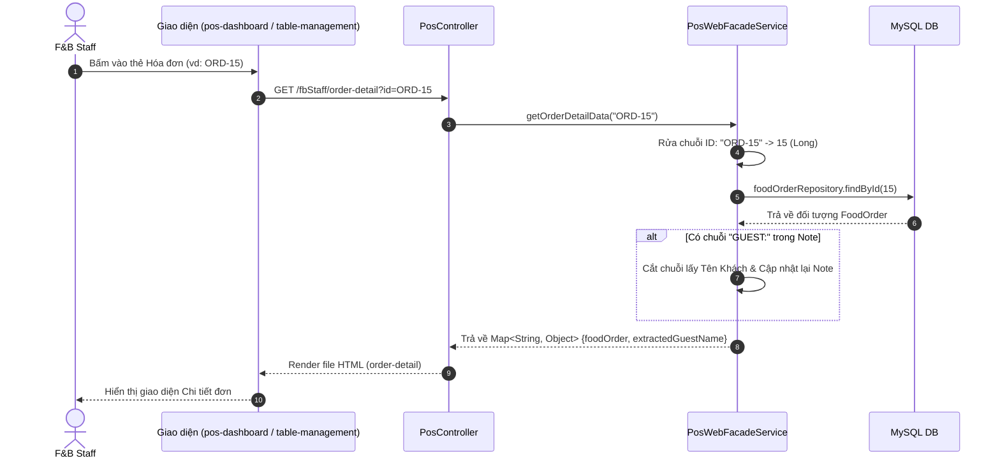

# Báo cáo Phân tích Luồng hoạt động: F&B Staff Xem Chi tiết Đơn hàng (Order Detail)

Tài liệu này giải thích chi tiết luồng xử lý của nghiệp vụ **Nhân viên F&B xem chi tiết một đơn hàng (Dine-in hoặc Room Service)** trong mã nguồn hiện tại của dự án Kawai Resort & Tour Hub, sau khi hệ thống đã được tái cấu trúc áp dụng Web Facade Pattern.

---

## Danh sách các file được can thiệp / phân tích

Trong luồng nghiệp vụ này, dữ liệu luân chuyển qua các tệp tin sau:

1. **[VIEW]** `src/main/resources/templates/f&bStaff/order-detail.html`: Giao diện chi tiết đơn hàng.
2. **[CONTROLLER]** `com/kawai/controllers/web/PosController.java`: Nơi tiếp nhận Request URL và tham số ID.
3. **[SERVICE]** `com/kawai/services/impl/PosWebFacadeServiceImpl.java`: (Mới) Tầng trung gian chịu trách nhiệm "rửa" tham số ID, truy vấn Database và bóc tách dữ liệu Note.
4. **[REPOSITORY]** `com/kawai/repositories/FoodOrderRepository.java`: Truy vấn bản ghi `FoodOrder`.

---

## 1. Sơ đồ Data Flow (Luồng dữ liệu)



---

## 2. Phân tích mã nguồn chi tiết từng dòng (Line-by-line Code Analysis)

Phần này bóc tách mã nguồn tại tầng trung gian (Facade), giải thích cách hệ thống làm sạch dữ liệu và xử lý các chuỗi văn bản lồng ghép.

### Tầng Facade: `PosWebFacadeServiceImpl.java` (Logic Xử lý Dữ liệu Hiển thị)

```java
1.  @Override
2.  public Map<String, Object> getOrderDetailData(String idParam) {
3.      Map<String, Object> data = new HashMap<>();
4.      
5.      // BƯỚC 1: LÀM SẠCH ID (SANITIZATION)
6.      String cleanId = idParam.replace("ORD-", "").replace("RES-", "");
7.      Long id = Long.parseLong(cleanId);
8.      
9.      // BƯỚC 2: TRUY VẤN VÀ BÓC TÁCH DỮ LIỆU
10.     foodOrderRepository.findById(id).ifPresent(order -> {
11.         String extractedGuestName = "";
12.         String realNote = order.getNote();
13.         
14.         // Tách tên khách hàng từ chuỗi Note (nếu có)
15.         if (realNote != null && realNote.startsWith("GUEST:")) {
16.             int pipeIndex = realNote.indexOf("|");
17.             if (pipeIndex != -1) {
18.                 extractedGuestName = realNote.substring(6, pipeIndex);
19.                 order.setNote(realNote.substring(pipeIndex + 1));
20.             }
21.         }
22.         
23.         // Đóng gói trả về Controller
24.         data.put("extractedGuestName", extractedGuestName);
25.         data.put("foodOrder", order);
26.     });
27.     
28.     return data;
29. }
```

**Giải thích chi tiết:**

- **Dòng 2:** Hàm nhận vào tham số `idParam` kiểu `String`. Bởi vì từ giao diện, các thẻ HTML thường truyền lên ID có kèm tiền tố (ví dụ: `?id=ORD-123` hoặc `?id=RES-45`) để người dùng dễ nhìn, chứ không truyền số nguyên trần trụi.
- **Dòng 6:** Kỹ thuật **Sanitization (Làm sạch dữ liệu)**: Dùng `.replace()` để bóc lớp vỏ tiền tố `ORD-` hoặc `RES-` đi, chỉ giữ lại phần số.
- **Dòng 7:** Ép kiểu chuỗi số (ví dụ `"123"`) thành số nguyên `Long` để có thể truy vấn Database.
- **Dòng 10:** Gọi `findById` từ `FoodOrderRepository`. Dùng `.ifPresent()` để đảm bảo code an toàn (Null-safety) – nếu hóa đơn không tồn tại, khối lệnh bên trong sẽ không chạy, tránh lỗi `NullPointerException`.
- **Dòng 12-21:** Kỹ thuật **String Parsing (Phân tách chuỗi)**. Trong Database, tên khách hàng vãng lai (Walk-in) thường được nối chung vào cột `note` theo cú pháp `GUEST:TenKhach|GhiChuChoBep`. 
  - Hệ thống dò tìm chữ `"GUEST:"` (Dòng 15).
  - Tìm vị trí của dấu gạch đứng `"|"` ngăn cách (Dòng 16).
  - Cắt lấy phần tên khách hàng từ sau số 6 (chữ GUEST: có độ dài 6) cho đến trước dấu `|` (Dòng 18).
  - Cập nhật lại giá trị `Note` của thực thể `order` thành phần đuôi đằng sau dấu `|` (Dòng 19). Nhờ vậy, khi in ra giao diện, Ghi chú cho bếp sẽ không bị dính chữ `GUEST:...` rác nữa.
- **Dòng 24-25:** Đóng gói biến tên khách (`extractedGuestName`) và đối tượng đơn hàng (`foodOrder`) vào một `Map` rồi ném trả về cho Controller. Controller chỉ việc đẩy Map này vào Model cho Thymeleaf.

---

## 3. Đánh giá Kiến trúc Hiện tại

1. **Tuân thủ SRP (Single Responsibility Principle):** Quá trình làm sạch dữ liệu (`cleanId`) và bóc tách logic hiển thị tên khách (`String Parsing`) không được viết chung trong Controller nữa. Điều này khiến Controller cực kỳ sạch sẽ và dễ Unit Test.
2. **Data Munging (Nhào nặn dữ liệu):** Việc nhồi Tên khách vào cột `Note` (theo định dạng `GUEST:Name|Note`) là một Workaround khá thông minh khi Database chưa có cột Guest Name riêng cho khách vãng lai. Lớp Facade đã làm rất tốt việc bóc tách chuỗi này để tầng View không phải xử lý chuỗi phức tạp bằng Javascript hay Thymeleaf expression.

## 4. Gợi ý Cải tiến (Future Improvements)

- **Lỗi NumberFormatException:** Nếu trên URL ai đó cố tình truyền `?id=ORD-ABC`, dòng số 7 `Long.parseLong(cleanId)` sẽ ném ra ngoại lệ và làm Crash trang (Lỗi 500). Nên bọc khối lệnh này trong một `try/catch` bắt `NumberFormatException` và ném ra một Custom Exception nhẹ nhàng hơn (ví dụ: Redirect về trang lỗi 404).
- **Cải tiến Database:** Về lâu dài, nên thêm cột `walk_in_guest_name` vào bảng `FoodOrder` để tránh phải dùng chuỗi regex/parse như hiện nay. Việc lưu gộp vào cột `Note` không tốt cho mục đích Data Analytics sau này.
