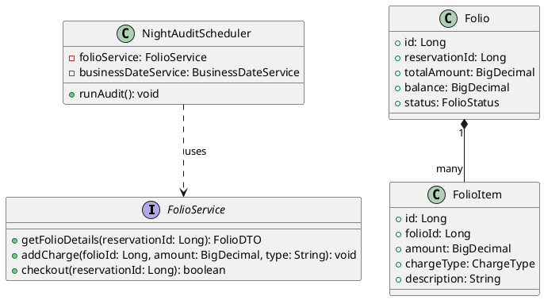
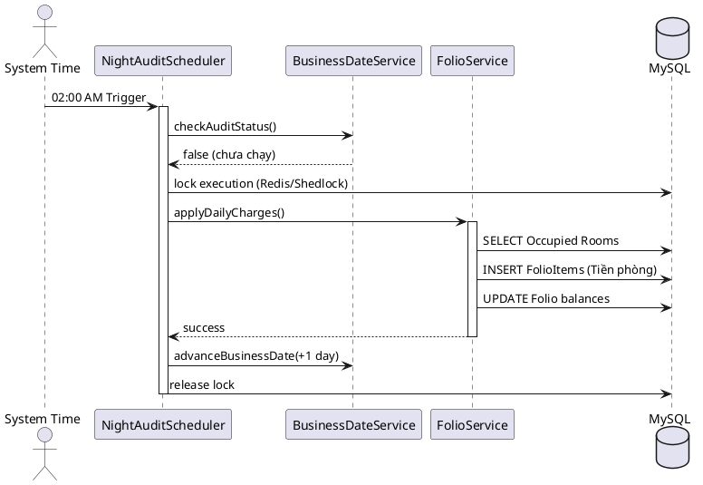
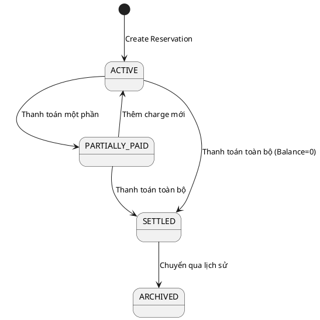

# ENGINEERING DOCUMENTATION STANDARD (EDS) v2.0

## MOD5 — Quản lý Tài chính & Kiểm toán đêm (Finance & Night Audit)

| Field | Value |
|-------|-------|
| **Document ID** | `KAWAI-EDS-MOD5-001` |
| **Version** | 1.0 |
| **Date** | 2026-06-15 |
| **Status** | Approved |
| **Document Owner** | Ngô Thị Ngọc Lan |
| **Author** | Nguyễn Xuân Lưu — Tech Lead |
| **Reviewed by** | Nguyễn Xuân Lưu — Tech Lead |
| **DPO Sign-off** | `[x] Approved – 2026-06-15 – Nguyễn Xuân Lưu` |
| **Approved by** | `[x] Nguyễn Xuân Lưu – 2026-06-15` |
| **Last Review** | 2026-06-15 |
| **Based on EDS** | v2.0 |

---

### CHANGELOG
| Ngày | Người thực hiện | Nội dung thay đổi |
|------|-----------------|-------------------|
| 2026-06-12 | Nguyễn Xuân Lưu | Tạo tài liệu sơ bộ |
| 2026-06-15 | Nguyễn Xuân Lưu | Hoàn thiện chi tiết 17 phần theo chuẩn EDS |

---

### MỤC LỤC
1. [Tổng quan Module](#1)
2. [Ma trận Truy vết](#2)
3. [ADR](#3)
4. [Non-Functional & SLA](#4)
5. [Static Modeling](#5)
6. [Dynamic Modeling](#6)
7. [Domain Event Catalog](#7)
8. [Interface Specification](#8)
9. [API Specification](#9)
10. [Bảng mã lỗi](#10)
11. [Quy trình Triển khai](#11)
12. [Rollback & Incident Runbook](#12)
13. [Kịch bản Kiểm thử](#13)
14. [Phương pháp Xác minh](#14)
15. [Mẫu thử thực tế](#15)
16. [Authorization Matrix](#16)
17. [Phụ lục](#17)

---

### 1. Tổng quan Module

| Field | Value |
|-------|-------|
| **Module Name** | Finance & Night Audit (MOD5) |
| **Bounded Context** | Billing, Payment & Accounting |
| **Use Case** | UC24, UC25, UC26, UC27, UC28 |
| **Data Classification** | PII (Thông tin khách hàng), Financial (Hóa đơn, thanh toán) |
| **Compliance Scope** | Tiêu chuẩn kế toán khách sạn (USALI) |
| **Upstream Dependencies** | Reservation, Housekeeping (Trạng thái phòng) |
| **Downstream Consumers** | Email Service (SendGrid) |

---

### 2. Ma trận Truy vết

| Requirement ID | Loại | Mô tả | Thành phần Code | Compliance | ADR |
|----------------|------|-------|-----------------|------------|-----|
| UC24.1 | US | Quản lý Folio nợ phòng | `FolioService.getFolio()` | USALI | — |
| UC24.4 | US | Night Audit chốt sổ 2h sáng | `NightAuditScheduler.run()` | — | ADR-001 |
| UC25.1 | US | Thanh toán & Check-out | `FolioService.checkout()` | — | ADR-002 |
| UC25.2 | US | Gửi e-Invoice | `InvoiceService.send()` | — | — |
| UC26.1 | US | Dashboard Tài chính | `ReportService.getDashboard()` | — | — |
| UC27 | US | Báo cáo USALI | `ReportService.generateUsali()` | USALI | — |
| BR-FIN-01 | BR | Không cho check-out nếu Folio > 0 | `FolioService.checkout()` | — | — |

---

### 3. Architecture Decision Records (ADR)

#### ADR-001 — Lập lịch Night Audit
| Field | Value |
|-------|-------|
| **Status** | Accepted |
| **Deciders** | Nguyễn Xuân Lưu |
| **Date** | 2026-06-12 |

**Bối cảnh:** Cần tự động cộng tiền phòng vào 2h sáng mỗi đêm và chuyển ngày làm việc (Business Date).
**Quyết định:** Sử dụng Spring `@Scheduled(cron = "0 0 2 * * ?")` kết hợp Redis Lock (ShedLock) để tránh chạy trùng lặp trong môi trường multi-node.
**Hệ quả:** Đảm bảo Night Audit chỉ chạy duy nhất 1 lần, an toàn và dễ bảo trì.

#### ADR-002 — Cơ chế lưu trữ Folio
| Field | Value |
|-------|-------|
| **Status** | Accepted |
| **Deciders** | Nguyễn Xuân Lưu |
| **Date** | 2026-06-12 |

**Bối cảnh:** Folio (Hồ sơ nợ) chứa nhiều loại phí (phòng, dịch vụ, F&B) có thể thay đổi liên tục.
**Quyết định:** Thiết kế Folio gồm `Folio` (Master) và `FolioItem` (Detail). Mọi giao dịch phát sinh sẽ insert `FolioItem` thay vì update Folio chính (Event Sourcing nhẹ).
**Hệ quả:** Dễ dàng truy vết lịch sử giao dịch (Audit Trail), cho phép hoàn tác.

---

### 4. Non-Functional Requirements & SLA

#### 4.1. Performance & Availability

| Category | Requirement | Target SLA | Measurement |
|----------|-------------|------------|-------------|
| **Latency** | Night Audit completion | < 5 phút / 1000 phòng | k6 load test, APM |
| **Latency** | Checkout Folio Calculation | < 500ms | APM |
| **Availability** | Uptime (monthly) | 99.9% | Uptime monitor |

#### 4.2. Security & Compliance

| Category | Requirement | Target | Verification |
|----------|-------------|--------|-------------|
| **Data** | Làm mờ số thẻ tín dụng | Hiển thị 4 số cuối | Unit test |
| **Concurrency**| Tránh double payment | Optimistic Locking | Integration test |
| **Audit** | Lưu log giao dịch | Bảng `transaction_log` | DB Audit |

---

### 5. Static Modeling

#### 5.1. Class Diagram



#### 5.2. Data Structure

```sql
CREATE TABLE folio (
    id BIGINT AUTO_INCREMENT PRIMARY KEY,
    reservation_id BIGINT NOT NULL,
    total_amount DECIMAL(15,2) DEFAULT 0,
    balance DECIMAL(15,2) DEFAULT 0,
    status VARCHAR(50) DEFAULT 'ACTIVE',
    created_at TIMESTAMP DEFAULT CURRENT_TIMESTAMP
);

CREATE TABLE folio_item (
    id BIGINT AUTO_INCREMENT PRIMARY KEY,
    folio_id BIGINT NOT NULL,
    amount DECIMAL(15,2) NOT NULL,
    charge_type VARCHAR(50) NOT NULL,
    description VARCHAR(255),
    created_at TIMESTAMP DEFAULT CURRENT_TIMESTAMP,
    FOREIGN KEY (folio_id) REFERENCES folio(id)
);

CREATE TABLE business_date (
    id INT PRIMARY KEY,
    current_date DATE NOT NULL,
    is_audit_run BOOLEAN DEFAULT FALSE
);
```

---

### 6. Dynamic Modeling

#### 6.1. Sequence Diagram — Night Audit



#### 6.2. State Machine — Folio Status



---

### 7. Domain Event Catalog

| Event Name | Trigger | Publisher | Subscriber(s) | Async? |
|------------|---------|-----------|---------------|--------|
| `NightAuditCompleted` | Chạy audit xong | `NightAuditScheduler` | `ReportService` | Yes |
| `FolioSettled` | Checkout thành công | `FolioService` | `InvoiceService` | Yes |
| `ChargeAdded` | Thêm khoản phí mới | `FolioService` | `AuditService` | Yes |

---

### 8. Interface Specification

```java
// FolioService.java
// @version 1.0

public interface FolioService {
    FolioDTO getFolioDetails(Long reservationId);
    void addCharge(Long folioId, ChargeRequestDTO request);
    void processPayment(Long folioId, PaymentDTO payment) throws PaymentException;
    void checkout(Long reservationId) throws UnsettledFolioException;
}
```

---

### 9. API Specification

| Method | Path | Auth | Roles | Rate Limit | Idempotent? |
|--------|------|------|-------|------------|-------------|
| GET | `/api/v1/folios/{id}` | JWT | RECEPTIONIST | 30/min | Yes |
| POST | `/api/v1/folios/{id}/pay` | JWT | RECEPTIONIST | 10/min | No |
| POST | `/api/v1/audit/run` | JWT | ADMIN | 5/min | Yes |
| GET | `/api/v1/reports/usali` | JWT | ADMIN | 10/min | Yes |

**POST `/api/v1/folios/{id}/pay`**
*Request:* `{"amount": 1500000, "method": "CREDIT_CARD"}`
*Response 200:* `{"status": "SUCCESS", "newBalance": 0}`
*Response 400:* `{"error": {"code": "FIN-003", "message": "Invalid amount"}}`

---

### 10. Bảng mã lỗi

| Code | HTTP | Message (EN) | Message (VI) | Trigger |
|------|------|--------------|--------------|---------|
| `FIN-001` | 400 | Audit already run | Đã audit trong ngày | BusinessDate đã update |
| `FIN-002` | 400 | Folio not found | Không tìm thấy Folio | ID sai |
| `FIN-003` | 400 | Invalid payment amount | Số tiền không hợp lệ | Amount <= 0 hoặc > Balance |
| `FOLIO-001` | 422 | Unsettled folio | Chưa thanh toán hết | Checkout khi Balance > 0 |

---

### 11. Quy trình Triển khai

#### 11.1. Prerequisites
- [x] Chạy migration tạo bảng `folio`, `folio_item`, `business_date`.
- [x] Cấu hình Redis (cho ShedLock).
- [x] Tích hợp SendGrid API Key cho e-Invoice.

#### 11.2. Deployment
```bash
mvn clean package -DskipTests
java -jar target/kawai-backend-1.0.jar --spring.profiles.active=staging
```

#### 11.3. Verification
```bash
curl -X GET http://localhost:8080/api/v1/folios/1 -H "Authorization: Bearer [TOKEN]"
```

---

### 12. Rollback & Incident Runbook

| Điều kiện | Ngưỡng | Người quyết định |
|-----------|--------|-------------------|
| Night Audit fail | Báo lỗi hoặc chạy quá 30p | On-call Engineer |
| Tính sai Folio | > 2% số giao dịch | Tech Lead |

**Rollback Audit:**
Chạy script phục hồi `business_date` về ngày trước đó, đánh dấu `FolioItem` tạo bởi audit_run_id là `VOID`.

---

### 13. Kịch bản Kiểm thử

**[Policy]** Test Data: SYNTHETIC. ❌ KHÔNG dùng Production Data.

#### 13.1. Unit Tests
- TC-UNIT-FIN-001: Tính tổng Folio chính xác từ các FolioItems.
- TC-UNIT-FIN-002: Ném lỗi FOLIO-001 khi check-out mà Balance > 0.
- TC-UNIT-FIN-003: Chuyển Business Date lên 1 ngày sau Night Audit.

#### 13.2. Integration Tests
- TC-INT-FIN-001: Luồng tạo Charge -> Payment -> Checkout -> Gửi Email Invoice.
- TC-INT-FIN-002: Night Audit job trigger đúng và cộng tiền chính xác vào database.

---

### 14. Phương pháp Xác minh

```sql
-- Xác minh Night Audit chạy thành công
SELECT * FROM business_date;
-- Xác minh Folio đã tất toán
SELECT balance, status FROM folio WHERE id = :folioId;
```

---

### 15. Mẫu thử thực tế

```bash
# Kích hoạt Night Audit thủ công
curl -X POST https://api.kawairesort.com/api/v1/audit/run \
  -H "Authorization: Bearer [ADMIN_JWT]"

# Thanh toán Folio
curl -X POST https://api.kawairesort.com/api/v1/folios/123/pay \
  -H "Content-Type: application/json" \
  -H "Authorization: Bearer [JWT]" \
  -d '{"amount": 5000000, "method": "CASH"}'
```

---

### 16. Authorization Matrix

| Endpoint | GUEST | CUSTOMER | RECEPTIONIST | ADMIN |
|----------|:-----:|:--------:|:------------:|:-----:|
| GET `/api/v1/folios/{id}` | ❌ | ✔️ (Own) | ✔️ | ✔️ |
| POST `/api/v1/folios/{id}/pay` | ❌ | ❌ | ✔️ | ✔️ |
| POST `/api/v1/audit/run` | ❌ | ❌ | ❌ | ✔️ |
| GET `/api/v1/reports/usali` | ❌ | ❌ | ❌ | ✔️ |

---

### 17. Phụ lục

#### A. Glossary
| Thuật ngữ | Định nghĩa |
|-----------|------------|
| **Folio** | Hồ sơ theo dõi các khoản nợ và thanh toán của khách |
| **Night Audit** | Quá trình kiểm toán đêm, cộng phí phòng và đóng sổ ngày |
| **USALI** | Uniform System of Accounts for the Lodging Industry |

#### B. Tài liệu tham chiếu
| Document | Path |
|----------|------|
| TDD MOD5 | `06-Testing/mod5_finance/TDD_MOD5_SPEC.md` |

---

*EDS v2.0*
