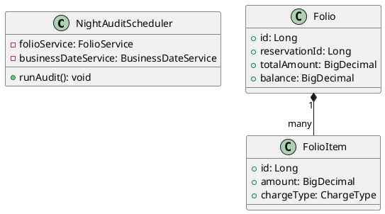
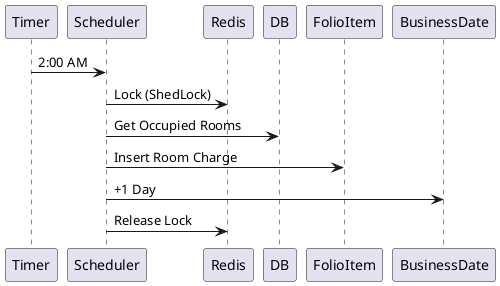

# ENGINEERING DOCUMENTATION STANDARD (EDS) v2.0

## UC24 — Quản lý Folio & Kiểm toán đêm

| Field | Value |
|-------|-------|
| **Document ID** | `KAWAI-EDS-MOD5-UC24-001` |
| **Version** | 1.0 |
| **Date** | 2026-06-15 |
| **Status** | Approved |
| **Document Owner** | Ngô Thị Ngọc Lan |
| **Author** | Nguyễn Xuân Lưu — Tech Lead |
| **Reviewed by** | Nguyễn Xuân Lưu — Tech Lead |
| **DPO Sign-off** | `[x] Approved – 2026-06-15 – Nguyễn Xuân Lưu` |
| **Approved by** | `[x] Nguyễn Xuân Lưu – 2026-06-15` |
| **Last Review** | 2026-06-15 |
| **Based on EDS** | v2.0 |

---

### CHANGELOG
| Ngày | Người thực hiện | Nội dung thay đổi |
|------|-----------------|-------------------|
| 2026-06-15 | Nguyễn Xuân Lưu | Tạo tài liệu thiết kế chi tiết UC24 |

---

### MỤC LỤC
1. [Tổng quan Module](#1)
2. [Ma trận Truy vết](#2)
3. [ADR](#3)
4. [Non-Functional & SLA](#4)
5. [Static Modeling](#5)
6. [Dynamic Modeling](#6)
7. [Domain Event Catalog](#7)
8. [Interface Specification](#8)
9. [API Specification](#9)
10. [Bảng mã lỗi](#10)
11. [Quy trình Triển khai](#11)
12. [Rollback & Incident Runbook](#12)
13. [Kịch bản Kiểm thử](#13)
14. [Phương pháp Xác minh](#14)
15. [Mẫu thử thực tế](#15)
16. [Authorization Matrix](#16)
17. [Phụ lục](#17)

---

### 1. Tổng quan Module

| Field | Value |
|-------|-------|
| **Module Name** | Quản lý Folio & Night Audit (UC24) |
| **Bounded Context** | Billing & Accounting |
| **Use Case** | UC24: Quản lý chi tiết công nợ phòng, kích hoạt kiểm toán đêm |
| **Data Classification** | Financial (Tiền tệ, lịch sử giao dịch) |
| **Compliance Scope** | Kế toán nội bộ |
| **Upstream Dependencies** | Reservation, Housekeeping |
| **Downstream Consumers** | Report (UC27), Checkout (UC25) |

---

### 2. Ma trận Truy vết

| Requirement ID | Loại | Mô tả | Thành phần Code | Compliance | ADR |
|----------------|------|-------|-----------------|------------|-----|
| UC24.1 | US | Quản lý Folio nợ phòng (danh sách dịch vụ) | `FolioService.getFolio()` | — | ADR-002 |
| UC24.2 | US | Ghi nhận luồng tiền nhiều đợt (ứng, trả thêm) | `FolioService.addCharge()` | — | — |
| UC24.3 | US | Gom hóa đơn (tổng tiền các dịch vụ) | `Folio.getTotalAmount()` | — | — |
| UC24.4 | US | Night Audit chốt sổ 2h sáng & đổi Business Date | `NightAuditScheduler.run()` | — | ADR-001 |

---

### 3. Architecture Decision Records (ADR)

#### ADR-001 — Cơ chế đồng bộ Night Audit (ShedLock)
**Bối cảnh:** Night Audit tự động chạy lúc 2h sáng. Nếu chạy > 1 instance backend, hàm có thể bị kích hoạt 2 lần.
**Quyết định:** Sử dụng `@Scheduler` kết hợp thư viện ShedLock với Redis.
**Hệ quả:** Audit chỉ chạy 1 lần duy nhất, tránh tình trạng cộng phí phòng hai lần.

#### ADR-002 — Event Sourcing nhẹ cho Folio
**Bối cảnh:** Cần ghi lại chi tiết từng khoản phát sinh (Charge) và thanh toán (Payment).
**Quyết định:** Mọi thay đổi về Balance của Folio được thực hiện thông qua việc chèn record vào bảng `FolioItem`. Folio Balance là Aggregate Sum của các items.
**Hệ quả:** Dễ dàng kiểm tra lịch sử (Audit trail), tránh sai sót số liệu.

---

### 4. Non-Functional Requirements & SLA

#### 4.1. Performance & Availability
| Category | Requirement | Target SLA | Measurement |
|----------|-------------|------------|-------------|
| **Latency** | Get Folio details | < 300ms | APM |
| **Throughput** | Night Audit Process | < 5 mins cho 1000 phòng | Database Monitor |

#### 4.2. Precision
| Category | Requirement | Target | Verification |
|----------|-------------|--------|-------------|
| **Datatype** | Tính toán tiền tệ | Dùng `BigDecimal`, không dùng `Double` | Unit test |

---

### 5. Static Modeling

#### 5.1. Class Diagram


#### 5.2. Data Structure
Bảng `folio`, `folio_item`, `business_date`.

---

### 6. Dynamic Modeling

#### 6.1. Sequence Diagram — Night Audit


#### 6.2. State Machine
Không có State Machine phức tạp cho riêng Folio, chỉ tính Balance.

---

### 7. Domain Event Catalog

| Event Name | Trigger | Publisher | Subscriber(s) | Async? |
|------------|---------|-----------|---------------|--------|
| `NightAuditCompleted` | Chạy audit xong | `NightAuditScheduler` | `ReportService` | Yes |
| `ChargeAdded` | Thêm khoản phí mới | `FolioService` | `AuditService` | Yes |

---

### 8. Interface Specification

```java
public interface FolioService {
    FolioDTO getFolioDetails(Long reservationId);
    void addCharge(Long folioId, ChargeRequestDTO request);
}
```

---

### 9. API Specification

| Method | Path | Auth | Roles | Rate Limit |
|--------|------|------|-------|------------|
| GET | `/api/v1/folios/{id}` | JWT | RECEPTIONIST | 30/min |
| POST | `/api/v1/folios/{id}/charge` | JWT | RECEPTIONIST | 30/min |
| POST | `/api/v1/audit/run` | JWT | ADMIN | 5/min |

---

### 10. Bảng mã lỗi

| Code | HTTP | Message (EN) | Message (VI) | Trigger |
|------|------|--------------|--------------|---------|
| `FIN-001` | 400 | Audit already run | Đã audit trong ngày | BusinessDate đã update |
| `FIN-002` | 400 | Folio not found | Không tìm thấy Folio | ID sai |

---

### 11. Quy trình Triển khai
- Chạy Liquibase/Flyway tạo bảng.
- Cấu hình Redis URL cho ShedLock.

---

### 12. Rollback & Incident Runbook
**Sự cố:** Night audit chạy giữa chừng bị crash.
**Xử lý:** Xóa các `FolioItem` có nhãn `AUDIT_{date}` và chạy lại API `/api/v1/audit/run` thủ công.

---

### 13. Kịch bản Kiểm thử
- TC-UNIT-UC24-001: Lấy chi tiết Folio thành công.
- TC-UNIT-UC24-002: Thêm phí dịch vụ (Charge) tăng nợ.
- TC-INT-UC24-001: Night Audit chạy cộng đủ tiền cho các phòng Occupied.

---

### 14. Phương pháp Xác minh
`SELECT * FROM business_date;` để kiểm tra ngày đã nhảy.

---

### 15. Mẫu thử thực tế
`curl -X POST /api/v1/audit/run -H "Authorization: Bearer [ADMIN_TOKEN]"`

---

### 16. Authorization Matrix
- `/audit/run` -> Chỉ ADMIN.
- `/folios/{id}` -> RECEPTIONIST, ADMIN.

---

### 17. Phụ lục
- **Night Audit**: Kiểm toán đêm để chốt sổ tài chính hàng ngày.