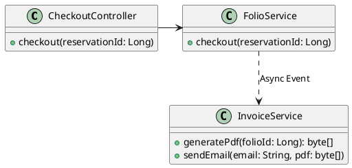
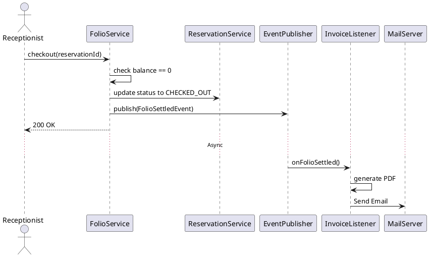

# ENGINEERING DOCUMENTATION STANDARD (EDS) v2.0

## UC25 — Thanh toán & Check-out

| Field | Value |
|-------|-------|
| **Document ID** | `KAWAI-EDS-MOD5-UC25-001` |
| **Version** | 1.0 |
| **Date** | 2026-06-15 |
| **Status** | Approved |
| **Document Owner** | Ngô Thị Ngọc Lan |
| **Author** | Nguyễn Xuân Lưu — Tech Lead |
| **Reviewed by** | Nguyễn Xuân Lưu — Tech Lead |
| **DPO Sign-off** | `[x] Approved – 2026-06-15 – Nguyễn Xuân Lưu` |
| **Approved by** | `[x] Nguyễn Xuân Lưu – 2026-06-15` |
| **Last Review** | 2026-06-15 |
| **Based on EDS** | v2.0 |

---

### CHANGELOG
| Ngày | Người thực hiện | Nội dung thay đổi |
|------|-----------------|-------------------|
| 2026-06-15 | Nguyễn Xuân Lưu | Tạo tài liệu thiết kế chi tiết UC25 |

---

### MỤC LỤC
1. [Tổng quan Module](#1)
2. [Ma trận Truy vết](#2)
3. [ADR](#3)
4. [Non-Functional & SLA](#4)
5. [Static Modeling](#5)
6. [Dynamic Modeling](#6)
7. [Domain Event Catalog](#7)
8. [Interface Specification](#8)
9. [API Specification](#9)
10. [Bảng mã lỗi](#10)
11. [Quy trình Triển khai](#11)
12. [Rollback & Incident Runbook](#12)
13. [Kịch bản Kiểm thử](#13)
14. [Phương pháp Xác minh](#14)
15. [Mẫu thử thực tế](#15)
16. [Authorization Matrix](#16)
17. [Phụ lục](#17)

---

### 1. Tổng quan Module

| Field | Value |
|-------|-------|
| **Module Name** | Thanh toán & Check-out (UC25) |
| **Bounded Context** | Payment & Invoicing |
| **Use Case** | UC25: Thanh toán hóa đơn, thực hiện Check-out, Gửi e-Invoice |
| **Data Classification** | Financial, PII (Email, Tên khách) |
| **Compliance Scope** | Hóa đơn điện tử |
| **Upstream Dependencies** | Folio (UC24) |
| **Downstream Consumers** | Email Service |

---

### 2. Ma trận Truy vết

| Requirement ID | Loại | Mô tả | Thành phần Code | Compliance | ADR |
|----------------|------|-------|-----------------|------------|-----|
| UC25.1 | US | Checkout khi Folio=0 hoặc thanh toán để Checkout | `FolioService.checkout()` | — | ADR-003 |
| UC25.2 | US | Tự động gửi e-Invoice qua Email | `InvoiceService.sendEmail()` | — | — |
| BR-FIN-01 | BR | Không cho checkout nếu Folio > 0 | `FolioService.checkout()` | — | — |

---

### 3. Architecture Decision Records (ADR)

#### ADR-003 — Sử dụng Async cho luồng Gửi Email e-Invoice
**Bối cảnh:** Gửi email Invoice có thể mất thời gian (1-3s), làm block luồng Checkout của nhân viên.
**Quyết định:** Bắn Domain Event `FolioSettled` và xử lý gửi email ở `@Async` event listener.
**Hệ quả:** API Checkout phản hồi nhanh, nếu gửi mail thất bại có thể retry sau mà không rollback việc thanh toán.

---

### 4. Non-Functional Requirements & SLA

#### 4.1. Performance & Availability
| Category | Requirement | Target SLA | Measurement |
|----------|-------------|------------|-------------|
| **Latency** | Checkout processing | < 500ms | APM |
| **Latency** | Email send latency | < 2s (Async) | Queue Metric |

#### 4.2. Security
- Không lưu toàn bộ số thẻ tín dụng nếu thanh toán qua thẻ, chỉ lưu mã giao dịch (Transaction Ref).

---

### 5. Static Modeling

#### 5.1. Class Diagram


#### 5.2. Data Structure
Bảng `payment_transaction` lưu lịch sử thanh toán thẻ/tiền mặt.

---

### 6. Dynamic Modeling

#### 6.1. Sequence Diagram — Checkout & Invoice


#### 6.2. State Machine
Reservation: OCCUPIED -> CHECKED_OUT.
Folio: ACTIVE -> SETTLED.

---

### 7. Domain Event Catalog

| Event Name | Trigger | Publisher | Subscriber(s) | Async? |
|------------|---------|-----------|---------------|--------|
| `FolioSettled` | Checkout xong | `FolioService` | `InvoiceListener` | Yes |

---

### 8. Interface Specification

```java
public interface FolioService {
    void processPayment(Long folioId, PaymentDTO payment) throws PaymentException;
    void checkout(Long reservationId) throws UnsettledFolioException;
}
```

---

### 9. API Specification

| Method | Path | Auth | Roles |
|--------|------|------|-------|
| POST | `/api/v1/folios/{id}/pay` | JWT | RECEPTIONIST |
| POST | `/api/v1/reservations/{id}/checkout`| JWT | RECEPTIONIST |

---

### 10. Bảng mã lỗi

| Code | HTTP | Message (EN) | Message (VI) | Trigger |
|------|------|--------------|--------------|---------|
| `FOLIO-001` | 422 | Unsettled folio | Chưa thanh toán hết | Checkout khi Balance > 0 |
| `FIN-003` | 400 | Invalid amount | Số tiền không hợp lệ | Trả nhiều hơn Balance |

---

### 11. Quy trình Triển khai
- Đảm bảo API Key SendGrid đã config trong `application.yml`.

---

### 12. Rollback & Incident Runbook
- Nếu Checkout lỗi: Hoàn tác trạng thái Reservation về OCCUPIED.

---

### 13. Kịch bản Kiểm thử
- TC-UNIT-UC25-001: Checkout thành công khi Balance = 0.
- TC-UNIT-UC25-002: Báo lỗi FOLIO-001 khi checkout Balance > 0.
- TC-INT-UC25-001: Gửi email bất đồng bộ được trigger.

---

### 14. Phương pháp Xác minh
Xác minh bảng `payment_transaction` và trạng thái `reservation`.

---

### 15. Mẫu thử thực tế
`curl -X POST /api/v1/reservations/1/checkout -H "Authorization: Bearer [TOKEN]"`

---

### 16. Authorization Matrix
- Checkout & Pay chỉ dành cho nhân viên (RECEPTIONIST, ADMIN).

---

### 17. Phụ lục
- **e-Invoice**: Hóa đơn điện tử PDF.