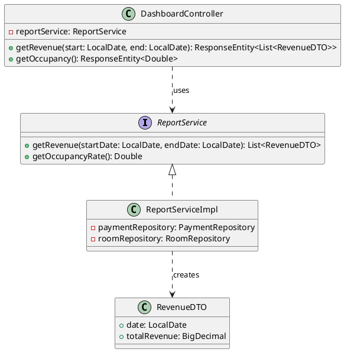
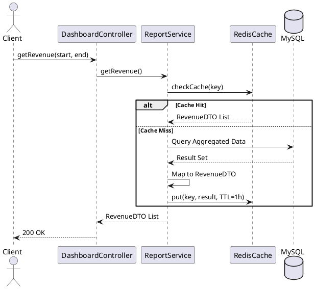

# ENGINEERING DOCUMENTATION STANDARD (EDS) v2.0

## UC26 — Dashboard Tài chính

| Field | Value |
|-------|-------|
| **Document ID** | `KAWAI-EDS-MOD5-UC26-001` |
| **Version** | 1.0 |
| **Date** | 2026-06-15 |
| **Status** | Approved |
| **Document Owner** | Ngô Thị Ngọc Lan |
| **Author** | Nguyễn Xuân Lưu — Tech Lead |
| **Reviewed by** | Nguyễn Xuân Lưu — Tech Lead |
| **DPO Sign-off** | `[x] Approved – 2026-06-15 – Nguyễn Xuân Lưu` |
| **Approved by** | `[x] Nguyễn Xuân Lưu – 2026-06-15` |
| **Last Review** | 2026-06-15 |
| **Based on EDS** | v2.0 |

---

### CHANGELOG
| Ngày | Người thực hiện | Nội dung thay đổi |
|------|-----------------|-------------------|
| 2026-06-15 | Nguyễn Xuân Lưu | Tạo tài liệu thiết kế chi tiết UC26 |

---

### MỤC LỤC
1. [Tổng quan Module](#1)
2. [Ma trận Truy vết](#2)
3. [ADR](#3)
4. [Non-Functional & SLA](#4)
5. [Static Modeling](#5)
6. [Dynamic Modeling](#6)
7. [Domain Event Catalog](#7)
8. [Interface Specification](#8)
9. [API Specification](#9)
10. [Bảng mã lỗi](#10)
11. [Quy trình Triển khai](#11)
12. [Rollback & Incident Runbook](#12)
13. [Kịch bản Kiểm thử](#13)
14. [Phương pháp Xác minh](#14)
15. [Mẫu thử thực tế](#15)
16. [Authorization Matrix](#16)
17. [Phụ lục](#17)

---

### 1. Tổng quan Module
| Field | Value |
|-------|-------|
| **Module Name** | Dashboard Tài chính (UC26) |
| **Bounded Context** | Reporting & Analytics |
| **Use Case** | UC26: Trực quan hóa dữ liệu doanh thu và công suất phòng |
| **Data Classification** | Financial Analytics |
| **Compliance Scope** | Nội bộ |

---

### 2. Ma trận Truy vết
| Requirement ID | Loại | Mô tả | Thành phần Code | Compliance | ADR |
|----------------|------|-------|-----------------|------------|-----|
| UC26.1 | US | Dashboard biểu đồ doanh thu theo ngày/tháng | `ReportService.getRevenueData()` | — | ADR-004 |
| UC26.2 | US | Tính Occupancy Rate (% phòng có khách) | `ReportService.getOccupancyRate()` | — | — |

---

### 3. Architecture Decision Records (ADR)
#### ADR-004 — Truy vấn Dữ liệu Dashboard
**Bối cảnh:** Dashboard cần aggregate dữ liệu từ bảng `payment_transaction` và `folio_item`.
**Quyết định:** Sử dụng Spring Data JPA Projection hoặc Native SQL Views để gom nhóm (GROUP BY) thay vì kéo dữ liệu về Java memory để loop.
**Hệ quả:** Tối ưu memory, response time cho Dashboard cực kỳ nhanh < 200ms.

---

### 4. Non-Functional Requirements & SLA

#### 4.1. Performance & Availability
| Category | Requirement | Target SLA | Measurement |
|----------|-------------|------------|-------------|
| **Latency** | Dashboard Revenue API | < 200ms | APM / k6 |
| **Availability** | Dashboard Uptime | 99.9% | Uptime Monitor |

#### 4.2. Caching Strategy
- Dữ liệu lịch sử (các tháng trước) được cache trên Redis với TTL 24h.
- Dữ liệu tháng hiện tại cache với TTL 1h hoặc tính toán realtime.

---

### 5. Static Modeling
#### Class Diagram


---

### 6. Dynamic Modeling

#### 6.1. Sequence Diagram — Fetch Revenue


---

### 7. Domain Event Catalog

Mặc dù UC26 là Read-Only, Dashboard có thể subscribe các event để chủ động làm mới cache (Pre-warm).

| Event Name | Trigger | Publisher | Action in Dashboard | Async? |
|------------|---------|-----------|---------------------|--------|
| `NightAuditCompleted` | Audit xong | `NightAuditScheduler` | Clear cache doanh thu tháng hiện tại | Yes |
| `FolioSettled` | Checkout xong | `FolioService` | (Optional) Trigger re-calculate nếu cần realtime | Yes |

---

### 8. Interface Specification
```java
public interface ReportService {
    List<RevenueDTO> getRevenue(LocalDate start, LocalDate end);
    Double getOccupancyRate();
}
```

---

### 9. API Specification

| Method | Path | Auth | Roles | Description |
|--------|------|------|-------|-------------|
| GET | `/api/v1/dashboard/revenue` | JWT | ADMIN, MANAGER | Lấy dữ liệu biểu đồ doanh thu |
| GET | `/api/v1/dashboard/occupancy` | JWT | ADMIN, MANAGER, RECEPTIONIST | Tính Occupancy Rate hiện tại |

**GET `/api/v1/dashboard/revenue`**
*Query Params:* `startDate` (YYYY-MM-DD), `endDate` (YYYY-MM-DD)
*Response 200 OK:*
```json
[
  {
    "date": "2026-06-14",
    "totalRevenue": 15000000.00
  },
  {
    "date": "2026-06-15",
    "totalRevenue": 22000000.00
  }
]
```

---

### 10. Bảng mã lỗi

| Code | HTTP | Message (EN) | Message (VI) | Trigger |
|------|------|--------------|--------------|---------|
| `RPT-001` | 400 | Invalid date range | Khoảng thời gian không hợp lệ | `startDate` > `endDate` |
| `RPT-002` | 400 | Date range too large | Khoảng thời gian quá lớn | Khoảng cách > 365 ngày |

---

### 11. Quy trình Triển khai

#### 11.1. Prerequisites
- Đảm bảo Redis server đang chạy và cấu hình `spring.redis.host` chính xác để hỗ trợ caching cho Dashboard.

#### 11.2. Deployment
Không yêu cầu deploy đặc thù, khởi chạy cùng module Backend chung.

---

### 12. Rollback & Incident Runbook

| Điều kiện | Ngưỡng | Người quyết định | Hành động |
|-----------|--------|-------------------|-----------|
| Redis Crash | Connection Refused > 3 lần | Hệ thống tự động | Fallback truy vấn trực tiếp từ MySQL (Disable Cache) |
| Query Timeout | > 5s cho API Revenue | On-call Engineer | Giới hạn Date Range mặc định xuống 7 ngày |

---

### 13. Kịch bản Kiểm thử

**[Policy]** KHÔNG sử dụng dữ liệu thật của khách hàng (PII) trên môi trường test.

#### 13.1. Unit / Integration Tests
- **TC-INT-UC26-001:** Truyền date range 1 tháng hợp lệ → Trả về danh sách RevenueDTO chính xác, HTTP 200.
- **TC-INT-UC26-002:** Truyền date range không hợp lệ (start > end) → Ném lỗi `RPT-001`, HTTP 400.
- **TC-INT-UC26-003:** Gọi API 2 lần liên tiếp → Lần 2 phải lấy từ Cache (verify qua số lượng query DB).
- **TC-UNIT-UC26-004:** Cập nhật công suất phòng → API Occupancy Rate trả về % chính xác.

---

### 14. Phương pháp Xác minh

```sql
-- Xác minh dữ liệu Revenue ngày 2026-06-15
SELECT DATE(created_at), SUM(amount)
FROM folio_item
WHERE DATE(created_at) = '2026-06-15'
GROUP BY DATE(created_at);

-- Xác minh Occupancy Rate
SELECT 
  (SELECT COUNT(*) FROM room WHERE status = 'OCCUPIED') / 
  (SELECT COUNT(*) FROM room) * 100 AS occupancy_rate;
```

---

### 15. Mẫu thử thực tế

```bash
# Lấy doanh thu từ ngày 01 đến 15 tháng 6
curl -X GET "https://api.kawairesort.com/api/v1/dashboard/revenue?startDate=2026-06-01&endDate=2026-06-15" \
  -H "Authorization: Bearer [ADMIN_JWT]"

# Lấy Occupancy Rate
curl -X GET "https://api.kawairesort.com/api/v1/dashboard/occupancy" \
  -H "Authorization: Bearer [JWT]"
```

---

### 16. Authorization Matrix

| Endpoint | GUEST | CUSTOMER | RECEPTIONIST | MANAGER | ADMIN |
|----------|:-----:|:--------:|:------------:|:-------:|:-----:|
| GET `/api/v1/dashboard/revenue` | ❌ | ❌ | ❌ | ✔️ | ✔️ |
| GET `/api/v1/dashboard/occupancy` | ❌ | ❌ | ✔️ | ✔️ | ✔️ |

---

### 17. Phụ lục

#### A. Glossary
| Thuật ngữ | Định nghĩa |
|-----------|------------|
| **Occupancy Rate** | Tỷ lệ lấp đầy: `(Số phòng có khách / Tổng số phòng) * 100%` |
| **RevPAR** | Doanh thu trên mỗi phòng sẵn có (Chỉ số mở rộng nếu cần tích hợp thêm) |