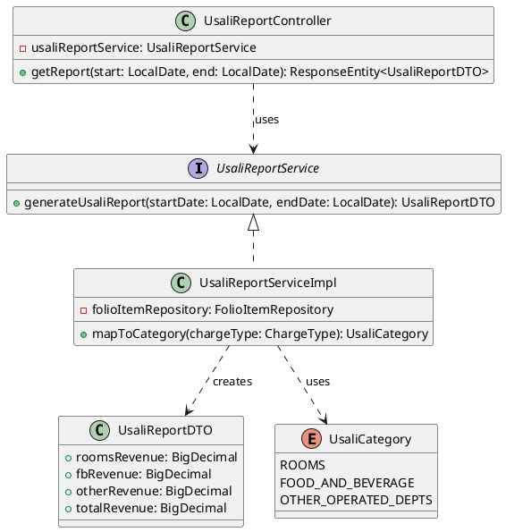
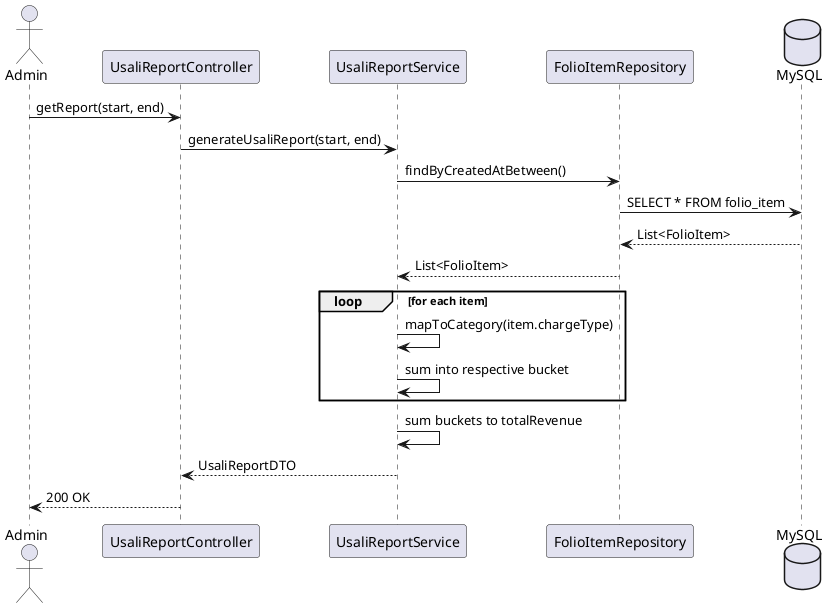

# ENGINEERING DOCUMENTATION STANDARD (EDS) v2.0

## UC27 — Báo cáo USALI

| Field | Value |
|-------|-------|
| **Document ID** | `KAWAI-EDS-MOD5-UC27-001` |
| **Version** | 1.0 |
| **Date** | 2026-06-15 |
| **Status** | Approved |
| **Document Owner** | Ngô Thị Ngọc Lan |
| **Author** | Nguyễn Xuân Lưu — Tech Lead |
| **Reviewed by** | Nguyễn Xuân Lưu — Tech Lead |
| **DPO Sign-off** | `[x] Approved – 2026-06-15 – Nguyễn Xuân Lưu` |
| **Approved by** | `[x] Nguyễn Xuân Lưu – 2026-06-15` |
| **Last Review** | 2026-06-15 |
| **Based on EDS** | v2.0 |

---

### CHANGELOG
| Ngày | Người thực hiện | Nội dung thay đổi |
|------|-----------------|-------------------|
| 2026-06-15 | Nguyễn Xuân Lưu | Tạo tài liệu thiết kế chi tiết UC27 |

---

### MỤC LỤC
1. [Tổng quan Module](#1)
2. [Ma trận Truy vết](#2)
3. [ADR](#3)
4. [Non-Functional & SLA](#4)
5. [Static Modeling](#5)
6. [Dynamic Modeling](#6)
7. [Domain Event Catalog](#7)
8. [Interface Specification](#8)
9. [API Specification](#9)
10. [Bảng mã lỗi](#10)
11. [Quy trình Triển khai](#11)
12. [Rollback & Incident Runbook](#12)
13. [Kịch bản Kiểm thử](#13)
14. [Phương pháp Xác minh](#14)
15. [Mẫu thử thực tế](#15)
16. [Authorization Matrix](#16)
17. [Phụ lục](#17)

---

### 1. Tổng quan Module
| Field | Value |
|-------|-------|
| **Module Name** | Báo cáo USALI (UC27) |
| **Bounded Context** | Accounting |
| **Use Case** | UC27: Lập báo cáo hoạt động kinh doanh khách sạn chuẩn USALI |

---

### 2. Ma trận Truy vết
| Requirement ID | Loại | Mô tả | Thành phần Code |
|----------------|------|-------|-----------------|
| UC27 | US | Phân tách doanh thu Rooms / F&B / Tour theo USALI | `UsaliReportService.generate()` |

---

### 3. Architecture Decision Records (ADR)
- **Mapping Logic:** Phân tách dựa vào ENUM `ChargeCategory` (ROOM_RATE, FOOD, BEVERAGE, LAUNDRY...).

---

### 4. Non-Functional Requirements & SLA

#### 4.1. Precision & Accuracy
| Category | Requirement | Target SLA | Measurement |
|----------|-------------|------------|-------------|
| **Data Type** | Tính toán doanh thu | Không sai số (100% khớp `FolioItem`) | Unit/Integration Test |
| **Consistency** | Tổng USALI | `Rooms + F&B + Other = Total Revenue` | DB Constraint Check |

#### 4.2. Performance
| Category | Requirement | Target SLA | Measurement |
|----------|-------------|------------|-------------|
| **Latency** | Xuất báo cáo 1 tháng | < 1000ms | APM |
| **Latency** | Xuất báo cáo 1 năm | < 5000ms | APM |

---

### 5. Static Modeling
#### 5.1. Class Diagram


---

### 6. Dynamic Modeling

#### 6.1. Sequence Diagram — Generate USALI Report


---

### 7. Domain Event Catalog

Tương tự UC27 chủ yếu là truy xuất dữ liệu tổng hợp. Tuy nhiên, nếu hệ thống áp dụng Report Generation bất đồng bộ cho các kỳ báo cáo lớn (ví dụ: Báo cáo năm), có thể phát sinh Event sau:

| Event Name | Trigger | Publisher | Subscriber(s) | Async? |
|------------|---------|-----------|---------------|--------|
| `UsaliReportGenerated` | Báo cáo năm được tạo xong | `UsaliReportService` | `NotificationService` (Báo Email) | Yes |

---

### 8. Interface Specification
```java
public interface UsaliReportService {
    UsaliReportDTO getReport(LocalDate start, LocalDate end);
}
```

---

### 9. API Specification

| Method | Path | Auth | Roles | Description |
|--------|------|------|-------|-------------|
| GET | `/api/v1/reports/usali` | JWT | ADMIN, MANAGER | Lấy báo cáo doanh thu theo chuẩn USALI |

**GET `/api/v1/reports/usali`**
*Query Params:* `startDate` (YYYY-MM-DD), `endDate` (YYYY-MM-DD)
*Response 200 OK:*
```json
{
  "startDate": "2026-06-01",
  "endDate": "2026-06-30",
  "roomsRevenue": 50000000.00,
  "fbRevenue": 15000000.00,
  "otherRevenue": 5000000.00,
  "totalRevenue": 70000000.00
}
```

---

### 10. Bảng mã lỗi

| Code | HTTP | Message (EN) | Message (VI) | Trigger |
|------|------|--------------|--------------|---------|
| `RPT-001` | 400 | Invalid date range | Khoảng thời gian không hợp lệ | `startDate` > `endDate` |
| `RPT-003` | 404 | No data found | Không có dữ liệu trong kỳ | Báo cáo rỗng hoàn toàn |

---

### 11. Quy trình Triển khai

#### 11.1. Prerequisites
- Bảng Mapping giữa `ChargeType` nội bộ và `UsaliCategory` phải được seed đầy đủ trong cơ sở dữ liệu hoặc config cứng.

---

### 12. Rollback & Incident Runbook

| Điều kiện | Ngưỡng | Hành động |
|-----------|--------|-----------|
| Báo cáo chạy quá chậm | > 10s timeout API | Thêm index cho cột `created_at` trong bảng `folio_item`, phân trang report theo từng tháng. |

---

### 13. Kịch bản Kiểm thử

**[Policy]** Dữ liệu giả lập (Synthetic Data) phải bao quát toàn bộ các Charge Types.

#### 13.1. Integration Tests
- **TC-INT-UC27-001:** Truyền date range có đủ các loại Charge (Room, Food, Tour) → API trả về `roomsRevenue`, `fbRevenue`, `otherRevenue` phân loại chính xác, tổng bằng `totalRevenue`.
- **TC-INT-UC27-002:** Date range rỗng không có giao dịch → Báo lỗi `RPT-003` hoặc trả về toàn 0.
- **TC-UNIT-UC27-003:** Mapping function ném exception nếu gặp một ChargeType lạ chưa được định nghĩa.

---

### 14. Phương pháp Xác minh

Chạy SQL kiểm chứng chéo với API Response:
```sql
SELECT 
    CASE 
        WHEN charge_type IN ('ROOM_RATE', 'EXTRA_BED') THEN 'ROOMS'
        WHEN charge_type IN ('RESTAURANT', 'MINIBAR') THEN 'FOOD_AND_BEVERAGE'
        ELSE 'OTHER' 
    END AS usali_category,
    SUM(amount) as revenue
FROM folio_item
WHERE DATE(created_at) BETWEEN '2026-06-01' AND '2026-06-30'
GROUP BY usali_category;
```

---

### 15. Mẫu thử thực tế

```bash
curl -X GET "https://api.kawairesort.com/api/v1/reports/usali?startDate=2026-06-01&endDate=2026-06-30" \
  -H "Authorization: Bearer [ADMIN_JWT]"
```

---

### 16. Authorization Matrix

| Endpoint | GUEST | CUSTOMER | RECEPTIONIST | MANAGER | ADMIN |
|----------|:-----:|:--------:|:------------:|:-------:|:-----:|
| GET `/api/v1/reports/usali` | ❌ | ❌ | ❌ | ✔️ | ✔️ |

---

### 17. Phụ lục

#### A. Glossary
| Thuật ngữ | Định nghĩa |
|-----------|------------|
| **USALI** | Uniform System of Accounts for the Lodging Industry - Hệ thống thống kê chuẩn dành cho ngành dịch vụ lưu trú. |
| **Rooms Revenue** | Doanh thu thuần túy từ việc cho thuê phòng. |
| **F&B Revenue** | Doanh thu từ dịch vụ ăn uống (nhà hàng, minibar, room service). |