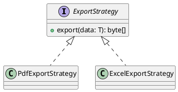

# ENGINEERING DOCUMENTATION STANDARD (EDS) v2.0

## UC28 — Kết xuất dữ liệu PDF/Excel

| Field | Value |
|-------|-------|
| **Document ID** | `KAWAI-EDS-MOD5-UC28-001` |
| **Version** | 1.0 |
| **Date** | 2026-06-15 |
| **Status** | Approved |
| **Document Owner** | Ngô Thị Ngọc Lan |
| **Author** | Nguyễn Xuân Lưu — Tech Lead |
| **Reviewed by** | Nguyễn Xuân Lưu — Tech Lead |
| **DPO Sign-off** | `[x] Approved – 2026-06-15 – Nguyễn Xuân Lưu` |
| **Approved by** | `[x] Nguyễn Xuân Lưu – 2026-06-15` |
| **Last Review** | 2026-06-15 |
| **Based on EDS** | v2.0 |

---

### CHANGELOG
| Ngày | Người thực hiện | Nội dung thay đổi |
|------|-----------------|-------------------|
| 2026-06-15 | Nguyễn Xuân Lưu | Tạo tài liệu thiết kế chi tiết UC28 |

---

### MỤC LỤC
1. [Tổng quan Module](#1)
2. [Ma trận Truy vết](#2)
3. [ADR](#3)
4. [Non-Functional & SLA](#4)
5. [Static Modeling](#5)
6. [Dynamic Modeling](#6)
7. [Domain Event Catalog](#7)
8. [Interface Specification](#8)
9. [API Specification](#9)
10. [Bảng mã lỗi](#10)
11. [Quy trình Triển khai](#11)
12. [Rollback & Incident Runbook](#12)
13. [Kịch bản Kiểm thử](#13)
14. [Phương pháp Xác minh](#14)
15. [Mẫu thử thực tế](#15)
16. [Authorization Matrix](#16)
17. [Phụ lục](#17)

---

### 1. Tổng quan Module
| Field | Value |
|-------|-------|
| **Module Name** | Kết xuất dữ liệu (UC28) |
| **Bounded Context** | Reporting & Invoicing |
| **Use Case** | UC28: Kết xuất dữ liệu ra file PDF và Excel |

---

### 2. Ma trận Truy vết
| Requirement ID | Loại | Mô tả | Thành phần Code |
|----------------|------|-------|-----------------|
| UC28 | US | Xuất PDF/Excel | `ExportService.export()` |

---

### 3. Architecture Decision Records (ADR)
- **Thư viện PDF:** Sử dụng `OpenPDF` hoặc `iText` (mã nguồn mở).
- **Thư viện Excel:** Sử dụng `Apache POI`.
- **Strategy Pattern:** Sử dụng `ExportStrategy<T>` để tái sử dụng mã nguồn cho cả PDF và Excel.

---

### 4. Non-Functional Requirements & SLA
- Xử lý mảng byte in-memory (sử dụng `ByteArrayOutputStream`) thay vì lưu file tạm trên đĩa để tránh rác ổ cứng server.

---

### 5. Static Modeling


---

### 6. Dynamic Modeling
N/A

---

### 7. Domain Event Catalog
N/A

---

### 8. Interface Specification
```java
public interface ExportService {
    byte[] exportFolioToPdf(Long folioId);
    byte[] exportReportToExcel(ReportDTO report);
}
```

---

### 9. API Specification
| Method | Path | Auth | Roles | Trả về |
|--------|------|------|-------|-------|
| GET | `/api/v1/folios/{id}/export/pdf` | JWT | RECEPTIONIST | `application/pdf` |
| GET | `/api/v1/reports/export/excel` | JWT | ADMIN | `application/vnd.ms-excel` |

---

### 10. Bảng mã lỗi
- `EXP-001`: Lỗi tạo file (PDF generation exception).

---

### 11. Quy trình Triển khai
N/A

---

### 12. Rollback & Incident Runbook
N/A

---

### 13. Kịch bản Kiểm thử
- TC-UNIT-UC28-001: Kết xuất PDF trả về byte array có header `%PDF-`.
- TC-UNIT-UC28-002: Kết xuất Excel trả về file không bị corrupt.

---

### 14. Phương pháp Xác minh
Mở file tải về để kiểm tra metadata.

---

### 15. Mẫu thử thực tế
`curl -X GET /api/v1/folios/1/export/pdf --output invoice.pdf`

---

### 16. Authorization Matrix
- GUEST không được xuất file.

---

### 17. Phụ lục
N/A