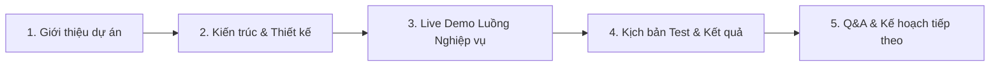

# 07-Reports — Báo cáo Tiến độ & Slide Thuyết trình

Thư mục này quản lý các báo cáo tiến độ định kỳ gửi cho Giảng viên hướng dẫn (Supervisor) và tài liệu chuẩn bị cho các đợt bảo vệ cột mốc (Milestones).

---

## 1. Danh sách các mẫu báo cáo (Reports Templates)

Mỗi tuần hoặc mỗi kết thúc Sprint, nhóm sẽ lưu trữ báo cáo tại đây dưới định dạng:
`Weekly_Report_Week_[XX].md` hoặc `Sprint_[X]_Retrospective.md`

### 1.1 Mẫu Báo cáo Tuần (Weekly Report Template)
```markdown
# Báo cáo tiến độ tuần [XX] — Nhóm [G2]

## 1. Tiến độ hoàn thành công việc
- **Task A (Đỗ Văn Tiến):** Đã hoàn thành cấu hình Seeder RBAC tự phục hồi.
- **Task B (Nguyễn Cường Mạnh):** Hoàn thành tích hợp giao diện Thymeleaf Front-Office.

## 2. Khó khăn / Blocker gặp phải
- Gặp lỗi Access Denied kết nối DB trên môi trường máy cá nhân. (Đã xử lý bằng cách cập nhật pass DB trong application.yml).

## 3. Kế hoạch tuần tiếp theo
- Bắt đầu code API cho luồng đặt phòng trực tuyến (WF-02).
- Viết kịch bản kiểm thử API cho Module 2.
```

---

## 2. Kế hoạch bảo vệ Cột mốc (Milestone Defense Outline)

Khi chuẩn bị slide thuyết trình cho các đợt Demo, nội dung slide bắt buộc phải tuân thủ cấu trúc sau:



### Chi tiết các đợt duyệt:
*   **Milestone 1 (Requirements & Mockup):** Tập trung chứng minh BA hiểu nghiệp vụ, vẽ xong BPMN cho 22 workflows, RTM và sơ đồ lớp (Class Diagram).
*   **Milestone 2 (Core Functional Demo):** Demo chạy được ít nhất 30% tính năng cốt lõi (Đăng nhập, Phân quyền, Đặt phòng).
*   **Milestone 3 (Integration & QA):** Demo chạy thông suốt luồng thanh toán VNPay, Audit Log, Night Audit và có báo cáo test tự động.
*   **Final Defense (Bảo vệ tốt nghiệp/môn học):** Toàn diện hệ thống, phân tích hiệu năng và hướng phát triển tiếp theo.
