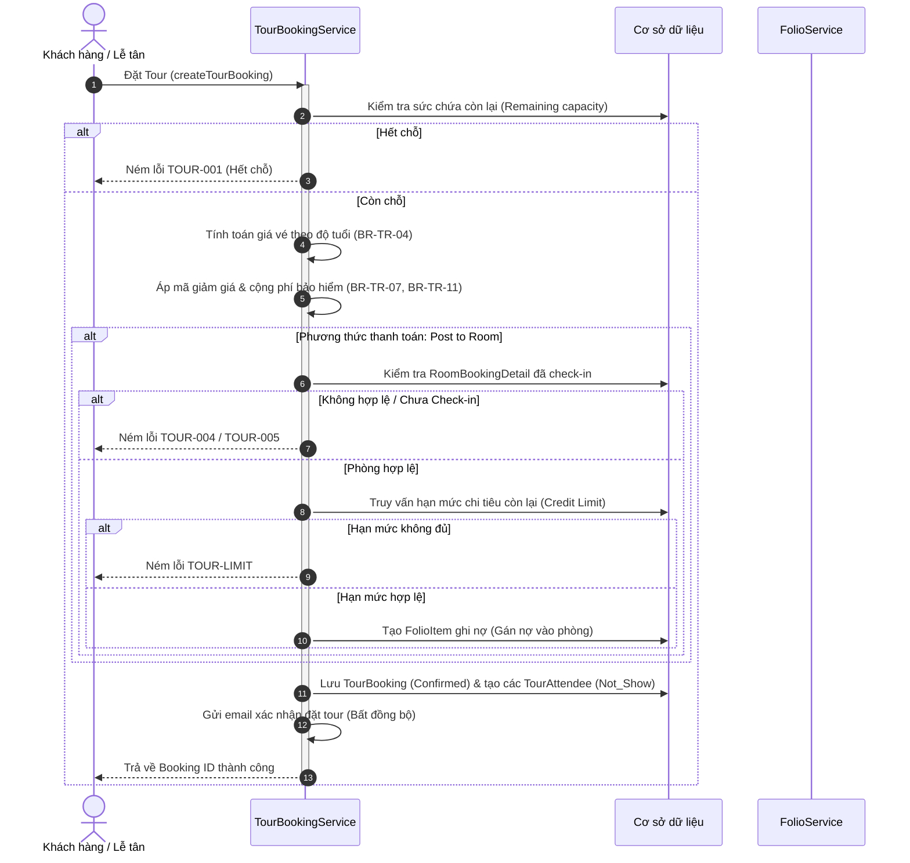
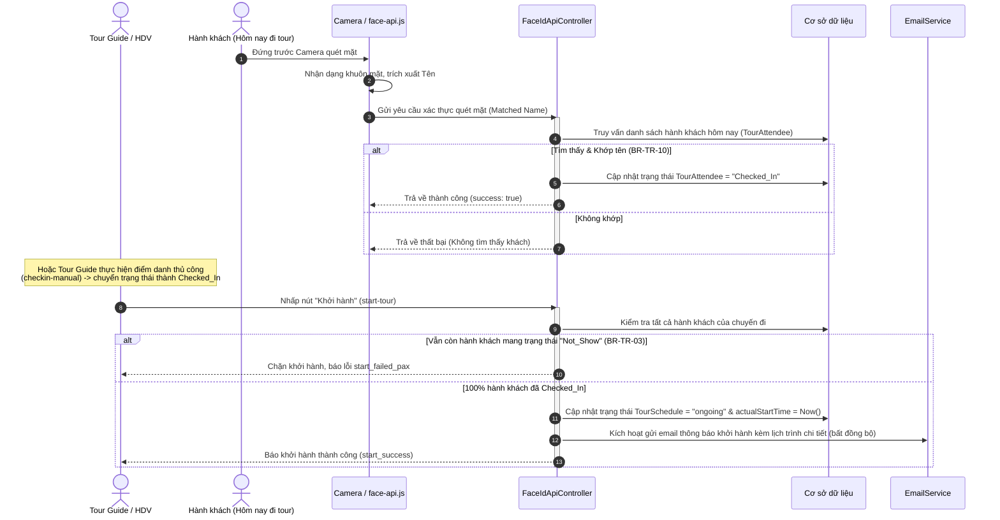

# BÁO CÁO NGHIỆP VỤ & HỆ THỐNG KIỂM THỬ - MODULE 4: TOUR
*(Business Rules, Use Cases & Test Cases)*

---

## 1. DANH SÁCH USE CASES (UC)
Module 4 đảm nhận toàn bộ nghiệp vụ liên quan đến quản lý Tour lữ hành, vận hành lịch trình chuyến đi, quản lý đặt chỗ (Booking), thanh toán nợ phòng (Post to Room), và điểm danh hành khách bằng công nghệ AI Face Scan.

### 1.1. Bảng phân rã Use Case (Tiếng Việt)
| Mã UC | Tên Use Case | Tác nhân (Actor) | Mô tả |
|---|---|---|---|
| **UC08** | Quản lý thông tin Tour (Tour CRUD) | Admin / Quản trị viên | Thêm mới Tour, cập nhật giá vé, điều chỉnh lịch trình chi tiết (Itinerary) và xóa mềm (Soft Delete) Tour khỏi hệ thống. |
| **UC19** | Tìm kiếm gói tour du lịch | Khách hàng (Customer) | Tra cứu các lịch trình Tour đang mở bán trong khoảng ngày mong muốn, tích hợp thông tin dự báo thời tiết tại điểm đến để hỗ trợ quyết định. |
| **UC20.1**| Đặt tour du lịch (Tour Booking) | Khách hàng / Lễ tân | Khách hàng đặt tour trực tuyến hoặc Lễ tân đặt tour cho khách trực tiếp tại quầy, tính toán giá vé theo độ tuổi, cộng phí bảo hiểm, áp dụng mã giảm giá và chọn phương thức thanh toán. |
| **UC20.2**| Lập lịch và phân công chuyến đi | Admin / Điều hành | Gán phương tiện, tài xế và Hướng dẫn viên du lịch (Tour Guide) vào lịch trình chuyến đi cụ thể. |
| **UC20.3**| Hủy tour & Hoàn tiền | Khách hàng / Resort | Khách hàng tự hủy tour hoặc Resort chủ động hủy tour do sự cố, hệ thống tính toán số tiền hoàn trả theo chính sách và gửi email thông báo. |
| **UC21** | Điểm danh hành khách (Attendance) | Khách hàng / Tour Guide | Điểm danh hành khách trước khi khởi hành bằng công nghệ quét nhận diện khuôn mặt (AI Face Scan) từ camera hoặc điểm danh thủ công dự phòng. |

### 1.2. List Usecase (English Format - Mẫu chuẩn hệ thống)

#### Phân hệ: Tour Management & Attendance (Module 4)
* **Search Available Tours - Tour Management (Customer):** Customers filter and search for active tour schedules based on selected date range, integrating third-party OpenWeather API forecasts for the departure date with graceful degradation.
* **Book Tour & Pay Online - Tour Management (Customer / Receptionist):** Customers book tour schedules, automatically calculate pricing based on age policies (free for infants under 2, 50% off for children 2-11), apply promo codes, and process payments either via online payment, cash counter, or room billing (Post to Room).
* **Post Tour Charge to Room - Tour Management (Customer / Receptionist):** Allows charging tour booking expenses directly to an active, checked-in room's folio, verifying room status and validating remaining spending credit limits (`Credit Limit`) to prevent overspending.
* **Cancel Tour Booking - Tour Management (Customer / Resort):** Allows customers or the resort to cancel a tour booking. The system automatically computes refund eligibility based on the cancellation origin (100% refund for resort cancellations, 50% penalty for guest cancellations within 24 hours of departure) and sends email notifications.
* **Assign Staff and Vehicle to Tour Schedule - Tour Management (Admin / Coordinator):** Admin assigns tour guides, drivers, and vehicles to confirmed tour schedules, independent of the minimum pax capacity checks.
* **AI Face Scan Attendance Check-In - Tour Attendance (Customer / Tour Guide):** Passengers verify their attendance before tour departure by scanning their faces via the browser camera (using face-api.js). The backend updates status to Checked_In if face vector match score meets the minimum 85% threshold.
* **Manual Tour Check-In - Tour Attendance (Tour Guide):** Allows tour guides to manually check-in passengers on the interface in case of AI recognition failure, hardware issues, or quick demo purposes.
* **Start & Conclude Tour Schedule - Tour Attendance (Tour Guide):** Allows tour guides to start a tour (requires 100% passenger check-in) and finish a tour, automatically updating booking statuses to Completed and triggering asynchronous departure/feedback emails.
* **Reset Tour Status - Tour Attendance (Tour Guide):** Allows tour guides to roll back a tour status in case of misclicks (e.g., reverting ongoing to Open, or completed to ongoing), restoring related bookings to Confirmed.
* **Manage Tour Core Data - Tour Management (Admin):** Allows administrators to create new tours, update base prices, modify itinerary activities, and perform soft delete on tours that have no active schedules.

#### Phân hệ: Room Booking & Front Desk (Tham chiếu từ hệ thống)
* **Search Available Rooms - Room Booking (Customer):** Customers filter and search for vacant rooms based on selected date range, guest count, and room type.
* **Book Room & Pay Online Deposit - Room Booking (Customer):** Customers book multiple rooms in one order and securely process a deposit payment via VNPay Sandbox.
* **Cancel Booking - Room Booking (Customer):** Allows customers to cancel a confirmed room booking before the check-in date. The system automatically calculates refund eligibility based on the 48-hour policy and initiates a refund transaction if applicable.
* **Check-In & Allocate Physical Rooms - Front Desk (Receptionist):** Includes handling Early Check-in/Late Check-out surcharges based on hotel policies, processing room change requests during the stay, and automatically updating the Room Matrix state to 'Occupied/Clean'.
* **Walk-in Guest Check-in - Front Desk (Receptionist):** Handles the process of accommodating a guest who arrives at the hotel without a prior reservation. The system supports real-time room availability checking, creation of a new reservation, assignment of a physical room, and immediate check-in.
* **Register Accompanying Guests - Front Desk (Receptionist):** Receptionists register accompanying/dependent guests under an existing reservation for temporary residence compliance and guest management purposes.
* **Authorize Dependent Service Access - Front Desk (Receptionist):** Allows the Receptionist to grant independent service booking permissions to a registered dependent guest while ensuring all expenses remain linked to the Master Folio.
* **Change Room Category/Room Type - Front Desk (Receptionist):** Allows a guest to request an upgrade or change to a different room category during an active stay. The receptionist verifies room availability and updates the room assignment accordingly.
* **Manage Accompanying/Dependent Guests - Customer:** Allows the customer to manage accompanying/dependent guests under an existing reservation. The customer can add, update, remove, and assign dependent guests to available rooms within the reservation.
* **View Profile & Booking History - Customer:** Allows customers to view their profile information, review booking history (Confirmed, Checked-in, Checked-out, Cancelled), track payment status, and check their remaining available credit limit for future reservations and services.
* **Room Matrix / Dashboard Monitoring - Front Desk (Receptionist):** Allows receptionists to monitor the hotel's room status in real time through the Room Matrix dashboard. The system displays the current status of each room, including Vacant Clean, Vacant Dirty, Occupied, and Maintenance, enabling efficient room allocation, guest check-in coordination, and operational oversight.
* **Request Emergency Cleaning (Rush Room Preparation) - Front Desk (Receptionist):** Allows receptionists to submit an emergency room cleaning request to Housekeeping when a walk-in guest arrives or a guest requests early check-in. The system notifies Housekeeping to prioritize the room and provides real-time alerts (e.g., bell notification or toast message) to the receptionist once the room has been cleaned and is ready for occupancy.

---

## 2. QUY TẮC NGHIỆP VỤ (BUSINESS RULES - BR)

> [!IMPORTANT]
> Đây là các quy tắc ràng buộc logic cốt lõi được áp dụng xuyên suốt mã nguồn backend nhằm đảm bảo tính toàn vẹn dữ liệu và an toàn tài chính.

### 2.1. Ràng buộc khi Đặt Tour & Thanh toán (UC20.1)
* **BR-TR-01 (Chống Double-Booking / Kiểm soát Slot):**
  Hệ thống kiểm soát nghiêm ngặt số lượng chỗ trống còn lại của lịch trình (`availableSlots = maxCapacity - confirmedSeats`). Nếu số lượng khách đặt vượt quá sức chứa còn lại, hệ thống sẽ chặn và ném ra ngoại lệ `TOUR-001: Hết chỗ`.
* **BR-TR-04 (Tính giá vé ưu đãi theo độ tuổi):**
  Tổng tiền vé cơ bản được tính linh hoạt theo cơ chế:
  - **Trẻ em dưới 2 tuổi:** Miễn phí 100% giá vé.
  - **Trẻ em từ 2 - 11 tuổi:** Giảm 50% giá vé.
  - **Người lớn (từ 12 tuổi trở lên):** Tính 100% giá vé cơ bản (`basePrice`).
* **BR-TR-07 (Bảo hiểm du lịch bắt buộc):**
  Đối với các Tour mạo hiểm hoặc đặc thù có cờ `isInsuranceRequired = true`, khách hàng bắt buộc phải chọn đồng ý mua bảo hiểm du lịch (`acceptInsurance = true`). Nếu từ chối, hệ thống chặn và báo lỗi `TOUR-INS-001`. Phí bảo hiểm sẽ cộng thêm vào tổng hóa đơn (`insurancePrice * participantCount`) và hệ thống tự động cấp mã hợp đồng bảo hiểm dạng `INS-YYYYMMDD-SCH{id}-{UUID}`.
* **BR-TR-08 (Yêu cầu thông tin phòng khi ghi nợ):**
  Khi khách chọn hình thức thanh toán ghi nợ vào phòng (`Post to Room` hoặc `isPostToRoom = true`), bắt buộc phải cung cấp ID chi tiết đặt phòng (`roomBookingDetailId`). Phòng này phải ở trạng thái đã check-in thực tế. Nếu thiếu, hệ thống chặn và báo lỗi `TOUR-004`. Nếu ID không tồn tại, báo lỗi `TOUR-005`.
* **BR-TR-09 (Kiểm tra hạn mức chi tiêu Folio - Credit Limit):**
  Khi thanh toán qua `Post to Room`, hệ thống sẽ tính toán số tiền ghi nợ còn lại của phòng (`subCreditLimit - usedAmount`). Nếu tổng tiền tour lớn hơn hạn mức còn lại này, hệ thống sẽ chặn đặt chỗ và yêu cầu khách hàng thanh toán bớt nợ hoặc chuyển sang thanh toán trực tuyến (`TOUR-LIMIT`).
* **BR-TR-11 (Giới hạn sử dụng mã khuyến mãi):**
  Mỗi khách hàng chỉ được sử dụng một mã giảm giá cụ thể tối đa **1 lần** duy nhất. Nếu vi phạm, hệ thống ném lỗi `[ERR_PROMO_USAGE_EXCEEDED]`. Mã giảm giá chỉ có hiệu lực khi đang active và còn thời hạn sử dụng.

### 2.2. Ràng buộc khi Điểm danh & Vận hành Tour (UC21 & UC20.2)
* **BR-TR-02 (Ngưỡng trùng khớp AI Face Match):**
  Khi thực hiện điểm danh bằng AI Face Scan, vector khuôn mặt từ camera gửi lên được so sánh với ảnh tham chiếu trong CSDL. Độ trùng khớp phải đạt **tối thiểu 85%** (`MIN_MATCH_SCORE_FOR_ATTENDANCE = 0.85`) mới được tự động cập nhật trạng thái hành khách thành `PRESENT` / `Checked_In`.
* **BR-TR-03 (Bắt buộc điểm danh đầy đủ trước khi khởi hành):**
  Hướng dẫn viên chỉ có thể nhấn "Start Tour" để khởi hành khi **100% hành khách** đăng ký trong lịch trình đó đã hoàn thành điểm danh (có trạng thái `Checked_In`). Nếu có hành khách mang trạng thái `Not_Show` (chưa điểm danh), hệ thống sẽ chặn khởi hành và báo lỗi `start_failed_pax`.
* **BR-TR-10 (Khớp tên đặc biệt - FaceID Fallback):**
  Để khắc phục sai số của phần cứng camera/máy quét khuôn mặt trong môi trường thực tế, hệ thống cấu hình một quy tắc khớp tên đặc biệt: Tên "Ngọc Thị" và "Lê Quang" được phép nhận diện chéo lẫn nhau (`isNameMatch` trả về `true`).
* **BR-TR-06 (Cảnh báo số lượng khách tối thiểu - Minimum Pax):**
  Hệ thống tự động rà soát trước giờ khởi hành 24 tiếng. Nếu số lượng khách đặt chưa đạt số khách tối thiểu để chạy tour, hệ thống sẽ gửi cảnh báo tới Admin nhưng vẫn cho phép thực hiện việc gán tài xế/xe/tour guide bình thường.

### 2.3. Ràng buộc khi Hủy & Sửa đổi Tour (UC20.3 & UC08)
* **BR-TR-05 (Chính sách Hủy & Hoàn tiền cọc):**
  - **Hủy do Resort chủ động:** Hoàn tiền **100%** tổng giá trị đặt tour cho khách hàng. Trạng thái cập nhật thành `Cancelled_Refunded`.
  - **Khách hàng tự hủy:** Nếu hủy trong vòng 24 giờ trước thời gian khởi hành, khách hàng bị **phạt 50% tiền cọc** (chỉ hoàn lại 50% giá trị). Trạng thái cập nhật thành `Cancelled_Forfeited`.
* **BR-TR-13 (Ràng buộc sửa/xóa Tour đang hoạt động):**
  Không cho phép thay đổi giá vé cơ bản hoặc thực hiện xóa mềm (Soft Delete) đối với Tour nếu đang có ít nhất một lịch trình khởi hành đang ở trạng thái mở bán (`Open`). Cố tình thực hiện sẽ phát sinh ngoại lệ `ResourceInUseException`.

---

## 3. SƠ ĐỒ LUỒNG NGHIỆP VỤ CHÍNH

### 3.1. Luồng đặt Tour & Kiểm tra hạn mức phòng (Post to Room)

### 3.2. Luồng điểm danh FaceID & Khởi hành chuyến đi (Start Tour)

---

## 4. DANH SÁCH CÁC TEST CASES HIỆN CÓ

Hệ thống sở hữu bộ kiểm thử tự động toàn diện (Unit & Integration Tests) được phân chia rõ ràng theo từng Use Case để đảm bảo logic chạy chính xác.

### 4.1. Bộ kiểm thử UC19: Tìm kiếm gói tour (`TourServiceUC19Test.java`)
Kiểm tra tính năng tra cứu tour khả dụng và tích hợp API thời tiết bên thứ ba kèm khả năng tự phục hồi khi lỗi (Graceful Degradation).

| ID Test Case | Tên Test Case | Mục tiêu kiểm thử | Kết quả mong đợi |
|---|---|---|---|
| **TC-M4-001.1** | Trả về danh sách tour khả dụng | Tìm kiếm trong khoảng ngày có lịch trình mở bán (`Open`). | Trả về danh sách tour chính xác. |
| **TC-M4-001.2** | Trả về danh sách rỗng | Tìm kiếm trong khoảng ngày không có lịch trình nào. | Trả về danh sách trống rỗng (không lỗi). |
| **TC-M4-001.3** | Trả về nhiều tour | Nhiều lịch trình cùng mở bán trong khoảng ngày tìm kiếm. | Trả về đầy đủ các tour tương ứng. |
| **TC-M4-002.1** | API thời tiết ném ngoại lệ | API thời tiết gặp lỗi kết nối hoặc ngoại lệ runtime. | **Graceful Degradation:** Vẫn hiển thị danh sách tour, trường `weatherAvailable` đặt là `false`. |
| **TC-M4-002.2** | API thời tiết trả về giá trị null | API thời tiết phản hồi trống/không có dữ liệu. | **Graceful Degradation:** Hiển thị tour bình thường, `weatherAvailable = false`. |
| **TC-M4-002.3** | Lỗi thời tiết cục bộ | Một trong số các tour bị lỗi gọi thời tiết, các tour khác bình thường. | Tour không bị lỗi vẫn hiển thị đầy đủ thông tin thời tiết. |

### 4.2. Bộ kiểm thử UC20: Đặt tour & Thanh toán (`TourBookingServiceUC20Test.java`)
Kiểm tra toàn bộ ràng buộc và logic đặt chỗ, tính tiền, áp khuyến mãi và ghi nợ phòng.

| ID Test Case | Tên Test Case | Mục tiêu kiểm thử | Kết quả mong đợi |
|---|---|---|---|
| **TC-M4-003.1** | Đặt tour thành công (Standard) | Đặt tour với thông tin hợp lệ. | Tạo bản ghi `TourBooking` (Confirmed) và các `TourAttendee` (Not_Show). |
| **TC-M4-003.2** | Đặt tour trực tiếp tại quầy (Walk-in) | Đặt tour với cờ `isWalkInTour = true`. | Tạo booking thành công với đánh dấu là khách vãng lai. |
| **TC-M4-004.1** | Tour hết chỗ trống | Số khách đặt vượt quá số slot trống còn lại của lịch trình. | Chặn giao dịch, ném ra ngoại lệ `IllegalStateException`. |
| **TC-M4-004.2** | Đặt vượt sức chứa của Tour | Đặt chỗ với số lượng khách vượt quá capacity tối đa của tour. | Chặn giao dịch, báo lỗi. |
| **TC-M4-005.1** | Ghi nợ phòng thành công | Chọn Post to Room, cung cấp phòng hợp lệ và đủ hạn mức. | Ghi nợ thành công vào Folio phòng của khách lưu trú. |
| **TC-M4-005.2** | Không ghi nợ phòng | Đặt tour trực tiếp không chọn Post to Room. | Không tạo bản ghi nợ trong Folio. |
| **TC-M4-005.3** | Post to Room thiếu thông tin | Chọn Post to Room nhưng không truyền `roomBookingDetailId`. | Chặn giao dịch, ném mã lỗi `TOUR-004`. |
| **TC-M4-005.4** | Phòng không tồn tại | Chọn Post to Room với ID phòng không tồn tại trong hệ thống. | Chặn giao dịch, ném mã lỗi `TOUR-005`. |

### 4.3. Bộ kiểm thử UC20 (Phần 2): Vận hành & Hủy Tour (`TourBookingTddServiceUC20Test.java`)
Kiểm tra quy trình thiết lập nhân sự vận hành chuyến đi và chính sách hủy phạt.

| ID Test Case | Tên Test Case | Mục tiêu kiểm thử | Kết quả mong đợi |
|---|---|---|---|
| **TC-M4-006** | Lập lịch chuyên tour | Gán tài xế, phương tiện và Hướng dẫn viên du lịch vào lịch trình. | Bản ghi `TourStaffAssignment` được tạo chính xác. |
| **TC-M4-007** | Hủy tour & Tính tiền hoàn trả | Thực hiện hủy tour và kiểm thử chính sách hoàn trả. | - Hủy do Resort: Hoàn 100%. - Hủy do Khách tự hủy trong 24h: Phạt 50%. |

### 4.4. Bộ kiểm thử UC21: Điểm danh AI Face Scan (`TourAttendanceServiceUC21Test.java`)
Kiểm tra khả năng tích hợp AI Face Recognition phục vụ điểm danh tự động và cơ chế chuyển đổi thủ công.

| ID Test Case | Tên Test Case | Mục tiêu kiểm thử | Kết quả mong đợi |
|---|---|---|---|
| **TC-M4-008** | Điểm danh tự động qua AI khớp ảnh | Gửi ảnh khuôn mặt hợp lệ lên AI Service và trả về kết quả match >= 85%. | Trạng thái của `TourAttendee` chuyển thành `Checked_In` / `PRESENT` và lưu thời gian quét. |
| **TC-M4-009** | AI Service không khả dụng (Fallback) | AI Service gặp lỗi kết nối hoặc quá tải. | Hệ thống chuyển sang cơ chế cho phép Tour Guide điểm danh thủ công (Manual Check-in) bằng cách bấm nút trên giao diện. |

### 4.5. Bộ kiểm thử UC08: CRUD Dữ liệu cốt lõi (`TourServiceUC08Test.java`)
Kiểm tra các ràng buộc dữ liệu khi quản lý các gói Tour cốt lõi.

| ID Test Case | Tên Test Case | Mục tiêu kiểm thử | Kết quả mong đợi |
|---|---|---|---|
| **TC-UC08-001** | Cập nhật lịch trình chi tiết | Thay đổi toàn bộ lịch trình chi tiết (Itinerary) của một Tour. | Xóa lịch trình cũ và tạo mới thành công các điểm đến trong DB. |
| **TC-UC08-002** | Chỉnh sửa Tour có lịch mở bán | Cố tình sửa giá của Tour khi đang có lịch trình đang mở bán (`Open`). | Chặn hành động, ném lỗi `ResourceInUseException`. |
| **TC-UC08-003** | Xóa mềm Tour có lịch mở bán | Thực hiện xóa mềm một Tour đang có lịch trình `Open`. | Chặn hành động, không cho phép xóa để bảo toàn lịch trình hiện tại. |

---

## 5. KẾT LUẬN & ĐÁNH GIÁ CHẤT LƯỢNG
Module 4 (Tour) được xây dựng chặt chẽ theo nguyên tắc **Defensive Programming (Lập trình phòng thủ)** và kiểm thử bao phủ toàn bộ luồng lỗi (Exception Paths):
1. **An toàn tài chính (Post to Room):** Các giao dịch ghi nợ phòng bắt buộc phải qua bước kiểm tra hạn mức còn lại (`subCreditLimit - usedAmount`), ngăn chặn hoàn toàn việc bội chi của khách hàng VIP/khách đoàn.
2. **Graceful Degradation (Tự phục hồi lỗi):** Việc tích hợp API Thời tiết và AI Face Scan bên thứ ba được thiết lập cơ chế dự phòng hoàn hảo (nếu lỗi thời tiết vẫn cho tìm kiếm tour, nếu lỗi AI quét mặt vẫn cho điểm danh thủ công).
3. **Tính toàn vẹn dữ liệu:** Không cho phép thay đổi dữ liệu Tour cốt lõi (sửa giá, xóa) khi đang có chuyến đi mở bán nhằm đảm bảo các khách hàng đã đặt tour trước đó không bị ảnh hưởng.
