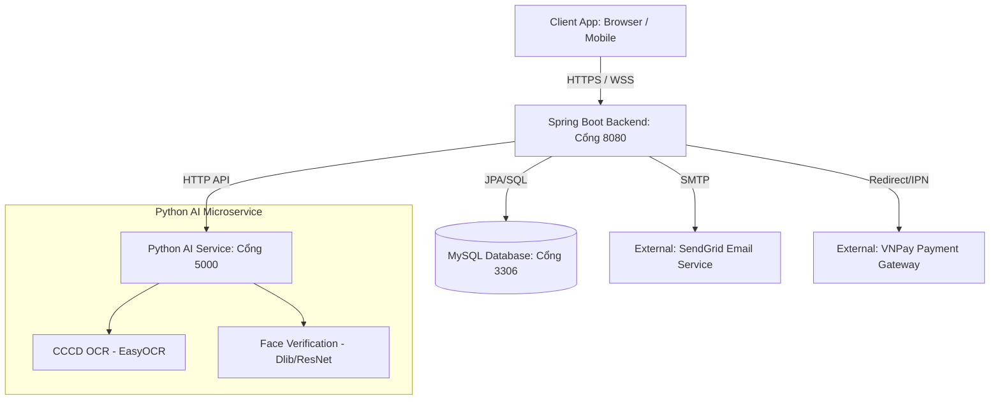

# Kawai Retreat Resort & Tour Hub — Master Guide

**Đồ án Môn học:** SWP391 - Software Development Project  
**Lớp:** SE2003-NET  
**Nhóm:** Group 2 — FPT University HN  
**Giảng viên hướng dẫn:** Nguyễn Mạnh Cường  

---

## 📖 1. Mô tả Chi tiết Hệ thống (Project Architecture & Submodules)

**Kawai Retreat Resort & Hub** là một hệ thống quản lý tích hợp dạng ERP thu nhỏ dành riêng cho khu nghỉ dưỡng phức hợp cao cấp. Khác với các phần mềm quản lý khách sạn (PMS) đơn lẻ, hệ thống này kết nối chặt chẽ các hoạt động lưu trú với dịch vụ ẩm thực (F&B), lữ hành (Tour), dọn phòng (Housekeeping) và thanh toán tập trung (Folio Ledger).

Hệ thống được thiết kế theo cấu trúc **Microservice lai** (Hybrid Monolith + Python AI Worker), bao gồm các phân hệ cốt lõi sau:



### Các Phân hệ Vận hành chính (Operational Submodules):
1.  **Front-Office (Lễ tân & Đặt phòng):** Hỗ trợ đặt phòng trực tuyến qua cổng Khách hàng (`/booking`), quản lý đặt phòng, Check-in, Check-out, đổi hạng phòng và gán phòng vật lý. Tích hợp giải pháp quét CCCD từ xa bằng điện thoại của Khách hàng, tự động điền form thông tin lưu trú qua WebSocket thời gian thực.
2.  **F&B POS (Nhà hàng & Gọi món tại phòng):** Cho phép gọi món trực tuyến (Room Service) hoặc tại bàn. Tích hợp cơ chế **Post-to-Room (Ký nợ về phòng)** đối chiếu trực tiếp với hạn mức tín dụng (credit_limit) của phòng đang lưu trú.
3.  **Tour Operations & AI Attendance (Lữ hành & Điểm danh khuôn mặt):** Quản lý lịch trình tour du lịch trong khu nghỉ dưỡng. Tích hợp module camera AI tại sảnh hoặc xe điện để tự động điểm danh hành khách tham gia tour bằng so khớp khuôn mặt (FaceID), ngăn ngừa gian lận.
4.  **Housekeeping & Maintenance (Buồng phòng & Bảo trì):** Tự động chuyển trạng thái phòng sang `Vacant_Dirty` ngay khi Check-out thông qua Database Trigger, tự động đẩy việc dọn dẹp cho nhân viên buồng phòng và khóa phòng trên hệ thống cho đến khi hoàn tất dọn dẹp.
5.  **Finance & Night Audit (Tài chính & Kiểm toán đêm):** Hệ thống tích hợp Folio Ledger gom tất cả các khoản chi tiêu phòng, F&B, Tour về một hóa đơn tổng hợp (`ConsolidatedInvoice`). Chạy trình ngầm kiểm toán đêm (Night Audit) tự động chốt doanh thu, tính tiền phòng hàng ngày và gửi báo cáo PDF qua email cho quản trị viên.

---

## 🛠️ 2. Công nghệ Sử dụng & Yêu cầu Hệ thống (Tech Stack & Prerequisites)

### Yêu cầu cài đặt môi trường (Environment Setup):
*   **Java Development Kit (JDK):** Version 17.
*   **Python:** Version 3.9 trở lên (cần cài đặt C++ Build Tools trên Windows để compile thư viện `dlib`).
*   **Hệ quản trị CSDL:** MySQL 8.x.
*   **Công cụ build:** Apache Maven 3.8+.
*   **Ngrok (Tùy chọn):** Dùng để test Webhook IPN của VNPay trên môi trường local.

---

## 📂 3. Quy chuẩn Cấu trúc Thư mục (Project Structure Policy)

| Thư mục | Tên phân hệ | Nội dung bắt buộc cần nạp (Deliverables) | Vai trò phụ trách |
|:---|:---|:---|:---:|
| **`00-Policy`** | Quy định dự án | Quy chuẩn đặt tên code (Coding Conventions), Quy trình Git Flow (Branching, Merge Request). | **Tech Lead** |
| **`01-Planning`** | Kế hoạch | Bảng phân rã công việc **WBS**, sơ đồ Gantt Chart tiến độ, Biên bản họp nhóm hàng tuần (**Meeting Minutes**). | **Project Manager** |
| **`02-Requirement`**| Yêu cầu | Tài liệu đặc tả yêu cầu phần mềm (**SRS**), Sơ đồ luồng nghiệp vụ tổng quát (**workflow.md**), Quy tắc kinh doanh (**BusinessRule.md**), Ma trận truy vết (**RequirementsTraceabilityMatrix.md**). | **BA** |
| **`03-Design`** | Thiết kế | Các quyết định kiến trúc cốt lõi (**ADR**), Sơ đồ cơ sở dữ liệu vật lý (**ERD**), Sơ đồ deployment mạng. | **Tech Lead / Architect** |
| **`04-Implement`** | Kế hoạch thực thi | Các bản kế hoạch thực thi chi tiết cho từng Workflow (**Implementation Plan - IMP**) gồm DDL SQL, API Spec, Error Code, Code mẫu. | **Developer / Tech Lead** |
| **`05-Development`**| Mã nguồn | Mã nguồn chạy được Backend (Spring Boot), Frontend (Thymeleaf/JS), Database SQL script. | **Developer** |
| **`06-Testing`** | Kiểm thử | Bộ sưu tập API test (**Postman Collections**), các script Cypress/Selenium test UI, Dữ liệu chạy thử (`mock_data.sql`). | **Tester / QA** |
| **`07-Reports`** | Báo cáo | Báo cáo tiến độ tuần (**Weekly Reports**), báo cáo tổng kết Sprint (Sprint Retrospective), **Slide thuyết trình** cho các mốc bảo vệ. | **PM / Cả nhóm** |
| **`08-Document-References`**| Tham khảo | Tài liệu tích hợp API bên thứ 3 (VNPay API Doc, SendGrid Guide, OCR SDK...). | **Developer** |

---

## ⚠️ 4. CHÚ Ý: CÁC CẤU HÌNH THAY ĐỔI THEO MÁY CÁ NHÂN (Local Environments Checklist)

Khi tải code về máy cá nhân (Git clone/pull), bạn chỉ cần thay đổi **4 điểm cấu hình đặc thù** sau đây để hệ thống chạy ổn định:

### 1. Mật khẩu MySQL (`password`):
*   **File cần sửa:** `05-Development/kawai-backend/src/main/resources/application.yml`
*   **Vị trí:** Dưới mục `spring.datasource.password`.
*   **Cách sửa:** Thay đổi `your_database_password` thành mật khẩu MySQL root cục bộ của máy bạn (ví dụ: `12345678`, `admin`, hoặc để trống).

### 2. Địa chỉ IP Mạng LAN (`IPv4 Address`):
*   *Chỉ cần thiết khi test tính năng quét CCCD từ xa trên điện thoại.*
*   **Cách lấy:** Gõ lệnh `ipconfig` (Windows) để tìm địa chỉ IPv4 máy tính chạy Backend của bạn (ví dụ: `192.168.1.15`).
*   **Cách sửa trên điện thoại:** Truy cập `chrome://flags` trên Chrome điện thoại, tìm mục **"Insecure origins treated as secure"** và điền: `http://[IP-MÁY-TÍNH]:8080` để trình duyệt cho phép bật Camera.

### 3. Visual Studio C++ Build Tools (Lỗi cài đặt Python `dlib`):
*   *Lỗi thường gặp trên các máy Windows của thành viên khi chạy `pip install -r requirements.txt` ở module AI.*
*   **Hiện tượng:** Quá trình cài đặt bị treo hoặc báo lỗi thiếu compiler C++.
*   **Cách xử lý:** Tải và cài đặt phần mềm [Visual Studio Build Tools](https://visualstudio.microsoft.com/visual-cpp-build-tools/), tích chọn gói **"Desktop development with C++"** rồi tiến hành chạy lại lệnh cài đặt thư viện Python.

### 4. Xung đột Cổng kết nối (Trùng Port `8080` hoặc `3306`):
*   Nếu máy tính cá nhân của bạn đang chạy các dịch vụ trùng cổng (Docker, XAMPP, Skype...), bạn có thể cấu hình đổi cổng chạy của Spring Boot:
    *   **File cần sửa:** `application.yml`
    *   **Vị trí:** `server.port` (Mặc định: `8080`).

---

## ⚙️ 5. Hướng dẫn Khởi chạy Hệ thống Chi tiết (Deployment & Run Guide)

### Bước 5.1: Cấu hình và Khởi tạo Cơ sở Dữ liệu (MySQL)
1.  Đăng nhập vào MySQL Server của bạn và chạy lệnh tạo database:
    ```sql
    CREATE DATABASE IF NOT EXISTS kawai_retreat DEFAULT CHARACTER SET utf8mb4 COLLATE utf8mb4_unicode_ci;
    ```
2.  Kiểm tra file cấu hình Spring Boot `05-Development/kawai-backend/src/main/resources/application.yml` và chỉnh sửa mật khẩu kết nối MySQL theo mục **Chú ý số 1**.

---

### Bước 5.2: Khởi chạy Java Spring Boot Backend (Port 8080)
1.  Mở cửa sổ dòng lệnh tại thư mục: `05-Development/kawai-backend`
2.  Thực hiện compile và đóng gói ứng dụng:
    ```bash
    ./mvnw clean compile
    ```
3.  Chạy ứng dụng:
    ```bash
    ./mvnw spring-boot:run
    ```
4.  Sau khi ứng dụng khởi chạy thành công, class `RolePermissionSeeder` sẽ tự động quét và chèn các dữ liệu phân quyền RBAC mặc định cùng tài khoản quản trị Admin (`admin@kawai.com` / `12345678aA`) vào database.

---

### Bước 5.3: Khởi chạy Python AI Service (Port 5000)
Module Python chịu trách nhiệm xử lý các tác vụ nặng về AI như Trích xuất dữ liệu CCCD (OCR) và Nhận diện khuôn mặt (Face Verification).

1.  Di chuyển vào thư mục dịch vụ Python: `05-Development/kawai-ai-service`
2.  Tạo môi trường ảo (Virtual Environment) để tránh xung đột thư viện:
    ```bash
    python -m venv venv
    # Kích hoạt trên Windows:
    .\venv\Scripts\activate
    # Kích hoạt trên macOS/Linux:
    source venv/bin/activate
    ```
3.  Cài đặt các thư viện phụ thuộc (lưu ý **Chú ý số 3** về C++ Build Tools):
    ```bash
    pip install -r requirements.txt
    ```
4.  Chạy microservice:
    ```bash
    python app.py
    ```
    *Dịch vụ sẽ lắng nghe tại cổng `http://localhost:5000`.*

---

### Bước 5.4: Cấu hình VNPay Sandbox & SendGrid API
Các khóa cấu hình bảo mật được quản lý qua biến môi trường hoặc khai báo trực tiếp trong `application.yml`:

*   **VNPay Integration:** Đăng ký tài khoản doanh nghiệp thử nghiệm trên cổng VNPay Sandbox để lấy `vnp_TmnCode` và `vnp_HashSecret`. Nhập cấu hình này vào file `application.yml` phần cấu hình vnpay.
*   **SendGrid Integration:** 
    1. Lấy API Key từ tài khoản SendGrid.
    2. Cấu hình khóa trong tệp `application.yml`:
       ```yaml
       spring:
         sendgrid:
           api-key: SG.your_sendgrid_api_key_here
       ```
    3. Đảm bảo email người gửi (`from_email`) khớp với email đã được verify trên SendGrid Dashboard.

---

## 🧪 6. Kiểm thử & Đảm bảo Chất lượng (Quality Assurance)

*   **Unit & Integration Test (Backend):** 
    Để chạy toàn bộ các ca kiểm thử tích hợp tự động của Java Spring Boot, sử dụng lệnh:
    ```bash
    ./mvnw test
    ```
*   **API Test (Postman):**
    Import file `06-Testing/Kawai_Retreat_API_Collection.json` vào Postman. Chạy theo thứ tự: `Auth: Login` -> `Get Token` -> `Call Business APIs`.
*   **UI Automation Test (Cypress):**
    Di chuyển vào thư mục `cypress` và chạy lệnh:
    ```bash
    npx cypress open
    ```
