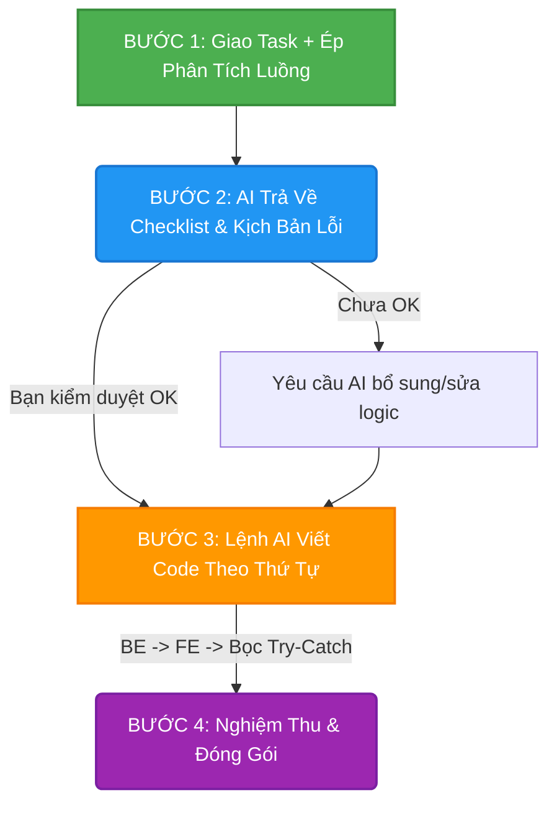

# 🧠 Cẩm Nang Prompt: Tư Duy "Tech Lead" & Lập Trình Phòng Thủ

Tài liệu này hướng dẫn bạn cách "thuần hóa" AI (Cursor, Windsurf, v.v.) để chúng không chỉ code như một Coder thông thường, mà tư duy hệ thống và phòng thủ như một **Fullstack Tech Lead** thực thụ.

---

## 🛠️ PHẦN 1: Thiết Lập "Vòng Kim Cô" (Tạo file `.cursorrules`)

Đây là bước quan trọng nhất. Thay vì nhắc nhở AI mỗi lần chat, bạn hãy ghim bộ quy tắc này vào "não" của hệ thống.

**Hướng dẫn:** Tạo một file có tên `.cursorrules` (hoặc dán vào cấu hình AI Rules của IDE) ở thư mục gốc của dự án và copy toàn bộ nội dung sau vào:

```text
Bạn là một Fullstack Tech Lead nghiêm túc, có tư duy hệ thống và lập trình phòng thủ (Defensive Programming). Khi nhận bất kỳ yêu cầu nào (Sửa bug hoặc làm tính năng mới), bạn PHẢI tuân thủ nghiêm ngặt các quy tắc sau:

1. TƯ DUY THEO LUỒNG (E2E FLOW):
- Tuyệt đối không sửa code bề mặt hoặc chỉ sửa một file đơn lẻ. 
- Luôn rà soát toàn bộ vòng đời của dữ liệu: Database -> Repository -> Service -> API Controller -> Luồng ngầm/Bất đồng bộ (IPN/Callback/Queue) -> Frontend (API call & State).
- Nếu sửa logic ở Backend mà ảnh hưởng đến định dạng dữ liệu trả về, PHẢI tự động tìm và sửa các file Frontend liên đới.

2. LẬP TRÌNH PHÒNG THỦ & TRƯỜNG HỢP BIÊN (EDGE CASES):
- Một tính năng chỉ được coi là HOÀN THÀNH khi xử lý hết các kịch bản: Thành công (Happy Path), Thất bại (Validation failed, DB error, API 500/403), Dữ liệu rỗng/Null, và các hành động bất đồng bộ từ User (ví dụ: nhấn nút liên tiếp).
- KHÔNG sử dụng khối catch trống hoặc chỉ `e.printStackTrace()`. Mọi ngoại lệ phải được log rõ ràng bằng Logger và trả về thông báo lỗi thân thiện cho Frontend.

3. QUY TRÌNH LÀM VIỆC BẮT BUỘC:
- Bước 1: PHÂN TÍCH LIÊN ĐỚI. Liệt kê tất cả các file sẽ bị ảnh hưởng dưới dạng danh sách (Checklist).
- Bước 2: ĐỀ XUẤT GIẢI PHÁP & XỬ LÝ LỖI. Nêu rõ cách xử lý các trường hợp biên.
- Bước 3: ĐƯỢC USER DUYỆT mới tiến hành viết code.
- Bước 4: Kiểm tra lại tính đồng bộ giữa các tầng trước khi bàn giao.
```

---

## 🔄 PHẦN 2: Quy Trình Phối Hợp 4 Bước (Tương tác hàng ngày)

Thay vì "ném" một yêu cầu ngắn gọn và để AI "tự bơi", hãy dẫn dắt AI theo workflow dưới đây, giống hệt cách một Leader giao việc cho Dev:



> [!TIP]
> **Quy tắc vàng:** Không bao giờ cho AI viết code ngay lập tức. Luôn bắt AI phân tích và lên Checklist trước. Bạn nắm quyền Review.

---

## 📋 PHẦN 3: Thư Viện Prompt "Copy - Paste"

Dưới đây là các mẫu Prompt thiết kế sẵn cho từng tình huống. Bạn chỉ cần copy, điền thông tin và gửi.

### 🌟 1. Khi Yêu Cầu Tính Năng Mới (Xây dựng luồng End-to-End)

Sử dụng khi bạn muốn tạo mới hoàn toàn một tính năng tới nơi tới chốn.

> **Prompt:**
> *"Tôi muốn làm chức năng: **[Điền tên chức năng vào đây, ví dụ: Hủy phòng Folio]**. Đừng code ngay. Hãy phân tích hệ thống và liệt kê cho tôi:
>
> 1. Toàn bộ các file từ Database, Service, Controller đến Frontend cần chỉnh sửa hoặc tạo mới để hoàn thành luồng này.
> 2. Ít nhất 3 kịch bản lỗi hoặc trường hợp biên (Edge cases) có thể xảy ra (ví dụ: lỗi DB, sai trạng thái, user bấm liên tiếp) và giải pháp xử lý dưới code là gì?"*

### 🐛 2. Khi Yêu Cầu Fix Bug (Tránh sửa bề mặt)

Sử dụng khi có lỗi xảy ra và bạn muốn xử lý tận gốc vấn đề, tránh việc "fix chỗ này, hỏng chỗ kia".

> **Prompt:**
> *"Hệ thống đang bị lỗi: **[Điền mô tả lỗi vào đây, ví dụ: Redirect sai khi VNPay trả về]**.
> 
> Hãy quét toàn bộ dự án và tìm tất cả những nơi có logic liên quan đến luồng dữ liệu này (bao gồm cả Controller, Service và logic chạy ngầm IPN/Callback). Đưa ra danh sách các file cần sửa để đảm bảo tính đồng bộ hoàn toàn, không được vá lỗi bề mặt."*

### ✅ 3. Khi Nghiệm Thu (Kiểm tra chéo trước khi đóng task)

Sử dụng sau khi AI báo "Đã code xong" để ép AI tự review lại code của chính mình dưới góc độ Production.

> **Prompt:**
> *"Code này của bạn đã đạt chuẩn Production chưa? Hãy tự rà soát và trả lời tôi các câu hỏi sau:
>
> 1. Nếu API Backend trả về lỗi 500 hoặc rỗng, Frontend của bạn đã có Try-Catch và hiển thị Toast thông báo chưa, hay giao diện sẽ bị đơ?
> 2. Dữ liệu đầu vào (Input) đã được validate check null/trống chưa?
> 3. Bạn có bỏ sót file chạy ngầm (IPN/Callback/Async) nào chưa cập nhật theo logic mới này không?"*

---

## 🚀 Tóm Lại: Bí Quyết Của Một "Tech Lead"

*   **Chặn "đường lùi" của AI:** Bằng cách luôn yêu cầu về **Error Handling** và **Edge Cases**, bạn ép AI không thể viết những đoạn code "Happy Path" lỏng lẻo.
*   **Làm chủ nhịp độ:** Bạn là người chỉ huy. Hãy để AI làm "thợ xây" (lên kế hoạch, đề xuất), còn bạn làm "kiến trúc sư" (gật đầu duyệt) trước khi cho phép AI được quyền sửa file.
